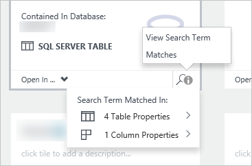

<properties
   pageTitle="Cómo ver los orígenes de datos | Microsoft Azure"
   description="Artículo de procedimiento para resaltar cómo determinar los activos de datos registrados con el catálogo de datos de Azure, incluida la búsqueda y filtrado y uso de la posición del resaltado capacidades del portal del catálogo de datos de Azure."
   services="data-catalog"
   documentationCenter=""
   authors="steelanddata"
   manager="NA"
   editor=""
   tags=""/>
<tags
   ms.service="data-catalog"
   ms.devlang="NA"
   ms.topic="article"
   ms.tgt_pltfrm="NA"
   ms.workload="data-catalog"
   ms.date="10/04/2016"
   ms.author="maroche"/>

# Cómo ver los orígenes de datos

## Introducción
**Catálogo de datos de Microsoft Azure** es un servicio de nube totalmente administrado que sirve como un sistema de registro y sistema de detección de orígenes de datos de la empresa. En otras palabras, **El catálogo de datos de Azure** consiste en ayudar a las personas descubrir, comprender y usar orígenes de datos y ayudar a las organizaciones a obtener más valor de sus datos. Una vez que se ha registrado un origen de datos con el **Catálogo de datos de Azure**, sus metadatos se indizan por el servicio, para que los usuarios pueden buscar fácilmente para descubrir los datos que necesitan.

## Búsqueda y el filtrado

Detección de **Catálogo de datos de Azure** usa dos mecanismos principales: buscar y filtrar.

Buscar está diseñado para ser intuitiva y eficaz: de forma predeterminada, los términos de búsqueda se comparan con cualquier propiedad en el catálogo, incluidas las anotaciones proporcionado por el usuario.

Filtrado está diseñado para búsqueda de complemento. Los usuarios pueden seleccionar características específicas como expertos, tipo de origen de datos, tipo de objeto y etiquetas, para ver solo los activos de datos coincidentes y para restringir los resultados de búsqueda para que coincidan con los activos físicos.

Mediante una combinación de búsqueda y el filtrado, los usuarios pueden desplazarse rápidamente los orígenes de datos que se han registrado con el **Catálogo de datos de Azure** para detectar los orígenes de datos que necesitan.

## Sintaxis de la búsqueda

Aunque la búsqueda de texto sin formato predeterminado es sencillo e intuitivo, los usuarios también pueden usar sintaxis de la búsqueda del **Catálogo de datos de Azure**para tener un mayor control sobre los resultados de búsqueda. Búsqueda de **Catálogo de datos de Azure** es compatible con las técnicas siguientes:

| Técnica                 | Usar                                                                                                                                     | Ejemplo                                                   |
|---------------------------|-----------------------------------------------------------------------------------------------------------------------------------------|-----------------------------------------------------------|
| Búsqueda básica              | Búsqueda básica con uno o varios términos de búsqueda. Los resultados son los activos que coinciden en cualquier propiedad con uno o más de las condiciones especificadas. | datos de ventas                                                |
| Especificar el ámbito (propiedad)          | Devolver solo los orígenes de datos donde el término de búsqueda coincide con la propiedad especificada                                                   | nombre: Finanzas                                              |
| Operadores booleanos         | Ampliar o reducir una búsqueda mediante operaciones booleanas                                                                                     | Finanzas no corporativa                                     |
| Agrupación con paréntesis | Usar paréntesis para elementos de grupo de la consulta para conseguir el aislamiento lógico, especialmente en combinación con operadores booleanos              | nombre: Finanzas y (etiquetas: T1 o etiquetas: T2) |
| Operadores de comparación      | Usar las comparaciones que no sea de igualdad para las propiedades que tienen los tipos de datos numéricos y de fecha                                                | modifiedTime > "11/05/2014"                                 |

Para obtener más información sobre la búsqueda en el **Catálogo de datos de Azure** , consulte [https://msdn.microsoft.com/library/azure/mt267594.aspx](https://msdn.microsoft.com/library/azure/mt267594.aspx).

## Resaltado
Al ver los resultados de búsqueda, se resaltarán las propiedades que se muestran que coinciden con los términos de búsqueda especificada, como el nombre de activos de datos, descripción y etiquetas: para que sea más fácil identificar por qué se devolvió un activo de datos determinado mediante una búsqueda determinada.

> [AZURE.NOTE] Los usuarios pueden activar visitas resaltado si lo desea, con el modificador "Resaltar" en el portal de **Catálogo de datos de Azure** .

Al ver los resultados de búsqueda, no siempre puede evidente por qué un activo de datos se incluyen, incluso con resaltado habilitado. Porque se buscan todas las propiedades de forma predeterminada, se puede devolver un activo de datos debido a una coincidencia en una propiedad de nivel de columna. Y debido a varios usuarios pueden realizar anotaciones en activos de datos registrados con sus propias etiquetas y sus descripciones, no todos los metadatos se mostrará en la lista de resultados de búsqueda.

En el predeterminado de la vista en mosaico, cada mosaico muestra en los resultados de búsqueda incluirá un icono de "término de búsqueda de vista coincide con", que permite al usuario para ver rápidamente el número de coincidencias y su ubicación y para saltar a ellos si lo desea.

 

## Resumen
Cómo registrar un origen de datos con el **Catálogo de datos de Azure** facilita ese origen de datos descubrir y comprender copiando descriptivo y estructural metadatos del origen de datos en el servicio de catálogo. Una vez que se ha registrado un origen de datos, los usuarios pueden descubrir mediante el filtrado y la búsqueda desde dentro del portal de **Catálogo de datos de Azure** .

## Vea también
- [Empezar a trabajar con el catálogo de datos de Azure](data-catalog-get-started.md) tutorial de instrucciones paso a paso acerca de cómo ver los orígenes de datos.
