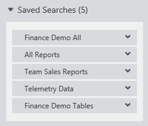
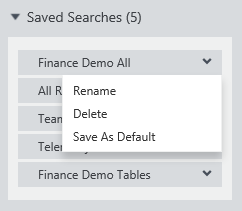

<properties
   pageTitle="Cómo guardar búsquedas y anclar activos de datos | Microsoft Azure"
   description="Artículo de procedimiento para resaltar las capacidades en catálogo de datos de Azure para guardar los orígenes de datos y activos de datos para su uso posterior."
   services="data-catalog"
   documentationCenter=""
   authors="steelanddata"
   manager="NA"
   editor=""
   tags=""/>
<tags
   ms.service="data-catalog"
   ms.devlang="NA"
   ms.topic="article"
   ms.tgt_pltfrm="NA"
   ms.workload="data-catalog"
   ms.date="10/10/2016"
   ms.author="maroche"/>

# Cómo guardar búsquedas y anclar activos de datos

## Introducción

Catálogo de datos de Microsoft Azure ofrece capacidades de descubrimiento de origen de datos. Rápidamente, los usuarios pueden buscar y filtrar el catálogo para buscar orígenes de datos y comprender su propósito, por lo que le resulte más fácil encontrar los datos adecuados para el trabajo en curso.

Pero, ¿qué sucede cuando los usuarios necesitan trabajar con regularidad con los mismos datos? ¿Qué ocurre cuando los usuarios contribuyan con regularidad sus conocimientos a los mismos orígenes de datos en el catálogo? En estos casos, tener que emitir repetidamente las mismas búsquedas puede ser ineficaz: aquí es donde se guardan búsqueda y anclados pueden ayudar los activos de datos.

## Búsquedas guardadas

Una búsqueda guardada en catálogo de datos de Azure es una definición de búsqueda reutilizable, de cada usuario. Una vez que un usuario ha definido una búsqueda – incluido términos de búsqueda, etiquetas y otros filtros, puede guardarlo para su uso posterior. La definición de la búsqueda guardada puede volver a ejecutarse en una fecha posterior, para devolver los activos de datos que cumplen los criterios de búsqueda.

### Crear una búsqueda guardada

Para crear una búsqueda guardada, en primer lugar escriba los criterios de búsqueda para volver a utilizar. A continuación, haga clic en el vínculo "Guardar" en el cuadro "Búsqueda actual" en el portal de catálogo de datos de Azure.

 

Cuando se le pida, escriba un nombre para la búsqueda guardada. Elija un nombre significativo y descriptivo de los activos de datos que devolverá la búsqueda.

 

### Administración de búsquedas

Una vez que el usuario haya guardado en una o varias búsquedas, aparecerá una opción de "Búsquedas guardadas" en el portal de catálogo de datos de Azure en el cuadro "Buscar actual". Cuando se expande, se mostrará la lista completa de búsquedas de guarda.

 

Seleccionar una búsqueda guardada de la lista hará que la búsqueda que se debe ejecutar.

Seleccionar el menú desplegable le proporcionará un conjunto de opciones de administración:

 

Seleccionar "Cambiar nombre" solicitará al usuario que escriba un nuevo nombre para la búsqueda guardada. No se cambiará la definición de la búsqueda.

Seleccionar "Eliminar" solicitará al usuario confirmación y, a continuación, quitará la búsqueda guardada de la lista del usuario.

Seleccione ""Guardar como predeterminado para marcar el elegido búsqueda guardado como la búsqueda predeterminada para el usuario. Si el usuario realiza una búsqueda de "vacía" de la página de inicio del catálogo de datos de Azure, se ejecutará la búsqueda de predeterminada del usuario. Además, la búsqueda marcada como predeterminado aparecerá en la parte superior de la lista de búsqueda guardada.

### Organización búsquedas guardadas

Todos los usuarios pueden guardar búsquedas para su propio uso. Los administradores del catálogo de datos también pueden guardar búsquedas para todos los usuarios dentro de la organización. Al guardar una búsqueda, los administradores se presentan una opción para compartir la búsqueda guardada dentro de la compañía. Si selecciona esta opción, la búsqueda guardada se incluirán en la lista de búsquedas disponibles para todos los usuarios.

 

## Activos de datos anclada

Búsquedas guardadas permiten a los usuarios guardar y reutilizar definiciones de búsqueda; los activos de datos devueltos por las búsquedas pueden cambiar con el tiempo cuando el contenido del cambio de catálogo. Anclaje de activos de datos permite a los usuarios explícitamente identificar los activos de datos específicos para facilitar su acceso sin necesidad de utilizar una búsqueda.

Anclar un activo de datos es sencillo: los usuarios simplemente haga clic en el icono de "anclar" de los activos de datos agregarlo a su lista anclada. Este icono aparece en la esquina del mosaico del activo en la vista en mosaico y, en la columna situada más a la izquierda en la vista de lista en el portal de catálogo de datos de Azure.

Liberar un activo también es sencillo: los usuarios simplemente haga clic en el icono de "anclar" nuevo para cambiar la configuración para el activo seleccionado.

## "Mis activos"
La página principal del catálogo de datos de Azure portal incluye una sección de "Mis activos" que se muestra los activos de interés para el usuario actual. Esta sección incluye dos activos anclados y búsquedas guardadas.

## Resumen
Catálogo de datos de Azure proporciona características que facilitan la descubrir los orígenes de datos que necesitan, por lo que pueden pasar menos tiempo para buscar datos y más tiempo trabajando con él. Búsquedas guardadas y anclados datos activos se basan en estas capacidades centrales para que los usuarios puedan identificar fácilmente los orígenes de datos con la que funcionarán varias veces.
