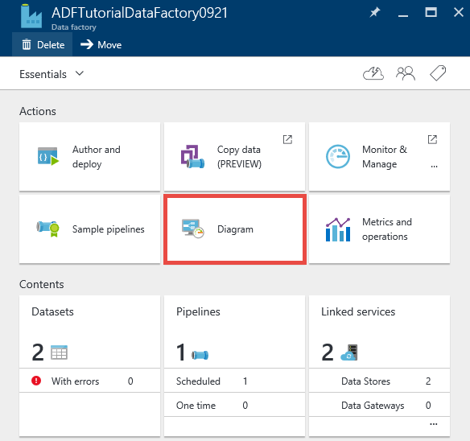
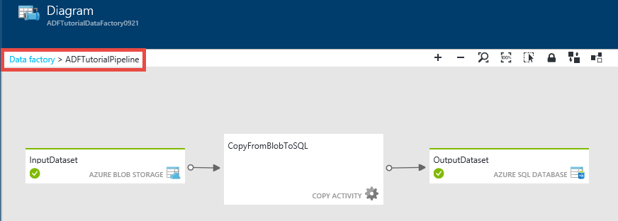
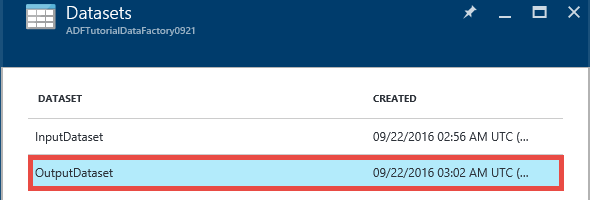
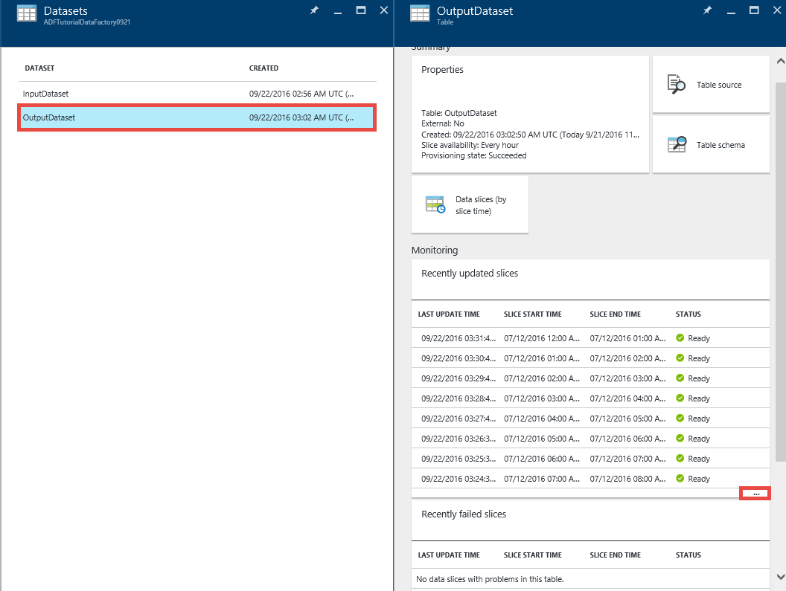
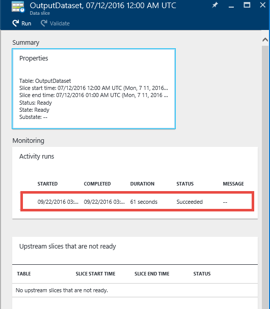

<properties 
    pageTitle="Tutorial: Crear una canalización con la actividad de copia con Azure portal | Microsoft Azure" 
    description="En este tutorial, creará una canalización del generador de datos de Azure con una actividad de copia mediante el Editor de fábrica de datos en el portal de Azure." 
    services="data-factory" 
    documentationCenter="" 
    authors="spelluru" 
    manager="jhubbard" 
    editor="monicar"/>

<tags 
    ms.service="data-factory" 
    ms.workload="data-services" 
    ms.tgt_pltfrm="na" 
    ms.devlang="na" 
    ms.topic="get-started-article" 
    ms.date="09/16/2016" 
    ms.author="spelluru"/>

# Tutorial: Crear una canalización con la actividad de copia con Azure portal
> [AZURE.SELECTOR]
- [Información general y los requisitos previos](data-factory-copy-data-from-azure-blob-storage-to-sql-database.md)
- [Asistente para copiar](data-factory-copy-data-wizard-tutorial.md)
- [Portal de Azure](data-factory-copy-activity-tutorial-using-azure-portal.md)
- [Visual Studio](data-factory-copy-activity-tutorial-using-visual-studio.md)
- [PowerShell](data-factory-copy-activity-tutorial-using-powershell.md)
- [Azure plantilla de administrador de recursos](data-factory-copy-activity-tutorial-using-azure-resource-manager-template.md)
- [API DE REST](data-factory-copy-activity-tutorial-using-rest-api.md)
- [API DE .NET](data-factory-copy-activity-tutorial-using-dotnet-api.md)

En este tutorial se muestra cómo crear y supervisar un generador de datos de Azure con el portal de Azure. La canalización en el generador de datos utiliza una actividad de copiar para copiar los datos desde el almacenamiento de blobs de Windows Azure a base de datos de SQL Azure.

Estos son los pasos que se realizan como parte de este tutorial:

Paso | Descripción
-----| -----------
[Crear un generador de datos de Azure](#create-data-factory) | En este paso, creará un generador de datos de Azure denominado **ADFTutorialDataFactory**.  
[Crear servicios vinculados](#create-linked-services) | En este paso, creará dos servicios vinculados: **AzureStorageLinkedService** y **AzureSqlLinkedService**.   Vínculos a la AzureStorageLinkedService el almacenamiento de Azure y AzureSqlLinkedService vínculos la base de datos de SQL Azure a la ADFTutorialDataFactory. Los datos de entrada para la canalización reside en un contenedor de blobs de los datos de salida y el almacenamiento de blobs de Windows Azure se almacenan en una tabla en la base de datos de SQL Azure. Por lo tanto, agregue estos almacena dos datos como servicios vinculados en el generador de datos.      
[Cree la entrada y salida conjuntos de datos](#create-datasets) | En el paso anterior, había creado servicios vinculados que hacen referencia a almacena datos que contienen datos de entrada y salida. En este paso, se definen dos conjuntos de datos, **InputDataset** y **OutputDataset** , que representan los datos de entrada y salida se almacenan en la almacena datos.   Para el InputDataset especificar el contenedor de blob que contiene un blob con los datos de origen y de la OutputDataset, especifique la tabla SQL que almacena los datos de salida. También especificar otras propiedades, como la estructura, la disponibilidad y la directiva. 
[Crear una canalización](#create-pipeline) | En este paso, creará una canalización denominada **ADFTutorialPipeline** en la ADFTutorialDataFactory.   Se agrega una **actividad de copia** de la canalización de copia de entrada de datos de la Azure blob a la tabla SQL Azure de salida. La actividad de copia realiza el movimiento de datos en el generador de datos de Azure. Funciona con un servicio disponible globalmente que puede copiar datos entre varias almacena datos de forma segura, confiable y scalable. Consulte el artículo de [Actividades de movimiento de datos](data-factory-data-movement-activities.md) para obtener más información acerca de la actividad de copia. 
[Canalización de Monitor](#monitor-pipeline) | En este paso, supervisar sectores de tablas de entrada y salidas con Azure portal.

## Requisitos previos 
Completado requisitos previos enumerados en el artículo [Introducción a Tutorial](data-factory-copy-data-from-azure-blob-storage-to-sql-database.md) antes de realizar este tutorial.

## Crear el generador de datos
En este paso, se utiliza el portal de Azure para crear un generador de datos de Azure denominado **ADFTutorialDataFactory**.

1.  Después de iniciar sesión el [portal de Azure](https://portal.azure.com/), haga clic en **nuevo**, seleccione **inteligencia + análisis**y haga clic en **Generador de datos**. 

      

6. En el módulo **Nuevo generador de datos** :
    1. Escriba **ADFTutorialDataFactory** para el **nombre**. 
    
        

        El nombre del generador de datos de Azure debe ser **único global**. Si recibe el siguiente error, cambie el nombre de la fábrica de datos (por ejemplo, yournameADFTutorialDataFactory) e intente crear de nuevo. Vea el tema de la [Fábrica de datos - las reglas de nombres](data-factory-naming-rules.md) para las reglas de nomenclatura para artefactos del generador de datos.
    
            Data factory name “ADFTutorialDataFactory” is not available  
     
        
    2. Seleccione la **suscripción**de Azure.
    3. Para el grupo de recursos, siga uno de los siguientes pasos:
        1. Seleccione **Usar existente**y seleccione un grupo de recursos existente en la lista desplegable. 
        2. Seleccione **Crear nueva**y escriba el nombre de un grupo de recursos.   
    
            Algunos de los pasos de este tutorial se supone que usa el nombre: **ADFTutorialResourceGroup** del grupo de recursos. Para obtener información sobre los grupos de recursos, consulte [uso de grupos de recursos para administrar los recursos de Azure](../azure-resource-manager/resource-group-overview.md).  
    4. Seleccione la **ubicación** para el generador de datos. Solo las regiones que admite el servicio de generador de datos se muestran en la lista desplegable.
    5. Seleccione **Anclar al Startboard**.     
    6. Haga clic en **crear**.

        > [AZURE.IMPORTANT] Para crear instancias del generador de datos, debe ser miembro del rol de [Colaborador del generador de datos](../active-directory/role-based-access-built-in-roles.md/#data-factory-contributor) en el nivel de grupo de suscripción o recurso.
        >  
        >  El nombre de la fábrica de datos puede estar registrado como un nombre DNS en el futuro y por tanto se hacen visible públicamente.              
9.  Para ver los mensajes de notificación del estado, haga clic en el icono de campana en la barra de herramientas. 

     
10. Una vez completada la creación, consulte el módulo de **Generador de datos** como se muestra en la imagen.

    

## Crear servicios vinculados
Servicios vinculados vincular almacena datos o calculan servicios a un generador de datos de Azure. Consulte [almacena datos compatibles](data-factory-data-movement-activities.md##supported-data-stores-and-formats) para todos los orígenes y receptores compatibles con la actividad de copia. Vea [calcular servicios vinculados](data-factory-compute-linked-services.md) de la lista de servicios de cálculo compatibles con el generador de datos. En este tutorial, no utilizar cualquier servicio de cálculo. 

En este paso, creará dos servicios vinculados: **AzureStorageLinkedService** y **AzureSqlLinkedService**. AzureStorageLinkedService vinculadas vínculos de servicio una cuenta de almacenamiento de Azure y AzureSqlLinkedService una base de datos de SQL Azure se vincula a la **ADFTutorialDataFactory**. Crear una canalización más adelante en este tutorial que copie los datos de un contenedor de blob en AzureStorageLinkedService a una tabla SQL en AzureSqlLinkedService.

### Crear un servicio vinculado de la cuenta de almacenamiento de Azure
1.  En el módulo de **Generador de datos** , haga clic en **autor e implementar** mosaico para iniciar el **Editor** de la fábrica de datos.

     
5. En el **Editor**, haga clic en el botón **almacenan nuevos datos** en la barra de herramientas y seleccione **almacenamiento de Azure** en el menú desplegable. Ahora debe aparecer la plantilla de JSON para crear un servicio de almacenamiento de Azure vinculado en el panel derecho. 

        
6. Reemplazar `<accountname>` y `<accountkey>` con el nombre de cuenta y los valores de clave de cuenta para su cuenta de almacenamiento de Azure. 

     
6. En la barra de herramientas, haga clic en **implementar** . Ahora debe ver la implementado **AzureStorageLinkedService** en la vista de árbol. 

    

> [AZURE.NOTE]
> Para obtener más información sobre las propiedades JSON, vea [mover datos desde y hacia blobs de Windows Azure](data-factory-azure-blob-connector.md#azure-storage-linked-service) .

### Crear un servicio vinculado para la base de datos de SQL Azure
1. En el **Editor del generador de datos**, haga clic en el botón **almacenan nuevos datos** en la barra de herramientas y seleccione la **Base de datos de SQL Azure** en el menú desplegable. Ahora debe aparecer la plantilla JSON para crear el servicio SQL Azure vinculado en el panel derecho.
2. Reemplazar `<servername>`, `<databasename>`, `<username>@<servername>`, y `<password>` con nombres de su servidor SQL Azure, la base de datos, la cuenta de usuario y la contraseña. 
3. En la barra de herramientas para crear e implementar la **AzureSqlLinkedService**, haga clic en **implementar** .
4. Confirme que ve **AzureSqlLinkedService** en la vista de árbol. 

> [AZURE.NOTE]
> Para obtener más información sobre las propiedades JSON, vea [mover datos desde y hacia la base de datos de SQL Azure](data-factory-azure-sql-connector.md#azure-sql-linked-service-properties) .

## Crear conjuntos de datos
En el paso anterior, creado vinculados servicios **AzureStorageLinkedService** y **AzureSqlLinkedService** para vincular una cuenta de almacenamiento de Azure y la base de datos de SQL Azure en el generador de datos: **ADFTutorialDataFactory**. En este paso, se definen dos conjuntos de datos, **InputDataset** y **OutputDataset** , que representan los datos de entrada y salida se almacenan en la almacena datos referencia AzureStorageLinkedService y AzureSqlLinkedService respectivamente. Para InputDataset, especifique el contenedor de blob que contiene un blob con los datos de origen y de OutputDataset, especifique la tabla SQL que almacena los datos de salida. 

### Crear conjunto de datos de entrada 
En este paso, creará un conjunto de datos denominado **InputDataset** que apunta a un contenedor de blob en el almacenamiento de Azure representada por el servicio de **AzureStorageLinkedService** vinculado.

1. En el **Editor** de la fábrica de datos, haga clic en **... Más**, haga clic en **nuevo conjunto de datos**y haga clic en **almacenamiento de blobs de Windows Azure** en el menú desplegable. 

    
2. Reemplazar JSON en el panel derecho con el fragmento JSON siguiente: 

        {
          "name": "InputDataset",
          "properties": {
            "structure": [
              {
                "name": "FirstName",
                "type": "String"
              },
              {
                "name": "LastName",
                "type": "String"
              }
            ],
            "type": "AzureBlob",
            "linkedServiceName": "AzureStorageLinkedService",
            "typeProperties": {
              "folderPath": "adftutorial/",
              "fileName": "emp.txt",
              "format": {
                "type": "TextFormat",
                "columnDelimiter": ","
              }
            },
            "external": true,
            "availability": {
              "frequency": "Hour",
              "interval": 1
            }
          }
        }
        
     Tenga en cuenta los siguientes puntos: 
    
    - **tipo** de conjunto de datos se establece en **AzureBlob**.
    - **linkedServiceName** se establece en **AzureStorageLinkedService**. Este servicio vinculada que creado en el paso 2.
    - **folderPath** se establece en el contenedor **adftutorial** . También puede especificar el nombre de un blob dentro de la carpeta mediante la propiedad del **nombre de archivo** . Puesto que no se especifica el nombre del objeto binario, datos de todos los blobs en el contenedor se consideran como una entrada de datos.  
    - **tipo** de formato se establece en **TextFormat**
    - Hay dos campos en el archivo de texto: **nombre** y **apellido** , separado por un carácter de coma (**columnDelimiter**) 
    - La **disponibilidad** se establece en **cada hora** (**frecuencia** se establece en **horas** y el **intervalo** está establecido en **1**). Por lo tanto, el generador de datos busca datos de entrada cada hora en la carpeta raíz del contenedor de blob (**adftutorial**) especificado. 
    
    Si no especifica un **nombre de archivo** para un conjunto de datos de **entrada** , todos los archivos o blobs de la carpeta de entrada (**folderPath**) se consideran como entradas. Si especifica un nombre de archivo en el JSON, solo el especificado archivo/blob se considera asn entrada.
 
    Si no especifica un **nombre de archivo** para una **tabla de resultados**, los archivos generados en el **folderPath** se denominan en el siguiente formato: datos. &lt;Guid\&gt;. txt (ejemplo: Data.0a405f8a 93ff 4c6f b3be f69616f1df7a.txt.).

    Para establecer **folderPath** y **nombre de archivo** dinámicamente en función del tiempo de **SliceStart** , use la propiedad **partitionedBy** . En el ejemplo siguiente, folderPath usa el año, mes y día de la SliceStart (hora de inicio de la segmentación de datos que se está procesando) y nombre de archivo usa horas desde el SliceStart. Por ejemplo, si se produce un sector para 2016-09-20T08:00:00, el nombre de carpeta se establece en wikidatagateway, wikisampledataout, 2016, 09/20 y el nombre de archivo se establece en 08.csv. 

            "folderPath": "wikidatagateway/wikisampledataout/{Year}/{Month}/{Day}",
            "fileName": "{Hour}.csv",
            "partitionedBy": 
            [
                { "name": "Year", "value": { "type": "DateTime", "date": "SliceStart", "format": "yyyy" } },
                { "name": "Month", "value": { "type": "DateTime", "date": "SliceStart", "format": "MM" } }, 
                { "name": "Day", "value": { "type": "DateTime", "date": "SliceStart", "format": "dd" } }, 
                { "name": "Hour", "value": { "type": "DateTime", "date": "SliceStart", "format": "hh" } } 
            ],
2. En la barra de herramientas para crear e implementar el conjunto de datos de **InputDataset** , haga clic en **implementar** . Confirme que ve la **InputDataset** en la vista de árbol.

> [AZURE.NOTE]
> Para obtener más información sobre las propiedades JSON, vea [mover datos desde y hacia blobs de Windows Azure](data-factory-azure-blob-connector.md#azure-blob-dataset-type-properties) .

### Crear conjunto de datos de salida
En esta parte del paso, creará un conjunto de datos de salida denominada **OutputDataset**. Puntos de este conjunto de datos a una tabla SQL en la base de datos de SQL Azure representada por **AzureSqlLinkedService**. 

1. En el **Editor** de la fábrica de datos, haga clic en **... Más**, haga clic en **nuevo conjunto de datos**y haga clic en **SQL Azure** en el menú desplegable. 
2. Reemplazar JSON en el panel derecho con el fragmento JSON siguiente:

        {
          "name": "OutputDataset",
          "properties": {
            "structure": [
              {
                "name": "FirstName",
                "type": "String"
              },
              {
                "name": "LastName",
                "type": "String"
              }
            ],
            "type": "AzureSqlTable",
            "linkedServiceName": "AzureSqlLinkedService",
            "typeProperties": {
              "tableName": "emp"
            },
            "availability": {
              "frequency": "Hour",
              "interval": 1
            }
          }
        }
        
     Tenga en cuenta los siguientes puntos: 
    
    - **tipo** de conjunto de datos se establece en **AzureSQLTable**.
    - **linkedServiceName** se establece en **AzureSqlLinkedService** (este servicio vinculada que creó en el paso 2).
    - **nombre de tabla** se establece en **emp**.
    - Hay tres columnas: **ID**, **nombre**y **apellido** : en la tabla de emp en la base de datos. ID es una columna de identidad, por lo que debe especificar solo **nombre** y **Apellidos** aquí.
    - La **disponibilidad** se establece en **cada hora** (**frecuencia** establecido en **hora** e **intervalo** establecido en **1**).  El servicio de generador de datos genera un segmento de datos de salida cada hora en la tabla de **emp** en la base de datos de SQL Azure.

3. En la barra de herramientas para crear e implementar el conjunto de datos de **OutputDataset** , haga clic en **implementar** . Confirme que ve la **OutputDataset** en la vista de árbol. 

> [AZURE.NOTE]
> Para obtener más información sobre las propiedades JSON, vea [mover datos desde y hacia la base de datos de SQL Azure](data-factory-azure-sql-connector.md#azure-sql-linked-service-properties) .

## Crear canalización
En este paso, cree una canalización con una **Copia actividad** que usa **InputDataset** como entrada y **OutputDataset** como resultado.

1. En el **Editor** de la fábrica de datos, haga clic en **... Más**y haga clic en **nuevo canal**. Como alternativa, puede contextual **canalizaciones** en la vista de árbol y haga clic en **nueva canalización**.
2. Reemplazar JSON en el panel derecho con el fragmento JSON siguiente: 
        
        {
          "name": "ADFTutorialPipeline",
          "properties": {
            "description": "Copy data from a blob to Azure SQL table",
            "activities": [
              {
                "name": "CopyFromBlobToSQL",
                "type": "Copy",
                "inputs": [
                  {
                    "name": "InputDataset"
                  }
                ],
                "outputs": [
                  {
                    "name": "OutputDataset"
                  }
                ],
                "typeProperties": {
                  "source": {
                    "type": "BlobSource"
                  },
                  "sink": {
                    "type": "SqlSink",
                    "writeBatchSize": 10000,
                    "writeBatchTimeout": "60:00:00"
                  }
                },
                "Policy": {
                  "concurrency": 1,
                  "executionPriorityOrder": "NewestFirst",
                  "retry": 0,
                  "timeout": "01:00:00"
                }
              }
            ],
            "start": "2016-07-12T00:00:00Z",
            "end": "2016-07-13T00:00:00Z"
          }
        } 

    Tenga en cuenta los siguientes puntos:

    - En la sección actividades, hay sólo una actividad cuyo **tipo** se establece en **Copiar**.
    - Entrada de la actividad se establece en **InputDataset** y salida de la actividad está establecida en **OutputDataset**.
    - En la sección **typeProperties** , **BlobSource** se especifica como el tipo de origen y **SqlSink** se especifica como el tipo de receptor.

    Reemplace el valor de la propiedad **empezar** con el valor de día y de **finalización** actual con el día siguiente. Puede especificar la parte de la fecha y omitir la parte de hora de la fecha hora. Por ejemplo, "2016-02-03", que es equivalente a "2016-02-03T00:00:00Z"
    
    Ambas inicio y final fechas y horas deben estar en [formato ISO](http://en.wikipedia.org/wiki/ISO_8601). Por ejemplo: 2016-10-14T16:32:41Z. La hora de **finalización** es opcional, pero se usa en este tutorial. 
    
    Si no especifica el valor de la propiedad **final** , se calcula como "**Inicio + 48 horas**". Para ejecutar la canalización de forma indefinida, especifique **9999-09-09** como el valor de la propiedad **end** .
    
    En el ejemplo anterior, hay 24 segmentaciones de datos como cada segmento de datos se produce cada hora.
    
4. En la barra de herramientas para crear e implementar la **ADFTutorialPipeline**, haga clic en **implementar** . Confirme que ve la canalización de la vista de árbol. 
5. Ahora, cierre el módulo **Editor** haciendo clic en **X**. Haga clic en **X** para ver la página de inicio del **Generador de datos** para la **ADFTutorialDataFactory**.

**¡Felicidades!** Ha creado un generador de datos de Azure, servicios vinculados, tablas y una canalización y programar la canalización.   
 
### Ver el generador de datos en una vista de diagrama 
1. En el módulo de **Generador de datos** , haga clic en **diagrama**.

    
2. Verá el diagrama similar a la siguiente imagen: 

    

    Puede acercar, alejar, zoom al 100%, zoom ajustar automáticamente colocar canalizaciones y tablas y mostrar información de linaje (resalta elementos ascendentes y descendentes de los elementos seleccionados).  Hacer doble clic en un objeto (tabla de entrada y salida o canalización) para ver las propiedades para el mismo. 
3. Haga clic con el botón **ADFTutorialPipeline** en la vista Diagrama y haga clic en **abrir canalización**. 

    
4. Debería ver las actividades de la canalización junto con conjuntos de datos de entrada y salida para las actividades. En este tutorial, tener sólo una actividad de la canalización (copiar actividad) con InputDataset como entrada de conjunto de datos y OutputDataset como conjunto de datos de salida.   

    
5. En la ruta de exploración en la esquina superior izquierda para volver a la vista de diagrama, haga clic en **Generador de datos** . La vista de diagrama muestra todas las tuberías. En este ejemplo, sólo ha creado una canalización.   
 

## Canalización de Monitor
En este paso, usa el portal de Azure para supervisar lo que sucede en un generador de datos de Azure. 

### Mediante la vista Diagrama de canalización de Monitor

1. Haga clic en **X** para cerrar la vista de **diagrama** para ver la página de inicio del generador de datos para el generador de datos. Si ha cerrado el explorador web, siga los pasos siguientes: 
    2. Vaya al [portal de Azure](https://portal.azure.com/). 
    2. Haga doble clic en **ADFTutorialDataFactory** en la **Startboard** (o) haga clic en **fábricas de datos** en el menú de la izquierda y busque ADFTutorialDataFactory. 
3. Debería ver el número y los nombres de tablas y canalización creada en este módulo.

    
4. Ahora, haga clic en el mosaico de **conjuntos de datos** .
5. En el módulo de **conjuntos de datos** , haga clic en **InputDataset**. Este conjunto de datos es el conjunto de datos de entrada para **ADFTutorialPipeline**.

       
5. Haga clic en **... (puntos suspensivos)** Para ver todos los sectores de datos.

      

    Observe que todos los sectores de datos hasta la hora actual están **listos** , porque el archivo **emp.txt** existe todo el tiempo en el contenedor de blob: **adftutorial\input**. Confirme que no hay sectores aparecen en la sección de **sectores recientemente errores** en la parte inferior.

    Listas tanto **actualizado recientemente sectores** y **error recientemente sectores** se ordenan por la **hora de última actualización**. 
    
    En la barra de herramientas para filtrar los sectores, haga clic en **filtro** .  
    
    
6. Cierre los módulos hasta que vea el módulo de **conjuntos de datos** . Haga clic en el **OutputDataset**. Este conjunto de datos es el conjunto de datos de salida para **ADFTutorialPipeline**.

    
6. Verá el módulo **OutputDataset** tal como se muestra en la siguiente imagen:

     
7. Observe que ya se han producido los sectores de datos hasta el momento actual y está **Listo**. No hay sectores aparecerán en la sección de **sectores de problema** en la parte inferior.
8. Haga clic en **... (Puntos suspensivos)** Para ver todos los sectores.

    
9. Haga clic en cualquier sector de datos de la lista y verá el módulo de **sectores de datos** .

    
  
    Si la segmentación de datos no está en el estado **Listo** , puede ver los sectores precedentes que no están listos e impiden la segmentación de datos actual de la ejecución de la lista de **sectores precedentes que son no está listos** .
11. En el módulo de **Sectores de datos** , debería ver todas las actividades que se ejecución en la lista en la parte inferior. Haga clic en una **actividad ejecutar** para ver el módulo de **actividad de los detalles de ejecución** . 

    
12. Haga clic en **X** para cerrar todos los módulos hasta que regrese a la hoja principal para el **ADFTutorialDataFactory**.
14. (opcional) Haga clic en **canalizaciones** en la página principal para **ADFTutorialDataFactory**, haga clic en **ADFTutorialPipeline** en el módulo de **tuberías** y obtención de detalles de entrada (**consumido**) o tablas de salida (**producido**).
15. Inicie **SQL Server Management Studio**, conectarse a la base de datos de SQL Azure y compruebe que las filas se insertan en la tabla de **emp** en la base de datos.

    

### Supervisar la canalización utilizando Monitor y administrar aplicaciones
También puede utilizar el Monitor y administrar la aplicación para supervisar su canalizaciones. Para obtener información detallada sobre el uso de esta aplicación, vea [Monitor y administrar canalizaciones generador de datos de Azure con supervisión y aplicación de administración de](data-factory-monitor-manage-app.md).

1. Haga clic en el icono de **Monitor y administrar** en la página principal para el generador de datos.

     
2. Debería ver **supervisar y administrar aplicaciones**. Cambiar la **hora de inicio** y **hora de finalización** para incluir inicio (2016-07-12) y fin (2016-07-13) de la canalización y haga clic en **Aplicar**. 

     
3. Seleccione una ventana de la actividad de la lista de **Actividad de Windows** para ver detalles sobre ella. 
    

## Resumen 
En este tutorial, ha creado un generador de datos de Azure para copiar datos de un Azure blob a una base de datos de SQL Azure. Utilizar el portal de Azure para crear el generador de datos, servicios vinculados, los conjuntos de datos y una canalización. Estos son los pasos que realizó en este tutorial:  

1.  Crea un **Generador de datos**de Azure.
2.  Crear **servicios vinculados**:
    1. Un servicio de **Almacenamiento de Azure** vinculado vincular tu cuenta de almacenamiento de Azure que contiene los datos de entrada.    
    2. Un servicio de **SQL Azure** vinculadas para vincular la base de datos de SQL Azure que contiene los datos de salida. 
3.  Crear **conjuntos de datos** que describen los datos de entrada y salida para canalizaciones.
4.  Crea una **canalización** con una **Actividad de copia** con **BlobSource** como origen y **SqlSink** como receptor.  

## Vea también
| Tema | Descripción |
| :---- | :---- |
| [Actividades de movimiento de datos](data-factory-data-movement-activities.md) | En este artículo se proporciona información detallada sobre la actividad de copia que usó en el tutorial. |
| [Programación y ejecución](data-factory-scheduling-and-execution.md) | En este artículo se explica los aspectos de programación y ejecución del generador de datos de Azure del modelo de aplicación. |
| [Canalizaciones](data-factory-create-pipelines.md) | Este artículo le ayudará a comprender canalizaciones y actividades en el generador de datos de Azure. |
| [Conjuntos de datos](data-factory-create-datasets.md) | Este artículo le ayudará a comprender los conjuntos de datos en el generador de datos de Azure.
| [Supervisar y administrar tuberías mediante la aplicación de supervisión](data-factory-monitor-manage-app.md) | En este artículo se describe cómo supervisar, administrar y depurar tuberías mediante la supervisión y la aplicación de administración. 

