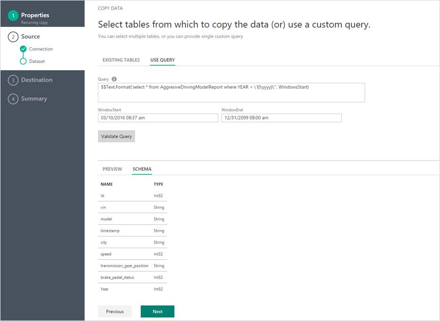
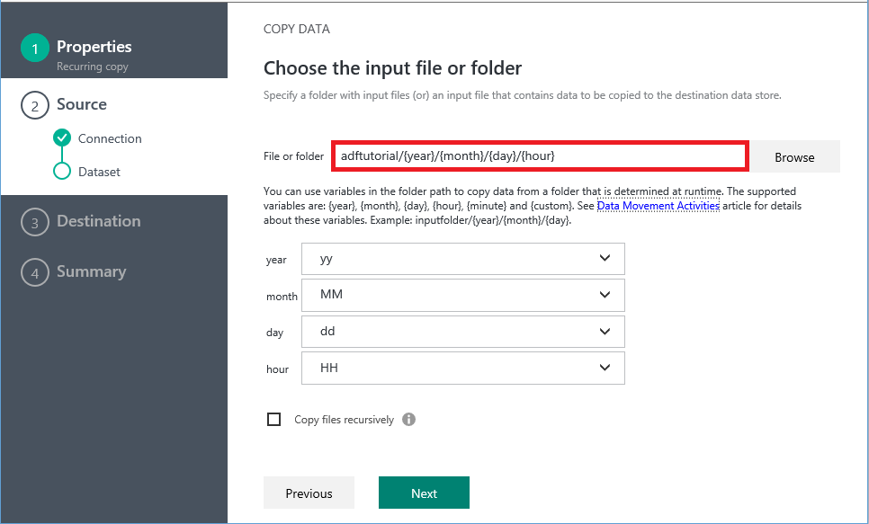

<properties
    pageTitle="Asistente para la copia de datos Factory | Microsoft Azure"
    description="Obtenga información sobre cómo usar al Asistente para la copia del generador de datos para copiar los datos desde orígenes de datos compatibles receptores."
    services="data-factory"
    documentationCenter=""
    authors="spelluru"
    manager="jhubbard"
    editor="monicar"/>

<tags
    ms.service="data-factory"
    ms.workload="data-services"
    ms.tgt_pltfrm="na"
    ms.devlang="na"
    ms.topic="article"
    ms.date="09/29/2016"
    ms.author="spelluru"/>

# Asistente para la copia de generador de datos
El Asistente para la copia de Azure datos fábrica es facilitar el proceso de recopilación de datos de, que normalmente es un primer paso en un escenario de integración de datos de llevar a cabo. Al pasar por el Asistente para la copia de Azure datos fábrica, no es necesario comprender las definiciones de JSON para servicios vinculados, los conjuntos de datos y canalizaciones. Sin embargo, después de completar todos los pasos del asistente, el asistente crea automáticamente un proceso para copiar los datos de origen de datos seleccionado en el destino seleccionado. Además, el Asistente para copiar le ayuda a validar los datos que se ingestión en el momento de creación, que guarda gran parte de su tiempo, especialmente cuando recopila datos por primera vez desde el origen de datos. Para iniciar al Asistente para copiar, haga clic en el mosaico **Copiar datos** en la página de inicio de la fábrica de datos.

## Un asistente intuitivo para copiar los datos
Este asistente permite mover fácilmente los datos de una amplia variedad de orígenes a destinos en minutos. Tras seguir el asistente, se crea automáticamente una canalización con una actividad de copia para usted junto con las entidades de datos fábrica dependientes (services vinculados y conjuntos de datos). Pasos adicionales no son necesarios para crear la canalización.   

> [AZURE.NOTE] Consulte [tutorial del Asistente para copiar](data-factory-copy-data-wizard-tutorial.md) el artículo para obtener instrucciones paso a paso crear una canalización de ejemplo para copiar datos de un Azure blob a una tabla de base de datos de SQL Azure. 

El Asistente está diseñado con datos grandes en cuenta desde el principio. Es sencillo y eficaz para crear canalizaciones generador de datos que se mueven cientos de carpetas, archivos o tablas con el Asistente para copiar los datos. El asistente admite las tres características siguientes: vista previa de datos automática, captura de esquema y asignación y filtrado de datos. 

## Vista previa de datos automática 
El Asistente para copiar le permite revisar parte de los datos de origen de datos seleccionado para validar si los datos los datos correctos que desea copiar. Además, si el origen de datos está en un archivo de texto, el Asistente para copiar analiza el archivo de texto para obtener esquemas y delimitadores de columna y fila automáticamente. 

## Captura de esquema y asignación 
El esquema de datos de entrada no puede coincidir con el esquema de datos de salida en algunos casos. En este escenario, debe asignar columnas desde el esquema de origen a las columnas del esquema de destino. 

El Asistente para copiar, columnas del esquema de origen asigna automáticamente a las columnas del esquema de destino. Puede reemplazar las asignaciones mediante las listas desplegables (o) especificar si se debe omitir al copiar los datos de una columna.   

## Filtrado de datos  
El asistente le permite filtrar los datos de origen para seleccionar sólo los datos que necesita para copiar al almacén de datos de destino o receptor. Filtrado reduce el volumen de los datos se copien en el almacén de datos del receptor y, por tanto, mejora el rendimiento de la operación de copia. Proporciona una manera flexible para filtrar datos en una base de datos relacional mediante SQL query language (o) archivos en una carpeta de blobs de Windows Azure utilizando [variables y funciones del generador de datos](data-factory-functions-variables.md).   

### Filtrado de datos en una base de datos  
En el ejemplo, la consulta SQL utiliza la `Text.Format` función y `WindowStart` variable. 

### Filtrado de datos en una carpeta de blobs de Windows Azure
Puede utilizar variables en la ruta de acceso de la carpeta para copiar datos de una carpeta que se determina en tiempo de ejecución en función de [las variables del sistema](data-factory-functions-variables.md#data-factory-system-variables). Las variables compatibles son: **{year}**, **{mes}**, **{day}**, **{horas}**, **{minuto}**y **{personalizado}**. Ejemplo: inputfolder / {year} / {mes} / {día}.

Suponga que ha introducido carpetas en el siguiente formato:

    2016/03/01/01
    2016/03/01/02
    2016/03/01/03
    ...

Haga clic en el botón **Examinar** para el **archivo o carpeta**, vaya a una de estas carpetas (por ejemplo,-2016 > 03 -> 01 -> 02) y haga clic en **Elegir**. Debería ver `2016/03/01/02` en el cuadro de texto. Ahora, reemplace **2016** con **{year}**, **03** con **{mes}**, **01** con **{day}**y **02** con **{horas}**y a continuación, presione Tab. Debería ver listas desplegables para seleccionar el formato de estos cuatro variables:

   

Como se muestra en la siguiente captura de pantalla, también puede usar una variable **personalizado** y cualquier [admiten cadenas de formato](https://msdn.microsoft.com/library/8kb3ddd4.aspx). Para seleccionar una carpeta con esa estructura, utilice el botón **Examinar** primero. A continuación, reemplace un valor por **{personalizado}**y presione la tecla Tab para ver el cuadro de texto donde puede escribir la cadena de formato.     

## Compatibilidad con diversos datos y tipos de objeto
Usando el Asistente para copiar, mover eficazmente cientos de tablas, archivos o carpetas.

## Opciones de programación
Puede ejecutar la operación de copia una vez o en una programación (cada hora, diariamente, y así sucesivamente). Ambas de estas opciones pueden utilizarse para la anchura de los conectores entre local, la nube y la copia local de escritorio.

Una operación de copia única permite el movimiento de datos desde un origen a un destino solo una vez. Se aplica a los datos de cualquier tamaño y en cualquier formato compatible. La copia programada le permite copiar datos en una periodicidad preestablecida. Puede usar configuración enriquecido (como intentos, el tiempo de espera y alertas) para configurar la copia programada.

## Pasos siguientes
Para obtener un tutorial rápido de utilizar el Asistente para la copia del generador de datos para crear una canalización con copia actividad, consulte [Tutorial: crear una tubería mediante el Asistente para copiar](data-factory-copy-data-wizard-tutorial.md).
