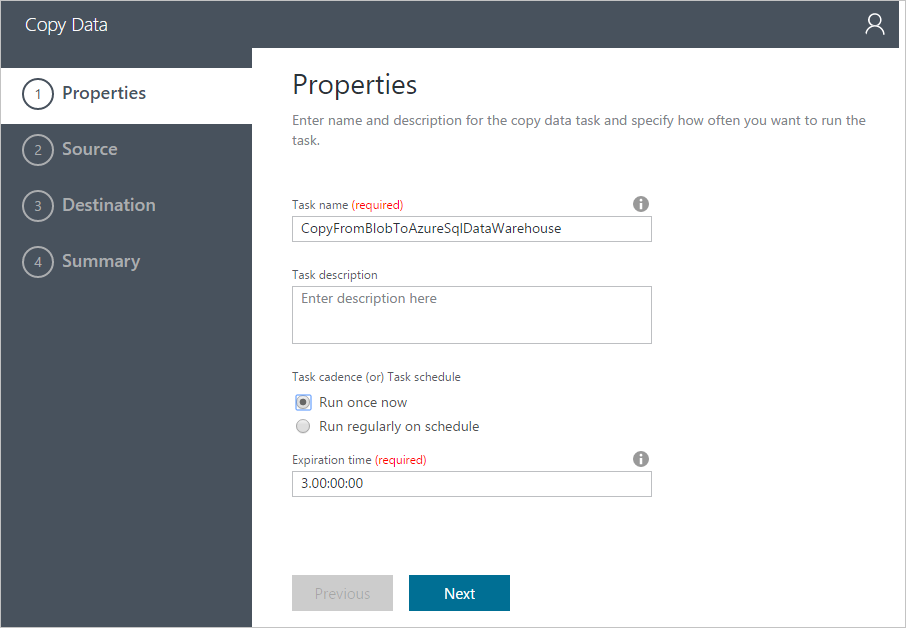
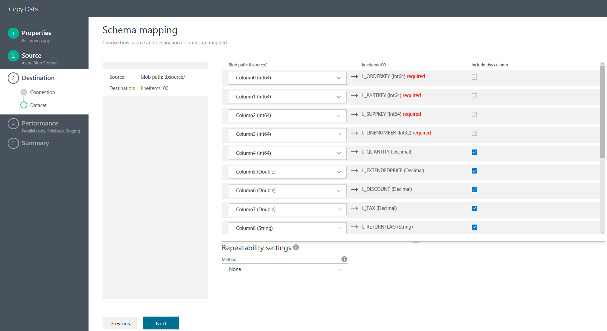
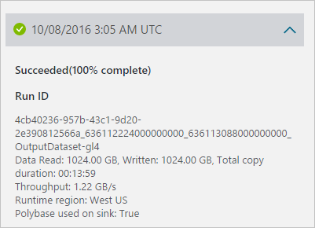

<properties 
    pageTitle="Cargar terabytes de datos en el almacén de datos SQL | Microsoft Azure" 
    description="Muestra cómo 1 TB de datos se pueden cargar en el almacén de datos de SQL Azure en 15 minutos con el generador de datos de Azure" 
    services="data-factory" 
    documentationCenter="" 
    authors="linda33wj" 
    manager="jhubbard" 
    editor="monicar"/>

<tags 
    ms.service="data-factory" 
    ms.workload="data-services" 
    ms.tgt_pltfrm="na" 
    ms.devlang="na" 
    ms.topic="article" 
    ms.date="10/28/2016" 
    ms.author="jingwang"/>

# Cargar 1 TB en el almacén de datos de SQL Azure en 15 minutos con el generador de datos de Azure [Asistente para copiar]
[Almacén de datos de SQL Azure](../sql-data-warehouse/sql-data-warehouse-overview-what-is.md) es una basada en nube escalado base de datos capaz de procesar grandes volúmenes de datos relacionales y no relacionales.  Basado en arquitectura de procesamiento enormemente paralelo (MPP), el almacén de datos de SQL está optimizado para las cargas de trabajo del almacén de datos de empresa.  Ofrece elasticidad de nube con la flexibilidad para ajustar el tamaño de almacenamiento y calcular de forma independiente.

Introducción a almacenamiento de datos de SQL Azure ahora es más fácil que nunca con el **Generador de datos de Azure**.  Generador de datos de Azure es un servicio de integración de datos en la nube totalmente administrado, que se puede utilizar para rellenar un almacén de datos de SQL con los datos de su sistema existente y ahorrará tiempo al evaluar el almacén de datos SQL y la creación de las soluciones de análisis en la parte superior.  Estas son las principales ventajas de cargar datos en el almacén de datos de SQL Azure con el generador de datos de Azure:

- **Fácil de configurar**: paso 5 asistente intuitivo sin scripting requerido.
- **Soporte técnico de almacén de datos enriquecidos**: compatibilidad integrada para un amplio conjunto de local y almacena datos basados en la nube.
- **Seguro y cumplir**: datos se transfieren por HTTPS o ExpressRoute y presencia de servicio global garantiza que los datos nunca dejan el límite geográfico
- **Rendimiento inigualable usando PolyBase** : usar Polybase es la manera más eficaz para mover datos en el almacén de datos de SQL Azure. La característica de blobs provisional se puede conseguir la velocidad de carga es alta de todos los tipos de datos almacena aparte de almacenamiento de blobs de Windows Azure, que es compatible con la Polybase de forma predeterminada.

Este artículo le muestra cómo usar al Asistente para copiar la fábrica de datos para cargar los datos de 1 TB de almacenamiento de blobs de Windows Azure en almacén de datos de SQL Azure en menos de 15 minutos, al rendimiento de más 1,2 GB/s.

Este artículo proporciona instrucciones paso a paso para mover datos en el almacén de datos de SQL Azure mediante el Asistente para copiar. 

> [AZURE.NOTE] Consulte el artículo de [mover los datos hacia y desde el almacén de datos de SQL Azure con el generador de datos de Azure](data-factory-azure-sql-data-warehouse-connector.md) para información general sobre las capacidades del generador de datos de mover los datos a o de almacén de datos de SQL Azure. 
> 
> También puede crear canalizaciones con Azure portal, Visual Studio, PowerShell, etcetera. Consulte [Tutorial: copiar datos de blobs de Windows Azure en la base de datos de SQL Azure](data-factory-copy-data-from-azure-blob-storage-to-sql-database.md) para obtener un tutorial rápido con instrucciones paso a paso para el uso de la actividad de copia en el generador de datos de Azure.  

## Requisitos previos
- Almacenamiento de blobs de Windows Azure: este ensayo usa almacenamiento de blobs de Windows Azure (GRS) para almacenar el conjunto de datos de pruebas de TPC-H.  Si no tiene una cuenta de almacenamiento de Azure, obtenga información sobre [cómo crear una cuenta de almacenamiento](../storage/storage-create-storage-account.md#create-a-storage-account).
- Datos [TPC-H](http://www.tpc.org/tpch/) : vamos a usar TPC-H como el conjunto de datos de prueba.  Para ello, debe usar `dbgen` desde el Kit de herramientas de TPC-H, que le ayudará a generar el conjunto de datos.  Puede descargar código fuente de `dbgen` de [Herramientas de TPC](http://www.tpc.org/tpc_documents_current_versions/current_specifications.asp) y compilar usted mismo o descargar el binario compilado de [GitHub](https://github.com/Azure/Azure-DataFactory/tree/master/Samples/TPCHTools).  Ejecutar dbgen.exe con los comandos siguientes para generar el archivo plano de 1 TB para `lineitem` tabla difusión entre 10 archivos:
    - `Dbgen -s 1000 -S **1** -C 10 -T L -v`
    - `Dbgen -s 1000 -S **2** -C 10 -T L -v`
    - …
    - `Dbgen -s 1000 -S **10** -C 10 -T L -v` 

    Ahora puede copiar los archivos generados para blobs de Windows Azure.  [Mover los datos hacia y desde un sistema de archivos local utilizando el generador de datos de Azure](data-factory-onprem-file-system-connector.md) para saber cómo hacerlo, consulte con la función copiar ADF.   
- Almacén de datos SQL Azure: este ensayo carga los datos en el almacén de datos de SQL Azure creados con 6.000 DWUs

    Para obtener instrucciones detalladas sobre cómo crear una base de datos de almacén de datos de SQL, consulte [crear un almacén de datos de SQL Azure](../sql-data-warehouse/sql-data-warehouse-get-started-provision/) .  Para obtener el mejor rendimiento posible carga en el almacén de datos de SQL con Polybase, elegimos el número máximo de unidades de almacén de datos (DWUs) permitidos en la configuración de rendimiento, que es 6.000 DWUs.

    > [AZURE.NOTE] 
    > Al cargar de blobs de Windows Azure, los datos de rendimiento de la carga están directamente proporcionales al número de DWUs configurar en el almacén de datos de SQL:
    > 
    > Cargar 1 TB en 1.000 almacén de datos de SQL DWU toma 87min (~ 200MBps rendimiento) cargar 1 TB en 2.000 almacén de datos de SQL DWU toma 46min (~ 380MBps rendimiento) cargar 1 TB en 6.000 almacén de datos de SQL DWU toma 14min (~1.2GBps rendimiento) 

    Para crear un almacén de datos de SQL con 6.000 DWUs, mueva el control deslizante de rendimiento a la derecha:

    

    Para una base de datos existente que no está configurado con 6.000 DWUs, puede escalar el con Azure portal.  Vaya a la base de datos en el portal de Azure y hay un botón de **escala** en el panel de **información general** que se muestra en la siguiente imagen:

        

    Haga clic en el botón de **escala** para abrir el panel siguiente, mueva el control deslizante al valor máximo y haga clic en el botón **Guardar** .

    
    
    Este ensayo carga los datos en el almacén de datos de SQL Azure usando `xlargerc` clase de recursos.

    Para obtener el mejor rendimiento posible, debe realizarse utilizando un usuario de almacén de datos SQL que pertenecen al copiar `xlargerc` clase de recursos.  Obtenga información sobre cómo hacerlo al siguiente [cambio un ejemplo de la clase del recurso](../sql-data-warehouse/sql-data-warehouse-develop-concurrency.md#change-a-user-resource-class-example).  

- Crear esquema de la tabla de destino en la base de datos de almacén de datos de SQL Azure, ejecutar la siguiente instrucción DDL:

        CREATE TABLE [dbo].[lineitem]
        (
            [L_ORDERKEY] [bigint] NOT NULL,
            [L_PARTKEY] [bigint] NOT NULL,
            [L_SUPPKEY] [bigint] NOT NULL,
            [L_LINENUMBER] [int] NOT NULL,
            [L_QUANTITY] [decimal](15, 2) NULL,
            [L_EXTENDEDPRICE] [decimal](15, 2) NULL,
            [L_DISCOUNT] [decimal](15, 2) NULL,
            [L_TAX] [decimal](15, 2) NULL,
            [L_RETURNFLAG] [char](1) NULL,
            [L_LINESTATUS] [char](1) NULL,
            [L_SHIPDATE] [date] NULL,
            [L_COMMITDATE] [date] NULL,
            [L_RECEIPTDATE] [date] NULL,
            [L_SHIPINSTRUCT] [char](25) NULL,
            [L_SHIPMODE] [char](10) NULL,
            [L_COMMENT] [varchar](44) NULL
        )
        WITH
        (
            DISTRIBUTION = ROUND_ROBIN,
            CLUSTERED COLUMNSTORE INDEX
        )

Con los pasos previos completados, estamos listos para configurar la actividad de copia utilizando al Asistente para copiar.

## Iniciar el Asistente para copiar

1.  Inicie sesión en el [portal de Azure](https://portal.azure.com).
2.  Haga clic en **+ nuevo** desde la esquina superior izquierda, haga clic en **inteligencia + análisis**y haga clic en **Generador de datos**. 
6. En el módulo **Nuevo generador de datos** :
    1. Escriba **LoadIntoSQLDWDataFactory** para el **nombre**.
        El nombre del generador de datos de Azure debe ser único global. Si recibe el error: **el nombre del generador de datos "LoadIntoSQLDWDataFactory" no está disponible**, cambiar el nombre de la fábrica de datos (por ejemplo, yournameLoadIntoSQLDWDataFactory) y pruebe a crear de nuevo. Vea el tema de la [Fábrica de datos - las reglas de nombres](data-factory-naming-rules.md) para las reglas de nomenclatura para artefactos del generador de datos.  
     
    2. Seleccione la **suscripción**de Azure.
    3. Grupo de recursos, siga uno de los siguientes pasos: 
        1. Seleccione **Usar existente** para seleccionar un grupo de recursos existente.
        2. Seleccione **Crear nuevo** para especificar un nombre para un grupo de recursos.
    3. Seleccione una **ubicación** para el generador de datos.
    4. Active la casilla de verificación de **Anclar al panel** en la parte inferior de la hoja.  
    5. Haga clic en **crear**.
10. Una vez completada la creación, consulte el módulo de **Generador de datos** tal como se muestra en la siguiente imagen:

    
11. En la página de inicio del generador de datos, haga clic en el mosaico **Copiar datos** para iniciar el **Asistente para copiar**. 

    > [AZURE.NOTE] Si ve que el explorador web se detiene en "Autorizar...", deshabilitar o desactive la opción **Bloquear las cookies de terceros y datos del sitio** (o) manténgala habilitada y cree una excepción para **://Login.microsoftonline.com)** y pruebe a continuación, vuelva a iniciar al Asistente para.

## Paso 1: Configurar la programación de carga de datos
El primer paso es configurar la programación de carga de datos.  

En la página de **Propiedades** :
1. Escriba **CopyFromBlobToAzureSqlDataWarehouse** para el **nombre de la tarea**
2. Seleccione la opción **ejecutar una vez ahora** .   
3. Haga clic en **siguiente**.  

## Paso 2: Configurar origen
En esta sección se muestra los pasos para configurar el origen: blobs de Windows Azure que contiene la línea TB TPC-H 1 elemento archivos.

Seleccione el **Almacenamiento de blobs de Windows Azure** , como los datos, almacenan y haga clic en **siguiente**.

Rellene la información de conexión para la cuenta de almacenamiento de blobs de Windows Azure y haga clic en **siguiente**.

Elija la **carpeta** que contiene los archivos de elemento de línea TPC-H y haga clic en **siguiente**.

Al hacer clic en **siguiente**, la configuración de formato de archivo se detecta automáticamente.  Compruebe que es el delimitador de columnas ' | 'en lugar de la coma predeterminado','.  Después de que se obtiene la vista previa de los datos, haga clic en **siguiente** .

## Paso 3: Configurar el destino
En esta sección se muestra cómo configurar el destino: `lineitem` tabla en la base de datos de almacén de datos de SQL Azure.

Elija el almacén de destino de **Almacenamiento de datos de SQL Azure** y haga clic en **siguiente**.

Rellene la información de conexión para el almacén de datos de SQL Azure.  Asegúrese de que especifique el usuario que es miembro de la función `xlargerc` (consulte la sección **requisitos previos** para obtener instrucciones detalladas) y haga clic en **siguiente**. 

Elija la tabla de destino y haga clic en **siguiente**.

Acepte la configuración predeterminada para la asignación de columna y haga clic en **siguiente**.

## Paso 4: Configuración de rendimiento

**Permitir polybase** está activada de forma predeterminada.  Haga clic en **siguiente**.

## Paso 5: Implementar y supervisar los resultados de la carga
Haga clic en el botón **Finalizar** para implementar. 

Una vez completada la implementación, haga clic en `Click here to monitor copy pipeline` para supervisar la copia ejecutar progreso.

Seleccionar la canalización de copia que creó en la lista de **Actividad de Windows** .

Puede ver la copia ejecutar detalles en el **Explorador de la ventana de actividad** en el panel derecho, incluido el volumen de datos origen leer y escribir en destino, la duración y el rendimiento medio de la ejecución.

Como puede ver en la siguiente pantalla, copiando 1 TB de almacenamiento de blobs de Windows Azure en el almacén de datos de SQL tomó 14 minutos, alcanzando eficaz 1,22 rendimiento GB/s!

## Prácticas recomendadas
Estas son algunas prácticas recomendadas para ejecutar la base de datos de almacén de datos de SQL Azure:

- Use una clase de recurso mayor al cargar en un índice de COLUMNSTORE agrupado.
- Para las combinaciones más eficaces, considere la posibilidad de usando la distribución de hash por una columna en lugar de predeterminada round robin distribución select.
- Velocidades de carga, considere la posibilidad de usar montón transitorias datos.
- Crear estadísticas tras finalizar la carga de almacenamiento de datos de SQL Azure.

Para obtener información detallada, vea [procedimientos recomendados para el almacenamiento de datos de SQL Azure](../sql-data-warehouse/sql-data-warehouse-best-practices.md) . 

## Pasos siguientes
- [Asistente para la copia de fábrica de datos](data-factory-copy-wizard.md) : en este artículo se proporciona información detallada sobre el Asistente para copiar. 
- [Copiar actividad Guía de rendimiento y optimización](data-factory-copy-activity-performance.md) - este artículo contiene las medidas de rendimiento de referencia y la Guía de optimización.

