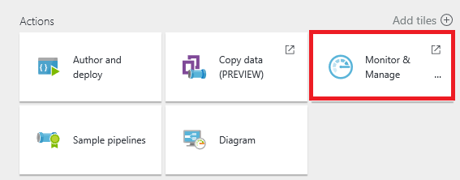
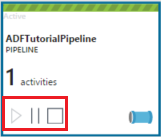
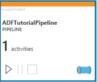
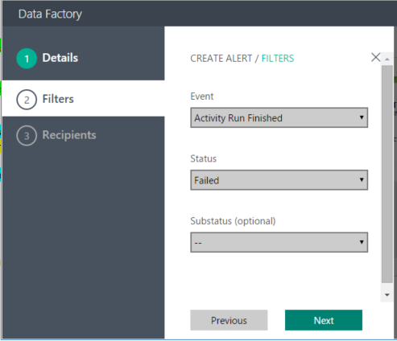

<properties 
    pageTitle="Supervisar y administrar el generador de datos de Azure canalizaciones" 
    description="Obtenga información sobre cómo utilizar supervisión y aplicación de administración para supervisar y administrar canalizaciones y generadores de datos de Azure." 
    services="data-factory" 
    documentationCenter="" 
    authors="spelluru" 
    manager="jhubbard" 
    editor="monicar"/>

<tags 
    ms.service="data-factory" 
    ms.workload="data-services" 
    ms.tgt_pltfrm="na" 
    ms.devlang="na" 
    ms.topic="article" 
    ms.date="09/06/2016" 
    ms.author="spelluru"/>

# Supervisar y administrar con nuevo supervisión y aplicación de administración de canalizaciones de generador de datos de Azure
> [AZURE.SELECTOR]
- [Uso de PowerShell de Portal/Azure Azure](data-factory-monitor-manage-pipelines.md)
- [Mediante la supervisión y aplicación de administración](data-factory-monitor-manage-app.md)

En este artículo se describe cómo supervisar, administrar y depurar su canalizaciones y crear alertas para recibir una notificación cuando se produzcan errores con la **supervisión y aplicación de administración**. También puede ver el siguiente vídeo para obtener información sobre el uso de la supervisión y la aplicación de administración.
   

> [AZURE.VIDEO azure-data-factory-monitoring-and-managing-big-data-piplines]
      
## Iniciar la supervisión y aplicación de administración un
Para iniciar el Monitor y la aplicación de administración, haga clic en mosaico de **supervisión y administrar** en el módulo de **Generador de datos** para el generador de datos.

 

Verá la supervisión y administración de aplicación que se inicia en una pestaña o ventana independiente.  

> [AZURE.NOTE] Si ve que el explorador web se detiene en "Autorizar...", deshabilitar o desactive la opción **Bloquear las cookies de terceros y datos del sitio** (o) manténgala habilitada y cree una excepción para **://Login.microsoftonline.com)** y pruebe a continuación, vuelva a iniciar la aplicación.

Si no ve windows actividad en la lista en la parte inferior, haga clic en el botón **Actualizar** en la barra de herramientas para actualizar la lista. Además, establezca los valores correctos para los filtros de la **hora de inicio** y **hora de finalización** .  

## Descripción de la supervisión y aplicación de administración
Hay tres pestañas (**Explorador de recursos**, **Vistas de supervisión**y **alertas**) a la izquierda y la primera pestaña (Explorador de recursos) está activada de forma predeterminada. 

### Explorador de recursos
Vea lo siguiente: 

- Recursos explorador **vista de árbol** en el panel izquierdo.
- **Vista de diagrama** de la parte superior.
- Lista de **Actividad de Windows** en la parte inferior en el panel central.
- **Propiedades**/fichas de**Actividad de ventana del explorador** en el panel derecho. 

En el Explorador de recursos, vea todos los recursos (canalizaciones, conjuntos de datos, servicios vinculados) en el generador de datos en una vista de árbol. Cuando selecciona un objeto en el Explorador de recursos, verá lo siguiente: 

- entidad de datos fábrica asociada está resaltada en la vista de diagrama.
- asociados windows actividad (haga clic [aquí](data-factory-scheduling-and-execution.md) para obtener información sobre windows actividad) se resaltan en la lista de ventanas de actividad en la parte inferior.  
- propiedades del objeto seleccionado en la ventana de propiedades en el panel derecho. 
- Definición de JSON del objeto seleccionado, si procede. Por ejemplo: un servicio vinculado o un conjunto de datos o una canalización. 

Consulte el artículo de [la programación y ejecución](data-factory-scheduling-and-execution.md) para obtener información detallada acerca de la ventana de actividad conceptual. 

### Vista de diagrama
La vista de diagrama de un generador de datos ofrece un lugar único para supervisar y administrar el generador de datos y sus activos. Al seleccionar una entidad de fábrica de datos (conjunto de datos o canalización) en la vista de diagrama, verá lo siguiente:
 
- la entidad de fábrica de datos está seleccionada en la vista de árbol
- windows actividad asociada se resaltan en la lista de Windows de la actividad.
- propiedades del objeto seleccionado en la ventana Propiedades

Cuando se habilita la canalización (no en estado de pausa), se muestra con una línea verde. 

Observe que hay tres botones de comando para la canalización de la vista de diagrama. Puede usar el segundo botón pausar la canalización. Pausar no terminar las actividades que se está ejecutando y hacerle continúe hasta finalizar. Tercer botón pausa la canalización y finaliza su ejecutar actividades existentes. Primer botón reanuda la canalización. Cuando se detiene la canalización, observe el cambio de color para la canalización de manera de mosaico.

Puede selección múltiple de dos o más tuberías (mediante CTRL) y use los botones de la barra de comandos para pausar o reanudar varias tuberías a la vez.

Puede ver todas las actividades de la canalización, haciendo clic en el mosaico de canalización y haga clic en **abrir canalización**.

En la vista de canalización abierto, vea todas las actividades de la canalización. En este ejemplo, hay sólo una actividad: copiar actividad. Para volver a la vista anterior, haga clic en nombre del generador de datos en el menú de navegación en la parte superior.

En la vista de canalización, al hacer clic en un conjunto de datos de salida o cuando se mueve el mouse sobre el conjunto de datos de salida, verá la ventana emergente de Windows de actividad para el conjunto de datos.

Puede hacer clic en una ventana de actividad para ver los detalles para él en la ventana de **Propiedades** en el panel derecho. 

En el panel derecho, cambie a la ficha de **Actividad de ventana del explorador** para ver más detalles.

 

También puede ver **resuelto variables** para cada ejecución de actividad intentar en la sección **intentos** . 

Cambie a la pestaña de la **secuencia de comandos** para ver la definición de secuencia de comandos JSON para el objeto seleccionado.   

Puede ver ventanas de actividad en tres lugares:

- Ventana emergente de Windows actividad en la vista de diagrama (panel central).
- Explorador de ventana de actividad en el panel derecho.
- Lista de Windows de actividad en el panel inferior.

En la actividad Windows emergente y la actividad de ventana del explorador, puede desplazarse a la semana anterior y la semana próxima con flechas izquierda y derecha.

En la parte inferior de la vista de diagrama, consulte botones para acercar, alejar, Zoom para ajustar Zoom 100%, bloquear el diseño. El botón de diseño de bloqueo impide accidentalmente mover tablas y canalizaciones en la vista de diagrama y está activada de forma predeterminada. Puede desactivar la opción y desplazarse entidades en el diagrama. Cuando se activa desactivada, puede usar el botón último para colocar automáticamente tablas y canalizaciones. También puede acercar o alejar usando la rueda del mouse.

### Lista de actividad de Windows
La lista de windows de actividad de la parte inferior del panel central muestra todas las ventanas de actividad para el conjunto de datos seleccionado en el Explorador de recursos o vista de diagrama. De forma predeterminada, la lista está en orden descendente, lo que significa que ve en la ventana de actividad más reciente en la parte superior. 

Esta lista no actualizar de forma automática, así que utilice el botón Actualizar en la barra de herramientas para actualizar de forma manual.  

Las ventanas de actividad pueden estar en uno de los estados siguientes:

<table>
<tr>
    <th align="left">Estado</th><th align="left">Subestado</th><th align="left">Descripción</th>
</tr>
<tr>
    <td rowspan="8">En espera</td><td>ScheduleTime</td><td>No ha llegado la hora de la ventana de actividad ejecutar.</td>
</tr>
<tr>
<td>DatasetDependencies</td><td>Las dependencias precedentes no están listos.</td>
</tr>
<tr>
<td>ComputeResources</td><td>Recursos de cálculo no están disponibles.</td>
</tr>
<tr>
<td>ConcurrencyLimit</td> <td>Todas las instancias de actividad están ocupadas ejecutando otras ventanas de actividad.</td>
</tr>
<tr>
<td>ActivityResume</td><td>Actividad está en pausa y no puede ejecutar las ventanas de actividad hasta que se reanude.</td>
</tr>
<tr>
<td>Vuelva a intentar</td><td>Se vuelve a intentar la ejecución de la actividad.</td>
</tr>
<tr>
<td>Validación</td><td>Aún no ha iniciado la validación.</td>
</tr>
<tr>
<td>ValidationRetry</td><td>Esperando la validación de volver a intentar.</td>
</tr>
<tr>
<tr
<td rowspan="2">En curso</td><td>Validar</td><td>Validación en curso.</td>
</tr>
<td></td>
<td>En la ventana actividad se está procesando.</td>
</tr>
<tr>
<td rowspan="4">No se pudo</td><td>Tiempo de espera agotado</td><td>Ejecución tardó más tiempo del está permitido por la actividad.</td>
</tr>
<tr>
<td>Cancelar</td><td>Cancelar la acción del usuario.</td>
</tr>
<tr>
<td>Validación</td><td>Error de validación.</td>
</tr>
<tr>
<td></td><td>Error al generar o validar la ventana actividad.</td>
</tr>
<td>Listo</td><td></td><td>La ventana de actividad está lista para su uso.</td>
</tr>
<tr>
<td>Omitido</td><td></td><td>La ventana de actividad no se procesa.</td>
</tr>
<tr>
<td>Ninguno</td><td></td><td>Una ventana de actividad que usa existen con un estado diferente, pero se ha restablecido.</td>
</tr>
</table>

Al hacer clic en una ventana de actividad de la lista, consulte detalles sobre ella en la ventana del **Explorador de Windows de actividad** o **Propiedades** de la derecha.

### Actualizar windows de actividad  
Los detalles no son actualizan automáticamente para usar la **actualización** del botón (segundo botón) en la barra de comandos para actualizar manualmente la lista de actividad de windows.  
 

### Ventana Propiedades
La ventana Propiedades está en el panel de la parte derecha de la aplicación de administración y supervisión. 

Muestra las propiedades del elemento seleccionado en el Explorador de recursos (vista de árbol) (o) diagrama (o) lista de actividad de windows. 

### Explorador de la ventana de actividad

La ventana del **Explorador de la ventana de actividad** está en el panel de la parte derecha de la supervisión y la aplicación de administración. Muestra detalles acerca de la ventana de actividad seleccionado en la lista de actividad Windows o Windows actividad emergente. 

Puede cambiar a otra ventana actividad haciendo clic en ella en la vista de calendario en la parte superior. También puede utilizar la **flecha izquierda**/botones de**flecha a la derecha** en la parte superior para ver ventanas de actividad de la anterior/siguiente semana.

Puede usar los botones de la barra de herramientas en el panel de la parte inferior para **volver a ejecutar** la ventana de actividad o **Actualizar** los detalles en el panel. 

### Secuencia de comandos 
Puede usar la pestaña de la **secuencia de comandos** para ver la definición de JSON de la entidad de fábrica de datos seleccionada (servicios vinculados, conjunto de datos y canalización). 

## Uso de vistas del sistema
La supervisión y la aplicación de administración incluye vistas prefabricado (**windows de actividad recientes**, **error actividad windows**, **Windows actividad en curso**) que le permite ver ventanas de actividad recientes o error/en curso para el generador de datos. 

Cambie a la pestaña de **Vistas de supervisión** de la izquierda haciendo clic en ella. 

Actualmente, hay tres vistas de sistema compatibles. Seleccione una opción para ver windows de actividad recientes (o) actividad error windows (o) windows actividad en curso en la lista de ventanas de actividad (en la parte inferior del panel central). 

Cuando se selecciona la opción de **windows de actividad recientes** , vea todas las ventanas de actividad recientes en orden descendente de **último intento tiempo**. 

Puede usar la vista de **windows de actividad de error** para ver todas las ventanas de actividad de los errores en la lista. Seleccione una ventana de la actividad de los errores en la lista para ver los detalles acerca de él en las **Propiedades** ventana (o) **Actividad ventana del explorador**. También puede descargar todos los registros de una ventana de actividad error. 

## Windows de actividad de filtrado y ordenación
Cambiar la configuración de **hora de inicio** y **hora de finalización** en la barra de comandos para windows de actividad de filtro. Después de cambiar la hora de inicio y hora de finalización, haga clic en el botón junto a la hora de finalización para actualizar la lista de Windows de la actividad.

> [AZURE.NOTE] Actualmente, todas las veces están en formato de UTC en la supervisión y la aplicación de administración. 

En la **lista de actividad de Windows**, haga clic en el nombre de una columna (por ejemplo: estado). 

Puede hacer lo siguiente:

- Ordenar en el orden ascendente.
- Ordenar en orden descendente.
- Filtrar por uno o varios de los valores (listo, en espera, etcetera)

Al especificar un filtro en una columna, verá el botón Filtro habilitado para que esa columna indicar que los valores de la columna son valores filtrados. 

Puede usar la misma ventana emergente para borrar filtros. Para borrar todos los filtros de la lista de actividad de windows, haga clic en el botón Borrar filtro en la barra de comandos. 

## Realizar acciones de proceso por lotes

### Vuelva a ejecutar windows actividad seleccionada
Seleccione una ventana de actividad, haga clic en la flecha hacia abajo para el primer botón de la barra de comandos y seleccione **volver a ejecutar** / **vuelva a ejecutar con en sentido ascendente de canalización**. Cuando se selecciona la opción de **volver a ejecutar con en sentido ascendente de canalización** , vuelve a ejecutar todas las ventanas de actividades en sentido ascendente. 
    

También puede seleccionar varias ventanas de actividad de la lista y vuelva a ejecutar ellos al mismo tiempo. Desea filtrar windows actividad según el estado (por ejemplo: **error**) y vuelva a ejecutar las ventanas de actividad error después de corregir el problema que hace que las ventanas de actividad de los errores. Vea la siguiente sección para obtener más información acerca del filtrado de windows de actividad en la lista.  

### Pausar o reanudar varias canalizaciones
Puede selección múltiple de dos o más tuberías (mediante CTRL) y use los botones de la barra de comandos (resaltados en el rectángulo rojo en la imagen siguiente) para pausar o reanudar ellos a la vez.

## Crear alertas 
La página de alertas le permite crear una alerta, ver, editar o eliminar las alertas existentes. Se puede también habilitar o deshabilitar una alerta. Para ver la página de alertas, haga clic en la pestaña alertas.

### Para crear una alerta

1. Haga clic en **Agregar alerta** para agregar una alerta. Consulte la página de detalles. 

    
1. Especifique el **nombre** y la **Descripción** de la alerta y haga clic en **siguiente**. Debe ver la página de **filtros** .

    

2. Seleccione el **evento**, **estado**y **subestado** del (opcional) en la que desea que el servicio de datos fábrica le avise y haga clic en **siguiente**. Debe ver la página de **los destinatarios** .

     
3. Seleccione la opción de **administradores de la suscripción de correo electrónico** o escriba **correo electrónico de administrador adicionales**y haga clic en **Finalizar**. Ahora debe aparecer la alerta en la lista. 
    
    

En la lista de alertas, use los botones asociados a la alerta para editar o eliminar y activar o desactivar una alerta. 

### Evento, estado/subestado
La tabla siguiente proporciona la lista de eventos disponibles y Estados (y sub-estados).

Nombre del evento | Estado | Estado de Sub
-------------- | ------ | ----------
Ejecutar la introducción de actividad | Introducción | Iniciar
Ejecutar terminado de actividad | Se realizó correctamente | Se realizó correctamente 
Ejecutar terminado de actividad | No se pudo| Asignación de recursos error  Error ejecución  Tiempo de espera  Errores de validación  Abandonados
Crear Introducción a petición HDI clúster | Introducción | &nbsp; |
Clúster a petición HDI creado correctamente | Se realizó correctamente | &nbsp; |
Clúster a petición HDI eliminado | Se realizó correctamente | &nbsp; |
### Para editar o eliminar o deshabilitar una alerta

    
 

