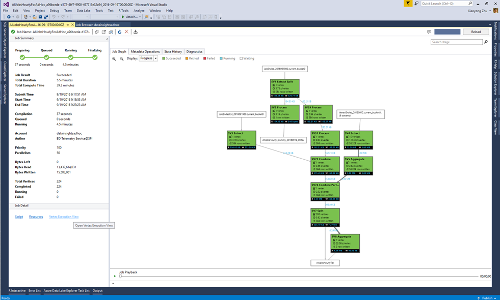

<properties 
   pageTitle="Usar la vista de ejecución de vértice en datos lago Tools para Visual Studio | Microsoft Azure" 
   description="Obtenga información sobre cómo usar la vista de la ejecución de vértice para trabajos de análisis de datos lago examen." 
   services="data-lake-analytics" 
   documentationCenter="" 
   authors="mumian" 
   manager="jhubbard" 
   editor="cgronlun"/>
 
<tags
   ms.service="data-lake-analytics"
   ms.devlang="na"
   ms.topic="article"
   ms.tgt_pltfrm="na"
   ms.workload="big-data" 
   ms.date="10/13/2016"
   ms.author="jgao"/>

# Usar la vista de ejecución de vértice en datos lago Tools para Visual Studio

Obtenga información sobre cómo usar la vista de la ejecución de vértice para trabajos de análisis de datos lago examen.

## Requisitos previos

- Conocimientos básicos del uso de datos lago Tools para Visual Studio para desarrollar script U-SQL.  Consulte [Tutorial: desarrollar secuencias de comandos de SQL U con datos lago Tools para Visual Studio](data-lake-analytics-data-lake-tools-get-started.md).

## Abrir la vista de la ejecución de vértices

Para un determinado tipo de trabajo, puede hacer clic en el vínculo "Ver de ejecución de vértice" en la esquina inferior izquierda. Le pedirá que primero cargar los perfiles y puede tardar algún tiempo según la conectividad de red.

## Comprender la vista de la ejecución de vértices

Después de escribir la vista de la ejecución de vértice, hay tres partes:

- Selector de vértice: A la izquierda es el selector de vértice.  Puede seleccionar los vértices características (como datos de 10 principales lectura o elija por fase).

    Uno de los filtros usados más comunes es los vértices de ruta crítica. Ruta crítica es la ruta de acceso más larga de una tarea U SQL. Es útil para optimizar los trabajos Comprobando qué vértice tarda más tiempo.

- El panel de la parte superior central:

    

    Esta vista también muestra el estado de todos los vértices de la ejecución. Convierte el tiempo en consecuencia a su equipo local y muestra el estado diferente en distintos colores.

- El panel del centro inferior:

    

    - Nombre del proceso: El nombre de la instancia de vértice. Se compone de distintas partes de StageName | VertexName | VertexRunInstance. Por ejemplo, el vértice de .v1 [62] SV7_Split significa para la segunda instancia de ejecución (.v1, índice a partir de 0) del número de vértice 62 en SV7_Split fase.
    - Total de datos de sólo lectura: Los datos eran leídos/escritos por este vértice.
    - Estado de estado o salir: El estado final cuando finaliza el vértice.
    - Tipo de código o error de salida: El error cuando el vértice un error.
    - Motivo de creación: ¿Por qué el vértice se creó.
    - Latencia de cola de latencia/NP de latencia/proceso de recursos: el tiempo necesario para que el vértice que esperar para los recursos, para procesar datos y permanezca en la cola.
    - GUID de creador del proceso: GUID su creador o el vértice de ejecución actual.
    - Versión: la N-ésimo instancia del vértice ejecución (el sistema puede programar nuevas instancias de un vértice por varios motivos, por ejemplo, migración tras error, calculan redundancia, etcetera).
    - Versión creada tiempo.
    - Crear inicio o el proceso de tiempo en cola proceso en tiempo inicio tiempo/proceso completado del proceso tiempo: cuando inicia el proceso de vértice creación; Cuando se inicia el proceso de vértice para poner en cola; Cuando se inicia el proceso de vértice determinados; Cuando haya finalizado el vértice determinados.

## Pasos siguientes

- Para obtener una visión general de análisis de lago de datos, vea [información general de análisis de lago de datos de Azure](data-lake-analytics-overview.md).
- Para empezar a desarrollar aplicaciones SQL U, vea [secuencias de comandos SQL de U desarrollar mediante datos lago Tools para Visual Studio](data-lake-analytics-data-lake-tools-get-started.md).
- Para obtener U SQL, consulte [Introducción a Azure datos lago análisis U-SQL idioma](data-lake-analytics-u-sql-get-started.md).
- Para las tareas de administración, vea [administrar el análisis de Azure datos lago con Azure portal](data-lake-analytics-manage-use-portal.md).
- Para registrar información de diagnóstico, consulte [registros de diagnósticos de acceso para el análisis de lago de datos de Azure](data-lake-analytics-diagnostic-logs.md)
- Para ver una consulta más compleja, vea [registros de sitio Web de analizar mediante el análisis de lago de datos de Azure](data-lake-analytics-analyze-weblogs.md).
- Para ver los detalles del trabajo, vea [Explorador de trabajo de uso y la vista de trabajo para trabajos de análisis de lago de datos de Azure](data-lake-analytics-data-lake-tools-view-jobs.md)