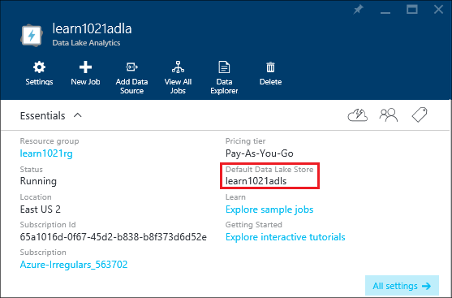
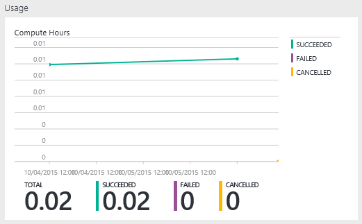
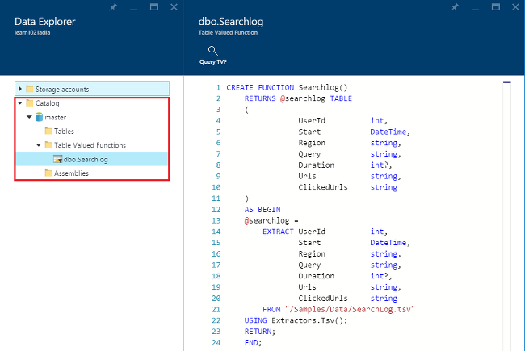

<properties 
   pageTitle="Administrar el análisis de lago de datos de Azure con el portal de Azure | Azure" 
   description="Obtenga información sobre cómo administrar el análisis de datos lago cuentas, orígenes de datos, los usuarios y trabajos." 
   services="data-lake-analytics" 
   documentationCenter="" 
   authors="edmacauley" 
   manager="jhubbard" 
   editor="cgronlun"/>
 
<tags
   ms.service="data-lake-analytics"
   ms.devlang="na"
   ms.topic="article"
   ms.tgt_pltfrm="na"
   ms.workload="big-data" 
   ms.date="10/06/2016"
   ms.author="edmaca"/>

# Administrar el análisis de lago de datos de Azure con Azure portal

[AZURE.INCLUDE [manage-selector](../../includes/data-lake-analytics-selector-manage.md)]

Obtenga información sobre cómo administrar cuentas de análisis de lago de datos de Azure, orígenes de datos de la cuenta, los usuarios y trabajos con el portal de Azure. Para ver los temas de administración con otras herramientas, haga clic en el selector de tabulaciones en la parte superior de la página.

**Requisitos previos**

Antes de comenzar este tutorial, debe tener los siguientes elementos:

- **Suscripción de un Azure**. Vea la [versión de prueba gratuita de Azure obtener](https://azure.microsoft.com/pricing/free-trial/).

<!-- ################################ -->
<!-- ################################ -->
## Administrar cuentas

Antes de ejecutar los trabajos de análisis de datos lago, debe tener una cuenta de análisis de datos lago. A diferencia de HDInsight de Azure, solo paga para una cuenta de análisis de datos lago cuando se ejecuta una tarea.  Solo paga por vez cuando se está ejecutando una tarea.  Para obtener más información, vea [Información general sobre el análisis de lago datos Azure](data-lake-analytics-overview.md).  

**Para crear una cuenta de análisis de datos lago**

1. Inicie sesión el [portal de Azure](https://portal.azure.com).
2. Haga clic en **nuevo**, haga clic en **inteligencia + análisis**y, a continuación, haga clic en **Análisis de datos lago**.
3. Escriba o seleccione los valores siguientes:

    

    - **Nombre**: el nombre de la cuenta de análisis de datos lago.
    - **Suscripción**: elija la suscripción de Azure utilizada para la cuenta de análisis.
    - **Grupo de recursos**. Seleccione un grupo de recursos de Azure existente o cree uno nuevo. Administrador de recursos de Azure le permite trabajar con los recursos de la aplicación como un grupo. Para obtener más información, vea [Información general del Administrador de recursos de Azure](resource-group-overview.md). 
    - **Ubicación**. Seleccione un centro de datos de Azure para la cuenta de análisis de datos lago. 
    - **Almacén de lago de datos**: cuenta de cada análisis de lago de datos tiene una cuenta de almacén de datos lago dependiente. La cuenta de análisis de datos lago y el almacén de datos lago dependientes deben encontrarse en el mismo centro de datos de Azure. Siga las instrucciones para crear una nueva cuenta de almacén de datos lago o seleccione uno existente.

8. Haga clic en **crear**. Accederá a la pantalla principal del portal. Un nuevo mosaico se agrega a la StartBoard con la etiqueta que muestra "Implementación de análisis de lago de datos de Azure". Se necesitan unos minutos para crear una cuenta de análisis de datos lago. Cuando se crea la cuenta, el portal abre la cuenta en una hoja nueva.

Después de crea una cuenta de análisis de datos lago, puede agregar cuentas adicionales de almacén de datos lago y almacenamiento de Azure. Para obtener instrucciones, vea [administrar el análisis de datos lago orígenes de datos de la cuenta](data-lake-analytics-manage-use-portal.md#manage-account-data-sources).

**En access o abrir una cuenta de análisis de datos lago**

1. Inicie sesión el [portal de Azure](https://portal.azure.com/).
2. En el menú de la izquierda, haga clic en **Análisis de datos lago** .  Si no lo ves, haga clic en **más servicios**y, a continuación, haga clic en **Análisis de datos lago** en **inteligencia + análisis**.
3. Haga clic en la cuenta de análisis de lago de datos que desea tener acceso. Se abre la cuenta en una hoja nueva.

**Para eliminar una cuenta de análisis de datos lago**

1. Abra la cuenta de análisis de lago de datos que desea eliminar. Para obtener instrucciones, vea [cuentas de análisis de lago de datos de Access](#access-adla-account).
2. En el menú de botón en la parte superior de la hoja, haga clic en **Eliminar** .
3. Escriba el nombre de cuenta y, a continuación, haga clic en **Eliminar**.

Eliminar una cuenta de análisis de datos lago no elimina las cuentas de almacén de datos lago dependientes. Para obtener instrucciones de la eliminación de cuentas de almacenamiento de lago de datos, vea [Eliminar datos lago tienda cuenta](data-lake-store-get-started-portal.md#delete-azure-data-lake-store-account).

<!-- ################################ -->
<!-- ################################ -->
## Administrar orígenes de datos de la cuenta

Análisis de datos lago admite actualmente los siguientes orígenes de datos:

- [Almacén de lago de datos de Azure](../data-lake-store/data-lake-store-overview.md)
- [Almacenamiento de Azure](../storage/storage-introduction.md)

Cuando se crea una cuenta de análisis de datos lago, debe designar una cuenta de Azure datos lago almacén sea la cuenta de almacenamiento. La cuenta predeterminada de la tienda de lago de datos se utiliza para almacenar los registros de auditoría de metadatos y la tarea de trabajo. Después de haber creado una cuenta de análisis de datos lago, puede agregar cuentas adicionales de almacenamiento de datos lago o cuenta de almacenamiento de Azure. 

**Para buscar la cuenta de almacenamiento de datos lago predeterminado**

- Abra la cuenta de análisis de lago de datos que desea administrar. Para obtener instrucciones, vea [cuentas de análisis de lago de datos de Access](#access-adla-account). El almacén de datos lago predeterminado se muestra en **esenciales**:

    

**Para agregar más orígenes de datos**

1. Abra la cuenta de análisis de lago de datos que desea administrar. Para obtener instrucciones, vea [cuentas de análisis de lago de datos de Access](#access-adla-account).
2. Haga clic en **configuración** y, a continuación, haga clic en **Orígenes de datos**. Se verá la cuenta del almacén de datos lago predeterminada en la lista. 
3. Haga clic en **Agregar origen de datos**.

    

    Para agregar una cuenta de Azure datos lago tienda, necesita la cuenta de nombre y acceso a la cuenta para poder consultarlo.
    Para agregar un almacenamiento de blobs de Windows Azure, necesitará la cuenta de almacenamiento y la clave de cuenta, que puede encontrar, vaya a la cuenta de almacenamiento en el portal.

**Para explorar los orígenes de datos**  

1. Abra la cuenta de análisis que desee administrar. Para obtener instrucciones, vea [cuentas de análisis de lago de datos de Access](#access-adla-account).
2. Haga clic en **configuración** y, a continuación, haga clic en **Explorador de datos**. 
 
    
    
3. Haga clic en una cuenta de la tienda de lago de datos para abrir la cuenta.

    
    
    Para cada cuenta de la tienda de lago de datos, puede:
    
    - **Nueva carpeta**: Agregar nueva carpeta.
    - **Cargar**: cargar archivos a la cuenta de almacenamiento de su estación de trabajo.
    - **Access**: configurar el acceso de permisos.
    - **Cambiar el nombre de carpeta**: cambiar el nombre de una carpeta.
    - **Propiedades de carpeta**: mostrar propiedades de archivo o carpeta, como WASB ruta de acceso, WEBHDFS, modificó por última vez tiempo y así sucesivamente.
    - **Eliminar carpeta**: eliminar una carpeta.

**Para cargar archivos a la cuenta de almacén de datos de lago**

1. Desde el Portal, haga clic en **Examinar** en el menú izquierdo y, a continuación, haga clic en **Almacén de datos de lago**.
2. Haga clic en la cuenta de almacén de lago de datos que desea cargar datos. Para buscar la cuenta de almacenamiento de datos lago predeterminada, vea [aquí](#default-adl-account).
3. En el menú superior, haga clic en **Explorador de datos** .
4. Haga clic en **Nuevo directorio** para crear una nueva carpeta, o haga clic en un nombre de carpeta para cambiar la carpeta.
6. En el menú superior para cargar el archivo, haga clic en **cargar** .

**Para cargar archivos a la cuenta de almacenamiento de blobs de Windows Azure**

Vea [cargar datos para trabajos de Hadoop en HDInsight](../hdinsight/hdinsight-upload-data.md).  La información se aplica a datos lago análisis.

## Administrar usuarios

Análisis de datos lago usa el control de acceso basado en roles con Azure Active Directory. Cuando se crea una cuenta de análisis de datos lago, una función de "Administradores de suscripción" se agrega a la cuenta. Puede agregar usuarios y grupos de seguridad con las siguientes funciones adicionales:

|Función|Descripción|
|----|-----------|
|Propietario|Le permiten administrar todo, incluido el acceso a los recursos.|
|Colaborador|Acceder al portal; enviar y supervisar trabajos. Para poder enviar trabajos, un colaborador necesita el permiso de lectura o escritura para las cuentas de almacén de datos lago.|
|DataLakeAnalyticsDeveloper | Enviar, supervisar y Cancelar trabajos.  Estos usuarios sólo pueden cancelar sus propios trabajos. No pueden administrar su propia cuenta, por ejemplo, agregar usuarios, cambiar los permisos o eliminar la cuenta. Para poder ejecutar trabajos, que necesitan acceso de lectura o escritura a las cuentas de almacén de datos lago     | 
|Lector|Le permite ver todo el contenido, pero no hacer cambios.|  
|DevTest prácticas usuario|Le permite ver todo el contenido y conectar máquinas virtuales de inicio, reinicio y apagado.|  
|Administrador de acceso de usuario|Le permite administrar el acceso de usuario a recursos de Azure.|  

Para obtener información sobre la creación de grupos de seguridad y usuarios de Azure Active Directory, consulte [¿Qué es Azure Active Directory](../active-directory/active-directory-whatis.md).

**Para agregar usuarios o grupos de seguridad a una cuenta de análisis de datos lago**

1. Abra la cuenta de análisis que desee administrar. Para obtener instrucciones, vea [cuentas de análisis de lago de datos de Access](#access-adla-account).
2. Haga clic en **configuración**y, a continuación, haga clic en **usuarios**. También puede hacer clic en **Access** en la barra de título de **Essentials** , como se muestra en la siguiente captura de pantalla:

    
3. En el módulo de **usuario** , haga clic en **Agregar**.
4. Seleccione un rol y agregar un usuario y, a continuación, haga clic en **Aceptar**.

**Nota: Si este usuario o grupo de seguridad debe enviar trabajos, necesitan tener permiso en el repositorio de lago de datos. Para obtener más información, vea [proteger datos almacenados en el almacén de datos de lago](../data-lake-store/data-lake-store-secure-data.md).**

<!-- ################################ -->
<!-- ################################ -->
## Administrar trabajos

Debe tener una cuenta de análisis de datos lago antes de poder ejecutar los trabajos de SQL U.  Para obtener más información, vea [administrar el análisis de datos lago cuentas](#manage-data-lake-analytics-accounts).

**Para crear un trabajo**

1. Abra la cuenta de análisis que desee administrar. Para obtener instrucciones, vea [cuentas de análisis de lago de datos de Access](#access-adla-account).
2. Haga clic en **nueva tarea**.

    

    Deberá ver un nuevo módulo similar al:

    

    Para cada tarea, puede configurar

  	|Nombre|Descripción|
  	|----|-----------|
  	|Nombre del trabajo|Escriba el nombre de la tarea.|
  	|Prioridad|Número menor tiene prioridad más alta. Si hay dos trabajos ambas en cola, una con menor prioridad se ejecuta en primer lugar|
  	|Paralelismo |Número máximo de procesos de cálculo que puede ocurrir al mismo tiempo. Aumentar este número puede mejorar el rendimiento, pero también se puede aumentar el costo.|
  	|Secuencia de comandos|Escriba la secuencia de comandos SQL U para el trabajo.|

    Con la misma interfaz, puede también explorar los orígenes de datos de vínculo y agregue archivos adicionales a los orígenes de datos vinculados. 
3. Si desea enviar el trabajo, haga clic en **Enviar trabajo** .

**Para enviar un trabajo**

Consulte [crear el análisis de datos lago trabajos](#create-job).

**Supervisión de trabajos**

1. Abra la cuenta de análisis que desee administrar. Para obtener instrucciones, vea [cuentas de análisis de lago de datos de Access](#access-adla-account). El panel de administración del trabajo muestra la información del trabajo básicas:

    

3. Haga clic en **Administración del trabajo** , como se muestra en la captura de pantalla anterior.

    

4. Haga clic en una tarea de las listas. O bien, haga clic en **filtro** para ayudarle a encontrar las tareas:

    

    Puede filtrar trabajos por **Intervalo de tiempo**, el **Nombre del trabajo**y el **autor**.
5. Si desea volver a enviar el trabajo, haga clic en **Reenviar** .

**Para volver a enviar un trabajo**

Consulte [Monitor datos lago análisis trabajos](#monitor-jobs).

##Supervisar el uso de cuenta

**Supervisar el uso de la cuenta**

1. Abra la cuenta de análisis que desee administrar. Para obtener instrucciones, vea [cuentas de análisis de lago de datos de Access](#access-adla-account). En el panel de uso muestra el uso de:

    

2. Haga doble clic en el panel para ver más detalles.

##Catálogo de vista U SQL

El [catálogo de SQL U](data-lake-analytics-use-u-sql-catalog.md) se usa para estructurar los datos y el código para que se pueden compartir por secuencias de comandos SQL U. El catálogo permite el mejor rendimiento posible con datos de lago de datos de Azure. Desde el portal de Azure, es posible ver SQL U catálogo.

**Para examinar el catálogo de SQL U**

1. Abra la cuenta de análisis que desee administrar. Para obtener instrucciones, vea [cuentas de análisis de lago de datos de Access](#access-adla-account).
2. En el menú superior, haga clic en **Explorador de datos** .
3. Expanda **maestra**, expanda **catálogos**, **tablas, o **funciones con valores de tabla**, o **ensamblados **. La siguiente captura de pantalla muestra una función con valores de tabla.

    

<!-- ################################ -->
<!-- ################################ -->
## Usar los grupos de administrador de recursos de Azure

Aplicaciones normalmente están compuestas de muchos componentes, por ejemplo una aplicación web, base de datos, el servidor de base de datos, almacenamiento y servicios de terceros. Administrador de recursos de Azure le permite trabajar con los recursos de la aplicación como un grupo, que se conoce como un grupo de recursos de Azure. Puede implementar, actualizar, supervisar o eliminar todos los recursos para la aplicación en una única operación coordinada. Usar una plantilla para su implementación y esa plantilla puede trabajar para distintos entornos como pruebas, ensayo y producción. Puede aclarar facturación para su organización mediante la visualización de los costes para todo el grupo. Para obtener más información, vea [Información general del Administrador de recursos de Azure](../azure-resource-manager/resource-group-overview.md). 

Un servicio de análisis de datos lago puede incluir los siguientes componentes:

- Cuenta de análisis de lago de datos de Azure
- Predeterminados requeridos cuenta de la tienda de lago de datos de Azure
- Cuentas de la tienda de lago de datos de Azure adicional
- Cuentas adicionales de almacenamiento de Azure

Puede crear todos estos componentes en un grupo de administración de recursos para facilitar la administración.

Una cuenta de análisis de datos lago y las cuentas de almacenamiento dependientes deben situarse en el mismo centro de datos de Azure.
No obstante, puede encontrarse el grupo de administración de recursos en un centro de datos diferente.  

##Vea también 

- [Información general de análisis de datos lago de Microsoft Azure](data-lake-analytics-overview.md)
- [Introducción a análisis de lago de datos con el portal de Azure](data-lake-analytics-get-started-portal.md)
- [Administrar el análisis de lago de datos de Azure con PowerShell de Azure](data-lake-analytics-manage-use-powershell.md)
- [Supervisar y solucionar problemas con Azure portal de trabajos de análisis de lago de datos de Azure](data-lake-analytics-monitor-and-troubleshoot-jobs-tutorial.md)

