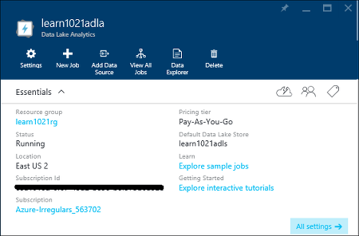

<properties 
   pageTitle="Obtenga información sobre el análisis de datos lago y con los tutoriales de Azure Portal interactiva de SQL U | Azure" 
   description="Inicio rápido con el aprendizaje de análisis de datos lago y U-SQL. " 
   services="data-lake-analytics" 
   documentationCenter="" 
   authors="edmacauley" 
   manager="jhubbard" 
   editor="cgronlun"/>
 
<tags
   ms.service="data-lake-analytics"
   ms.devlang="na"
   ms.topic="get-started-article"
   ms.tgt_pltfrm="na"
   ms.workload="big-data" 
   ms.date="05/16/2016"
   ms.author="edmaca"/>

# Usar tutoriales interactivas de análisis de lago de datos de Azure

El Portal de Azure ofrece un tutorial interactivo para comenzar con el análisis de datos lago. En este artículo se muestra cómo pasar por el tutorial para analizar los registros de sitio Web.

>[AZURE.NOTE]Si desea pasar por el mismo tutorial con Visual Studio, vea [analizar registros de sitio Web mediante el análisis de datos lago](data-lake-analytics-analyze-weblogs.md).
>Más interactivos tutoriales se agregue al portal.

Para otros tutoriales, consulte:

- [Introducción a análisis de lago de datos con el Portal de Azure](data-lake-analytics-get-started-portal.md)
- [Introducción a análisis de datos lago con PowerShell de Azure](data-lake-analytics-get-started-powershell.md)
- [Introducción a análisis de lago de datos con el SDK de .NET](data-lake-analytics-get-started-net-sdk.md)
- [Desarrollar secuencias de comandos de SQL U con datos lago Tools para Visual Studio](data-lake-analytics-data-lake-tools-get-started.md) 

**Requisitos previos**

Antes de comenzar este tutorial, debe tener el siguiente:

- **Análisis de lago de datos de una cuenta**.  Consulte [Introducción a Azure datos lago análisis con el Portal de Azure](data-lake-analytics-get-started-portal.md).

##Crear cuenta de análisis de datos lago 

Debe tener una cuenta de análisis de datos lago antes de poder ejecutar los trabajos.

Cada cuenta de análisis de datos lago tiene una dependencia de cuenta [Lago almacén de datos de Azure](../data-lake-store/data-lake-store-overview.md) .  Esta cuenta se conoce como la cuenta predeterminada de almacén de datos lago.  Puede crear la cuenta de almacén de datos lago previamente o cuando se crea la cuenta de análisis de datos lago. En este tutorial, va a crear la cuenta del almacén de datos lago con la cuenta de análisis

**Para crear una cuenta de análisis de datos lago**

1. Inicie sesión el [Portal de Azure](https://portal.azure.com/signin/index/?Microsoft_Azure_Kona=true&Microsoft_Azure_DataLake=true&hubsExtension_ItemHideKey=AzureDataLake_BigStorage%2cAzureKona_BigCompute).
2. Haga clic en **Microsoft Azure** en la esquina superior izquierda para abrir el StartBoard.
3. Haga clic en el mosaico del **catálogo de soluciones** .  
3. Escriba **El análisis de lago de datos de Azure** en el cuadro de búsqueda en el módulo de **todo el contenido** y presione **ENTRAR**. Deberá ver **El análisis de lago de datos de Azure** en la lista.
4. Haga clic en **Análisis de lago de datos de Azure** en la lista.
5. Haga clic en **crear** en la parte inferior de la hoja.
6. Escriba o seleccione lo siguiente:

    

    - **Nombre**: el nombre de la cuenta de análisis.
    - **Almacén de lago de datos**: cuenta de cada análisis de lago de datos tiene una cuenta de almacén de datos lago dependiente. La cuenta de análisis de datos lago y el almacén de datos lago dependientes deben encontrarse en el mismo centro de datos de Azure. Siga las instrucciones para crear una nueva cuenta de almacén de datos lago o seleccione uno existente.
    - **Suscripción**: elija la suscripción de Azure utilizada para la cuenta de análisis.
    - **Grupo de recursos**. Seleccione un grupo de recursos de Azure existente o cree uno nuevo. Aplicaciones normalmente están compuestas de muchos componentes, por ejemplo una aplicación web, base de datos, el servidor de base de datos, almacenamiento y servicios de terceros 3ª. Azure Resource Manager (ARM) le permite trabajar con los recursos de la aplicación como un grupo, que se conoce como un grupo de recursos de Azure. Puede implementar, actualizar, supervisar o eliminar todos los recursos para la aplicación en una única operación coordinada. Usar una plantilla para su implementación y esa plantilla puede trabajar para diferentes entornos, como pruebas, ensayo y producción. Puede aclarar facturación para su organización mediante la visualización de los costes para todo el grupo. Para obtener más información, vea [Información general del Administrador de recursos de Azure](azure-resource-manager/resource-group-overview.md). 
    - **Ubicación**. Seleccione un centro de datos de Azure para la cuenta de análisis de datos lago. 
7. Seleccione **Anclar al Startboard**. Esto es necesario para seguir este tutorial.
8. Haga clic en **crear**. Abre el portal StartBoard. Un nuevo mosaico se agrega a la página de inicio con la etiqueta que muestra "Implementación de análisis de lago de datos de Azure". Se necesitan unos minutos para crear una cuenta de análisis de datos lago. Cuando se crea la cuenta, el portal abre la cuenta en una hoja nueva.

    

##Ejecutar el tutorial interactivo de análisis de registro de sitio Web

**Para abrir el tutorial interactivo de análisis de registro de sitio Web**

1. Desde el Portal, haga clic en **Microsoft Azure** desde el menú de la izquierda para abrir el StartBoard.
2. Haga clic en el mosaico que está vinculado a su cuenta de análisis de datos lago.
3. Haga clic en **Explorar interactivas tutoriales** desde la barra de **Essentials** .

    

4. Si ve un diciendo advertencia naranja "ejemplos de no configurar, haga clic en...", haga clic en **Copiar los datos de ejemplo** para copiar los datos de ejemplo en la cuenta predeterminada de almacén de datos lago. El tutorial interactivo debe ejecutar los datos.
5. En el módulo **Tutoriales interactivos** , haga clic en **Análisis de registro del sitio Web**. El portal abre el tutorial en un nuevo módulo de portal.
5. Haga clic en **1, introducción** y, a continuación, siga las instrucciones

##Vea también

- [Información general de análisis de datos lago de Microsoft Azure](data-lake-analytics-overview.md)
- [Introducción a análisis de lago de datos con el Portal de Azure](data-lake-analytics-get-started-portal.md)
- [Introducción a análisis de datos lago con PowerShell de Azure](data-lake-analytics-get-started-powershell.md)
- [Desarrollar secuencias de comandos de SQL U con datos lago Tools para Visual Studio](data-lake-analytics-data-lake-tools-get-started.md)
- [Analizar los registros de sitio Web mediante el análisis de lago de datos de Azure](data-lake-analytics-analyze-weblogs.md)
