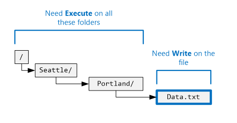
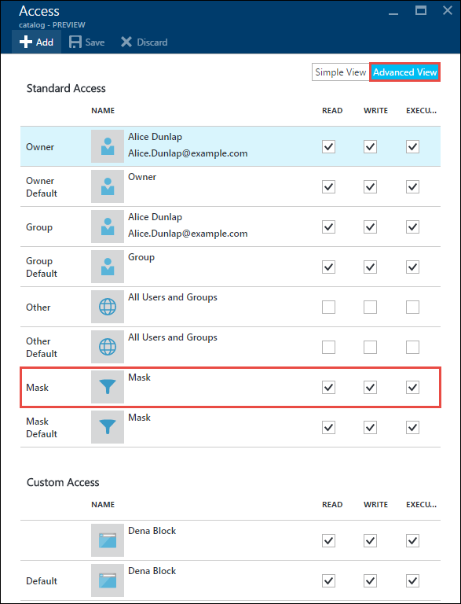
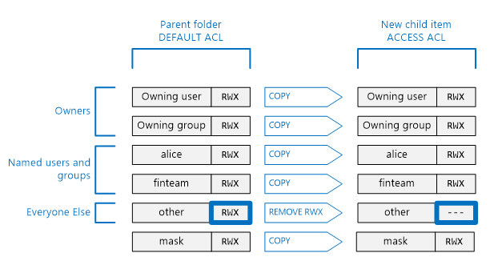

<properties
   pageTitle="Información general sobre el Control de acceso en el almacén de datos de lago | Microsoft Azure"
   description="Entender cómo control de acceso en la tienda de lago de datos de Azure"
   services="data-lake-store"
   documentationCenter=""
   authors="nitinme"
   manager="jhubbard"
   editor="cgronlun"/>

<tags
   ms.service="data-lake-store"
   ms.devlang="na"
   ms.topic="get-started-article"
   ms.tgt_pltfrm="na"
   ms.workload="big-data"
   ms.date="09/06/2016"
   ms.author="nitinme"/>

# Control de acceso en el almacén de lago de datos de Azure

Almacén de datos de lago implementa un modelo de control de acceso que se deriva de HDFS y a su vez, desde el modelo de control de acceso POSIX. En este artículo se resume los conceptos básicos del modelo de control de acceso para el almacén de datos de lago. Para obtener más información sobre la HDFS control de acceso modelo vea [HDFS Guía de permisos](https://hadoop.apache.org/docs/current/hadoop-project-dist/hadoop-hdfs/HdfsPermissionsGuide.html).

## Listas de control de acceso en archivos y carpetas

Existen dos tipos de listas de control de acceso (ACL) - **ACL del acceso** y **ACL predeterminada**.

* **Acceso ACL** : estos control acceso a un objeto. Archivos y carpetas tienen acceso ACL.

* **ACL predeterminado** : "Plantilla" ACL asociada a una carpeta que determinan las ACL de acceso para todos los elementos secundarios creados en esa carpeta. Archivos no tienen ACL predeterminada.

Acceso ACL y ACL predeterminada tienen la misma estructura.

>[AZURE.NOTE] Cambiar la ACL predeterminada de un elemento primario no afecta a la ACL del acceso o ACL predeterminada de los elementos secundarios que ya existen.

## Los usuarios e identidades

Cada archivo y carpeta tienen permisos diferentes para estas identidades:

* El usuario propietario del archivo
* El grupo propietario
* Usuarios con nombre
* Grupos con nombre
* Todos los demás usuarios

Las identidades de los usuarios y grupos son identidades de Azure Active Directory (AAD) es así a menos que se indique lo contrario un "usuario", en el contexto lago de almacén de datos, puede bien significar un usuario AAD o un grupo de seguridad AAD.

## Permisos

Los permisos de un objeto de sistema de archivos son **leer**, **escribir**, y **Ejecutar** y puede usarse en archivos y carpetas, como se muestra en la tabla siguiente.

|            |    Archivo     |   Carpeta |
|------------|-------------|----------|
| **Read (R)** | Puede leer el contenido de un archivo | Requiere **leer** y **Ejecutar** , mostrar el contenido de la carpeta.|
| **Escritura (W)** | Puede escribir o anexar a un archivo | Requiere **escribir y ejecutar** crear a secundarios elementos en una carpeta. |
| **Ejecutar (X)** | No significa nada en el contexto lago de almacén de datos | Necesaria para recorrer los elementos secundarios de una carpeta. |

### Formularios breves permisos

**RWX**se usa para indicar la **lectura + escribir y ejecutar**. Existe una versión comprimida numérico en el que **lectura = 4**, **escribir = 2**, y **Execute = 1** y su suma representa los permisos. A continuación se muestran algunos ejemplos.

| Formato numérico | Formato corto |      Qué significa     |
|--------------|------------|------------------------|
| 7            | RWX        | Lectura + escribir y ejecutar |
| 5            | R-X        | Lectura y ejecutar         |
| 4            | R:        | Lectura                   |
| 0            | ---        | Sin permisos         |

### No hereda los permisos

En el modelo de estilo de POSIX utilizado datos lago almacén, los permisos de un elemento se almacenan en el propio elemento. En otras palabras, no se puede heredar permisos de un elemento de los elementos primarios.

## Escenarios comunes relacionados con los permisos

Estas son algunas situaciones comunes a comprender qué permisos se necesitan realizar ciertas operaciones en una cuenta de almacén de datos lago.

### Permisos necesarios para leer un archivo

* Para que el archivo que se puedan leer - el llamador necesita permisos de **lectura**
* Para todas las carpetas en la estructura de la carpeta que contienen el archivo - el llamador necesita permisos de **ejecución**

### Permisos necesarios para anexar a un archivo

* Para que el archivo que se agregan al - el llamador necesita permisos de **escritura**
* Para todas las carpetas que contienen el archivo - el llamador necesita permisos de **ejecución**

### Permisos necesarios para eliminar un archivo

* Para la carpeta principal - el llamador necesita **escribir + ejecutar** permisos
* Para todas las carpetas en la ruta del archivo - el llamador necesita permisos de **ejecución**

>[AZURE.NOTE] Escribir permisos en el archivo no es necesario para eliminar el archivo como son verdaderas las dos condiciones anteriores.

### Permisos necesarios para enumerar una carpeta

* Para que la carpeta enumerar - el llamador necesita permisos de **lectura + Execute**
* Para todas las carpetas de antecesor - el llamador necesita permisos de **ejecución**

## Ver permisos en el portal de Azure

Módulo de **Explorador de datos** de la cuenta de la tienda de lago de datos, haga clic en **Access** para ver las ACL para un archivo o una carpeta. En la captura de pantalla a continuación, haga clic en Access para ver las ACL de la carpeta del **catálogo** en la cuenta **mydatastore** .

Después de eso, desde el módulo de **Access** , haga clic en **Vista Simple** para ver la vista más simple.

Haga clic en **Vista avanzada** para ver la vista más avanzada.

## El usuario

Un usuario tiene más derechos de todos los usuarios del almacén de datos lago. Un usuario:

* tiene los permisos para **todos los** archivos y carpetas
* puede cambiar los permisos de cualquier archivo o carpeta.
* puede cambiar el propietario usuario o grupo propietario de cualquier archivo o carpeta.

En Azure, una cuenta de almacén de datos lago tiene varias funciones de Azure:

* Propietarios
* Colaboradores
* Lectores
* Etcetera.

Todos los usuarios de la función de **propietarios** de una cuenta de almacén de datos lago automáticamente están un usuario muy para la cuenta. Para obtener más información acerca de la función según Access Control (RBAC) de Azure consulte [control de acceso basado en roles](../active-directory/role-based-access-control-configure.md).

## El usuario propietario

El usuario que creó el elemento automáticamente es el usuario propietario del elemento. Un usuario propietario puede:

* Cambiar los permisos de un archivo que pertenece
* Cambiar el grupo propietario de un archivo que es propietario, siempre y cuando el usuario propietario también es miembro del grupo de destino.

>[AZURE.NOTE] El propietario de usuario **no puede** cambiar el usuario propietario de otro archivo de propietario. Solo los usuarios muy pueden cambiar el usuario propietario de un archivo o carpeta.

## El grupo propietario

En las ACL POSIX, cada usuario está asociado con un "grupo principal". Por ejemplo, "Ana" del usuario puede pertenecer al grupo "Finanzas". Ana puede pertenecer a varios grupos, pero siempre se designa un grupo como su grupo principal. En POSIX, cuando Ana crea un archivo, el grupo propietario del archivo se establece a su grupo principal, que en este caso es "finance".
 
Cuando se crea un nuevo elemento de sistema de archivos, el almacén de datos de lago asigna un valor al grupo propietario. 

* **Caso 1** : la carpeta raíz "/". Esta carpeta se crea cuando se crea una cuenta de almacén de datos lago. En este caso el grupo propietario se establece en el usuario que creó la cuenta.
* **Caso 2** (cada otro caso) - cuando se crea un nuevo elemento, se copia del grupo propietario de la carpeta principal.

Puede cambiar el grupo propietario:
* Los usuarios muy
* El usuario propietario, si el usuario propietario también es un miembro del grupo de destino.

## Algoritmo de comprobación de acceso

La siguiente ilustración representa el algoritmo de comprobación de acceso para las cuentas de almacén de datos lago.

## La máscara y "permisos efectivos"

La **máscara** es un valor RWX que se usa para limitar el acceso para **con el nombre de los usuarios**, el **propietario de grupo**y **grupos llamados** al realizar el algoritmo de comprobación de acceso a. Estos son los conceptos clave para la máscara. 

* La máscara crea "permisos efectivos", es decir, se modifican los permisos en el momento de la comprobación de acceso a.
* La máscara se puede editar directamente al propietario del archivo y a los usuarios muy.
* La máscara tiene la capacidad de quitar permisos para crear los permisos efectivos. La máscara **no puede** agregar permisos a los permisos efectivos. 

Veamos algunos ejemplos. A continuación, se establece la máscara a **RWX**, lo que significa que la máscara no quita todos los permisos. Observe que no se modifiquen los permisos efectivos de nombre de usuario, grupo propietario y grupo denominado durante la comprobación de acceso.

En el ejemplo siguiente, se establece la máscara **R**x. Por lo tanto, se **desactiva el permiso de escritura** para **con el nombre de usuario**, **disponiendo grupo**y **con el nombre de grupo** en el momento de acceso a comprobar.

Para referencia, aquí es donde aparece la máscara para un archivo o carpeta en el Portal de Azure.

>[AZURE.NOTE] Para obtener una cuenta de almacén de datos lago, la máscara de acceso ACL y ACL predeterminada de la carpeta raíz ("/") son de forma predeterminada RWX.

## Permisos de archivos y carpetas

Cuando se crea un nuevo archivo o carpeta en una carpeta existente, determina la ACL predeterminada de la carpeta principal:

* ACL predeterminada y acceso ACL de una carpeta secundaria
* ACL del acceso de un archivo secundarios (archivos no tiene una ACL predeterminada)

### Un archivo secundario o ACL del acceso de la carpeta

Cuando se crea un archivo secundario o una carpeta, ACL predeterminada de principal se copia como archivo secundario o ACL del acceso de la carpeta. Además, si **otro** usuario tiene los permisos de ACL de la predeterminada del elemento primario, se quita por completo de ACL de acceso del elemento secundario.

En la mayoría de los escenarios, la información anterior es todo lo que debe necesita saber sobre cómo se determina ACL del acceso de un elemento secundario. Sin embargo, si está familiarizado con los sistemas POSIX y desea conocer en profundidad cómo se lleva a cabo esta transformación, vea la sección [roles de Umask para crear las ACL de acceso para los nuevos archivos y carpetas](#umasks-role-in-creating-the-access-acl-for-new-files-and-folders) más adelante en este artículo.
 

### ACL predeterminada de una carpeta secundaria

Cuando se crea una carpeta secundaria en una carpeta principal, se copia ACL de predeterminada de la carpeta principal, como, ACL predeterminada de la carpeta secundaria.

## Temas avanzados para comprender las ACL de almacén de datos de lago

Siguientes son un par de temas avanzados para ayudarle a entender cómo se determinan las ACL de almacén de datos lago archivos o carpetas.

### Rol de umask para crear las ACL de acceso para los nuevos archivos y carpetas

En un sistema compatible con POSIX, el concepto general es que umask es un valor de 9 bits en la carpeta principal que se utiliza para transformar el permiso de **propietario de usuario**, **disponiendo de grupo**y **otros** en un nuevo archivo secundario o ACL del acceso de la carpeta. Los bits de un umask identifican qué bits para desactivar el ACL de acceso del elemento secundario. Así es utilizados para evitar selectivamente la propagación de los permisos de propietario de usuario, al que pertenece el grupo y otros.
  
En un sistema HDFS, la umask normalmente es una opción de configuración de todo el sitio que está controlada por los administradores. Almacén de datos de lago usa un **umask toda la cuenta** que no se puede cambiar. La siguiente tabla muestra umask del almacén de datos lago.

| Grupo de usuarios  | Configuración | Efecto en ACL de acceso del nuevo elemento secundario |
|------------ |---------|---------------------------------------|
| Propietario usuario | ---     | Ningún efecto                             |
| Grupo propietario| ---     | Ningún efecto                             |
| Otros       | RWX     | Quitar lectura + escribir + ejecutar         | 

La siguiente ilustración muestra esta umask en acción. El resultado es quitar **leer + escribir + ejecutar** para **otro** usuario. Puesto que la umask no especificó bits para **disponiendo usuario** y **disponiendo de grupo**, los permisos no se transforman.

 

### El bit rápido

El bit rápido es una característica más avanzada de un sistema de archivos POSIX. En el contexto lago de almacén de datos, es probable que se necesitan el bit rápido.

La siguiente tabla muestra cómo funciona el bit rápido en el almacén de datos de lago.

| Grupo de usuarios         | Archivo    | Carpeta |
|--------------------|---------|-------------------------|
| Bit rápida **OFF** | Ningún efecto   | Ningún efecto           |
| Bit rápida **activado**  | Ningún efecto   | Impide que nadie excepto **los usuarios muy** y el **propietario de usuario** de un elemento secundario de eliminar o cambiar el nombre de dicho elemento secundario.               |

El bit rápido no se muestra en el Portal de Azure.

## Preguntas comunes para las ACL de almacén de datos de lago

Estas son algunas preguntas que se plantean a menudo con respecto a las ACL de almacén de datos de lago.

### ¿Tengo que admiten ACL?

No. Control de acceso a través de ACL siempre está activada para una cuenta de almacén de datos lago.

### ¿Qué permisos se necesitan para eliminar de forma recursiva una carpeta y su contenido?

* La carpeta principal debe tener **escribir + ejecutar**.
* La carpeta que desea eliminar y a continuación, todas las carpetas dentro de ella, requiere **lectura + escribir y ejecutar**.
>[AZURE.NOTE] Eliminar los archivos de carpetas no requiere escritura en esos archivos. Además, la carpeta raíz "/" **nunca** se pueden eliminar.

### ¿Quién se establece como propietario de un archivo o carpeta?

El creador de un archivo o carpeta se convierte en el propietario.

### ¿Quién se establece como el grupo propietario de un archivo o carpeta en creación?

Se copia desde el grupo propietario de la carpeta principal en la que se crea el nuevo archivo o carpeta.

### Soy el usuario propietario de un archivo, pero no tengo el los permisos que necesita. ¿Qué debo hacer?

El usuario propietario simplemente puede cambiar los permisos del archivo para dar a sí mismos todos los permisos que necesitan.

### ¿Almacén de lago de datos admite la herencia de ACL?

No.

### ¿Cuál es la diferencia entre la máscara y umask?

| máscara | umask|
|------|------|
| La propiedad **máscara** está disponible en todos los archivos y carpetas. | La **umask** es una propiedad de la cuenta de almacén de datos lago. Por lo tanto, hay solo un único umask del almacén de datos lago.    |
| La propiedad máscara en un archivo o carpeta puede ser modificada por el usuario propietario o el grupo propietario de un archivo o un usuario muy. | No se puede modificar la propiedad umask por cualquier usuario, incluso un usuario avanzado. Es un valor constante, no podrá cambiar.|
| La propiedad máscara se usa para durante el algoritmo de comprobación de acceso a en tiempo de ejecución para determinar si un usuario tiene derecho a realizar la operación en un archivo o carpeta. La función de la máscara es crear "permisos efectivos" en el momento de comprobación de acceso. | La umask no se utiliza durante la comprobación de acceso a en absoluto. La umask se utiliza para determinar la ACL del acceso de los nuevos elementos secundarios de una carpeta. |
| La máscara es un valor RWX 3 bits que se aplica al nombre de usuario, grupo con nombre y propietario usuario en el momento de comprobación de acceso.| La umask es un valor de bit 9 que se aplica al usuario propietario, grupo propietario y de un nuevo elemento secundario.| 

### ¿Dónde puedo obtener más información sobre el modelo de control de acceso POSIX?

* [http://www.vanemery.com/Linux/ACL/POSIX_ACL_on_Linux.HTML](http://www.vanemery.com/Linux/ACL/POSIX_ACL_on_Linux.html)

* [Guía de permisos HDFS](http://hadoop.apache.org/docs/current/hadoop-project-dist/hadoop-hdfs/HdfsPermissionsGuide.html) 

* [PREGUNTAS MÁS FRECUENTES DE POSIX](http://www.opengroup.org/austin/papers/posix_faq.html)

* [POSIX 1003.1 2008](http://standards.ieee.org/findstds/standard/1003.1-2008.html)

* [POSIX 1003.1e 1997](http://users.suse.com/~agruen/acl/posix/Posix_1003.1e-990310.pdf)

* [POSIX ACL en Linux](http://users.suse.com/~agruen/acl/linux-acls/online/)

* [ACL con listas de Control de acceso en Linux](http://bencane.com/2012/05/27/acl-using-access-control-lists-on-linux/)

## Vea también

* [Introducción a Azure lago de almacén de datos](data-lake-store-overview.md)

* [Introducción a análisis de datos de Azure lago](../data-lake-analytics/data-lake-analytics-get-started-portal.md)

