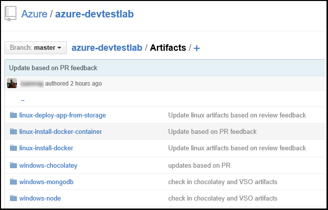

<properties
    pageTitle="Agregar un repositorio de muestra Git a un laboratorio de prácticas de Azure DevTest | Microsoft Azure"
    description="Agregar un repositorio GitHub o Visual Studio Team Services Git para el origen de artefactos personalizado en Azure DevTest prácticas"
    services="devtest-lab,virtual-machines,visual-studio-online"
    documentationCenter="na"
    authors="tomarcher"
    manager="douge"
    editor=""/>

<tags
    ms.service="devtest-lab"
    ms.workload="na"
    ms.tgt_pltfrm="na"
    ms.devlang="na"
    ms.topic="article"
    ms.date="09/06/2016"
    ms.author="tarcher"/>

# Agregar un repositorio de muestra Git a un laboratorio en Azure DevTest prácticas

> [AZURE.VIDEO how-to-add-your-private-artifacts-repository-in-a-devtest-lab]

En Azure DevTest prácticas, artefactos son *acciones* , como instalar software o la ejecución de secuencias de comandos y comandos - cuando se crea una máquina virtual. De forma predeterminada, un laboratorio incluye artefactos del repositorio de muestra de Azure DevTest prácticas oficial. Puede agregar un repositorio de muestra Git a su laboratorio para incluir los artefactos que crea el equipo. Repositorio puede estar hospedado en [GitHub](https://github.com) o en [Visual Studio Team Services (VSTS)](https://visualstudio.com).

- Para obtener información sobre cómo crear un repositorio de GitHub, consulte [GitHub campo d entrenamiento sobre](https://help.github.com/categories/bootcamp/).
- Para obtener información sobre cómo crear un proyecto de Team Services con un repositorio Git, vea [conectarse a Visual Studio Team Services](https://www.visualstudio.com/get-started/setup/connect-to-visual-studio-online).

La siguiente captura de pantalla muestra un ejemplo del aspecto que podría un repositorio que contiene artefactos en GitHub:  

## Obtener la información del repositorio y credenciales

Para agregar un repositorio de muestra a la práctica, primero debe obtener cierta información del repositorio de. Las secciones siguientes le guían obtener esta información para repositorios de muestra hospedado en GitHub y Visual Studio Team Services.

### Obtener la dirección URL de GitHub repositorio clonar y el personal acceso token

Para obtener la copia del repositorio de GitHub dirección URL y el token de acceso personal, siga estos pasos:

1. Vaya a la página de inicio del repositorio GitHub que contiene las definiciones de muestra.

1. Seleccione **clonar o descarga**.

1. Seleccione el botón para copiar la **HTTPS clonar dirección url** en el Portapapeles y guarde la dirección URL para su uso posterior.

1. Seleccione la imagen de perfil en la esquina superior derecha de GitHub y seleccione **configuración**.

1. En el menú **configuración Personal** de la izquierda, seleccione **tokens de acceso Personal**.

1. Seleccione **Generar nuevo símbolo**.

1. En la página **nuevo token de acceso personal** , escriba una **Descripción de Token**, acepte los elementos de forma predeterminada en **Seleccionar ámbitos**y, a continuación, elija **Generar Token**.

1. Guarde el token generado como sea necesario más adelante.

1. Ahora puede cerrar GitHub.   

1. Pase a la sección de [conectar el laboratorio en el repositorio de muestra](#connect-your-lab-to-the-artifact-repository) .

### Obtener la dirección URL de Visual Studio Team Services repositorio clonar y el personal acceso token

Para obtener la dirección URL de Visual Studio Team Services repositorio clonar y el token de acceso personal, siga estos pasos:

1. Abra la página principal de la colección de grupo (por ejemplo, `https://contoso-web-team.visualstudio.com`) y, a continuación, seleccione el proyecto de muestra.

1. En la página de inicio del proyecto, seleccione **código**.

1. Para ver la dirección URL de clonar, en la página de **código** del proyecto, seleccione **clonar**.

1. Guardar la dirección URL como sea necesario más adelante en este tutorial.

1. Para crear un Token de acceso Personal, seleccione **Mi perfil** en el menú desplegable de cuenta de usuario.

1. En la página de información de perfil, seleccione **seguridad**.

1. En la pestaña **seguridad** , seleccione **Agregar**.

1. En la página **crear un token de acceso personal** :

    - Escriba una **Descripción** para el token.
    - Seleccione **180 días** desde la lista **Caduca en** .
    - Elija **todas las cuentas de acceso** de la lista de **cuentas** .
    - Elija la opción **todos los ámbitos** .
    - Elija **crear Token**.

1. Cuando haya terminado, el nuevo token aparece en la lista de **Personal Tokens de acceso** . Seleccione **El Token de copia**y, a continuación, guarde el valor del token para su uso posterior.

1. Pase a la sección de [conectar el laboratorio en el repositorio de muestra](#connect-your-lab-to-the-artifact-repository) .

##Conectar el laboratorio en el repositorio de muestra

1. Inicie sesión en el [portal de Azure](http://go.microsoft.com/fwlink/p/?LinkID=525040).

1. Seleccione **Más servicios**y, a continuación, seleccione **DevTest prácticas** de la lista.

1. En la lista de prácticas, seleccione la práctica deseada.   

1. En el módulo de la práctica, seleccione **configuración**.

1. En el módulo de **configuración** de la práctica, seleccione **Repositorios de artefactos**.

1. En el módulo **Artefactos repositorios** , seleccione **+ Agregar**.

    
 
1. En el segundo módulo **Artefactos repositorios** , especifique lo siguiente:

    - **Nombre** : escriba un nombre para el repositorio.
    - **Dirección Url de clonar Git** - escriba la URL de clonar Git HTTPS que ha copiado de una versión anterior de GitHub o Visual Studio Team Services. 
    - **Ruta de la carpeta** : escriba la ruta de acceso relativa a la dirección URL de clonar que contiene las definiciones de muestra.
    - **Rama** , escriba la rama para obtener las definiciones de muestra.
    - **El Token de acceso personal** : escriba el token de acceso personal que obtenido previamente GitHub o Visual Studio Team Services. 
     
    

1. Seleccione **Guardar**.

[AZURE.INCLUDE [devtest-lab-try-it-out](../../includes/devtest-lab-try-it-out.md)]

## Entradas de blog relacionadas
- [Cómo solucionar errores defectos en AzureDevTestLabs](http://www.visualstudiogeeks.com/blog/DevOps/How-to-troubleshoot-failing-artifacts-in-AzureDevTestLabs)
- [Unirse a una máquina virtual para el dominio de Active Directory existente con la plantilla ARM en laboratorio de pruebas de desarrollo de Azure](http://www.visualstudiogeeks.com/blog/DevOps/Join-a-VM-to-existing-AD-domain-using-ARM-template-AzureDevTestLabs)