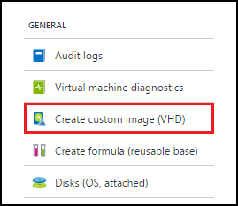
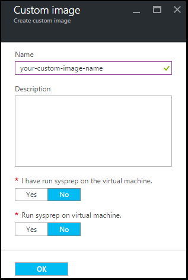

<properties
    pageTitle="Administrar imágenes personalizadas de Azure DevTest prácticas para crear máquinas virtuales | Microsoft Azure"
    description="Obtenga información sobre cómo crear una imagen personalizada desde un archivo de disco duro virtual o desde una máquina virtual existente en Azure DevTest prácticas"
    services="devtest-lab,virtual-machines"
    documentationCenter="na"
    authors="tomarcher"
    manager="douge"
    editor=""/>

<tags
    ms.service="devtest-lab"
    ms.workload="na"
    ms.tgt_pltfrm="na"
    ms.devlang="na"
    ms.topic="article"
    ms.date="09/07/2016"
    ms.author="tarcher"/>

# Administrar imágenes personalizadas de Azure DevTest prácticas para crear máquinas virtuales

En Azure DevTest prácticas, imágenes personalizadas le permiten crear máquinas virtuales rápidamente sin tener que esperar para que todo el software necesario esté instalado en el equipo de destino. Imágenes personalizadas le permiten previamente instalar todo el software que necesita en un archivo de disco duro virtual y, a continuación, usar el archivo de disco duro virtual para crear una máquina virtual. Dado que el software ya está instalado, la hora de creación de VM es mucho más rápida. Además, se usan imágenes personalizadas para clonar máquinas virtuales creando una imagen personalizada desde una máquina virtual y, a continuación, máquinas virtuales de esa imagen personalizada.

En este artículo, aprenderá cómo:

- [Crear una imagen personalizada desde un archivo de disco duro virtual](#create-a-custom-image-from-a-vhd-file) para que, a continuación, puede crear una máquina virtual desde esa imagen personalizada. 
- [Crear una imagen personalizada desde una máquina virtual](#create-a-custom-image-from-a-vm) para clonar rápida de máquina virtual.

## Crear una imagen personalizada desde un archivo de disco duro virtual

En esta sección, consulte cómo crear una imagen personalizada desde un archivo de disco duro virtual.
Debe tener acceso a un archivo de disco duro virtual válido para realizar todos los pasos de esta sección.   

1. Inicie sesión en el [portal de Azure](http://go.microsoft.com/fwlink/p/?LinkID=525040).

1. Seleccione **más servicios**y, a continuación, seleccione **DevTest prácticas** de la lista.

1. En la lista de prácticas, seleccione la práctica deseada.  

1. En el módulo de la práctica, seleccione **configuración**. 

1. En el módulo de **configuración** de la práctica, seleccione **imágenes personalizadas**.

1. En el módulo de **imágenes personalizadas** , seleccione **+ imagen personalizada**.

    

1. Escriba el nombre de la imagen personalizada. Este nombre se muestra en la lista de imágenes bases al crear una máquina virtual.

1. Escriba la descripción de la imagen personalizada. Esta descripción se muestra en la lista de imágenes de base al crear una máquina virtual.

1. Seleccione **el archivo de disco duro virtual**.

1. Si tiene acceso a un archivo de disco duro virtual no aparece, agréguelo siguiendo las instrucciones en la sección [cargar un archivo de disco duro virtual](#upload-a-vhd-file) y volver aquí cuando haya terminado.

1. Seleccione el archivo de disco duro virtual deseado.

1. Seleccione **Aceptar** para cerrar el módulo de **Archivo de disco duro virtual** .

1. Seleccione **Configuración del sistema operativo**.

1. En la pestaña **Configuración del sistema operativo** , seleccione **Windows** o **Linux**.

1. Si se selecciona **Windows** , especifique a través de la casilla de verificación si se ha ejecutado *Sysprep* en el equipo.

1. Seleccione **Aceptar** para cerrar el módulo de **Configuración del sistema operativo** .

1. Seleccione **Aceptar** para crear la imagen personalizada.

1. Vaya a la sección [Pasos siguientes](#next-steps) .

###Cargar un archivo de disco duro virtual

Para agregar una imagen personalizada, debe tener acceso a un archivo de disco duro virtual.

1. En el módulo de **Archivo de disco duro virtual** , seleccione **cargar un archivo de disco duro virtual con PowerShell**.

    

1. El módulo siguiente mostrará las instrucciones para modificar y ejecutar una secuencia de comandos de PowerShell que carga a su suscripción de Azure un archivo de disco duro virtual. 
**Nota:** Este proceso puede tardar mucho tiempo en función del tamaño del archivo de disco duro virtual y la velocidad de conexión.

## Crear una imagen personalizada desde una máquina virtual
Si tiene una máquina virtual que ya está configurada, puede crear una imagen personalizada de máquina y después use dicha imagen personalizada para crear otras máquinas virtuales idénticos. Los pasos siguientes muestran cómo crear una imagen personalizada desde una máquina virtual:

1. Inicie sesión en el [portal de Azure](http://go.microsoft.com/fwlink/p/?LinkID=525040).

1. Seleccione **más servicios**y, a continuación, seleccione **DevTest prácticas** de la lista.

1. En la lista de prácticas, seleccione la práctica deseada.  

1. En el módulo de la práctica, seleccione **Mis equipos virtuales**.
 
1. En el módulo **Mi máquinas virtuales de Windows** , seleccione la máquina virtual desde la que desea crear la imagen personalizada.

1. En el módulo de la máquina virtual, seleccione **Crear imagen personalizada (disco duro virtual)**.

    

1. En el módulo **Crear imagen** , escriba un nombre y una descripción para la imagen personalizada. Esta información se muestra en la lista de bases de datos cuando se crea una máquina virtual.

    

1. Seleccione si se ha ejecutado sysprep en la máquina virtual. Si no se ha ejecutado sysprep en la máquina virtual, especifique si desea que sysprep ejecuta cuando se crea una máquina virtual de esta imagen personalizada.

1. Seleccione **Aceptar** cuando termine de crear la imagen personalizada.

[AZURE.INCLUDE [devtest-lab-try-it-out](../../includes/devtest-lab-try-it-out.md)]

## Entradas de blog relacionadas

- [¿Imágenes personalizadas o fórmulas?](https://blogs.msdn.microsoft.com/devtestlab/2016/04/06/custom-images-or-formulas/)
- [Copiar imágenes personalizadas entre Azure DevTest prácticas](http://www.visualstudiogeeks.com/blog/DevOps/How-To-Move-CustomImages-VHD-Between-AzureDevTestLabs#copying-custom-images-between-azure-devtest-labs)

##Pasos siguientes

Una vez que haya agregado una imagen personalizada para usar al crear una máquina virtual, el siguiente paso es [Agregar una máquina virtual para el laboratorio](./devtest-lab-add-vm-with-artifacts.md).