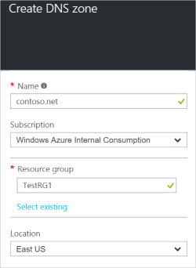

<properties
   pageTitle="Cómo crear y administrar una zona DNS en el portal de Azure | Microsoft Azure"
   description="Aprenda a crear zonas DNS en DNS de Azure. Esta es una guía paso a paso para crear y administrar DNS primera y comenzar aloja el dominio DNS con el portal de Azure."
   services="dns"
   documentationCenter="na"
   authors="sdwheeler"
   manager="carmonm"
   editor=""
   tags="azure-resource-manager"/>

<tags
   ms.service="dns"
   ms.devlang="na"
   ms.topic="article"
   ms.tgt_pltfrm="na"
   ms.workload="infrastructure-services"
   ms.date="08/16/2016"
   ms.author="sewhee"/>

# Crear una zona DNS en el portal de Azure

> [AZURE.SELECTOR]
- [Portal de Azure](dns-getstarted-create-dnszone-portal.md)
- [PowerShell](dns-getstarted-create-dnszone.md)
- [CLI de Azure](dns-getstarted-create-dnszone-cli.md)

En este artículo le guiará por los pasos para crear una zona DNS con el portal de Azure. También puede crear una zona DNS con PowerShell o CLI.

[AZURE.INCLUDE [dns-create-zone-about](../../includes/dns-create-zone-about-include.md)]

### Acerca de las etiquetas para Azure DNS

Las etiquetas son una lista de pares de valor de nombre y se utilizan por el Administrador de recursos de Azure a recursos de la etiqueta con fines de facturación o agrupamiento. Para obtener más información acerca de las etiquetas, vea el artículo [usar etiquetas para organizar los recursos de Azure](../resource-group-using-tags.md).

Puede agregar etiquetas en el portal de Azure usando el módulo de **configuración** de la zona DNS.

## Crear una zona DNS

1. Inicie sesión en el portal de Azure

2. En el menú de concentrador y haga clic en **Nuevo > redes >** y, a continuación, haga clic en la **zona DNS** para abrir el módulo de zona DNS.

    

3. En el módulo de **zona DNS** , haga clic en **crear** en la parte inferior. Se abrirá el módulo de **zona DNS crear** .

    

4. En el módulo de **zona DNS crear** , asigne un nombre a la zona DNS. Por ejemplo, *contoso.com*. Consulte [Acerca de los nombres de zona DNS](#names) , en la sección anterior.

5. A continuación, especifique el grupo de recursos que desea usar. Puede crear un nuevo grupo de recursos o seleccione uno ya existente.

6. En la lista desplegable de **ubicación** , especifique la ubicación del grupo de recursos. Tenga en cuenta que este valor se refiere a la ubicación del grupo de recursos, no la ubicación de zona DNS. El recurso de zona DNS real es automáticamente "global" y no es algo que puede (o necesita) especificar en el portal.

7. Puede dejar la casilla de verificación de **Anclar al panel** seleccionado si quiere encontrar fácilmente su zona nueva en su panel. A continuación, haga clic en **crear**.

    

8. Después de hacer clic en crear, verá su nueva zona está configurada en el panel.

    

9. Cuando se ha creado su nueva zona, se abrirá el módulo de la zona nuevo en el panel.

## Ver los registros

Crear una zona DNS, también crea los siguientes registros:

- El registro de "Inicio de la autoridad" (inicio de autoridad). El inicio de autoridad está presente en la raíz de cada zona DNS.
- Los registros de servidor (NS) de nombre relevantes. Estas muestran qué servidores de nombre alojan la zona. Azure DNS utiliza un grupo de servidores de nombres y tan diferentes servidores de nombres pueden asignarse a diferentes zonas en Azure DNS. Para obtener más información, vea [delegado un dominio DNS de Azure](dns-domain-delegation.md) .

Puede ver los registros desde el portal de Azure

1. En el módulo de **zona DNS** , haga clic en **todas las opciones** para abrir el **módulo de configuración** de la zona DNS.

    

2. En la parte inferior del panel Essentials, puede ver que el registro se establece para la zona DNS.

    

## Prueba

Puede probar la zona DNS mediante herramientas DNS, como nslookup, dig o el [cmdlet de PowerShell DnsName resolver](https://technet.microsoft.com/library/jj590781.aspx).

Si aún no ha delegado su dominio para usar la nueva zona de DNS de Azure, debe dirigir la consulta DNS directamente a uno de los servidores DNS de su zona. Los servidores DNS de su zona figuran en los registros NS, tal y como aparece por `Get-AzureRmDnsRecordSet` encima. Asegúrese de que la sustituir los valores correctos en la zona en el siguiente comando.

    nslookup
    > set type=SOA
    > server ns1-01.azure-dns.com
    > contoso.com

    Server: ns1-01.azure-dns.com
    Address:  208.76.47.1

    contoso.com
            primary name server = ns1-01.azure-dns.com
            responsible mail addr = msnhst.microsoft.com
            serial  = 1
            refresh = 900 (15 mins)
            retry   = 300 (5 mins)
            expire  = 604800 (7 days)
            default TTL = 300 (5 mins)

## Eliminar una zona DNS

Puede eliminar la zona DNS directamente desde el portal. Antes de eliminar una zona DNS en DNS de Azure, debe eliminar todos los conjuntos de registros, salvo los registros NS y SOA en la raíz de la zona creados automáticamente cuando se creó la zona.

1. Busque el módulo de **zona DNS** para la zona que desea eliminar y luego haga clic en **Eliminar** en la parte superior de la hoja.

2. Aparecerá un mensaje indicándole que debe eliminar todos los conjuntos de registros, excepto los registros NS y SOA creados automáticamente. Si ha eliminado los conjuntos de registros, haga clic en **Sí**. Tenga en cuenta que, al eliminar una zona DNS desde el portal, no se eliminará el grupo de recursos que está asociada la zona DNS.

## Pasos siguientes

Después de crear una zona DNS, crear [conjuntos de registros y los registros](dns-getstarted-create-recordset-portal.md) para iniciar la resolución de nombres de su dominio de Internet.
