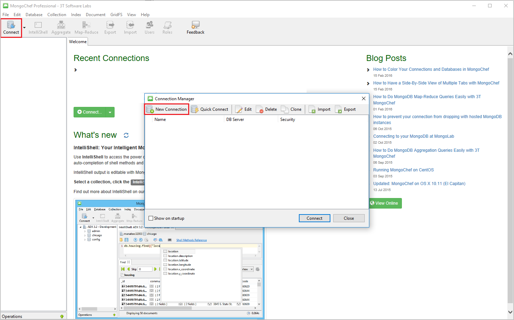
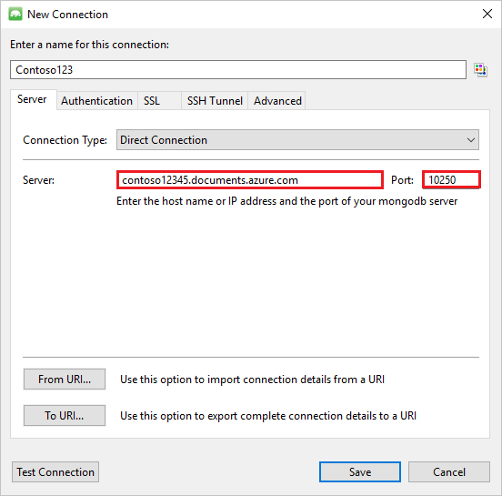
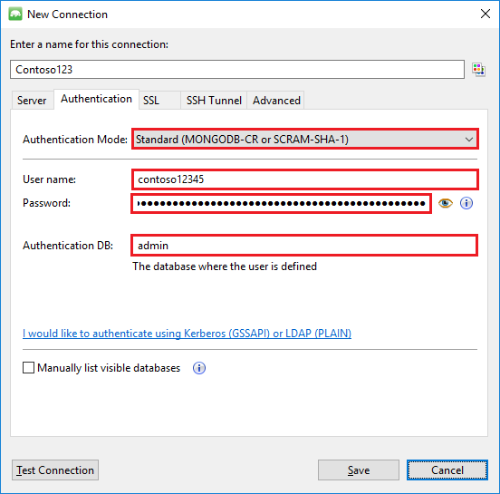

<properties 
    pageTitle="Utilizar MongoChef con una cuenta de DocumentDB con compatibilidad con el protocolo de MongoDB | Microsoft Azure" 
    description="Obtenga información sobre cómo usar MongoChef con una cuenta de DocumentDB con compatibilidad con el protocolo de MongoDB, ahora disponible para la vista previa." 
    keywords="mongochef"
    services="documentdb" 
    authors="AndrewHoh" 
    manager="jhubbard" 
    editor="" 
    documentationCenter=""/>

<tags 
    ms.service="documentdb" 
    ms.workload="data-services" 
    ms.tgt_pltfrm="na" 
    ms.devlang="na" 
    ms.topic="article" 
    ms.date="08/25/2016" 
    ms.author="anhoh"/>

# Utilizar MongoChef con una cuenta de DocumentDB con compatibilidad con el protocolo de MongoDB

Para conectarse a una cuenta de Azure DocumentDB con compatibilidad con el protocolo de MongoDB utilizando MongoChef, debe:

- Descargar e instalar [MongoChef](http://3t.io/mongochef)
- Tiene cuenta con compatibilidad con el protocolo de información de la [cadena de conexión](documentdb-connect-mongodb-account.md) de MongoDB DocumentDB

## Crear la conexión de MongoChef  

Para agregar su cuenta de DocumentDB con compatibilidad con el protocolo de MongoDB para el Administrador de conexión MongoChef, realice los pasos siguientes.

1. Recuperar su DocumentDB con compatibilidad con el protocolo de información de conexión de MongoDB siguiendo las instrucciones [aquí](documentdb-connect-mongodb-account.md).

    

2. Haga clic en **Conectar** para abrir el Administrador de conexión y luego haga clic en **Nueva conexión**

    
    
2. En la ventana de **Nueva conexión** , en la ficha **servidor** , escriba el HOST (FQDN) de la cuenta de DocumentDB protocolo compatible con MongoDB y el puerto.
    
    

3. En la ventana de **Nueva conexión** , en la ficha **autenticación** , elija el modo de autenticación **estándar (MONGODB CR o SCARM-SHA-1)** y escriba el nombre de usuario y la contraseña.  Acepte la base de datos de autenticación predeterminado (admin) o proporcionar su propio valor.

    

4. En la ventana de **Nueva conexión** , en la pestaña **SSL** , active la casilla de verificación **Protocolo de usar SSL para conectar** y el botón de radio de **certificados SSL autofirmados de aceptación** .

    

5. Haga clic en el botón **Probar conexión** para validar la información de conexión, haga clic en **Aceptar** para volver a la ventana de nueva conexión y, a continuación, haga clic en **Guardar**.

    

## Usar MongoChef para crear una base de datos, colección y documentos  

Para crear una base de datos, colección y documentos con MongoChef, realice los pasos siguientes.

1. En el **Administrador de conexión**, resalte la conexión y haga clic en **Conectar**.

    

2. Haga clic con el botón secundario del mouse en el host y elija **Agregar base de datos**.  Proporcione un nombre de base de datos y haga clic en **Aceptar**.
    
    

3. Haga clic con el botón secundario del mouse en la base de datos y elija **Agregar colección**.  Proporcione un nombre de la colección y haga clic en **crear**.

    

4. Haga clic en el elemento de menú de la **colección** y luego haga clic en **Agregar documento**.

    

5. En el cuadro de diálogo Agregar documento, pegue la siguiente y, a continuación, haga clic en **Agregar documento**.

        {
        "_id": "AndersenFamily",
        "lastName": "Andersen",
        "parents": [
            { "firstName": "Thomas" },
            { "firstName": "Mary Kay"}
        ],
        "children": [
        {
            "firstName": "Henriette Thaulow", "gender": "female", "grade": 5,
            "pets": [{ "givenName": "Fluffy" }]
        }
        ],
        "address": { "state": "WA", "county": "King", "city": "seattle" },
        "isRegistered": true
        }

    
6. Agregar otro documento, esta vez con el contenido siguiente.

        {
        "_id": "WakefieldFamily",
        "parents": [
            { "familyName": "Wakefield", "givenName": "Robin" },
            { "familyName": "Miller", "givenName": "Ben" }
        ],
        "children": [
            {
                "familyName": "Merriam", 
                "givenName": "Jesse", 
                "gender": "female", "grade": 1,
                "pets": [
                    { "givenName": "Goofy" },
                    { "givenName": "Shadow" }
                ]
            },
            { 
                "familyName": "Miller", 
                "givenName": "Lisa", 
                "gender": "female", 
                "grade": 8 }
        ],
        "address": { "state": "NY", "county": "Manhattan", "city": "NY" },
        "isRegistered": false
        }

7. Ejecutar una consulta de ejemplo. Por ejemplo, busque familias con el apellido 'Andersen' y devolver los campos de estado y padres.

    
    

## Pasos siguientes

- Explorar DocumentDB con compatibilidad con el protocolo de MongoDB [ejemplos](documentdb-mongodb-samples.md).

 
