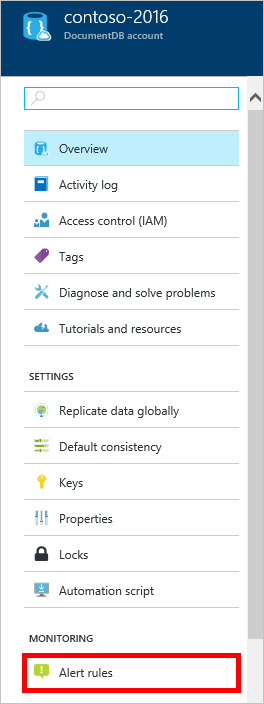
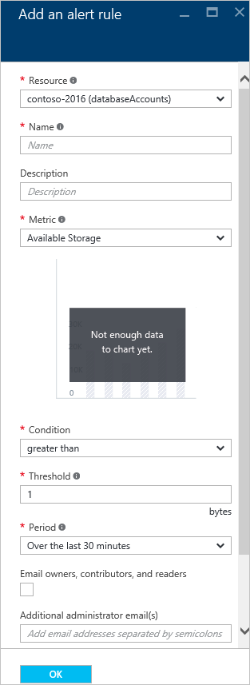

<properties
    pageTitle="Supervisar el almacenamiento y las solicitudes de DocumentDB | Microsoft Azure"
    description="Obtenga información sobre cómo supervisar su cuenta DocumentDB para métricas de rendimiento, como las convocatorias y errores del servidor y medidas de uso, como el consumo de almacenamiento."
    services="documentdb"
    documentationCenter=""
    authors="mimig1"
    manager="jhubbard"
    editor="cgronlun"/>

<tags
    ms.service="documentdb"
    ms.workload="data-services"
    ms.tgt_pltfrm="na"
    ms.devlang="na"
    ms.topic="article"
    ms.date="10/17/2016"
    ms.author="mimig"/>

# Supervisar las convocatorias, uso y almacenamiento de DocumentDB

Puede supervisar sus cuentas de Azure DocumentDB en el [portal de Azure](https://portal.azure.com/). Para cada cuenta DocumentDB, ambos métricas de rendimiento, como las convocatorias y errores del servidor y medidas de uso, como el consumo de almacenamiento están disponibles.

Métricas se pueden revisar en el módulo de cuenta o en el nuevo módulo de métricas.

## Indicadores de rendimiento de la vista en el módulo de métricas

1. En una ventana nueva, abra el [portal de Azure](https://portal.azure.com/), haga clic en **Más servicios**, haga clic en **DocumentDB (NoSQL)**y, a continuación, haga clic en el nombre de la cuenta de DocumentDB para el que desea ver los indicadores de rendimiento.
2. En el menú de recursos, haga clic en **métricas**.

El módulo de métricas se abre y puede seleccionar la colección de revisar. Puede revisar las mediciones de disponibilidad, solicitudes, rendimiento y almacenamiento y compararlos con los SLA DocumentDB.

## Indicadores de rendimiento de la vista en el módulo de la cuenta
1.  En una ventana nueva, abra el [portal de Azure](https://portal.azure.com/), haga clic en **Más servicios**, haga clic en **DocumentDB (NoSQL)**y, a continuación, haga clic en el nombre de la cuenta de DocumentDB para el que desea ver los indicadores de rendimiento.

2.  La lente de **supervisión** muestra los mosaicos siguientes predeterminada:
    *   Total de solicitudes de la fecha actual.
    *   Almacenamiento utilizado.

    Si la tabla no muestra **ningún dato disponible** y considera que hay datos en la base de datos, vea la sección de [solución de problemas](#troubleshooting) .

    

3.  Al hacer clic en las **solicitudes** o **almacenamiento** mosaico abre un módulo **métrica** detallado.
4.  El módulo de **métrica** muestra detalles sobre las medidas que haya seleccionado.  En la parte superior del módulo es un gráfico de solicitudes de representar cada hora y por debajo del es la tabla que muestra los valores de agregación de solicitudes limitados y total.  El módulo métrico también muestra la lista de alertas que se han definido, filtrado por la métrica que aparece en el módulo de métrica actual (de este modo, si tiene un número de alertas, solo verá las relacionadas que presentan aquí).   

    

## Personalizar vistas de métrica de rendimiento en el portal

1.  Para personalizar las medidas que se muestran en un gráfico determinado, haga clic en el gráfico para abrirlo en el módulo de **métrica** y, a continuación, haga clic en **Editar gráfico**.  
    

2.  En el módulo de **Editar gráfico** , hay opciones para modificar las medidas que se muestran en el gráfico, así como el intervalo de tiempo.  
    

3.  Para cambiar las medidas que se muestran en el elemento, simplemente seleccione o desactive las mediciones de rendimiento disponibles y, a continuación, haga clic en **Aceptar** en la parte inferior de la hoja.  
4.  Para cambiar el intervalo de tiempo, seleccione un rango diferente (por ejemplo, **personalizada**) y, a continuación, haga clic en **Aceptar** en la parte inferior de la hoja.  

    

## Crear gráficos en paralelo en el portal
El Portal de Azure le permite crear gráficos de métrica en paralelo.  

1.  En primer lugar, haga clic en el gráfico que desea copiar y seleccione **Personalizar**.

    

2.  En el menú para copiar el elemento y, a continuación, haga clic en **terminado de personalizar**, haga clic en **clonar** .

      

Ahora puede tratar este elemento como cualquier otra parte métrica, personalizar el rango métricas y la hora mostrado en el elemento.  Al hacer esto, puede ver dos diferentes métricas gráfico de forma simultánea al mismo tiempo.  
      

## Configurar alertas en el portal
1.  En el [portal de Azure](https://portal.azure.com/), haga clic en **Más servicios**, haga clic en **DocumentDB (NoSQL)**y, a continuación, haga clic en el nombre de la cuenta de DocumentDB le gustaría configurar alertas métrica de rendimiento.

2.  En el menú de recursos, haga clic en **Reglas de alertas** para abrir el módulo de reglas de alerta.  
    

3.  En el módulo de **reglas de alertas** , haga clic en **Agregar aviso**.  
    

4.  En el módulo de **Agregar una regla de alerta** , especifique:
    *   El nombre de la regla de alerta que está configurando.
    *   Descripción de la nueva regla de alerta.
    *   La métrica de la regla de alerta.
    *   La condición de umbral y período que determinan cuando se activa la alerta. Por ejemplo, un error de servidor recuento mayor que 5 sobre los últimos 15 minutos.
    *   Si el administrador del servicio y coadministrators se envían por correo electrónico cuando se activa la alerta.
    *   Direcciones de correo electrónico para las notificaciones de alerta.  
    

## Supervisar DocumentDB mediante programación
La métrica del nivel de cuenta disponible en el portal, como solicitudes de total y el uso de almacenamiento de información de cuenta, no está disponible a través de las APIs DocumentDB. Sin embargo, puede recuperar datos de uso en el nivel de colección mediante las APIs DocumentDB. Para recuperar datos de nivel de colección, haga lo siguiente:

- Para utilizar la API de REST, [realizar una operación GET en la colección](https://msdn.microsoft.com/library/mt489073.aspx). En los encabezados x-ms-cuota de recursos y x-ms-uso de recursos en la respuesta, se devuelve la información de cuota y el uso de la colección.
- Para usar el SDK de .NET, use el método [DocumentClient.ReadDocumentCollectionAsync](https://msdn.microsoft.com/library/microsoft.azure.documents.client.documentclient.readdocumentcollectionasync.aspx) , que devuelve un [ResourceResponse](https://msdn.microsoft.com/library/dn799209.aspx) que contiene un número de propiedades de uso, como **CollectionSizeUsage**, **DatabaseUsage**, **DocumentUsage**y mucho más.

Para obtener acceso a métricas adicionales, use el [SDK de Monitor de Azure](https://www.nuget.org/packages/Microsoft.Azure.Insights). Definiciones de métricas disponibles se pueden recuperar llamando:

    https://management.azure.com/subscriptions/{SubscriptionId}/resourceGroups/{ResourceGroup}/providers/Microsoft.DocumentDb/databaseAccounts/{DocumentDBAccountName}/metricDefinitions?api-version=2015-04-08

Las consultas para recuperar métricas individuales use el siguiente formato:

    https://management.azure.com/subscriptions/{SubecriptionId}/resourceGroups/{ResourceGroup}/providers/Microsoft.DocumentDb/databaseAccounts/{DocumentDBAccountName}/metrics?api-version=2015-04-08&$filter=%28name.value%20eq%20%27Total%20Requests%27%29%20and%20timeGrain%20eq%20duration%27PT5M%27%20and%20startTime%20eq%202016-06-03T03%3A26%3A00.0000000Z%20and%20endTime%20eq%202016-06-10T03%3A26%3A00.0000000Z

Para obtener más información, vea [Recuperar recursos métricas a través de la API de REST de Azure Monitor](https://blogs.msdn.microsoft.com/cloud_solution_architect/2016/02/23/retrieving-resource-metrics-via-the-azure-insights-api/). Tenga en cuenta que se cambió el nombre "Azure Inights" "Azure Monitor".  Esta entrada de blog hace referencia al nombre anterior.

## Solución de problemas
Si los mosaicos supervisión mostrar el mensaje **no hay datos disponibles** , y recientemente realizados solicitudes o agregar datos a la base de datos, puede editar el mosaico para reflejar el uso reciente.

### Editar un mosaico para actualizar datos actuales
1.  Para personalizar las medidas que se muestran en una parte determinada, haga clic en el gráfico para abrir el módulo de **métrica** y, a continuación, haga clic en **Editar gráfico**.  
    

2.  En el módulo de **Editar gráfico** , en la sección **Intervalo de tiempo** , haga clic en **más allá de la hora**y, a continuación, haga clic en **Aceptar**.  
    

3.  El mosaico ahora debe actualizar que muestra los datos actuales y uso.  
    

## Pasos siguientes
Para obtener más información acerca de la capacidad de DocumentDB, consulte [Administrar DocumentDB capacidad](documentdb-manage.md).
