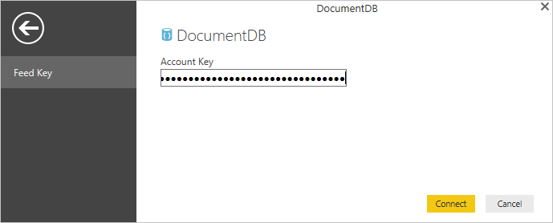
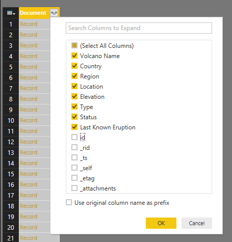
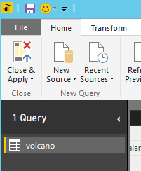

<properties
    pageTitle="Tutorial de Power BI para conector DocumentDB | Microsoft Azure"
    description="Use este tutorial de Power BI para importar JSON, crear informes precisos y visualizar datos mediante el conector DocumentDB y Power BI."
    keywords="Power bi tutorial y visualizar datos, conector de power bi"
    services="documentdb"
    authors="h0n"
    manager="jhubbard"
    editor="mimig"
    documentationCenter=""/>

<tags
    ms.service="documentdb"
    ms.workload="data-services"
    ms.tgt_pltfrm="na"
    ms.devlang="na"
    ms.topic="article"
    ms.date="09/22/2016"
    ms.author="hawong"/>

# Tutorial de Power BI para DocumentDB: visualice los datos mediante el conector de Power BI

[PowerBI.com](https://powerbi.microsoft.com/) es un servicio en línea, donde puede crear y compartir informes y paneles con datos que son importantes para usted y su organización.  Power BI Desktop es una herramienta que permite recuperar datos de varios orígenes de datos, combinar y transformar los datos, crear potentes informes y visualizaciones y publicar los informes en Power BI de creación de informes dedicada.  Con la última versión de Power BI Desktop, ahora puede conectarse a su cuenta de DocumentDB a través del conector DocumentDB para Power BI.   

En este tutorial de Power BI, se siga los pasos para conectarse a una cuenta de DocumentDB en Power BI Desktop, vaya a la colección necesitamos para extraer los datos mediante el navegador, transformar datos JSON en formato tabular mediante el Editor de consultas de Power BI Desktop y crear y publicar un informe en PowerBI.com.

Después de completar este tutorial de Power BI, podrá responder a las preguntas siguientes:  

-   ¿Cómo puedo crear informes con datos de desde DocumentDB con Power BI Desktop?
-   ¿Cómo puedo conectar a una cuenta de DocumentDB en Power BI Desktop?
-   ¿Cómo puedo recuperar datos de una colección de Power BI Desktop?
-   ¿Cómo puedo transformar datos JSON anidados en Power BI Desktop?
-   ¿Cómo se puede publicar y compartir mis informes en PowerBI.com?

## Requisitos previos

Antes de seguir las instrucciones de este tutorial de Power BI, asegúrese de que tiene los siguientes:

- [La última versión de Power BI Desktop](https://powerbi.microsoft.com/desktop).
- Acceso a nuestra demostración cuenta o los datos de su cuenta de Azure DocumentDB.
    - La cuenta de demostración se rellena con los datos de volcano que se muestra en este tutorial. Esta cuenta de demostración no está limitada por cualquier SLA y está destinada solo con fines de demostración.  Reserva el derecho de realizar modificaciones en esta cuenta de demostración incluidos pero no se limita a terminar la cuenta, cambiando la clave, restringir el acceso, cambiar y eliminar los datos, en cualquier momento sin antelación o motivo.
        - Dirección URL: https://analytics.documents.azure.com
        - Clave de sólo lectura: MSr6kt7Gn0YRQbjd6RbTnTt7VHc5ohaAFu7osF0HdyQmfR + YhwCH2D2jcczVIR1LNK3nMPNBD31losN7lQ/fkw ==
    - O bien, para crear su propia cuenta, vea [crear una cuenta de base de datos de DocumentDB con el portal de Azure](https://azure.microsoft.com/documentation/articles/documentdb-create-account/). A continuación, para obtener Volcán de muestra los datos que se asemeje a lo que se utilizan en este tutorial (pero no contiene los bloques de GeoJSON), consulte el [sitio de NOAA](https://www.ngdc.noaa.gov/nndc/struts/form?t=102557&s=5&d=5) y, a continuación, importar los datos con la [herramienta de migración de datos de DocumentDB](https://azure.microsoft.com/documentation/articles/documentdb-import-data/).

Para compartir los informes en PowerBI.com, debe tener una cuenta en PowerBI.com.  Para obtener más información acerca de Power BI para liberar y Power BI Pro, visite [https://powerbi.microsoft.com/pricing](https://powerbi.microsoft.com/pricing).

## Empecemos
En este tutorial, imaginemos que sea un geologist estudiar libro todo el mundo.  Los datos de volcano se almacenan en una cuenta de DocumentDB y los documentos JSON el aspecto siguiente.

    {
        "Volcano Name": "Rainier",
        "Country": "United States",
        "Region": "US-Washington",
        "Location": {
            "type": "Point",
            "coordinates": [
            -121.758,
            46.87
            ]
        },
        "Elevation": 4392,
        "Type": "Stratovolcano",
        "Status": "Dendrochronology",
        "Last Known Eruption": "Last known eruption from 1800-1899, inclusive"
    }

Desea recuperar los datos de Volcán desde la cuenta DocumentDB y visualizar datos en un informe de Power BI interactivo como el siguiente.

¿Listo para probarlo? Vamos a empezar.

1. Ejecutar Power BI Desktop en su estación de trabajo.
2. Una vez que se inicia Power BI Desktop, se muestra una pantalla de *bienvenida* .

    

3. Puede **Obtener datos**, consulte **Orígenes recientes**o **Abrir otros informes** directamente desde la pantalla de *bienvenida* .  Haga clic en la X en la esquina superior derecha para cerrar la pantalla. Se muestra la vista de **informe** de Power BI Desktop.

    

4. Seleccione la cinta de opciones de **Inicio** y luego haga clic en **Obtener datos**.  Debe aparecer la ventana de **Obtener datos** .

5. Haga clic en **Azure**, seleccione **Microsoft Azure DocumentDB (Beta)**y, a continuación, haga clic en **Conectar**.  Debe aparecer la ventana de **Microsoft Azure DocumentDB Connect** .

    

6. Especifique la dirección URL del extremo de cuenta del DocumentDB que desea recuperar los datos de tal como se muestra a continuación y, a continuación, haga clic en **Aceptar**. Puede recuperar la dirección URL en el cuadro de URI en el módulo de **[teclas](documentdb-manage-account.md#keys)** del portal de Azure o puede usar la cuenta de demostración, en cuyo caso, la dirección URL es `https://analytics.documents.azure.com`. 

    Deje el nombre de la base de datos, el nombre de la colección y la instrucción SQL en blanco como estos campos son opcionales.  En su lugar, se utilizará el navegador para seleccionar la base de datos y colección a identificar dónde proceden los datos.

    

7. Si se está conectando a este extremo por primera vez, se le pedirá la clave de cuenta.  Puede recuperar la clave del cuadro de **Clave principal** en el módulo de **[claves de solo lectura](documentdb-manage-account.md#keys)** del portal de Azure, o puede usar la cuenta de demostración, en cuyo caso la clave es `RcEBrRI2xVnlWheejXncHId6QRcKdCGQSW6uSUEgroYBWVnujW3YWvgiG2ePZ0P0TppsrMgscoxsO7cf6mOpcA==`. Escriba la clave de cuenta y haga clic en **Conectar**.

    Le recomendamos que utilice la tecla de sólo lectura cuando crea informes.  Esto evitará innecesaria exposición de la clave principal a posibles riesgos de seguridad. La clave de sólo lectura está disponible desde el módulo de [teclas](documentdb-manage-account.md#keys) del portal de Azure o puede usar la información de cuenta de demostración indicada anteriormente.

    

8. Si la cuenta se ha conectado correctamente, aparecerá el **navegador** .  El **navegador** mostrará una lista de bases de datos con la cuenta.
9. Haga clic en y expanda la base de datos la procedencia de los datos del informe de, si usa la cuenta de demostración, seleccione **volcanodb**.   

10. Ahora, seleccione una colección que se recuperan los datos. Si está utilizando la cuenta de demostración, seleccione **volcano1**.

    El panel de vista previa muestra una lista de elementos de **registro** .  Un documento se representa como un tipo de **registro** de Power BI. Del mismo modo, un bloque JSON anidado dentro de un documento también es un **registro**.

    

11. Haga clic en **Editar** para iniciar el Editor de consultas para que podamos transformar los datos.

## Acoplar y transformar documentos JSON
1. En el Editor de consultas de Power BI, debería ver una columna de **documento** en el panel central.

2. Haga clic en el botón de expansión en el lado derecho del encabezado de columna del **documento** .  Aparecerá el menú contextual con una lista de campos.  Seleccione los campos que necesita para el informe, por ejemplo, nombre de Volcano, país, región, ubicación, elevación, tipo, estado y última saber lectura, y, a continuación, haga clic en **Aceptar**.

    

3. El panel central mostrará una vista previa del resultado con los campos seleccionados.

    

4. En nuestro ejemplo, la propiedad de ubicación es un bloque de GeoJSON en un documento.  Como puede ver, la ubicación se representa como un tipo de **registro** en Power BI Desktop.  
5. Haga clic en el botón de expansión en el lado derecho del encabezado de columna ubicación.  Aparecerá el menú contextual con los campos tipo y las coordenadas.  Vamos a, seleccione el campo de las coordenadas y haga clic en **Aceptar**.

    

6. El panel central muestra ahora una columna de las coordenadas de tipo de **lista** .  Como se muestra al principio del tutorial, los datos de GeoJSON en este tutorial son de tipo de punto con los valores de latitud y longitud guardados en la matriz de coordenadas.

    El elemento de coordenadas [0] representa longitud mientras las coordenadas [1] representa latitud.
    

7. Para acoplar la matriz de coordenadas, creamos una **Columna personalizada** denominada LatLong.  Seleccione la cinta de opciones de **Agregar columna** y haga clic en **Agregar columna de personalizada**.  Debe aparecer la ventana **Agregar columna de personalizada** .

8. Proporcione un nombre para la nueva columna, por ejemplo, LatLong.

9. A continuación, especifique la fórmula personalizada para la nueva columna.  En nuestro ejemplo, hemos concatenará los valores de latitud y longitud separados por una coma, tal como se muestra a continuación con la siguiente fórmula: `Text.From([Document.Location.coordinates]{1})&","&Text.From([Document.Location.coordinates]{0})`. Haga clic en **Aceptar**.

    Para obtener más información sobre expresiones de análisis de datos (DAX) como las funciones DAX, visite [Básicos de DAX en Power BI Desktop](https://support.powerbi.com/knowledgebase/articles/554619-dax-basics-in-power-bi-desktop).

    

10. Ahora, el panel central mostrará la nueva columna de LatLong rellenada con los valores de latitud y longitud separados por una coma.

    

    Si recibe un Error en la nueva columna, asegúrese de que los pasos aplicados en configuración de la consulta coincide con la siguiente ilustración:

    

    Si los pasos son diferentes, elimine los pasos adicionales e intente volver a agregar la columna personalizada. 

11. Se ha finalizado el acoplamiento de los datos en formato tabular.  Puede aprovechar todas las características disponibles en el Editor de consultas a la forma y transformar datos en DocumentDB.  Si usa los datos de ejemplo, cambie el tipo de datos para la elevación al **número entero** cambiando el **Tipo de datos** en **la cinta** .

    

12. Haga clic en **Cerrar y aplicar** para guardar el modelo de datos.

    

## Crear los informes
Vista de Power BI Desktop informe es donde puede empezar a crear informes para visualizar los datos.  Puede crear informes arrastrando y soltando campos en el lienzo de **informe** .

En la vista informe, debe buscar:

 1. El panel **campos** , esto es donde se muestra una lista de modelos de datos con los campos que puede usar para los informes.

 2. El panel de **visualizaciones** . Un informe puede contener una o varias visualizaciones.  Elija los tipos visuales sus necesidades desde el panel de **visualizaciones** de conexión.

 3. El lienzo de **informe** , es donde va a crear los efectos visuales para el informe.

 4. La página del **informe** . Puede agregar varias páginas del informe en Power BI Desktop.

La siguiente imagen muestra los pasos básicos para crear un informe de vista de mapa interactivo simple.

1. En nuestro ejemplo, se crea una vista de mapa que muestra la ubicación de cada Volcán.  En el panel de **visualizaciones** , haga clic en el tipo de mapa visual como se resalta en la captura de pantalla anterior.  Verá el tipo de mapa visual dibujando en el lienzo de **informe** .  El panel de **visualización** también debe mostrar un conjunto de propiedades relacionadas con el tipo de mapa visual.

2. Ahora, arrastre y coloque el campo LatLong desde el panel **campos** a la propiedad de **ubicación** en el panel de **visualizaciones** .
3. A continuación, arrastre y coloque el campo nombre de Volcano la propiedad de la **leyenda** .  

4. A continuación, arrastre y coloque el campo elevación la propiedad **tamaño** .  

5. Ahora debe ver el mapa visual que muestra un conjunto de burbujas que indica la ubicación de cada volcano con el tamaño de la burbuja de correlación de la elevación de la Volcán.

6. Ahora que ha creado un informe básico.  Puede personalizar aún más el informe agregando más visualizaciones.  En este caso, hemos agregado una segmentación de datos de tipo Volcano para hacer que el informe interactivo.  

    

## Publicar y compartir su informe
Para compartir el informe, debe tener una cuenta en PowerBI.com.

1. En Power BI Desktop, haga clic en la cinta de opciones de **Inicio** .
2. Haga clic en **Publicar**.  Se le pedirá que escriba el nombre de usuario y la contraseña de su cuenta de PowerBI.com.
3. Una vez autenticada la credencial, el informe se publica en el destino seleccionado.
4. Haga clic en **abrir 'PowerBITutorial.pbix' en Power BI** para ver y compartir su informe en PowerBI.com.

    

## Crear un panel de PowerBI.com

Ahora que ya tiene un informe, le permite compartir en PowerBI.com

Cuando se publica el informe de Power BI Desktop a PowerBI.com, genera un **informe** y un **conjunto de datos** en su inquilino de PowerBI.com. Por ejemplo, una vez que ha publicado un informe denominado **PowerBITutorial** a PowerBI.com, verá PowerBITutorial en las secciones de los **informes** y los **conjuntos de datos** en PowerBI.com.

   

Para crear un panel puede compartir, haga clic en el botón de **Pin Live página** en el informe de PowerBI.com.

   

A continuación, siga las instrucciones de [Pin un mosaico de un informe](https://powerbi.microsoft.com/documentation/powerbi-service-pin-a-tile-to-a-dashboard-from-a-report/#pin-a-tile-from-a-report) para crear un nuevo panel. 

También puede hacer modificaciones ad hoc al informe antes de crear un panel. Sin embargo, se recomienda que use Power BI Desktop para realizar los cambios y volver a publicar el informe de PowerBI.com.

## Actualizar datos en PowerBI.com

Hay dos formas de actualizar los datos, ad hoc y programadas.

Para una actualización de ad hoc, simplemente haga clic en la eclipses (...) por el **conjunto de datos**, por ejemplo, PowerBITutorial. Verá una lista de acciones como **Actualizar ahora**. Haga clic en **Actualizar ahora** para actualizar los datos.

Para una actualización programada, haga lo siguiente.

1. En la lista Acción, haga clic en **Programar actualización** . 
    

2. En la página **configuración** , expanda **las credenciales de origen de datos**. 

3. Haga clic en **Editar credenciales**. 

    Aparece el menú emergente configurar. 

4. Escriba la clave para conectarse a la cuenta DocumentDB para ese conjunto de datos y luego haga clic en **iniciar sesión**. 

5. Expandir **Programar actualización** y configurar la programación que desea actualizar el conjunto de datos. 
  
6. Haga clic en **Aplicar** y haya terminado de configurar la actualización programada.

## Pasos siguientes
- Para obtener más información acerca de Power BI, vea [Introducción a Power BI](https://powerbi.microsoft.com/documentation/powerbi-service-get-started/).
- Para obtener más información sobre DocumentDB, consulte la [documentación de DocumentDB página de inicio](https://azure.microsoft.com/documentation/services/documentdb/).
