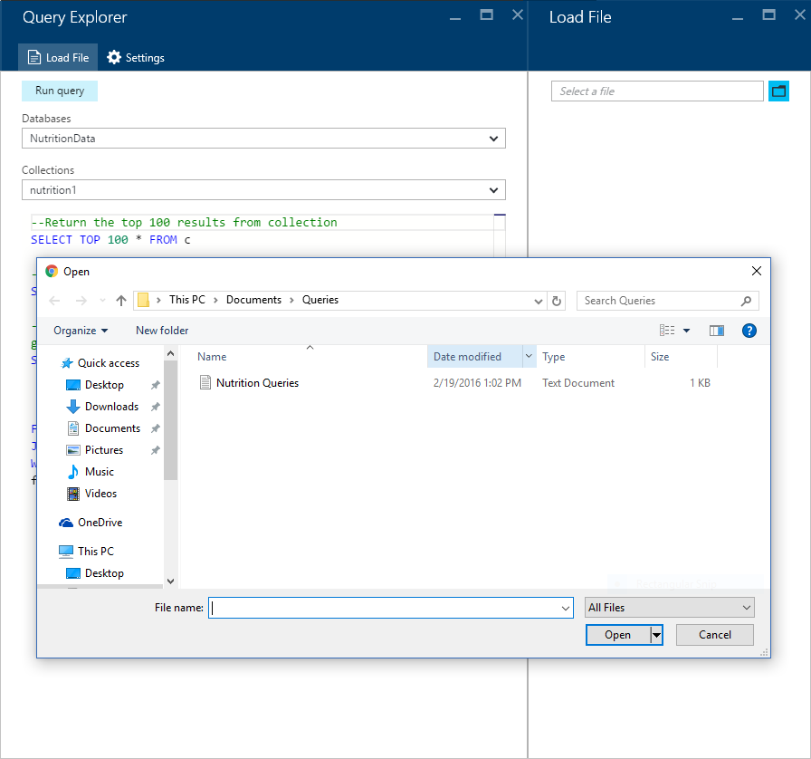

<properties
    pageTitle="Explorador de consulta DocumentDB: Un editor de consultas SQL | Microsoft Azure"
    description="Obtenga información sobre el Explorador de consulta DocumentDB, un editor de consultas SQL en el portal de Azure para escribir consultas SQL y ejecutarlos con un conjunto de NoSQL DocumentDB."
    keywords="escribir consultas sql, editor de consultas de sql"
    services="documentdb"
    authors="kirillg"
    manager="jhubbard"
    editor="monicar"
    documentationCenter=""/>

<tags
    ms.service="documentdb"
    ms.workload="data-services"
    ms.tgt_pltfrm="na"
    ms.devlang="na"
    ms.topic="article"
    ms.date="08/30/2016"
    ms.author="kirillg"/>

# Escribir, editar y ejecutar consultas SQL para DocumentDB con el Explorador de consulta 

En este artículo se proporciona información general sobre el Explorador de consulta de [Microsoft Azure DocumentDB](https://azure.microsoft.com/services/documentdb/) , una herramienta de portal Azure que permite escribir, editar y ejecutar consultas SQL en una [colección de DocumentDB](documentdb-create-collection.md).

1. En el portal de Azure en la Jumpbar, haga clic en **DocumentDB (NoSQL)**. Si **DocumentDB (NoSQL)** no está visible, haga clic en **Más servicios** y, a continuación, haga clic en **DocumentDB (NoSQL)**.

2. En el menú de recursos, haga clic en **Explorador de consulta**. 

    

3. En el módulo del **Explorador de consulta** , seleccione las **bases de datos** y **las colecciones** a la consulta de las listas desplegables y escriba ejecutar la consulta. 

    Las listas de lista desplegable de **bases de datos** y **colecciones** se rellenarán según el contexto en el que iniciar el Explorador de consulta. 

    Una consulta de forma predeterminada de `SELECT TOP 100 * FROM c` se proporciona.  Puede aceptar la consulta predeterminada o crear su propia consulta con el lenguaje de consulta SQL descrito en la [hoja de referencia sobre consulta SQL](documentdb-sql-query-cheat-sheet.md) o en el artículo de la [consulta SQL y sintaxis SQL](documentdb-sql-query.md) .

    Haga clic en **Ejecutar consulta** para ver los resultados.

    

4. El módulo de **resultados** muestra el resultado de la consulta. 

    

## Trabajar con los resultados

De forma predeterminada, el Explorador de consulta devuelve resultados en grupos de 100.  Si la consulta genera resultados más de 100, simplemente use los comandos de la **página siguiente** y **página anterior** para desplazarse por el conjunto de resultados.

Para consultas con éxito, el panel de **información** contiene métricas como el gasto de la solicitud, el número de ida y vuelta realizada la consulta, el conjunto de resultados que se muestran actualmente, y si hay más resultados, que pueden acceder a través del comando de la **siguiente página** , como se mencionó anteriormente.

## Usar varias consultas

Si usa varias consultas y desea cambiar rápidamente entre ellas, puede escriba todas las consultas en el cuadro de texto de la consulta del módulo del **Explorador de consulta** , resaltar aquel que desea ejecutar y, a continuación, haga clic en **Ejecutar consulta** para ver los resultados.

## Agregar consultas de un archivo en el editor de consultas SQL

Puede cargar el contenido de un archivo existente mediante el comando **Cargar archivo** .

## Solución de problemas

Si se realiza una consulta con errores, consulta Explorer muestra una lista de errores que puede ayudar a solucionar problemas.

## Ejecutar SQL DocumentDB consultas fuera del portal

El Explorador de consulta en el portal de Azure es una manera de ejecutar consultas SQL contra DocumentDB. También puede ejecutar consultas SQL con la [API de REST](https://msdn.microsoft.com/library/azure/dn781481.aspx) o el [SDK de cliente](documentdb-sdk-dotnet.md). Para obtener más información sobre el uso de estos otros métodos, vea [consultas de ejecución de SQL](documentdb-sql-query.md#executing-sql-queries)

## Pasos siguientes

Para obtener más información sobre la gramática de SQL DocumentDB compatible con el Explorador de consulta, vea el artículo de la [consulta SQL y sintaxis SQL](documentdb-sql-query.md) o imprimir la [hoja de referencia sobre consulta SQL](documentdb-sql-query-cheat-sheet.md).
También puede disfrutar de experimentar con la [Animación de consulta](https://www.documentdb.com/sql/demo) donde puede probar consultas en línea con un conjunto de datos de ejemplo.
