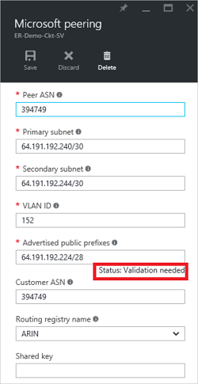
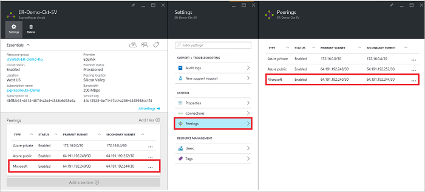

<properties
   pageTitle="Cómo configurar el enrutamiento para un circuito de ExpressRoute con el Portal de Azure | Microsoft Azure"
   description="En este artículo le guiará por los pasos necesarios para crear y aprovisionar el privado, público y Microsoft interconexión de un circuito ExpressRoute. En este artículo también muestra cómo comprobar el estado, actualizar o eliminar peerings para su circuito."
   documentationCenter="na"
   services="expressroute"
   authors="cherylmc"
   manager="carmonm"
   editor=""
   tags="azure-resource-manager"/>
<tags
   ms.service="expressroute"
   ms.devlang="na"
   ms.topic="hero-article" 
   ms.tgt_pltfrm="na"
   ms.workload="infrastructure-services"
   ms.date="10/10/2016"
   ms.author="cherylmc"/>

# Crear y modificar el enrutamiento de un circuito ExpressRoute

> [AZURE.SELECTOR]
[Portal de Azure - Administrador de recursos](expressroute-howto-routing-portal-resource-manager.md)
[PowerShell - Administrador de recursos](expressroute-howto-routing-arm.md)
[PowerShell - clásica](expressroute-howto-routing-classic.md)

En este artículo le guiará por los pasos para crear y administrar la configuración de enrutamiento de un circuito de ExpressRoute con el portal de Azure y el modelo de implementación de administrador de recursos.

**Acerca de los modelos de implementación de Azure**

[AZURE.INCLUDE [vpn-gateway-clasic-rm](../../includes/vpn-gateway-classic-rm-include.md)] 

## Requisitos previos de configuración

- Asegúrese de que ha revisado la página [requisitos previos](expressroute-prerequisites.md) , la página de [requisitos de enrutamiento](expressroute-routing.md) y la página de [flujos de trabajo](expressroute-workflows.md) antes de comenzar la configuración.
- Debe tener un circuito ExpressRoute activo. Siga las instrucciones para [crear un circuito ExpressRoute](expressroute-howto-circuit-arm.md) y tiene el circuito habilitado por su proveedor de servicios de conectividad antes de continuar. Circuito de ExpressRoute debe estar en un estado de preparación y están habilitado para poder ejecutar los cmdlets que se describe a continuación.

Estas instrucciones solo se aplican a circuitos creados con proveedores de servicios que ofrece servicios de conectividad de nivel 2. Si está utilizando un proveedor de servicios que ofrece servicios de nivel 3 administrados (normalmente un IPVPN, como MPLS), su proveedor de servicios de conectividad configurará y administrar el enrutamiento para usted. 

>[AZURE.IMPORTANT] Nos actualmente no se anuncia peerings configurado por proveedores de servicios a través del portal de administración de servicio. Estamos trabajando sobre cómo habilitar esta capacidad pronto. Consulte con su proveedor de servicios antes de configurar peerings BGP.

Puede configurar una, dos o todas las tres peerings (público privado, Azure Azure y Microsoft) para un circuito ExpressRoute. Puede configurar peerings en el orden que desee. Sin embargo, debe asegurarse de que complete la configuración de cada uno de ellos interconexión a la vez. 

## Interconexión privada de Azure

Esta sección proporciona instrucciones sobre cómo crear, obtener, actualizar y eliminar la configuración de interconexión privada Azure para un circuito ExpressRoute. 

### Para crear la interconexión privada de Azure

1. Configurar el circuito ExpressRoute. Asegúrese de que el proveedor de servicios de conectividad totalmente aprovisionado el circuito antes de continuar.

    

2. Configurar interconexión privada Azure para el circuito. Asegúrese de que tiene los siguientes elementos antes de continuar con los siguientes pasos:

    - Un /30 subred del vínculo principal. No debe ser parte de cualquier espacio de direcciones reservado para redes virtuales.
    - Un /30 subred del vínculo secundario. No debe ser parte de cualquier espacio de direcciones reservado para redes virtuales.
    - Un ID válido para establecer esta interconexión en. Asegúrese de que ningún otro interconexión circuito utiliza el mismo identificador de VLAN.
    - COMO número de interconexión. Puede utilizar 2 bytes y 4 bytes como números. Puede usar una privada como número para este interconexión. Asegúrese de que no está usando 65515.
    - Un hash MD5 si decide usar uno. **Esto es opcional**.

3. Seleccione la fila de interconexión privada de Azure, tal como se muestra a continuación.
    
    
    

4. Configurar una interconexión privada. La imagen siguiente muestra un ejemplo de configuración.

    

    
5. Guardar la configuración una vez que haya especificado todos los parámetros. Una vez que la configuración se ha aceptado correctamente, verá algo similar del siguiente ejemplo.

    
    

### Para ver los detalles de interconexión privadas Azure

Puede ver las propiedades de interconexión privada Azure seleccionando la interconexión.

### Actualizar la configuración de interconexión privada Azure

Puede seleccionar la fila de interconexión y modificar las propiedades de interconexión. 

### Para eliminar la interconexión privada de Azure

Puede quitar la configuración de interconexión seleccionando el icono de eliminar tal como se muestra a continuación.

## Interconexión pública de Azure

Esta sección proporciona instrucciones sobre cómo crear, obtener, actualizar y eliminar la configuración de interconexión pública Azure para un circuito ExpressRoute. 

### Para crear la interconexión pública de Azure

1. Configurar circuito ExpressRoute. Asegúrese de que el proveedor de servicios de conectividad totalmente aprovisionado el circuito antes de continuar más.

    

2. Configurar interconexión pública Azure para el circuito. Asegúrese de que tiene los siguientes elementos antes de continuar con los siguientes pasos:

    - Un /30 subred del vínculo principal. 
    - Un /30 subred del vínculo secundario. 
    - Todas las direcciones IP que se usa para configurar esta interconexión deben ser válidas direcciones IPv4 públicas.
    - Un ID válido para establecer esta interconexión en. Asegúrese de que ningún otro interconexión circuito utiliza el mismo identificador de VLAN.
    - COMO número de interconexión. Puede utilizar 2 bytes y 4 bytes como números.
    - Un hash MD5 si decide usar uno. **Esto es opcional**.

3. Seleccione la fila de interconexión pública Azure, tal como se muestra a continuación.
    
    
    

4. Configurar interconexión público. La imagen siguiente muestra un ejemplo de configuración.

    

    
5. Guardar la configuración una vez que haya especificado todos los parámetros. Una vez que la configuración se ha aceptado correctamente, verá algo similar del siguiente ejemplo.

    
    

### Para ver los detalles de interconexión públicas Azure

Puede ver las propiedades de Azure público interconexión seleccionando la interconexión.

### Actualizar la configuración de interconexión pública Azure

Puede seleccionar la fila de interconexión y modificar las propiedades de interconexión. 

### Para eliminar la interconexión pública de Azure

Puede quitar la configuración de interconexión seleccionando el icono de eliminar tal como se muestra a continuación.

## Interconexión de Microsoft

Esta sección proporciona instrucciones sobre cómo crear, obtener, actualizar y eliminar la configuración de interconexión de Microsoft para un circuito ExpressRoute. 

### Para crear Microsoft interconexión

1. Configurar circuito ExpressRoute. Asegúrese de que el proveedor de servicios de conectividad totalmente aprovisionado el circuito antes de continuar más.

    

2. Configurar Microsoft interconexión para el circuito. Asegúrese de que tiene la información siguiente antes de continuar.

    - Un /30 subred del vínculo principal. Debe ser un prefijo de IPv4 público válido posea y registrado en un RIR / TIR.
    - Un /30 subred del vínculo secundario. Debe ser un prefijo de IPv4 público válido posea y registrado en un RIR / TIR.
    - Un ID válido para establecer esta interconexión en. Asegúrese de que ningún otro interconexión circuito utiliza el mismo identificador de VLAN.
    - COMO número de interconexión. Puede utilizar 2 bytes y 4 bytes como números.
    - **Anuncia prefijos:** Debe proporcionar una lista de todos los prefijos que planea anunciar sobre la sesión BGP. Se aceptan solo prefijos de direcciones IP públicos. Puede enviar una lista separada por comas si va a enviar un conjunto de prefijos. Estos prefijos deben estar registrados para usted en un RIR / TIR.
    - **Cliente ASN:** Si se encuentra prefijos de publicidad que no están registrados para la interconexión como número, puede especificar el número de AS a los que están registrados. **Esto es opcional**.
    - **Nombre de ruta del registro:** Puede especificar el RIR / TIR frente a los que el número y prefijos se registrado. **Esto es opcional.**
    - Un hash MD5, si decide usar uno. **Esto es opcional.**
    
3. Puede seleccionar la interconexión que desee configurar como se muestra a continuación. Seleccione la fila de interconexión de Microsoft.
    
    
    

4.  Configurar interconexión de Microsoft. La imagen siguiente muestra un ejemplo de configuración.

    

    
5. Guardar la configuración una vez que haya especificado todos los parámetros. 

    Si obtiene el circuito a una validación necesaria estado (tal como se muestra a continuación), debe abrir una incidencia de soporte técnico para mostrar la prueba de propiedad de los prefijos a nuestro equipo de soporte técnico.  
    
    

    Puede abrir una incidencia de soporte técnico directamente desde el portal tal como se muestra a continuación   
    
    

6. Una vez que la configuración se ha aceptado correctamente, verá algo similar del siguiente ejemplo.

    
    

### Para ver los detalles de interconexión de Microsoft

Puede ver las propiedades de Azure público interconexión seleccionando la interconexión.

### Actualizar la configuración de interconexión de Microsoft

Puede seleccionar la fila de interconexión y modificar las propiedades de interconexión. 

### Para eliminar interconexión de Microsoft

Puede quitar la configuración de interconexión seleccionando el icono de eliminar tal como se muestra a continuación.

## Pasos siguientes

Siguiente paso, [vínculo un VNet a un circuito de ExpressRoute](expressroute-howto-linkvnet-arm.md).

-  Para obtener más información sobre los flujos de trabajo de ExpressRoute, consulte [ExpressRoute flujos de trabajo](expressroute-workflows.md).

-  Para obtener más información acerca de circuito interconexión, vea [ExpressRoute circuitos y dominios de enrutamiento](expressroute-circuit-peerings.md).

-  Para obtener más información sobre cómo trabajar con las redes virtuales, vea [Introducción a la red Virtual](../virtual-network/virtual-networks-overview.md).

