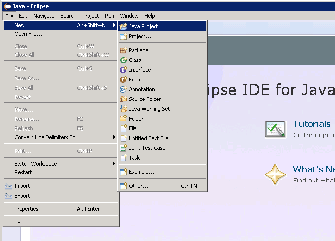
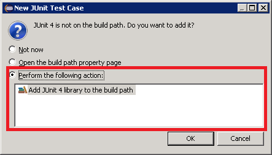
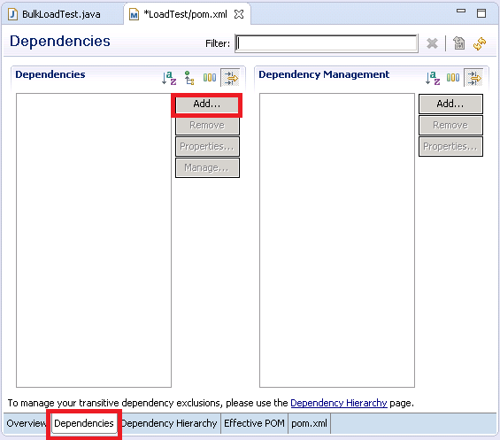

<properties
   pageTitle="Implementar un muestrario JMeter JUnit para realizar pruebas de rendimiento Elasticsearch | Microsoft Azure"
   description="Cómo usar un muestrario de JUnit para generar y cargar datos en un clúster de Elasticsearch."
   services=""
   documentationCenter="na"
   authors="dragon119"
   manager="bennage"
   editor=""
   tags=""/>

<tags
   ms.service="guidance"
   ms.devlang="na"
   ms.topic="article"
   ms.tgt_pltfrm="na"
   ms.workload="na"
   ms.date="09/22/2016"
   ms.author="masashin"/>
   
# Implementar un muestrario JMeter JUnit para realizar pruebas de rendimiento Elasticsearch

[AZURE.INCLUDE [pnp-header](../../includes/guidance-pnp-header-include.md)]

En este artículo forma [parte de una serie](guidance-elasticsearch.md). 

Este documento describe cómo crear y usar un muestrario de JUnit que se puede generar y cargar datos en un clúster de Elasticsearch como parte de un plan de pruebas JMeter. Este enfoque proporciona un enfoque muy flexible para pruebas de carga que puede generar grandes cantidades de datos de prueba sin dependiendo de los archivos de datos externos.

> [AZURE.NOTE] Las pruebas de carga que se usa para evaluar el rendimiento de recopilación de datos que se describe en el [ajuste del rendimiento de recopilación de datos para Elasticsearch](guidance-elasticsearch-tuning-data-ingestion-performance.md) se construyen con este método. Los detalles del código JUnit se describen en el documento.

Pruebas rendimiento de recopilación de datos se desarrollar el código de JUnit con Eclipse (Mars) y dependencias resolvieron utilizando a experto. Los procedimientos siguientes describen el proceso paso a paso para instalar Eclipse, configurar a experto, crear una prueba de JUnit e implementar esta prueba como una muestra de solicitud de JUnit en una prueba de JMeter.

> [AZURE.NOTE] Para obtener información detallada sobre la estructura y configuración del entorno de prueba, vea [crear un entorno de prueba de rendimiento para Elasticsearch en Azure][].

## Requisitos previos de instalación

Necesitará el [Entorno de tiempo de ejecución de Java](http://www.java.com/en/download/ie_manual.jsp) en su equipo de desarrollo.
También debe instalar el [IDE Eclipse para desarrolladores de Java](https://www.eclipse.org/downloads/index.php?show_instructions=TRUE).

> [AZURE.NOTE] Si está utilizando la VM principal JMeter se describe en la [creación de un entorno de prueba de rendimiento para Elasticsearch en Azure][] como entorno de desarrollo, descargue la versión de Windows de 32 bits del instalador Eclipse.

## Crear un proyecto de prueba de JUnit Elasticsearch de comprobación de carga

Inicie IDE Eclipse si no está ya en ejecución y, a continuación, cierre la página de **bienvenida** .  En el menú **archivo** , haga clic en y, a continuación, haga clic en **Proyecto Java**.

En la ventana **Nuevo proyecto Java** , escriba un nombre de proyecto, seleccione **predeterminadas JRE**y, a continuación, haga clic en **Finalizar**.

En la ventana **Explorador de paquete** , expanda el nodo con el nombre de su proyecto. Compruebe que contiene una carpeta denominada **src** y una referencia a JRE especificada.

Haga clic en la carpeta de **origen** , haga clic en **nuevo**y, a continuación, haga clic en **caso de prueba de JUnit**.

En la ventana **nuevo caso de prueba de JUnit** , seleccione **nuevo Junit 4 prueba**, escriba un nombre para el paquete (puede ser el mismo que el nombre del proyecto, aunque por convención debe empezar con una letra minúscula), un nombre para la clase de prueba y seleccione las opciones que generan el código auxiliar del método necesario para su prueba. Deje vacío el cuadro de **clase de prueba** y, a continuación, haga clic en **Finalizar**.

Si aparece el cuadro de diálogo **nuevo caso de prueba de JUnit** siguiente, seleccione la opción para agregar la biblioteca de JUnit 4 a la ruta de acceso de compilación y, a continuación, haga clic en **Aceptar**. 

Compruebe que la estructura de código de la prueba JUnit se genera y se muestra en la ventana del editor de Java.

En el **Explorador de paquetes**, haga clic en el nodo para el proyecto, haga clic en **Configurar**y, a continuación, haga clic en **convertir a experto en Project**.

> [AZURE.NOTE]Usando permite Maven más fácil administración dependencias externas (por ejemplo, las bibliotecas de cliente Elasticsearch Java) de un proyecto depende de.

En el cuadro de diálogo **Crear nuevo POM** , en la lista desplegable de **embalaje** , seleccione **jar**y, a continuación, haga clic en **Finalizar**.

El panel que aparece debajo del editor de (POM) del modelo de objetos de proyecto puede mostrar la advertencia "ruta de compilación especifica el entorno de ejecución J2SE 1.5. No hay versiones de JRE instaladas en el área de trabajo que son totalmente compatibles con este entorno", según la versión de Java está instalado en su equipo de desarrollo. Si tiene una versión de Java que sea posterior a la versión 1.5 puede omitir esta advertencia.

En el editor de POM, expanda **Propiedades** y, a continuación, haga clic en **crear**.

En el cuadro de diálogo **Agregar propiedad** , en el cuadro **nombre** , escriba *es.version*, en el cuadro **valor** , escriba *1.7.2*y, a continuación, haga clic en **Aceptar**. Esta es la versión de la biblioteca de cliente de Elasticsearch Java usar (esta versión puede ser reemplazada en el futuro, y definir la versión como una propiedad POM y hacer referencia a esta propiedad en otro lugar dentro del proyecto permiten la versión cambiarse rápidamente).

Haga clic en la ficha **dependencias** en la base del editor de POM y, a continuación, haga clic en **Agregar** junto a la lista de **dependencias** .

En el cuadro de diálogo **Seleccionar dependencia** , en el cuadro **Id. de grupo** , escriba *org.elasticsearch*, en el cuadro **Id de muestra** *elasticsearch*, en el cuadro **versión** , escriba * \${es.version}*y, a continuación, haga clic en **Aceptar**. Información acerca de la biblioteca de cliente de Java Elasticsearch se almacena en el repositorio Central de experto en línea y, a continuación, esta configuración descargue automáticamente la biblioteca y sus dependencias cuando se genera el proyecto.

En el menú **archivo** , haga clic en **Guardar todo**. Esta acción Guardar y genere el proyecto, descargar las dependencias especificadas por Maven. Compruebe que la carpeta experto dependencias aparece en el Explorador de paquete. Expanda esta carpeta para ver los archivos jar descargados para admitir la biblioteca de cliente de Elasticsearch Java.

## Importación de un proyecto existente JUnit en Eclipse

Este procedimiento supone que ha descargado un proyecto de experto en que se ha creado previamente utilizando Eclipse.

Iniciar IDE Eclipse. En el menú **archivo** , haga clic en **Importar**.

En la ventana **Seleccionar** , expanda la carpeta **Maven** , haga clic en **Proyectos de experto existente**y, a continuación, haga clic en **siguiente**.

En la ventana **Experto en proyectos** , especifique la carpeta que contiene el proyecto (la carpeta que contiene el archivo pom.xml), haga clic en **Seleccionar todo**y, a continuación, haga clic en **Finalizar**.

En la ventana **Explorador de paquetes** , expanda el nodo correspondiente a su proyecto. Compruebe que el proyecto contiene una carpeta denominada **src**. Esta carpeta contiene el código fuente de la prueba de JUnit. El proyecto se puede compilar e implementar estas instrucciones.

## Implementar una prueba de JUnit a JMeter

Este procedimiento se da por hecho que ha creado un proyecto denominado LoadTest que contiene una clase de prueba de JUnit denominada `BulkLoadTest.java` que acepta parámetros de configuración que se pasa como una única cadena a un constructor (este es el mecanismo que espera JMeter).

En el IDE Eclipse, en el **Explorador de paquetes**, haga clic en el nodo de proyecto y, a continuación, haga clic en **Exportar**.

En el **Asistente para exportación**, en la página **Seleccionar** , expanda el nodo de **Java** , haga clic en **archivo de JAR**y, a continuación, haga clic en **siguiente**.

En la página **JAR especificación de archivo** , en el cuadro **Seleccionar los recursos para exportar** , expanda el proyecto **.project**anular la selección y a continuación, anule la selección de **pom.xml**. En el cuadro **JAR archivo** , proporcione un nombre de archivo y una ubicación para el TARRO (se le debe asignar la extensión de archivo .jar) y, a continuación, haga clic en **Finalizar**.

Explorador de Windows, copie el archivo JAR que acaba de crear a JVM maestra JMeter y guárdelo en apache-jmeter-2.13\\biblioteca\\carpeta junit debajo de la carpeta donde ha instalado JMeter (consulte el procedimiento "Creación de la máquina virtual de JMeter principal" en la [creación de un entorno de prueba de rendimiento para Elasticsearch en Azure](guidance-elasticsearch-creating-performance-testing-environment.md) para obtener más información).

Volver a Eclipse, expanda la ventana del **Explorador de paquete** y tome nota de todos los archivos JAR y las ubicaciones que aparecen en la carpeta de experto en dependencias del proyecto. Tenga en cuenta que los archivos mostrados en la siguiente imagen pueden variar, dependiendo de qué versión de Elasticsearch usa:

Con el Explorador de Windows, copie cada archivo JAR que se hace referencia en la carpeta dependencias de experto a apache-jmeter-2.13\\biblioteca\\junit carpeta en la máquina virtual de JMeter principal.

Si la biblioteca\\junit carpeta ya contiene versiones anteriores de estos archivos JAR, a continuación, elimínelo. Si deja en su lugar, a continuación, la prueba JUnit podría no funcionar como referencias podrían resolverse el JARs incorrectos.

En el patrón de JMeter VM, detener JMeter si se está ejecutando.  Iniciar JMeter.  En JMeter, haga clic en **Plan de prueba**, haga clic en **Agregar**y, a continuación, haga clic en **subprocesos (usuarios)**y, a continuación, haga clic en **Un grupo de subproceso**.

Bajo el nodo de **Plan de pruebas** , haga clic en el **Grupo subproceso**, haga clic en **Agregar**, haga clic en **muestra**y, a continuación, haga clic en **Convocatoria de JUnit**.

En la página de **Solicitud de JUnit** , seleccione **Buscar anotaciones JUnit4 (en lugar de 3 JUnit)**. En la lista desplegable **nombre de clase** , seleccione la clase de prueba de carga de JUnit (se mostrarán en el formulario * &lt;paquete&gt;.&lt; clase&gt;*), en el **Método de prueba** de lista de la lista desplegable, seleccione la JUnit método de prueba (este es el método que realiza realmente el trabajo asociado a la prueba y se debe marcar con la *@test* anotación en el proyecto Eclipse) y escriba los valores que se pasan al constructor en el cuadro **Etiqueta de cadena de Constructor** . Los detalles que se muestra en la siguiente imagen son sólo ejemplos; el **nombre de clase**, * *Método de prueba*, y * *Etiqueta de cadena de Constructor** probablemente serán diferentes de los mostrados.

Si la clase no aparece en la lista desplegable **nombre de clase** , probablemente significa que no se ha exportado correctamente el TARRO o que no está guardado en la biblioteca\\junit carpeta o algunos de los botes dependientes que faltan en la biblioteca\\junit carpeta. Si esto sucede, vuelva a exportar el proyecto de Eclipse y asegurarse de que ha seleccionado el recurso **src** , copie el TARRO en la biblioteca\\junit carpeta y, a continuación, compruebe que ha copiado todo el JARs dependientes enumerados por Maven a la carpeta de biblioteca.

Cerrar JMeter. No es necesario guardar el plan de pruebas.  Copie el archivo JAR que contiene la clase de prueba de JUnit a la /home/&lt;nombre de usuario&gt;/apache-jmeter-2.13/lib/junit carpeta en cada una de las máquinas virtuales de JMeter subordinadas (*&lt;nombre de usuario&gt; * es el nombre del usuario administrativo que especificó al crear la máquina virtual, vea el procedimiento "Crear las máquinas virtuales de JMeter subordinadas" en la [creación de un entorno de prueba de rendimiento para Elasticsearch en Azure](guidance-elasticsearch-creating-performance-testing-environment.md) para obtener más información.)

Copiar los archivos JAR dependientes necesarios para la clase de prueba de JUnit a la /home/&lt;nombre de usuario&gt;/apache-jmeter-2.13/lib/junit carpeta en cada una de las máquinas virtuales de JMeter subordinadas. Asegúrese de quitar primero las versiones anteriores de archivos JAR de esta carpeta.

Puede usar el `pscp` utilidad Copiar archivos desde un equipo Windows a Linux.

[Crear un entorno de prueba para Elasticsearch en Azure de rendimiento]: guidance-elasticsearch-creating-performance-testing-environment.md
