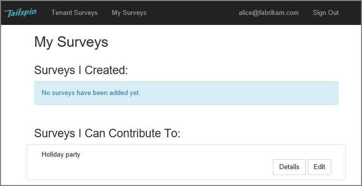

<properties
   pageTitle="Acerca de la aplicación Tailspin encuestas | Microsoft Azure"
   description="Información general sobre la aplicación de encuestas Tailspin"
   services=""
   documentationCenter="na"
   authors="MikeWasson"
   manager="roshar"
   editor=""
   tags=""/>

<tags
   ms.service="guidance"
   ms.devlang="dotnet"
   ms.topic="article"
   ms.tgt_pltfrm="na"
   ms.workload="na"
   ms.date="05/23/2016"
   ms.author="mwasson"/>

# Acerca de la aplicación Tailspin encuestas

[AZURE.INCLUDE [pnp-header](../../includes/guidance-pnp-header-include.md)]

En este artículo forma [parte de una serie]. También es una [aplicación de ejemplo] completa que acompaña a esta serie.

Tailspin es una empresa ficticia que es desarrollar una aplicación de SaaS denominada encuestas. Esta aplicación permite a las organizaciones crear y publicar encuestas en línea.

- Una organización puede iniciar sesión en la aplicación.
- Cuando la organización está suscrito, los usuarios pueden iniciar en la aplicación con sus credenciales de la organización.
- Los usuarios pueden crear, editar y publicar encuestas.

> [AZURE.NOTE] Para empezar con la aplicación, vea [ejecutar la aplicación de encuestas].

## Los usuarios pueden crear, editar y ver encuestas

Puede ver todas las encuestas que ha creado o tiene derechos de colaborador para un usuario autenticado y crear encuestas. Observe que el usuario ha iniciado sesión con su identidad de organización `bob@contoso.com`.

Esta captura de pantalla muestra la página Editar encuesta:

Los usuarios también pueden ver las encuestas creadas por otros usuarios en el mismo inquilino.

## Los propietarios de la encuesta pueden invitar a los colaboradores

Cuando un usuario crea una encuesta, que puede invitar a otras personas que sean colaboradores de la encuesta. Los colaboradores pueden editar la encuesta, pero no puede eliminar o publicarla.  

Un usuario puede agregar colaboradores desde otros inquilinos, que posibilita el inquilino entre compartir recursos. En esta captura de pantalla, Bob (`bob@contoso.com`) está agregando Ana (`alice@fabrikam.com`) como un colaborador a una encuesta que Bob creado.

Cuando Ana inicia sesión, ve la encuesta que aparece en "Encuestas ¿aporto a".

Tenga en cuenta que Ana inicia sesión en su propia inquilino, no como un invitado del inquilino de Contoso. Ana tiene permisos de colaborador solo para esa encuesta &mdash; no puede ver otras encuestas desde el inquilino de Contoso.

## Arquitectura

La aplicación de encuestas consta de un web front-end y back-end web API. Ambos se implementan con [núcleo de ASP.NET 1.0].

La aplicación web usa Azure Active Directory (AD Azure) para autenticar a los usuarios. La aplicación web también llama Azure AD obtener tokens de acceso OAuth 2 de la API de Web. Símbolos de acceso se almacenan en caché Redis de Azure. La caché permite varias instancias compartir la misma caché token (por ejemplo, en una granja de servidores).

## Pasos siguientes

- Lea el siguiente artículo de esta serie: [autenticación en aplicaciones multiempresa, con Azure Active Directory y conectar OpenID][authentication]

<!-- Links -->

[authentication]: guidance-multitenant-identity-authenticate.md
[parte de una serie]: guidance-multitenant-identity.md
[Ejecutar la aplicación de encuestas]: https://github.com/Azure-Samples/guidance-identity-management-for-multitenant-apps/blob/master/docs/running-the-app.md
[Núcleo de ASP.NET 1.0]: https://docs.asp.net/en/latest/
[aplicación de ejemplo]: https://github.com/Azure-Samples/guidance-identity-management-for-multitenant-apps
