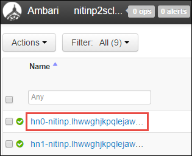
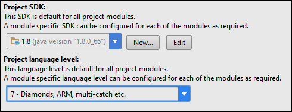
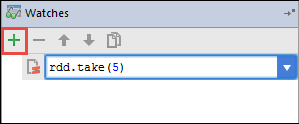
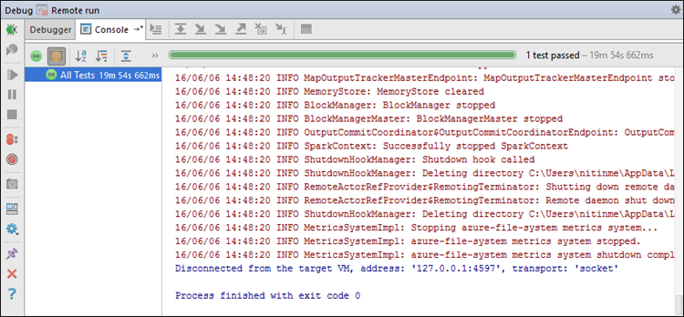

 <properties
    pageTitle="Use herramientas de HDInsight de Azure Kit de herramientas de IntelliJ para depurar de forma remota aplicaciones que se ejecutan en clústeres HDInsight Spark | Microsoft Azure"
    description="Obtenga información sobre cómo utilizar herramientas de HDInsight de Azure Kit de herramientas de IntelliJ para depurar aplicaciones que se ejecutan en clústeres HDInsight Spark de forma remota."
    services="hdinsight"
    documentationCenter=""
    authors="nitinme"
    manager="jhubbard"
    editor="cgronlun"
    tags="azure-portal"/>

<tags
    ms.service="hdinsight"
    ms.workload="big-data"
    ms.tgt_pltfrm="na"
    ms.devlang="na"
    ms.topic="article"
    ms.date="09/09/2016"
    ms.author="nitinme"/>

# Use herramientas de HDInsight de Azure Kit de herramientas para IntelliJ depurar aplicaciones motor remotamente en clúster de HDInsight motor Linux

Este artículo proporciona instrucciones paso a paso acerca de cómo usar las herramientas de HDInsight en el Kit de herramientas de Azure para IntelliJ para enviar un trabajo de motor en clúster HDInsight Spark y, a continuación, remotamente a depurar desde su equipo de escritorio. Para ello, debe realizar los siguientes pasos de alto nivel:

1. Crear una red Virtual de Azure a sitios o sitio de punto. Los pasos de este documento se supone que utiliza una red de sitio a otro.

2. Crear un clúster de motor en HDInsight de Azure que forma parte de la red Virtual de sitio a sitio Azure.

3. Compruebe la conectividad entre el headnode de clúster y el escritorio.

4. Cree una aplicación de Scala en IntelliJ IDEA y configúrelo para depuración remota.

5. Ejecutar y depurar la aplicación.

##Requisitos previos

* Una suscripción de Azure. Vea la [versión de prueba gratuita de Azure obtener](https://azure.microsoft.com/documentation/videos/get-azure-free-trial-for-testing-hadoop-in-hdinsight/).

* Un clúster de motor de Apache en HDInsight Linux. Para obtener instrucciones, vea [crear Apache motor clústeres en HDInsight de Azure](hdinsight-apache-spark-jupyter-spark-sql.md).
 
* Kit de desarrollo de Java de Oracle. Puede instalarlo desde [aquí](http://www.oracle.com/technetwork/java/javase/downloads/jdk8-downloads-2133151.html).
 
* IntelliJ IDEA. En este artículo se utiliza la versión 15.0.1. Puede instalarlo desde [aquí](https://www.jetbrains.com/idea/download/).
 
* Herramientas de HDInsight de Azure Kit de herramientas para IntelliJ. Herramientas de HDInsight para IntelliJ están disponibles como parte del Kit de herramientas de Azure para IntelliJ. Para obtener instrucciones sobre cómo instalar el Kit de herramientas de Azure, vea [instalar el Kit de herramientas de Azure para IntelliJ](../azure-toolkit-for-intellij-installation.md).

* Inicie sesión en su suscripción de Azure desde IntelliJ IDEA. Siga las instrucciones [aquí](hdinsight-apache-spark-intellij-tool-plugin.md#log-into-your-azure-subscription).
 
* Mientras se ejecuta la aplicación de Scala de motor de depuración remota en un equipo con Windows, puede que aparezca una excepción como se explica en [2356 motor](https://issues.apache.org/jira/browse/SPARK-2356) que se produce debido a una falta WinUtils.exe en Windows. Para evitar este error, debe [descargar el archivo ejecutable desde aquí](http://public-repo-1.hortonworks.com/hdp-win-alpha/winutils.exe) a una ubicación como **C:\WinUtils\bin**. A continuación, debe agregar una variable de entorno **HADOOP_HOME** y establezca el valor de la variable en **C\WinUtils**.

## Paso 1: Crear una red Virtual de Azure

Siga las instrucciones de los vínculos de abajo para crear una red Virtual de Azure y, a continuación, compruebe la conectividad entre el escritorio y una red Virtual de Azure.

* [Crear una VNet con una conexión VPN de sitio a sitio con el Portal de Azure](../vpn-gateway/vpn-gateway-howto-site-to-site-resource-manager-portal.md)
* [Crear una VNet con una conexión VPN de sitio a sitio con PowerShell](../vpn-gateway/vpn-gateway-create-site-to-site-rm-powershell.md)
* [Configurar una conexión punto a sitio a una red virtual con PowerShell](../vpn-gateway/vpn-gateway-howto-point-to-site-rm-ps.md)

## Paso 2: Crear un clúster HDInsight Spark

También debe crear un clúster de motor de Apache en HDInsight de Azure que forma parte de la red Virtual de Azure que ha creado. Use la información disponible en [clústeres basados en Linux crear en HDInsight](hdinsight-hadoop-provision-linux-clusters.md). Como parte de la configuración opcional, seleccione la red Virtual de Azure que creó en el paso anterior.

## Paso 3: Comprobar la conectividad entre el headnode de clúster y el escritorio

1. Obtener la dirección IP de la headnode. Abra Ambari UI para el clúster. En el módulo de clúster, haga clic en **panel**.

    

2. Desde la UI Ambari, desde la esquina superior derecha, haga clic en **Hosts**.

    

3. Verá una lista de nodos de zookeeper, nodos de trabajo y headnodes. El headnodes tiene la **hn*** prefijo. Haga clic en la primera headnode.

    

4. En la parte inferior de la página que se abre desde el cuadro **Resumen** , copie la dirección IP de la headnode y el nombre de host.

    

5. Incluya la dirección IP y el nombre de host de la headnode al archivo **hosts** en el equipo desde donde desea ejecutar y depurar los trabajos de motor de forma remota. Esto le permitirá comunicarse con el headnode mediante la dirección IP, así como el nombre de host.

    1. Abrir un bloc de notas con permisos elevados. En el menú archivo, haga clic en **Abrir** y, a continuación, desplácese hasta la ubicación del archivo hosts. En un equipo Windows, es `C:\Windows\System32\Drivers\etc\hosts`.

    2. Agregue lo siguiente al archivo **hosts** .

            # For headnode0
            192.xxx.xx.xx hn0-nitinp
            192.xxx.xx.xx hn0-nitinp.lhwwghjkpqejawpqbwcdyp3.gx.internal.cloudapp.net

            # For headnode1
            192.xxx.xx.xx hn1-nitinp
            192.xxx.xx.xx hn1-nitinp.lhwwghjkpqejawpqbwcdyp3.gx.internal.cloudapp.net

5. Desde el equipo conectado a la red Virtual de Azure que se usa el clúster HDInsight, compruebe que puede hacer ping tanto la headnodes mediante la dirección IP, así como el nombre de host.

6. SSH en el headnode de clúster siguiendo las instrucciones en [conectarse a un clúster de HDInsight mediante SSH](hdinsight-hadoop-linux-use-ssh-windows.md#connect-to-a-linux-based-hdinsight-cluster). Desde el headnode clúster ping a la dirección IP del equipo de escritorio. Debe probar la conectividad a las direcciones de IP asignadas al equipo, uno para la conexión de red y otro para la red Virtual de Azure que el equipo está conectado a.

7. Repita los pasos para lo demás headnode. 

## Paso 4: Crear una aplicación de motor Scala con las herramientas de HDInsight de Azure Kit de herramientas para IntelliJ y configúrelo para depuración remota

1. Inicie IntelliJ IDEA y cree un nuevo proyecto. En el cuadro de diálogo nuevo proyecto, efectúe las acciones siguientes y, a continuación, haga clic en **siguiente**.

    

    * En el panel izquierdo, seleccione **HDInsight**.
    * En el panel derecho, seleccione **motor en HDInsight (Scala)**.
    * Haga clic en **siguiente**.

2. En la ventana siguiente, proporcione los detalles del proyecto.

    * Proporcione un nombre de proyecto y la ubicación del proyecto.
    * Para el **SDK de Project**, asegúrese de que proporcione una versión de Java mayor que 7.
    * Para **Scala SDK**, haga clic en **crear**, haga clic en **Descargar**y, a continuación, seleccione la versión de Scala usar. **Asegúrese de que no desea usar la versión 2.11.x**. Este ejemplo usa la versión **2.10.6**.

        

    * Para **Motor SDK**, descargar y usar el SDK desde [aquí](http://go.microsoft.com/fwlink/?LinkID=723585&clcid=0x409). También puede omitir esta y utilizar el [repositorio de motor experto](http://mvnrepository.com/search?q=spark) en su lugar, sin embargo, asegúrese de que tiene el repositorio de experto en derecha instalado para desarrollar aplicaciones motor. (Por ejemplo, debe asegurarse de que tiene el elemento de transmisión de motor instalado si está utilizando la transmisión motor; También, asegúrese de que está utilizando el repositorio marcado como Scala 2.10: no utilice el repositorio marcado como Scala 2.11.)

        

    * Haga clic en **Finalizar**.

3. El proyecto de motor creará automáticamente un efecto. Para ver la muestra, siga estos pasos.

    1. En el menú **archivo** , haga clic en **Estructura del proyecto**.
    2. En el cuadro de diálogo de **Estructura del proyecto** , haga clic en **artefactos** para ver la muestra de forma predeterminada que se crea.

        

    También puede crear su propio muestra bly al hacer clic en el **+** icono, resaltado en la imagen anterior.

4. En el cuadro de diálogo de **Estructura del proyecto** , haga clic en **proyecto**. Si se establece el **SDK de Project** a 1,8, asegúrese de que el **nivel de lenguaje de proyecto** se establece en **7 - rombos, etcetera de múltiples captura, ARM,**.

    

4. Agregar bibliotecas a su proyecto. Para agregar una biblioteca, haga clic en el nombre del proyecto en el árbol del proyecto y, a continuación, haga clic en **Configuración de módulo abierto**. En el cuadro de diálogo de **Estructura del proyecto** , en el panel izquierdo, haga clic en **bibliotecas**, haga clic en (+) símbolo y, a continuación, haga clic en **De experto**. 

     

    En el cuadro de diálogo **Descargar biblioteca del repositorio de experto en** buscar y agregue las siguientes bibliotecas.

    * `org.scalatest:scalatest_2.10:2.2.1`
    * `org.apache.hadoop:hadoop-azure:2.7.1`

5. Copiar `yarn-site.xml` y `core-site.xml` de headnode de clúster y agregarlo al proyecto. Use los comandos siguientes para copiar los archivos. Puede usar [Cygwin](https://cygwin.com/install.html) para ejecutar el siguiente `scp` comandos para copiar los archivos de headnodes de clúster.

        scp <ssh user name>@<headnode IP address or host name>://etc/hadoop/conf/core-site.xml .

    Porque se ha agregan la dirección IP de headnode y los nombres de host fo los hosts de archivo en el escritorio, podemos utilizar los comandos de **scp** de la siguiente manera.

        scp sshuser@hn0-nitinp:/etc/hadoop/conf/core-site.xml .
        scp sshuser@hn0-nitinp:/etc/hadoop/conf/yarn-site.xml .

    Agregar estos archivos a su proyecto, cópielas en la **carpeta/src** en el árbol del proyecto, por ejemplo `<your project directory>\src`.

6. Actualizar la `core-site.xml` para realizar los cambios siguientes.

    1. `core-site.xml`incluye la clave de cifrado a la cuenta de almacenamiento asociada con el clúster. En la `core-site.xml` agregó al proyecto, reemplazar la clave de cifrado con la clave de almacenamiento real asociada a la cuenta de almacenamiento predeterminada. Consulte [administrar las claves de acceso de almacenamiento](../storage/storage-create-storage-account.md#manage-your-storage-account).

            <property>
                <name>fs.azure.account.key.hdistoragecentral.blob.core.windows.net</name>
                <value>access-key-associated-with-the-account</value>
            </property>

    2. Elimine las siguientes entradas de la `core-site.xml`.

            <property>
                <name>fs.azure.account.keyprovider.hdistoragecentral.blob.core.windows.net</name>
                <value>org.apache.hadoop.fs.azure.ShellDecryptionKeyProvider</value>
            </property>

            <property>
                <name>fs.azure.shellkeyprovider.script</name>
                <value>/usr/lib/python2.7/dist-packages/hdinsight_common/decrypt.sh</value>
            </property>

            <property>
                <name>net.topology.script.file.name</name>
                <value>/etc/hadoop/conf/topology_script.py</value>
            </property>

    3. Guarde el archivo.

7. Agregue la clase principal de la aplicación. Desde el **Explorador de proyectos**, contextual **src**, apunte a **nuevo**y, a continuación, haga clic en **clase Scala**.

    

8. En el cuadro de diálogo **Crear nueva clase Scala** , proporcione un nombre para seleccionar **tipo** de **objeto**y, a continuación, haga clic en **Aceptar**.

    

9. En la `MyClusterAppMain.scala` archivo, pegue el código siguiente. Este código crea el motor contexto y se inicia una `executeJob` método desde la `SparkSample` objeto.

        import org.apache.spark.{SparkConf, SparkContext}

        object SparkSampleMain {
          def main (arg: Array[String]): Unit = {
            val conf = new SparkConf().setAppName("SparkSample")
                                      .set("spark.hadoop.validateOutputSpecs", "false")
            val sc = new SparkContext(conf)
        
            SparkSample.executeJob(sc,
                                   "wasbs:///HdiSamples/HdiSamples/SensorSampleData/hvac/HVAC.csv",
                                   "wasbs:///HVACOut")
          }
        }

10. Repita los pasos 8 y 9 del procedimiento anterior para agregar un nuevo objeto Scala denominado `SparkSample`. Agregue el código siguiente esta clase. Este código lee los datos de la HVAC.csv (disponible en todos los clústeres HDInsight Spark), recupera las filas que solo tienen un dígito de la columna séptimo en la CSV y escribe el resultado en **/HVACOut** en el contenedor de almacenamiento predeterminada para el clúster.

        import org.apache.spark.SparkContext
    
        object SparkSample {
          def executeJob (sc: SparkContext, input: String, output: String): Unit = {
            val rdd = sc.textFile(input)
        
            //find the rows which have only one digit in the 7th column in the CSV
            val rdd1 =  rdd.filter(s => s.split(",")(6).length() == 1)
        
            val s = sc.parallelize(rdd.take(5)).cartesian(rdd).count()
            println(s)
        
            rdd1.saveAsTextFile(output)
            //rdd1.collect().foreach(println)
          }
        
        }

11. Repita clase pasos 8 y 9 del procedimiento anterior para agregar un nuevo llamado `RemoteClusterDebugging`. Esta clase implementa el marco de pruebas de motor que se usa para depurar aplicaciones. Agregue el código siguiente a la `RemoteClusterDebugging` clase.

        import org.apache.spark.{SparkConf, SparkContext}
        import org.scalatest.FunSuite
        
        class RemoteClusterDebugging extends FunSuite {
        
          test("Remote run") {
            val conf = new SparkConf().setAppName("SparkSample")
                                      .setMaster("yarn-client")
                                      .set("spark.yarn.am.extraJavaOptions", "-Dhdp.version=2.4")
                                      .set("spark.yarn.jar", "wasbs:///hdp/apps/2.4.2.0-258/spark-assembly-1.6.1.2.4.2.0-258-hadoop2.7.1.2.4.2.0-258.jar")
                                      .setJars(Seq("""C:\WORK\IntelliJApps\MyClusterApp\out\artifacts\MyClusterApp_DefaultArtifact\default_artifact.jar"""))
                                      .set("spark.hadoop.validateOutputSpecs", "false")
            val sc = new SparkContext(conf)
        
            SparkSample.executeJob(sc,
              "wasbs:///HdiSamples/HdiSamples/SensorSampleData/hvac/HVAC.csv",
              "wasbs:///HVACOut")
          }
        }

    Par de cosas importantes Nota aquí:
    
    * Para `.set("spark.yarn.jar", "wasbs:///hdp/apps/2.4.2.0-258/spark-assembly-1.6.1.2.4.2.0-258-hadoop2.7.1.2.4.2.0-258.jar")`, asegúrese de que el ensamblado de motor JAR está disponible en el almacenamiento de clúster en la ruta especificada.
    * Para `setJars`, especifique la ubicación donde se creará el tarro de muestra. Normalmente es `<Your IntelliJ project directory>\out\<project name>_DefaultArtifact\default_artifact.jar`. 

11. En la `RemoteClusterDebugging` de clases, haga clic en el `test` palabra clave y seleccione **Crear configuración de RemoteClusterDebugging**.

    

12. En el cuadro de diálogo, proporcione un nombre para la configuración y seleccione el **tipo de prueba** como **nombre de la prueba**. Deje todos los demás valores como predeterminado, haga clic en **Aplicar**y, a continuación, haga clic en **Aceptar**.

    

13. Ahora debe ver una configuración de **Ejecución remoto** desplegable en la barra de menús. 

    

## Paso 5: Ejecute la aplicación en modo de depuración

1. En el proyecto IntelliJ IDEA, abra `SparkSample.scala` y crear un punto de interrupción junto a 'val rdd1'. En el menú emergente para crear un punto de interrupción, seleccione la **línea de la función executeJob**.

    

2. Haga clic en el botón **Depurar ejecutar** junto a la configuración de **Ejecutar remoto** desplegable para iniciar la ejecución de la aplicación.

    

3. Cuando la ejecución del programa alcanza el punto de interrupción, debería ver una pestaña **depurador** en el panel inferior.

    

4. Haga clic en la (**+**) icono para agregar una inspección como se muestra en la imagen siguiente. 

    

    Aquí, porque la aplicación se interrumpió antes de la variable `rdd1` se creó usando esta inspección podemos ver cuáles son las primeras 5 filas en la variable `rdd`. Presione **ENTRAR**.

    

    Lo que ve en la imagen anterior es que en tiempo de ejecución, puede consultar terabytes de datos y depuración cómo progresa de la aplicación. Por ejemplo, en el resultado que se muestra en la imagen anterior, puede ver que la primera fila de la salida es un encabezado. En función de esto, puede modificar el código de aplicación para omitir la fila de encabezado si es necesario.

5. Ahora puede hacer clic en el icono del **Programa de currículo** para continuar con la ejecución de la aplicación.

    

6. Si la aplicación se realiza correctamente, verá un resultado similar al siguiente.

    

 

## Vea también

* [Información general: Apache motor en HDInsight de Azure](hdinsight-apache-spark-overview.md)

### Escenarios

* [Motor con BI: realizar análisis de datos interactivas con motor en HDInsight con herramientas de inteligencia empresarial](hdinsight-apache-spark-use-bi-tools.md)

* [Motor con Machine aprendizaje: motor de uso en HDInsight para analizar usando HVAC datos de temperatura de creación](hdinsight-apache-spark-ipython-notebook-machine-learning.md)

* [Motor con Machine aprendizaje: motor de uso en HDInsight de predecir los resultados de la inspección de comida](hdinsight-apache-spark-machine-learning-mllib-ipython.md)

* [Motor de flujo de datos: Motor de uso en HDInsight para la creación de aplicaciones de transmisión en tiempo real](hdinsight-apache-spark-eventhub-streaming.md)

* [Análisis de registro de sitio Web con el motor en HDInsight](hdinsight-apache-spark-custom-library-website-log-analysis.md)

### Crear y ejecutar aplicaciones

* [Crear una aplicación independiente de Scala](hdinsight-apache-spark-create-standalone-application.md)

* [Ejecutar trabajos de forma remota en un clúster de motor mediante Livio](hdinsight-apache-spark-livy-rest-interface.md)

### Herramientas y extensiones

* [Use herramientas de HDInsight de Azure Kit de herramientas de IntelliJ para crear y enviar el motor Scala aplicaciones](hdinsight-apache-spark-intellij-tool-plugin.md)

* [Use herramientas de HDInsight de Azure Kit de herramientas para Eclipse para crear aplicaciones de motor](hdinsight-apache-spark-eclipse-tool-plugin.md)

* [Utilizar blocs de notas de globo dirigible con un clúster de motor en HDInsight](hdinsight-apache-spark-use-zeppelin-notebook.md)

* [Kernels disponibles para el Bloc de notas de Jupyter en clúster de motor de HDInsight](hdinsight-apache-spark-jupyter-notebook-kernels.md)

* [Usar paquetes externos con blocs de notas Jupyter](hdinsight-apache-spark-jupyter-notebook-use-external-packages.md)

* [Instalar Jupyter en su equipo y conectarse a un clúster de HDInsight Spark](hdinsight-apache-spark-jupyter-notebook-install-locally.md)

### Administrar recursos

* [Administrar recursos para el clúster de motor de Apache en HDInsight de Azure](hdinsight-apache-spark-resource-manager.md)

* [Realizar el seguimiento y depuración trabajos que se ejecutan en un clúster de motor de Apache en HDInsight](hdinsight-apache-spark-job-debugging.md)
