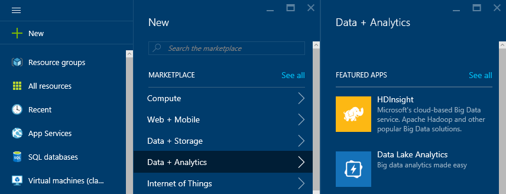
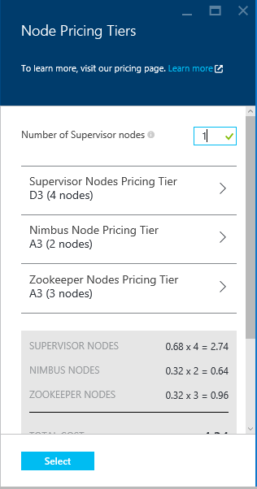
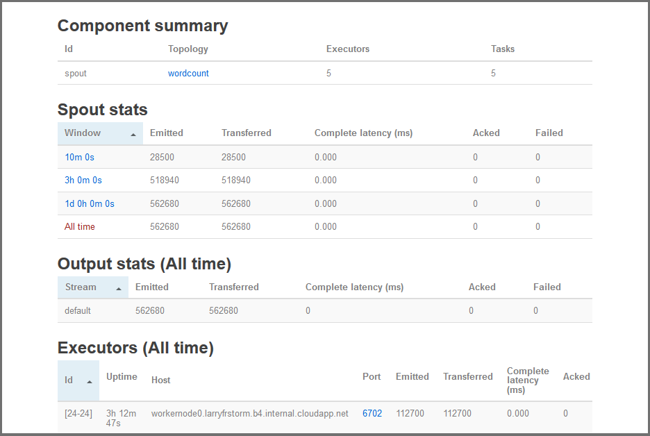

<properties
    pageTitle="Tutorial de tormenta Apache: Introducción a tormenta | Microsoft Azure"
    description="Introducción a análisis de datos grande con Apache tormenta y los ejemplos de tormenta Starter en HDInsight. Obtenga información sobre cómo usar tormenta para procesar datos en tiempo real."
    keywords="tormenta Apache, tutorial de tormenta apache, análisis de datos grande, starter tormenta"
    services="hdinsight"
    documentationCenter=""
    authors="Blackmist"
    manager="jhubbard"
    editor="cgronlun"
    tags="azure-portal"/>

<tags
   ms.service="hdinsight"
   ms.devlang="java"
   ms.topic="article"
   ms.tgt_pltfrm="na"
   ms.workload="big-data"
   ms.date="09/07/2016"
   ms.author="larryfr"/>

# Tutorial de tormenta Apache: empezar a trabajar con los ejemplos de tormenta Starter para análisis de datos grande en HDInsight

Tormenta Apache es un sistema de cálculo scalable, tolerancia a errores, distribuido y en tiempo real para el procesamiento de secuencias de datos. Con tormenta en Microsoft Azure HDInsight, puede crear un clúster de tormenta basada en nube que realiza el análisis de datos grande en tiempo real. 

> [AZURE.NOTE] Los pasos de este artículo, crean un clúster de HDInsight basado en Windows. Para que conocer los pasos crear una tormenta de Linux en clúster HDInsight, consulte [tutorial tormenta Apache: Introducción a la muestra de tormenta Starter con el análisis de datos en HDInsight](hdinsight-apache-storm-tutorial-get-started-linux.md)

## Requisitos previos

[AZURE.INCLUDE [delete-cluster-warning](../../includes/hdinsight-delete-cluster-warning.md)]

Debe tener las siguientes acciones para finalizar este tutorial Apache tormenta correctamente:

- **Suscripción de un Azure**. Vea la [versión de prueba gratuita de Azure obtener](https://azure.microsoft.com/documentation/videos/get-azure-free-trial-for-testing-hadoop-in-hdinsight/).

### Requisitos de control de acceso

[AZURE.INCLUDE [access-control](../../includes/hdinsight-access-control-requirements.md)]

## Crear un clúster de tormenta

Tormenta en HDInsight utiliza almacenamiento de blobs de Windows Azure para almacenar archivos de registro y topologías enviadas al clúster. Siga los pasos siguientes para crear una cuenta de almacenamiento de Azure para su uso con el clúster:

1. Inicie sesión en el [Portal de Azure][preview-portal].

2. Seleccione **nuevo**, seleccione __El análisis de datos__y, a continuación, seleccione __HDInsight__.

    

3. Escriba un __nombre de clúster__. Si está disponible, aparece una marca de verificación verde junto al __Nombre de clúster__ .

4. Si tiene más de una suscripción, seleccione la entrada de __suscripción__ para seleccionar la suscripción de Azure que se utilizará para el clúster.

5.  Use __Seleccionar tipo de clúster__ para seleccionar un clúster de __tormenta__ . Para el __sistema operativo__, seleccione Windows. __Nivel de clúster__, seleccione estándar. Por último, utilice el botón Seleccionar para guardar la configuración.

    

5. Para el __Grupo de recursos__, puede utilizar la lista desplegable para ver una lista de grupos de recursos existentes y, a continuación, seleccione una para crear el clúster de. O bien, puede seleccionar __nuevo__ y, a continuación, escriba el nombre del nuevo grupo de recursos. Aparece una marca de verificación verde para indicar si está disponible el nuevo nombre de grupo.

6. Seleccione __las credenciales__y, a continuación, escriba un __Nombre de usuario de inicio de sesión de clúster__ y una __Contraseña de inicio de sesión de clúster__. Use por último, __Seleccione__ establecer las credenciales. Escritorio remoto no se utilizará en este documento, por lo que puede dejarlo deshabilitado.

    

6. Para el __Origen de datos__, puede seleccionar la entrada para elegir un origen de datos existente o cree uno nuevo.

    

    Actualmente puede seleccionar una cuenta de almacenamiento de Azure como origen de datos para un clúster de HDInsight. Utilice las siguientes acciones para comprender las entradas en el módulo de __Origen de datos__ .

    - __Método de selección__: establezca este valor en el cuadro __de todas las suscripciones__ para habilitar la exploración de cuentas de almacenamiento en las suscripciones. Si desea escribir el __Nombre de almacenamiento__ y una __Tecla de acceso__ de una cuenta existente de almacenamiento, establezca en __Access__ .

    - __Crear nuevo__: Utilice esta opción para crear una nueva cuenta de almacenamiento. Utilice el campo que aparece para especificar el nombre de la cuenta de almacenamiento. Una marca de verificación verde aparece si el nombre está disponible.

    - __Elija predeterminado contenedor__: Use esta opción para escribir el nombre del contenedor predeterminado que se utilizará para el clúster. Aunque puede escribir cualquier nombre aquí, recomendamos con el mismo nombre que el clúster de modo que pueda reconocer fácilmente que se utiliza el contenedor para este clúster específico.

    - __Ubicación__: está en la región geográfica que será la cuenta de almacenamiento o se creará en.

        > [AZURE.IMPORTANT] Seleccionar la ubicación de origen de datos predeterminado, también establece la ubicación del clúster HDInsight. El origen de datos predeterminada y clúster debe estar ubicado en la misma región.

    - __Seleccionar__: Use esta opción para guardar la configuración de origen de datos.

7. Seleccione __Niveles de precios de nodo__ para mostrar información sobre los nodos que se crearán para este clúster. De forma predeterminada, el número de nodos de trabajo se establece en __4__. Establecer en __1__, ya que es suficiente para este tutorial y reduce el costo del clúster. El costo estimado del clúster se muestra en la parte inferior de este módulo.

    

    Utilice __Seleccionar__ para guardar la información de __Niveles de precios de nodo__ .

8. Seleccione __Configuración opcional__. Este módulo le permite seleccionar la versión de clúster, así como configurar otras opciones opcionales como unirse a una __Red Virtual__.

    

9. Asegúrese de que está seleccionada la opción __Anclar al Startboard__ y haga clic en __crear__. Esto crea el clúster y agrega un mosaico a la Startboard de su portal de Azure. El icono indica que el aprovisionamiento de clúster y cambia para mostrar el icono de HDInsight el aprovisionamiento de una vez se ha completado.

  	| Durante el aprovisionamiento | Aprovisionamiento completa |
  	| ------------------ | --------------------- |
  	|  |  |

    > [AZURE.NOTE] Tarda algún tiempo para que el clúster creado, normalmente unos 15 minutos. Use el mosaico de la Startboard o la entrada de __notificaciones__ de la izquierda de la página para comprobar el proceso de aprovisionamiento.

## Ejecutar un ejemplo de tormenta Starter en HDInsight

Este tutorial Apache tormenta presenta el análisis de datos grande con los ejemplos de tormenta Starter en GitHub.

Cada tormenta en clúster de HDInsight incluye el panel de tormenta, que puede utilizarse para cargar y ejecutar topologías tormenta en el clúster. Cada clúster también incluye topologías de ejemplo que se pueden ejecutar directamente desde el panel de tormenta.

### Conectarse a los paneles

Se encuentra en el panel **https://&lt;nombreDeClúster >.azurehdinsight.net//**, donde **nombreDeClúster** es el nombre del clúster. También puede encontrar un vínculo a panel seleccionando el clúster desde el Startboard y seleccione el vínculo del __escritorio__ en la parte superior de la hoja.

> [AZURE.NOTE] Al conectarse a los paneles, el sistema se lo solicita especificar un nombre de usuario y contraseña. Este es el nombre de administrador (**Administrador**) y contraseña que utilizó cuando creó el clúster.

Una vez que haya cargado el panel de tormenta, verá el formulario de **Topología de envío** .

El formulario de **Topología enviar** puede usarse para cargar y ejecutar archivos .jar que contienen topologías tormenta. También incluye varios ejemplos básicos que se proporcionan con el clúster.

### Ejecutar el recuento de palabras desde el proyecto de inicio de tormenta en GitHub

Los ejemplos con el clúster incluyen varias variaciones de una topología de recuento en word. Estos ejemplos incluyen un **chorros** que emite aleatoriamente oraciones y **pernos** que dividir una frase en palabras individuales, a continuación, cuente cuántas veces se ha producido cada palabra. Estos ejemplos son de las [muestras de tormenta Starter](https://github.com/apache/storm/tree/master/examples/storm-starter), que forman parte de tormenta Apache.

Realice los pasos siguientes para ejecutar un ejemplo de tormenta Starter:

1. Seleccione **StormStarter - WordCount** desde el menú desplegable de **Archivo Jar** . Se rellenará los campos **Nombre de la clase** y **Parámetros adicionales** con los parámetros de este ejemplo.

    

    * **Nombre de la clase** : la clase en el archivo .jar que envía la topología.
    * **Parámetros adicionales** : los parámetros requeridos por la topología. En este ejemplo, el campo se usa para proporcionar un nombre descriptivo para la topología de enviados.

2. Haga clic en **Enviar**. Después de un momento, el campo de **resultado** muestra el comando utilizado para enviar el trabajo, así como los resultados del comando. El campo **Error** muestra los errores que se producen en enviar la topología.

    

    > [AZURE.NOTE] Los resultados no indican que ha terminado la topología - **una topología de tormenta, una vez iniciada, se ejecutará hasta que se detiene it.** La topología de recuento de palabras genera oraciones aleatorios y mantiene un recuento de las veces que se encuentra cada palabra, hasta que se detenga.

### Supervisar la topología

La interfaz de usuario de tormenta puede utilizarse para supervisar la topología.

1. Seleccione **La interfaz de usuario de tormenta** desde la parte superior del panel de tormenta. Muestra información de resumen para el clúster y todas las topologías de ejecución.

    

    Desde la página anterior, puede ver la hora en que se activó la topología, así como el número de trabajadores, elementos de ejecución y las tareas que se usa.

    > [AZURE.NOTE] La columna **nombre** contiene el nombre descriptivo proporcionado anteriormente a través del campo **Parámetros adicionales** .

4. En **la topología de resumen**, seleccione la entrada de **wordcount** en la columna **nombre** . Muestra más información acerca de la topología.

    

    Esta página proporciona la información siguiente:

    * **Estadísticas de topología** : información básica sobre el rendimiento de topología, organizadas por las ventanas de tiempo.

        > [AZURE.NOTE] Selección de una ventana de tiempo específico cambia la ventana de tiempo para la información que aparece en otras secciones de la página.

    * **Spouts** - información básica sobre spouts, incluido el último error devuelto por cada pitorro.

    * **Pernos** - información básica sobre pernos.

    * **Configuración de la topología** : información detallada sobre la configuración de la topología.

    Esta página también proporciona acciones que pueden realizar en la topología:

    * **Activar** - procesamiento de currículos de topología desactivada.

    * **Desactivar** - pausa una topología de ejecución.

    * **Equilibrar** - ajusta el paralelismo de la topología. Debe equilibrar topologías ejecución después de haber cambiado el número de nodos en el clúster. Esto permite la topología para ajustar paralelismo a compensa la del número mayor o menor de nodos en el clúster. Para obtener más información, vea [comprender el paralelismo de una topología de tormenta](http://storm.apache.org/documentation/Understanding-the-parallelism-of-a-Storm-topology.html).

    * **Eliminar** - termina una topología de tormenta tras el tiempo de espera.

5. Desde esta página, seleccione una entrada de la sección **Spouts** o **pernos** . Se muestra información sobre el componente seleccionado.

    

    Esta página muestra la siguiente información:

    * **Estadísticas de pitorro/rayo** - información básica sobre el rendimiento de componente, organizadas por las ventanas de tiempo.

        > [AZURE.NOTE] Selección de una ventana de tiempo específico cambia la ventana de tiempo para la información que aparece en otras secciones de la página.

    * **Estadísticas de entrada** (solo pernos) - información sobre componentes que producen datos consumidos por el rayo.

    * **Estadísticas de resultados** : información sobre datos emitidos por este rayo.

    * **Elementos de ejecución** - información sobre las instancias de este componente.

    * **Errores** - errores producidos por este componente.

5. Al ver los detalles de un pitorro o los pernos, seleccione una entrada de la columna de **puerto** en la sección **elementos de ejecución** ver detalles de una instancia específica del componente.

        2015-01-27 14:18:02 b.s.d.task [INFO] Emitting: split default ["with"]
        2015-01-27 14:18:02 b.s.d.task [INFO] Emitting: split default ["nature"]
        2015-01-27 14:18:02 b.s.d.executor [INFO] Processing received message source: split:21, stream: default, id: {}, [snow]
        2015-01-27 14:18:02 b.s.d.task [INFO] Emitting: count default [snow, 747293]
        2015-01-27 14:18:02 b.s.d.executor [INFO] Processing received message source: split:21, stream: default, id: {}, [white]
        2015-01-27 14:18:02 b.s.d.task [INFO] Emitting: count default [white, 747293]
        2015-01-27 14:18:02 b.s.d.executor [INFO] Processing received message source: split:21, stream: default, id: {}, [seven]
        2015-01-27 14:18:02 b.s.d.task [INFO] Emitting: count default [seven, 1493957]

    De este tipo de datos, puede ver que la palabra de **siete** se ha producido 1,493,957 veces. Que es cuántas veces se ha encontrado desde que se inició esta topología.

### Detener la topología

Vuelva a la página de **Resumen de la topología** de la topología de recuento de palabras y, a continuación, seleccione **Eliminar** de la sección **acciones de topología** . Cuando se le pida, escriba 10 para los segundos de espera antes de detener la topología. Después del período de tiempo de espera, la topología ya no aparece al visitar la sección de la **Interfaz de usuario de tormenta** del panel.

##Eliminar el clúster

[AZURE.INCLUDE [delete-cluster-warning](../../includes/hdinsight-delete-cluster-warning.md)]

## Resumen

En este tutorial Apache tormenta, se utiliza el Starter tormenta para aprender a crear una tormenta en clúster HDInsight y usar el panel de tormenta implementar, supervisar y administrar topologías de tormenta.

## Pasos siguientes

* **HDInsight Tools para Visual Studio** - HDInsight herramientas le permite usar Visual Studio para enviar, supervisar y administrar topologías tormenta similares a los paneles de tormenta mencionó anteriormente. HDInsight herramientas también proporciona la capacidad para crear topologías de tormenta C# e incluye topologías de ejemplo que se pueden implementar y ejecutar en el clúster.

    Para obtener más información, vea [empezar a trabajar con las herramientas de HDInsight para Visual Studio](hdinsight-hadoop-visual-studio-tools-get-started.md).

* **Archivos de ejemplo** - clúster la tormenta HDInsight proporciona varios ejemplos en el directorio **%STORM_HOME%\contrib** . Cada ejemplo debe contener lo siguiente:

    * El código de origen, por ejemplo, tormenta starter 0.9.1.2.1.5.0 2057 sources.jar

    * Documentos de Java: por ejemplo, tormenta starter 0.9.1.2.1.5.0 2057 javadoc.jar

    * El ejemplo - por ejemplo, storm-starter-0.9.1.2.1.5.0-2057-jar-with-dependencies.jar

    Use el comando 'jar' para extraer el código fuente o los documentos de Java. Por ejemplo, ' tormenta de jar - xvf-starter-0.9.1.2.1.5.0.2057-javadoc.jar'.

    > [AZURE.NOTE] Documentos de Java constan de las páginas Web. Una vez extraídos, utilice un explorador para ver el archivo **index.html** .

    Para obtener acceso a estos ejemplos, debe habilitar Escritorio remoto para la tormenta en clúster HDInsight y, a continuación, copie los archivos de **%STORM_HOME%\contrib**.

* El siguiente documento contiene una lista de otros ejemplos en los que se pueden usar con tormenta en HDInsight:

    * [Topologías de ejemplo para tormenta en HDInsight](hdinsight-storm-example-topology.md)

[apachestorm]: https://storm.incubator.apache.org
[stormdocs]: http://storm.incubator.apache.org/documentation/Documentation.html
[stormstarter]: https://github.com/apache/storm/tree/master/examples/storm-starter
[stormjavadocs]: https://storm.incubator.apache.org/apidocs/
[azureportal]: https://manage.windowsazure.com/
[hdinsight-provision]: hdinsight-provision-clusters.md
[preview-portal]: https://portal.azure.com/
