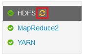
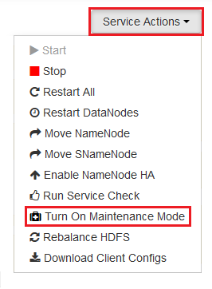

<properties
    pageTitle="Activar montón volcados Hadoop los servicios de HDInsight | Microsoft Azure"
    description="Activar montón volcados para servicios de Hadoop desde HDInsight basados en Linux clústeres para depuración y análisis."
    services="hdinsight"
    documentationCenter=""
    authors="Blackmist"
    manager="jhubbard"
    editor="cgronlun"
    tags="azure-portal"/>

<tags
    ms.service="hdinsight"
    ms.workload="big-data"
    ms.tgt_pltfrm="na"
    ms.devlang="na"
    ms.topic="article"
    ms.date="09/27/2016"
    ms.author="larryfr"/>

#Activar montón volcados Hadoop los servicios de HDInsight basados en Linux (vista preliminar)

[AZURE.INCLUDE [heapdump-selector](../../includes/hdinsight-selector-heap-dump.md)]

Volcados del montón contienen una instantánea de memoria de la aplicación, incluidos los valores de variables en el momento en que se creó la descarga. Por lo que son muy útiles para diagnosticar los problemas que se producen en tiempo de ejecución.

> [AZURE.NOTE] La información en este artículo se aplica solo a HDInsight de Linux. Para obtener información sobre HDInsight de Windows, vea [Activar montón volcados Hadoop los servicios de HDInsight de Windows](hdinsight-hadoop-collect-debug-heap-dumps.md)

## Servicios

Puede activar montón volcados para los siguientes servicios:

*  **hcatalog** - tempelton
*  **sección** - hiveserver2, metastore, derbyserver
*  **mapreduce** - jobhistoryserver
*  **hilo** - resourcemanager, nodemanager, timelineserver
*  **hdfs** - datanode, secondarynamenode, namenode

También puede activar montón volcados del mapa y reducir procesos se ha ejecutado HDInsight.

## Configuración descripción

Volcados del montón están habilitados pasando opciones (a veces se conoce como opte, o parámetros) a JVM cuando se inicia un servicio. La mayoría de los servicios de Hadoop, esto puede hacerse mediante la modificación de la secuencia de comandos de shell que utiliza para iniciar el servicio.

En cada secuencia de comandos, hay una exportación para ** \* \_OPTS**, que contiene las opciones que se pasa a la JVM. Por ejemplo, en la secuencia de comandos **env.sh hadoop** , la línea que comienza con `export HADOOP_NAMENODE_OPTS=` contiene las opciones para el servicio NameNode.

Asignar y reducir procesos son ligeramente diferentes, como se trata de un proceso secundario del servicio MapReduce. Cada mapa o reducir el proceso se ejecuta en un contenedor secundario y, a continuación, hay dos entradas que contienen las opciones de JVM para estos. Ambos incluyen en **site.xml mapred**:

* **MapReduce.Admin.Map.Child.java.OPTS**
* **MapReduce.Admin.reduce.Child.java.OPTS**

> [AZURE.NOTE] Se recomienda utilizar Ambari para modificar los scripts y la configuración de site.xml mapred, como Ambari controlará replicar los cambios en todos los nodos en el clúster. Vea la sección [Uso Ambari](#using-ambari) pasos específicos.

###Activar montón volcados

La siguiente opción habilita montón volcados cuando se produce un OutOfMemoryError:

    -XX:+HeapDumpOnOutOfMemoryError

La **+** indica que esta opción está activada. El valor predeterminado está deshabilitado.

> [AZURE.WARNING] Volcados del montón no están habilitados para los servicios de Hadoop en HDInsight de forma predeterminada, como la descarga de archivos puede ser grande. Si se habilita para solucionar este problema, no olvide desactivarlos después de reproducir el problema y recopilan los archivos de descarga.

###Ubicación de descarga

La ubicación predeterminada para el archivo de descarga es el directorio de trabajo actual. Puede controlar dónde está almacenado el archivo con la siguiente opción:

    -XX:HeapDumpPath=/path

Por ejemplo, mediante `-XX:HeapDumpPath=/tmp` hará que los volcados almacenarse en el directorio/tmp.

###Secuencias de comandos

También puede activar una secuencia de comandos cuando se produzca un **OutOfMemoryError** . Por ejemplo, desencadenar una notificación para que sepa que se ha producido el error. Esto se controla con la opción siguiente:

    -XX:OnOutOfMemoryError=/path/to/script

> [AZURE.NOTE] Puesto que Hadoop es un sistema distribuido, debe colocarse cualquier secuencia de comandos que se utiliza en todos los nodos en el clúster que se ejecuta el servicio en.
>
> La secuencia de comandos también debe estar en una ubicación que sea accesible para la cuenta del servicio se ejecuta como y debe proporcionar ejecutar permisos. Por ejemplo, que desea almacenar secuencias de comandos en `/usr/local/bin` y usar `chmod go+rx /usr/local/bin/filename.sh` concesión de lectura y permisos de ejecución.

##Usar Ambari

Para modificar la configuración de un servicio, siga estos pasos:

1. Abra la interfaz de usuario de web Ambari para el clúster. La dirección URL será https://YOURCLUSTERNAME.azurehdinsight.net.

    Cuando se le solicite, autenticarse en el sitio con el nombre de cuenta HTTP (predeterminado: administrador,) y la contraseña para el clúster.

    > [AZURE.NOTE] Le pedirá una segunda vez por Ambari el nombre de usuario y contraseña. Si es así, simplemente vuelva a escribir el mismo nombre de cuenta y la contraseña

2. En la lista de la izquierda, seleccione el área de servicio que desea modificar. Por ejemplo, **HDFS**. En el área central, seleccione la ficha de **configuraciones** .

    

3. Mediante la entrada **de filtro...** , escriba **opte**. Esto, filtrará la lista de elementos de configuración a sólo aquellos que contengan este texto y es una forma rápida de buscar la secuencia de comandos de shell o la **plantilla** que se pueden usar para configurar estas opciones.

    

4. Buscar la ** \* \_OPTS** entrada para el servicio que desea activar montón volcados para y agregue las opciones que desee habilitar. En la siguiente imagen, he agregado `-XX:+HeapDumpOnOutOfMemoryError -XX:HeapDumpPath=/tmp/` a la **HADOOP\_NAMENODE\_OPTS** entrada:

    

    > [AZURE.NOTE] Cuando al activar montón vuelca del mapa o reducir el proceso secundario, verá en su lugar para los campos etiquetadas **mapreduce.admin.map.child.java.opts** y **mapreduce.admin.reduce.child.java.opts**.

    Utilice el botón **Guardar** para guardar los cambios. Podrá escribir una nota breve que describe los cambios.

5. Una vez que los cambios se han aplicado, el icono **requiere reiniciar** aparecerá junto a uno o más servicios.

    

6. Seleccione cada servicio que debe reiniciar el equipo y usar el botón **Acciones de servicio** para **En modo de mantenimiento**. Impide que las alertas que se genera desde este servicio cuando lo reinicie.

    

7. Una vez ha habilitado el modo de mantenimiento, utilice el botón **reiniciar** al servicio **reiniciar** efectúe a todos

    

    > [AZURE.NOTE] las entradas para el botón **reiniciar** pueden ser diferentes para otros servicios.

8. Una vez se han reiniciar los servicios, utilice el botón **Acciones de servicio** para **Activar modo de mantenimiento**. Este Ambari para reanudar la supervisión de alertas para el servicio.
