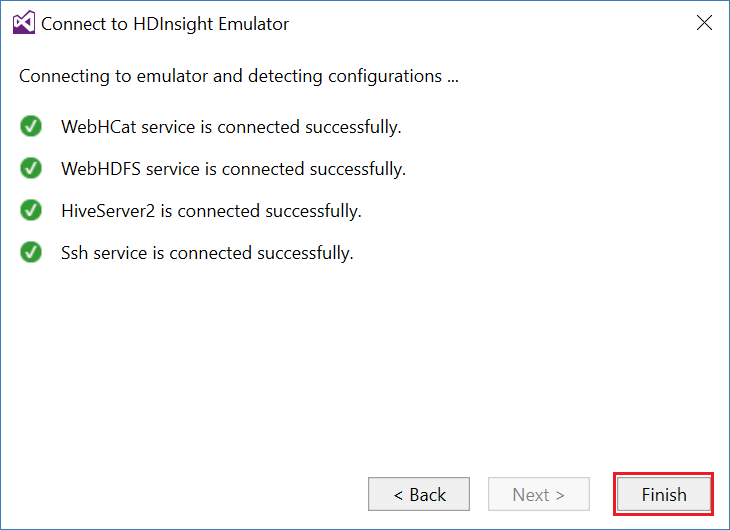
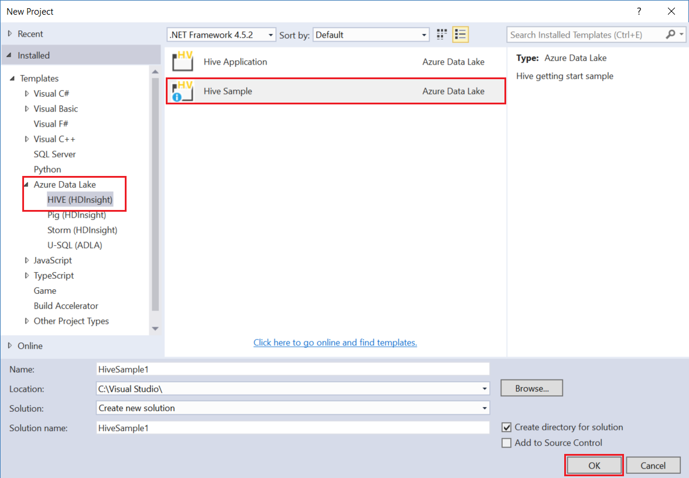
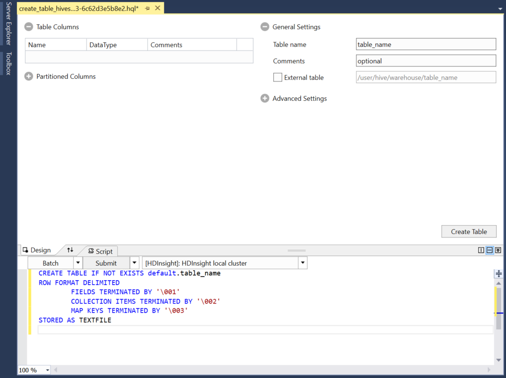

<properties
pageTitle="Use las herramientas de Microsoft Azure datos lago para Visual Studio con recinto de seguridad de Hortonworks | Microsoft Azure"
description="Obtenga información sobre cómo usar las herramientas de lago de datos de Azure para VIsual Studio con el espacio aislado Hortonworks (que se ejecuta en una máquina virtual local.) Con estas herramientas, puede crear y ejecutar trabajos de sección y cerdo en la salida de trabajo de espacio aislado y la vista e historial."
services="hdinsight"
documentationCenter=""
authors="Blackmist"
manager="paulettm"
editor="cgronlun"/>

<tags
ms.service="hdinsight"
ms.devlang="na"
ms.topic="article"
ms.tgt_pltfrm="na"
ms.workload="big-data"
ms.date="08/26/2016"
ms.author="larryfr"/>

# Use las herramientas de lago de datos de Azure para Visual Studio con recinto de seguridad de Hortonworks

Las herramientas de lago de datos de Azure para Visual Studio incluyen herramientas para trabajar con genéricos clústeres Hadoop, además de las herramientas para trabajar con lago de datos de Azure y HDInsight. Este documento proporciona los pasos necesarios para usar las herramientas de lago de datos de Azure con recinto de seguridad de Hortonworks en una máquina virtual local.

Usar el espacio aislado Hortonworks le permite trabajar con Hadoop localmente en su entorno de desarrollo. Una vez que ha desarrollado una solución y desea distribuir a escala, a continuación, puede mover a un clúster de HDInsight.

## Requisitos previos

* Recinto de Hortonworks que se ejecuta en una máquina virtual en su entorno de desarrollo. Este documento se ha escrito y probado con el espacio aislado que se ejecuta en Oracle VirtualBox, que se ha configurado con la información en el documento de [Introducción en el ecosistema Hadoop](hdinsight-hadoop-emulator-get-started.md) .

* Visual Studio 2013 o cualquier edición de 2015.

* El [SDK de Azure para .NET](https://azure.microsoft.com/downloads/) 2.7.1 o superior

* [Datos de Azure lago Tools para Visual Studio](https://www.microsoft.com/download/details.aspx?id=49504)

## Configurar las contraseñas para el espacio aislado

Asegúrese de que se está ejecutando el espacio aislado Hortonworks, a continuación, siga los pasos de la [Introducción del ecosistema Hadoop](hdinsight-hadoop-emulator-get-started.md#set-passwords) para configurar la contraseña para la SSH `root` cuenta y el Ambari `admin` cuenta. Estas contraseñas se usará al conectarse al recinto de seguridad de Visual Studio.

## Conectar las herramientas para el espacio aislado

1. Abra Visual Studio y seleccione __la vista__y, a continuación, __Explorador de servidores__.

2. Desde el __Explorador de servidores__, haga clic con el botón secundario del mouse en la entrada de __HDInsight__ y, a continuación, seleccione __Conectar con HDInsight emulador__.

    

3. Desde el cuadro de diálogo __conectarse a HDInsight emulador__ , escriba la contraseña que ha configurado para Ambari.

    

    Seleccione __siguiente__ para continuar.

4. Utilizar el campo de __contraseña__ escriba la contraseña que ha configurado para la `root` cuenta. Deje el resto de los campos en el valor predeterminado.

    

    Seleccione __siguiente__ para continuar.

5. Espere a que la validación de los servicios para completar. En algunos casos, validación puede producir errores y se le pida que actualice la configuración. Cuando ocurre esto, seleccione el botón __Actualizar__ y espere a que la configuración y la comprobación del servicio completar.

    

    > [AZURE.NOTE] El proceso de actualización usa Ambari para modificar la configuración de espacio aislado Hortonworks a lo esperado por las herramientas de lago de datos de Azure para Visual Studio.

    Una vez completada la validación, seleccione __Finalizar__ para completar la configuración.

    

    > [AZURE.NOTE] Dependiendo de la velocidad de su entorno de desarrollo y la cantidad de memoria asignada a la máquina virtual, puede tardar varios minutos para configurar y validar los servicios.

Después de seguir estos pasos, tiene ahora una entrada "Clúster local HDInsight" en el Explorador de servidor en la sección HDInsight.

## Escribir una consulta de sección

Sección proporciona un lenguaje de consulta SQL similares (HiveQL), para trabajar con datos estructurados. Realice los pasos siguientes para obtener información sobre cómo ejecutar consultas ad hoc en el clúster local.

1. En el __Explorador de servidores__, haga clic en la entrada para el clúster local que agregó anteriormente y, a continuación, seleccione __escribir una consulta de la sección__.

    

    Se abrirá una nueva ventana de consulta que permite escribir el rápidamente y enviar una consulta en el clúster local.

2. En la nueva ventana de consulta, escriba lo siguiente:

        select count(*) from sample_08;
    
    Desde la parte superior de la ventana de consulta, asegúrese de que la configuración para el clúster local está seleccionado y, a continuación, haga __clic en enviar__. Deje los demás valores (__lote__ y nombre de servidor,) los valores predeterminados.

    

    Tenga en cuenta que también puede usar el menú desplegable junto a __Enviar__ para seleccionar __Avanzadas__. Se abrirá un cuadro de diálogo que le permite proporcionar opciones adicionales al enviar el trabajo.

    

3. Una vez que solicite la consulta, aparecerá el estado del trabajo. Esto proporciona información sobre el trabajo mientras se procesa por Hadoop. La entrada de __Estado de trabajo__ proporciona el estado actual de la tarea. El estado se actualizará periódicamente, o puede usar el icono de actualización para actualizar manualmente el estado.

    

    Una vez que el __Estado del trabajo__ cambia a __terminada__, se muestra un dirigen acíclicos Graph (DAG incluidos). Describe la ruta de ejecución determinado por Tez (el predeterminado motor de ejecución de sección en el clúster local.) 
    
    > [AZURE.NOTE] Tez también es el valor predeterminado cuando utilice clústeres HDInsight basados en Linux. No es el valor predeterminado en HDInsight basado en Windows; se usa, debe agregar la línea `set hive.execution.engine = tez;` hasta el comienzo de la consulta de la sección. 

    Utilice el vínculo de __Salida de trabajo__ para ver el resultado. En este caso, es __823__; el número de filas de la tabla sample_08. Puede ver información de diagnóstico sobre el trabajo mediante los vínculos de __Registro del trabajo__ y __Registro del hilo de descarga__ .

4. También puede ejecutar trabajos de sección de forma interactiva cambiando el campo __lote__ a __interactivo__y, a continuación, seleccione __Ejecutar__. 

    

    Esto transmite el registro de salida generado durante el proceso de la ventana de __Resultados de HiveServer2__ .
    
    > [AZURE.NOTE] Esta es la misma información que está disponible desde el vínculo de __Registro de trabajo__ después de que se complete una tarea.

    

## Crear un proyecto de sección

También puede crear un proyecto que contiene varias secuencias de comandos de la sección. Esto es útil cuando tiene relacionadas secuencias de comandos que necesita para mantener juntos o mantener con sistemas de control de versiones.

1. En Visual Studio, seleccione __archivo__, __nuevo__y then__Project__.

2. En la lista de proyectos, expanda __plantillas__, __Lago de datos de Azure__ y, a continuación, seleccione __SUBÁRBOL (HDInsight)__. En la lista de plantillas, seleccione __Subárbol de ejemplo__. Escriba un nombre y una ubicación y luego haga clic en __Aceptar__.

    

El proyecto de __Ejemplo de la sección__ contiene dos secuencias de comandos __WebLogAnalysis.hql__ y __SensorDataAnalysis.hql__. Puede enviar con el mismo botón __Enviar__ en la parte superior de la ventana.

## Crear un proyecto de cerdo

Mientras subárbol proporciona un lenguaje similar a SQL para trabajar con datos estructurados, cerdo proporciona un idioma (latino de cerdo), que le permite desarrollar una canalización de transformaciones que se aplican a los datos. Realice los pasos siguientes para utilizar cerdo con el clúster local.

1. Abra Visual Studio y seleccione __archivo__, __nuevo__y, a continuación, en __Project__. En la lista de proyectos, expanda __plantillas__, __Lago de datos de Azure__y, a continuación, seleccione __cerdo (HDInsight)__. En la lista de plantillas, seleccione __Aplicación cerdo__. Escriba un nombre, ubicación y, a continuación, seleccione __Aceptar__.

    

2. Escriba lo siguiente como el contenido del archivo __script.pig__ que se creó con este proyecto.

        a = LOAD '/demo/data/Website/Website-Logs' AS (
            log_id:int, 
            ip_address:chararray, 
            date:chararray, 
            time:chararray, 
            landing_page:chararray, 
            source:chararray);
        b = FILTER a BY (log_id > 100);
        c = GROUP b BY ip_address;
        DUMP c;

    Mientras cerdo usa un idioma diferente de sección, cómo ejecutar los trabajos es coherente entre ambos idiomas mediante el botón __Enviar__ . Seleccionar el menú hacia abajo situada junto a __Enviar__ , muestra un cuadro de diálogo Enviar avanzadas para cerdo.

    
    
3. El estado del trabajo y el resultado también es la misma aparece como una consulta de la sección.

    

## Ver tareas

Herramientas de lago datos Azure también permiten a fácilmente ver información acerca de los trabajos que se han ejecutó en Hadoop. Use los siguientes pasos para ver las tareas que se han ejecutaban en el clúster local.

1. Desde el __Explorador de servidores__, haga clic en el clúster local y, a continuación, seleccione __Ver trabajos__. Esta opción mostrará una lista de tareas que se han enviado al clúster.

    

2. En la lista de trabajos, seleccione uno para ver los detalles del trabajo.

    

    La información que aparece es similar a lo que se ve después de ejecutar una consulta cerdo o secciones, completada con vínculos para ver los resultados y registrar información.

3. También puede modificar y vuelva a enviar el trabajo desde aquí.

## Ver las bases de datos de la sección

1. En el __Explorador de servidores__, expanda la entrada __HDInsight de clúster local__ y, a continuación, expanda la __Sección bases de datos__. Esto revelará las bases de datos __predeterminado__ y __xademo__ en el clúster local. Expandir una base de datos muestra las tablas de la base de datos.

    

2. Expandir una tabla muestra las columnas de esa tabla. Puede haga clic en una tabla y seleccione __Vista Top 100 filas__ para ver rápidamente los datos.

    

### Propiedades de base de datos y tabla

Puede que haya observado que puede seleccionar para ver las __Propiedades__ de una tabla o una base de datos. Esto mostrará los detalles del elemento seleccionado en la ventana Propiedades.

### Crear una tabla

Para crear una nueva tabla, haga clic en una base de datos y, a continuación, seleccione __Crear tabla__.

A continuación, puede crear la tabla con un formulario. Puede ver la HiveQL sin formato que se usará para crear la tabla en la parte inferior de esta página.

## Pasos siguientes

* [Los cables de recinto de seguridad de Hortonworks de aprendizaje](http://hortonworks.com/hadoop-tutorial/learning-the-ropes-of-the-hortonworks-sandbox/)
* [Tutorial de Hadoop: Introducción a HDP](http://hortonworks.com/hadoop-tutorial/hello-world-an-introduction-to-hadoop-hcatalog-hive-and-pig/)