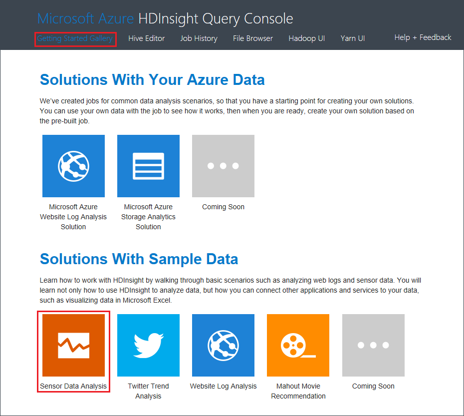

<properties
    pageTitle="Analizar datos de sensor con la sección y Hadoop | Microsoft Azure"
    description="Obtenga información sobre cómo analizar los datos de sensor mediante la consola de consulta subárbol con HDInsight (Hadoop), a continuación, visualizar los datos en Microsoft Excel con PowerView."
    services="hdinsight"
    documentationCenter=""
    authors="Blackmist"
    manager="jhubbard"
    editor="cgronlun"
    tags="azure-portal"/>

<tags
    ms.service="hdinsight"
    ms.workload="big-data"
    ms.tgt_pltfrm="na"
    ms.devlang="na"
    ms.topic="article"
    ms.date="09/20/2016" 
    ms.author="larryfr"/>

#Analizar datos de sensor con la consola de consulta subárbol en Hadoop en HDInsight

Obtenga información sobre cómo analizar los datos de sensor mediante la consola de consulta subárbol con HDInsight (Hadoop), a continuación, visualizar los datos en Microsoft Excel con Power View.

> [AZURE.NOTE] Los pasos de este documento solo funcionan con clústeres HDInsight basado en Windows.

En este ejemplo, deberá usar subárbol para procesar datos históricos creados mediante calefacción, ventilación y sistemas de aire acondicionado para identificar los sistemas que no son capaces de sujeto mantener una temperatura de conjunto. Obtendrá información sobre cómo:

- Crear tablas de SUBÁRBOL para consultar los datos almacenados en archivos de separados por comas (CSV) de valor.
- Crear consultas de SUBÁRBOL para analizar los datos.
- Usar Microsoft Excel para conectarse a HDInsight (mediante la conectividad abierta de base de datos (ODBC) para recuperar los datos analizados.
- Usar Power View para visualizar los datos.

##Requisitos previos

* Un clúster de HDInsight (Hadoop): consulte [clústeres de aprovisionamiento Hadoop en HDInsight](hdinsight-provision-clusters.md) para obtener información sobre la creación de un clúster.

* Microsoft Excel 2013

    > [AZURE.NOTE] Microsoft Excel se usa para la visualización de datos con [Power View](https://support.office.com/Article/Power-View-Explore-visualize-and-present-your-data-98268d31-97e2-42aa-a52b-a68cf460472e?ui=en-US&rs=en-US&ad=US).

* [Controlador ODBC de Microsoft subárbol](http://www.microsoft.com/download/details.aspx?id=40886)

##Para ejecutar el ejemplo

1. Desde el explorador web, vaya a la siguiente URL. Reemplazar `<clustername>` con el nombre de su clúster HDInsight.

        https://<clustername>.azurehdinsight.net

    Cuando se le solicite, autenticar mediante el nombre de usuario administrador y la contraseña que utilizó cuando este clúster de aprovisionamiento.

2. Desde la página web que se abre, haga clic en la pestaña de la **Galería de introducción de introducción** y, a continuación, en la categoría **soluciones con datos de ejemplo** , haga clic en la muestra de **Análisis de datos de Sensor** .

    

3. Siga las instrucciones proporcionadas en la página web para finalizar la muestra.
