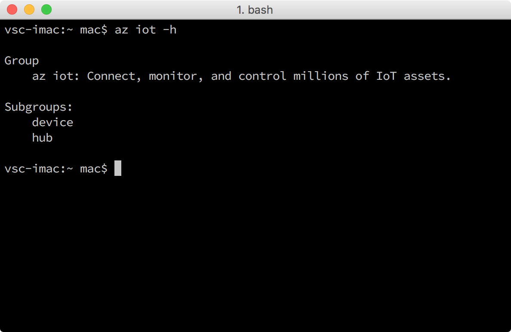

<properties
 pageTitle="Obtener herramientas de Azure (10.10 en Mac OS) | Microsoft Azure"
 description="Instalar Python y Azure de línea de comandos interfaz Azure en Mac OS."
 services="iot-hub"
 documentationCenter=""
 authors="shizn"
 manager="timlt"
 tags=""
 keywords=""/>

<tags
 ms.service="iot-hub"
 ms.devlang="multiple"
 ms.topic="article"
 ms.tgt_pltfrm="na"
 ms.workload="na"
 ms.date="10/21/2016"
 ms.author="xshi"/>

# <a name="21-get-azure-tools-macos-1010"></a>2.1 obtener herramientas de Azure (Mac OS 10.10)

> [AZURE.SELECTOR]
- [Windows 7 +](iot-hub-raspberry-pi-kit-node-lesson2-get-azure-tools-win32.md)
- [Ubuntu 16.04](iot-hub-raspberry-pi-kit-node-lesson2-get-azure-tools-ubuntu.md)
- [Mac OS 10.10](iot-hub-raspberry-pi-kit-node-lesson2-get-azure-tools-mac.md)

## <a name="211-what-you-will-do"></a>2.1.1 lo que debe hacer

Instalar la Azure de línea de comandos interfaz Azure. Si se cumple algún problema, buscar soluciones en la [página de solución de problemas](iot-hub-raspberry-pi-kit-node-troubleshooting.md).

## <a name="212-what-you-will-learn"></a>2.1.2 lo que aprenderá

- Cómo instalar CLI de Azure.
- Cómo agregar el subgrupo IoT de Azure CLI.

## <a name="213-what-you-need"></a>2.1.3 lo que necesita

- Un equipo Mac con conexión a Internet
- Una suscripción activa de Azure. Si no tiene una cuenta, puede crear una [cuenta gratuita](https://azure.microsoft.com/free/) de dos minutos.

## <a name="214-install-python"></a>2.1.4 instalar Python

Aunque Mac OS incluye Python 2.7 fuera del cuadro, se recomienda instalar Python a través de Homebrew. Vea [Instalar Python en Mac OS](http://docs.python-guide.org/en/latest/starting/install/osx/).

Instalar Python y puntos, ejecute el siguiente comando:

```bash
brew install python
```

## <a name="215-install-the-azure-cli"></a>2.1.5 instalar la CLI de Azure

CLI Azure ofrece una experiencia de línea de comandos varias plataformas de Azure, lo que le permite trabajar directamente desde la línea de comandos para aprovisionar y administrar los recursos. 

Para instalar la última CLI de Azure, siga estos pasos:

1. Ejecute los comandos siguientes en una ventana Terminal. Puede tardar cinco minutos en instalar CLI de Azure.

    ```bash
    pip install azure-cli-core==0.1.0b7 azure-cli-vm==0.1.0b7 azure-cli-storage==0.1.0b7 azure-cli-role==0.1.0b7 azure-cli-resource==0.1.0b7 azure-cli-profile==0.1.0b7 azure-cli-network==0.1.0b7 azure-cli-iot==0.1.0b7 azure-cli-feedback==0.1.0b7 azure-cli-configure==0.1.0b7 azure-cli-component==0.1.0b7 azure-cli==0.1.0b7
    ```

2. Comprobar la instalación, ejecute el siguiente comando:

    ```bash
    az iot -h
    ```
  
Si la instalación se realiza correctamente, verá el siguiente resultado.



## <a name="215-summary"></a>2.1.5 resumen de

Ha instalado CLI de Azure. Continúe con la siguiente sección para crear su identidad de Azure IoT concentrador y dispositivo mediante la CLI de Azure.

## <a name="next-steps"></a>Pasos siguientes

[2.2 crear su centro IoT y registrar su frambuesas Pi 3](iot-hub-raspberry-pi-kit-node-lesson2-prepare-azure-iot-hub.md)
