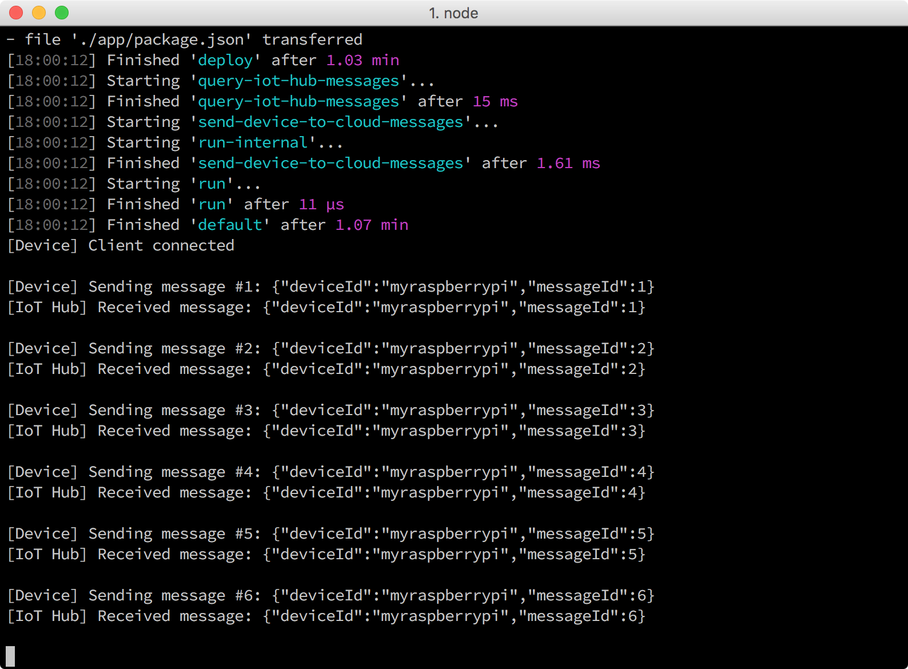

<properties
 pageTitle="Ejecutar la aplicación de ejemplo para enviar mensajes de la nube de dispositivo | Microsoft Azure"
 description="Implementar y ejecutar una aplicación de ejemplo para su frambuesas Pi 3 que envía mensajes a un concentrador IoT y parpadea el LED."
 services="iot-hub"
 documentationCenter=""
 authors="shizn"
 manager="timlt"
 tags=""
 keywords=""/>

<tags
 ms.service="iot-hub"
 ms.devlang="multiple"
 ms.topic="article"
 ms.tgt_pltfrm="na"
 ms.workload="na"
 ms.date="10/21/2016"
 ms.author="xshi"/>

# <a name="32-run-sample-application-to-send-device-to-cloud-messages"></a>3.2 ejecutar la aplicación de ejemplo para enviar mensajes de la nube de dispositivo

## <a name="321-what-you-will-do"></a>3.2.1 lo que debe hacer

Implementar y ejecutar una aplicación de ejemplo en su frambuesas Pi 3 que envía mensajes a su centro IoT. Si se cumple algún problema, buscar soluciones en la [página de solución de problemas](iot-hub-raspberry-pi-kit-node-troubleshooting.md).

## <a name="322-what-you-will-learn"></a>3.2.2 lo que aprenderá

- Cómo usar la herramienta solo golpe para implementar y ejecutar la aplicación de Node.js de ejemplo en el Pi.

## <a name="323-what-you-need"></a>3.2.3 lo que necesita

- Debe haber completado correctamente la sección anterior en esta lección: [crear una aplicación de la función Azure y una cuenta de almacenamiento de Azure para procesar y almacenar mensajes de concentrador IoT](iot-hub-raspberry-pi-kit-node-lesson3-deploy-resource-manager-template.md).

## <a name="324-get-your-iot-hub-and-device-connection-strings"></a>3.2.4 obtener las cadenas de conexión IoT concentrador y dispositivo

La cadena de conexión del dispositivo se usa para conectar el Pi a su centro IoT. Cadena de conexión de concentrador IoT se usa para conectar su centro IoT con la identidad del dispositivo que representa el Pi en el hub de IoT.

- Obtener la cadena de conexión de hub IoT ejecutando el siguiente comando CLI de Azure:

```bash
az iot hub show-connection-string --name {my hub name} --resource-group iot-sample
```

`{my hub name}`es el nombre que especificó en la lección 2. Usar `iot-sample` como el valor de `{resource group name}` si no cambia el valor en la lección 2.

- Obtener la cadena de conexión del dispositivo, ejecute el siguiente comando:

```bash
az iot device show-connection-string --hub {my hub name} --device-id myraspberrypi --resource-group iot-sample
```

`{my hub name}`tiene el mismo valor que utiliza con el comando anterior. Usar `iot-sample` como el valor de `{resource group name}` y usar `myraspberrypi` como el valor de `{device id}` si no cambia el valor en la lección 2.

## <a name="325-configure-the-device-connection"></a>3.2.5 configurar la conexión del dispositivo

1. Inicializar el archivo de configuración, ejecute los comandos siguientes:

    ```bash
    npm install
    gulp init
    ```

2. Abra el archivo de configuración de dispositivo `config-raspberrypi.json` en código de Visual Studio, ejecute el siguiente comando:

    ```bash
    # For Windows command prompt
    code %USERPROFILE%\.iot-hub-getting-started\config-raspberrypi.json
  
    # For macOS or Ubuntu
    code ~/.iot-hub-getting-started/config-raspberrypi.json
    ```

    

3. Realice las siguientes sustituciones en la `config-raspberrypi.json` archivo:

  - Reemplazar **[nombre de host del dispositivo o la dirección IP]** con la dirección IP del dispositivo o nombre de host que obtuvo de `device-discovery-cli` o con el valor heredado de configurado en la lección 1.
  - Reemplazar **[cadena de conexión de dispositivo IoT]** con la `device connection string` que se obtienen.
  - Reemplazar **[cadena de conexión de hub IoT]** con la `iot hub connection string` que se obtienen.

Actualizar la `config-raspberrypi.json` de archivo para que pueda implementar la aplicación de ejemplo de su equipo.

## <a name="326-deploy-and-run-the-sample-application"></a>3.2.6 implementar y ejecute la aplicación de ejemplo

Implementar y ejecutar la aplicación de ejemplo en el Pi, ejecute el siguiente comando:

```bash
gulp
```

> [AZURE.NOTE] Se ejecuta la tarea de forma predeterminada solo golpe `install-tools`, `deploy`, y `run` tareas de forma secuencial. En la [lección 1](iot-hub-raspberry-pi-kit-node-lesson1-deploy-blink-app.md), ejecutó consecutiva por separado estas tareas.

## <a name="327-verify-the-sample-application-works"></a>3.2.7 comprobar la aplicación de ejemplo funciona

Verá el LED que está conectado a su Pi parpadeando cada dos segundos. Cada vez que el LED parpadea, la aplicación de ejemplo envía un mensaje a su centro IoT y comprueba que el mensaje se ha enviado correctamente a su centro IoT. Además, para cada mensaje recibido por el concentrador IoT, se imprime el mensaje en la ventana de consola. La aplicación de ejemplo termina automáticamente después de enviar mensajes de 20.



## <a name="328-summary"></a>3.2.8 resumen de

Ha implementado y ejecute la aplicación de ejemplo intermitente nueva en su Pi para enviar mensajes de dispositivo a la nube a su centro IoT. Puede mover a la siguiente sección para supervisar los mensajes que se escriben en la cuenta de almacenamiento de Azure.

## <a name="next-steps"></a>Pasos siguientes

[3.3 mensajes leídos se conservan en el almacenamiento de Azure](iot-hub-raspberry-pi-kit-node-lesson3-read-table-storage.md)