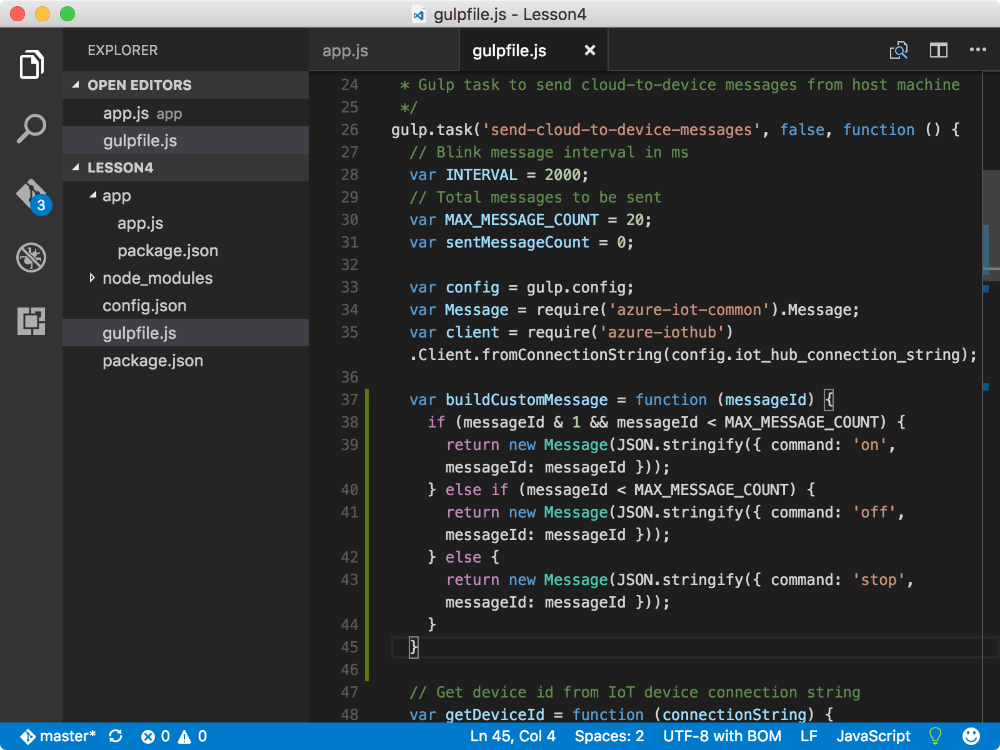

<properties
 pageTitle="Opcional de sección: cambiar el activado y desactivado el comportamiento de LED | Microsoft Azure"
 description="Personalizar los mensajes para cambiar el LED activar y desactivar el comportamiento."
 services="iot-hub"
 documentationCenter=""
 authors="shizn"
 manager="timlt"
 tags=""
 keywords=""/>

<tags
 ms.service="iot-hub"
 ms.devlang="multiple"
 ms.topic="article"
 ms.tgt_pltfrm="na"
 ms.workload="na"
 ms.date="10/21/2016"
 ms.author="xshi"/>

# <a name="42-optional-section-change-the-on-and-off-behavior-of-the-led"></a>4.2 sección opcional: cambiar el activado y desactivado el comportamiento de LED

## <a name="421-what-you-will-do"></a>4.2.1 lo que debe hacer

Personalizar los mensajes para cambiar el LED activar y desactivar el comportamiento. Si se cumple algún problema, buscar soluciones en la [página de solución de problemas](iot-hub-raspberry-pi-kit-node-troubleshooting.md).

## <a name="422-what-you-will-learn"></a>4.2.2 lo que aprenderá

Usar funciones de Node.js adicionales para cambiar el LED activar y desactivar el comportamiento.

## <a name="423-what-you-need"></a>4.2.3 lo que necesita

Debe finalizó correctamente [4.1 ejecutar una aplicación de ejemplo en el Pi frambuesas recibir nube a los mensajes del dispositivo](iot-hub-raspberry-pi-kit-node-lesson4-send-cloud-to-device-messages.md).

## <a name="424-add-nodejs-functions"></a>4.2.4 agregar funciones Node.js

1. Abra la aplicación de ejemplo en el código de Visual Studio, ejecute los comandos siguientes:

    ```bash
    cd Lesson4
    code .
    ```

2. Abrir la `app.js` de archivo y, a continuación, agregue las siguientes funciones al final:

    ```javascript
    function turnOnLED() {
      wpi.digitalWrite(CONFIG_PIN, 1);
    }

    function turnOffLED() {
      wpi.digitalWrite(CONFIG_PIN, 0);
    }
    ```

    

3. Agregue las siguientes condiciones antes de la predeterminada en el bloque de caso de cambio de la `receiveMessageCallback` función:

    ```javascript
    case 'on':
      turnOnLED();
      break;
    case 'off':
      turnOffLED();
      break;
    ```

    Ahora ha configurado la aplicación de ejemplo para responder a las instrucciones más a través de mensajes. La instrucción "en" activa el LED y la instrucción "off" desactiva el LED.

4. Abra el archivo gulpfile.js y, a continuación, agregue una nueva función antes de la función `sendMessage`:

    ```javascript
    var buildCustomMessage = function (messageId) {
      if ((messageId & 1) && (messageId < MAX_MESSAGE_COUNT)) {
        return new Message(JSON.stringify({ command: 'on', messageId: messageId }));
      } else if (messageId < MAX_MESSAGE_COUNT) {
        return new Message(JSON.stringify({ command: 'off', messageId: messageId }));
      } else {
        return new Message(JSON.stringify({ command: 'stop', messageId: messageId }));
      }
    }
    ```

    

5. En la `sendMessage` función, reemplace la línea `var message = buildMessage(sentMessageCount);` con la nueva línea se muestra en el fragmento de código siguiente:

    ```javascript
    var message = buildCustomMessage(sentMessageCount);
    ```

6. Guardar todos los cambios.

### <a name="425-deploy-and-run-the-sample-application"></a>4.2.5 implementar y ejecute la aplicación de ejemplo

Implementar y ejecutar la aplicación de ejemplo en el Pi, ejecute el siguiente comando:

```bash
gulp
```

Verá el LED activado para dos segundos y, a continuación, desactiva otro dos segundos. El último mensaje de "stop" detiene la ejecución de la aplicación de ejemplo.


¡Felicidades! Los mensajes que se envían a la Pi desde su centro IoT personalizó correctamente.

### <a name="427-summary"></a>4.2.7 resumen de

Esta sección opcional demostraciones cómo personalizar los mensajes para que la aplicación de ejemplo puede controlar el activado y desactivado el comportamiento de LED de manera diferente.

