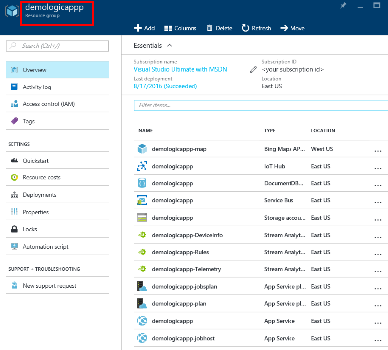
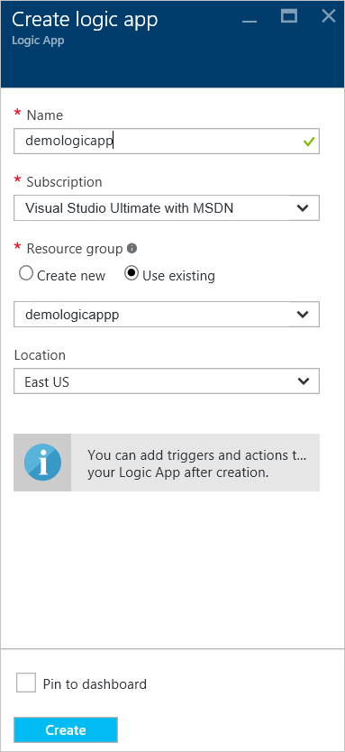

<properties
  pageTitle="Conjunto de aplicaciones de Azure IoT y aplicaciones de lógica | Microsoft Azure"
  description="Obtener un tutorial acerca de cómo conectar aplicaciones lógica al conjunto de aplicaciones de Azure IoT para los procesos empresariales."
  services=""
  suite="iot-suite"
  documentationCenter=""
  authors="aguilaaj"
  manager="timlt"
  editor=""/>

<tags
  ms.service="iot-suite"
  ms.devlang="na"
  ms.topic="article"
  ms.tgt_pltfrm="na"
  ms.workload="na"
  ms.date="08/16/2016"
  ms.author="araguila"/>
  
# <a name="tutorial-connect-logic-app-to-your-azure-iot-suite-remote-monitoring-preconfigured-solution"></a>Tutorial: Conectar lógica de aplicación a su solución de Azure IoT Suite la supervisión remota preconfigurados

El [Conjunto de programas de Microsoft Azure IoT] [ lnk-internetofthings] supervisión solución preconfigurada remota es una excelente manera comenzar rápidamente con un conjunto de características de llevar a cabo que ejemplifica una solución IoT. Este tutorial describe cómo agregar lógica de aplicación a su solución preconfigurada de supervisión remota Microsoft Azure IoT Suite. Estos pasos muestran cómo puede aprovechar aún más su solución IoT mediante una conexión a un proceso empresarial.

_Si busca un tutorial sobre cómo aprovisionar un control remoto preconfigurado solución, consulte [Tutorial: Introducción a las soluciones IoT preconfigurado][lnk-getstarted]._

Antes de comenzar este tutorial, debe:

- Aprovisionar la solución de supervisión preconfigurada en su suscripción de Azure.

- Crear una cuenta de SendGrid para que pueda enviar un correo electrónico que activa el proceso empresarial. Puede registrarse para una cuenta de prueba gratuita en [SendGrid](https://sendgrid.com/) haciendo clic en **probar de forma gratuita**. Una vez que haya registrado para su cuenta de prueba gratuita, debe crear una [clave de API](https://sendgrid.com/docs/User_Guide/Settings/api_keys.html) en SendGrid que concede permisos para enviar correo. Necesita esta clave API más adelante en el tutorial.

Suponiendo que ya haya configurado la supervisión remota preconfigurado solución, vaya al grupo de recursos para esa solución en el [portal de Azure][lnk-azureportal]. El grupo de recursos tiene el mismo nombre que el nombre de la solución eligió cuando haya proporcionado su solución de supervisión. En el grupo de recursos, puede ver todos los recursos de Azure preparación para la solución excepto para la aplicación de Azure Active Directory que puede encontrar en el Portal de clásico de Azure. La siguiente captura de pantalla muestra un módulo de **grupo de recursos** de ejemplo para una solución de preconfigurados supervisión:



Para empezar, configure la aplicación de la lógica para usar con la solución preconfigurada.

## <a name="set-up-the-logic-app"></a>Configurar la aplicación de lógica

1. Haga clic en __Agregar__ en la parte superior de la hoja del grupo de recursos en el portal de Azure.

2. Busque la __Aplicación lógica__, selecciónelo y, a continuación, haga clic en **crear**.

3. Rellene el __nombre__ y use la misma **suscripción** y **grupo de recursos** que utilizó cuando aprovisiona solución de supervisión. Haga clic en __crear__.

    

4. Cuando se complete la implementación, puede ver que la aplicación de la lógica se muestra como un recurso en el grupo de recursos.

5. Haga clic en la aplicación lógica para navegar hasta el módulo de aplicación de la lógica, seleccione la plantilla de **Aplicación lógica en blanco** para abrir el **Diseñador de lógica de aplicaciones**.

    

6. Seleccione la __solicitud__. Esta acción especifica que una solicitud HTTP entrante con un determinado JSON formato carga actúa como desencadenador.

7. Pegue lo siguiente en el esquema de JSON solicitar cuerpo:

    ```
    {
      "$schema": "http://json-schema.org/draft-04/schema#",
      "id": "/",
      "properties": {
        "DeviceId": {
          "id": "DeviceId",
          "type": "string"
        },
        "measuredValue": {
          "id": "measuredValue",
          "type": "integer"
        },
        "measurementName": {
          "id": "measurementName",
          "type": "string"
        }
      },
      "required": [
        "DeviceId",
        "measurementName",
        "measuredValue"
      ],
      "type": "object"
    }
    ```
    
    > [AZURE.NOTE] Puede copiar la dirección URL de HTTP post después de guardar la aplicación lógica, pero primero debe agregar una acción.

8. Haga clic en __+ nuevo paso__ en el desencadenador manual. A continuación, haga clic en **Agregar una acción**.

    

9. Buscar **SendGrid - enviar correo electrónico** y haga clic en él.

    

10. Escriba un nombre para la conexión, como **SendGridConnection**, escriba la **Clave de la API de SendGrid** que creó al configurar su cuenta de SendGrid y haga clic en **crear**.

    

11. Agregar direcciones de correo electrónico que es el propietario a campos tanto la **desde** y **hasta** . Agregar **supervisión alerta [DeviceId] remota** al campo **asunto** . En el campo del **Cuerpo del correo electrónico** , agregue **dispositivo [DeviceId] ha informado [measurementName] con valor [measuredValue].** Puede agregar **[DeviceId]**, **[measurementName]**y **[measuredValue]** haciendo clic en la sección **puede insertar datos de los pasos anteriores** .

    

12. En el menú superior, haga clic en __Guardar__ .

13. Haga clic en el desencadenador **Solicitar** y copie el valor de __Http Post a esta dirección URL__ . Esta URL es necesario más adelante en este tutorial.

> [AZURE.NOTE] Aplicaciones de lógica que pueda ejecutar [muchos tipos diferentes de acción] [ lnk-logic-apps-actions] incluyendo acciones en Office 365. 

## <a name="set-up-the-eventprocessor-web-job"></a>Configurar el trabajo de Web EventProcessor

En esta sección, puede conectar su solución preconfigurada a la aplicación de la lógica que creó. Para completar esta tarea, agregue la dirección URL para desencadenar la aplicación lógica a la acción que se aplica cuando un valor de sensor dispositivo supera un umbral.

1. Utilice el cliente de git clonar la última versión de la [supervisión una remota de iot azure repositorio github][lnk-rmgithub]. Por ejemplo:

    ```
    git clone https://github.com/Azure/azure-iot-remote-monitoring.git
    ```

2. En Visual Studio, abra el __RemoteMonitoring.sln__ de la copia local del repositorio.

3. Abra el archivo __ActionRepository.cs__ en la **infraestructura\\repositorio** carpeta.

4. Actualizar el diccionario **actionIds** el __Http Post a esta dirección URL__ que anotó desde la aplicación de lógica como sigue:

    ```
    private Dictionary<string,string> actionIds = new Dictionary<string, string>()
    {
        { "Send Message", "<Http Post to this UR>" },
        { "Raise Alarm", "<Http Post to this UR> }
    };
    ```

5. Guardar los cambios en la solución y salga de Visual Studio.

## <a name="deploy-from-the-command-line"></a>Implementar desde la línea de comandos

En esta sección, implemente la versión actualizada de la solución de supervisión para reemplazar la versión actualmente en ejecución en Azure.

1. Seguir la [configuración de desarrollo] [ lnk-devsetup] instrucciones para configurar el entorno para su implementación.

2.  Para implementar localmente, siga la [implementación local] de[ lnk-localdeploy] instrucciones.

3.  Para implementar en la nube y actualizar la implementación de nube existente, siga la [implementación de nube] [ lnk-clouddeploy] instrucciones. Use el nombre de la implementación original como el nombre de la implementación. Por ejemplo, si la implementación original se denominaba **demologicapp**, utilice el siguiente comando:

    ``
    build.cmd cloud release demologicapp
    ``
    
    Cuando se ejecuta la secuencia de comandos de generación, asegúrese de usar la misma cuenta de Azure, la suscripción, la región y la instancia de Active Directory que utilizó cuando aprovisionar la solución.

## <a name="see-your-logic-app-in-action"></a>Vea la aplicación lógica en acción

La solución de preconfigurados supervisión tiene dos reglas configuradas de forma predeterminada, cuando se aprovisiona una solución. Ambas reglas se encuentran en el dispositivo **SampleDevice001** :

* Temperatura > 38.00
* Humedad > 48,00

La regla de temperatura activa la acción de **Alarma elevar** y la regla de humedad activa la acción de **SendMessage** . Suponiendo que usan la misma dirección URL para ambas acciones de la clase **ActionRepository** , la aplicación de la lógica se activa para cada regla. Ambas reglas use SendGrid para enviar un correo electrónico a **la dirección con detalles de la alerta** .

> [AZURE.NOTE] La aplicación de lógica sigue desencadenar cada vez que se alcanza el umbral. Para evitar los correos electrónicos innecesarios, puede deshabilitar las reglas en el portal de solución o deshabilitar la aplicación lógica en el [portal de Azure][lnk-azureportal].

Además de recibir mensajes de correo electrónico, también puede ver cuando se ejecuta la aplicación de la lógica en el portal:


## <a name="next-steps"></a>Pasos siguientes

Ahora que ha usado una aplicación lógica para conectar la solución preconfigurada con un proceso empresarial, puede obtener más información sobre las opciones para personalizar las soluciones preconfiguradas:

- [Usar telemetría dinámico con la solución de preconfigurados supervisión][lnk-dynamic]
- [Metadatos de información de dispositivo en la solución preconfigurado supervisión remota][lnk-devinfo]

[lnk-dynamic]: iot-suite-dynamic-telemetry.md
[lnk-devinfo]: iot-suite-remote-monitoring-device-info.md

[lnk-internetofthings]: https://azure.microsoft.com/documentation/suites/iot-suite/
[lnk-getstarted]: iot-suite-getstarted-preconfigured-solutions.md
[lnk-azureportal]: https://portal.azure.com
[lnk-logic-apps-actions]: ../connectors/apis-list.md
[lnk-rmgithub]: https://github.com/Azure/azure-iot-remote-monitoring
[lnk-devsetup]: https://github.com/Azure/azure-iot-remote-monitoring/blob/master/Docs/dev-setup.md
[lnk-localdeploy]: https://github.com/Azure/azure-iot-remote-monitoring/blob/master/Docs/local-deployment.md
[lnk-clouddeploy]: https://github.com/Azure/azure-iot-remote-monitoring/blob/master/Docs/cloud-deployment.md
