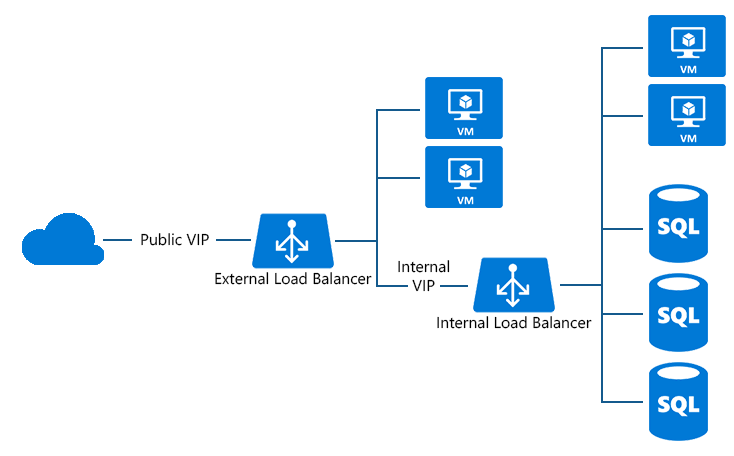

<properties
   pageTitle="Configurar equilibrador de carga para SQL siempre en | Microsoft Azure"
   description="Configurar equilibrador de carga para trabajar con SQL siempre en y cómo aprovechar powershell para crear equilibrador de carga para la implementación de SQL"
   services="load-balancer"
   documentationCenter="na"
   authors="sdwheeler"
   manager="carmonm"
   editor="tysonn" />
<tags
   ms.service="load-balancer"
   ms.devlang="na"
   ms.topic="article"
   ms.tgt_pltfrm="na"
   ms.workload="infrastructure-services"
   ms.date="10/24/2016"
   ms.author="sewhee" />

# Configurar equilibrador de carga para SQL siempre en

Grupos de disponibilidad de SQL Server AlwaysOn ahora se pueden ejecutar con ILB. Disponibilidad de grupo es la solución de estrella de SQL Server para alta disponibilidad y recuperación de desastres. La escucha de grupo de disponibilidad permite aplicaciones conectar con la réplica principal, independientemente del número de las réplicas en la configuración de cliente.

El nombre (de dominio DNS) de escucha se asigna a la dirección IP de equilibrio de carga y equilibrador de carga de Azure dirige el tráfico entrante al servidor principal en el conjunto de réplica.

Puede utilizar la ILB para los extremos de SQL Server AlwaysOn (escucha). Ahora tiene un control sobre la accesibilidad de la escucha y puede elegir la dirección IP de equilibrio de carga de subred específica en su red Virtual (VNet).

Mediante el uso de ILB en la escucha, el extremo del servidor SQL (por ejemplo, servidor = tcp:ListenerName, 1433; base de datos = nombreDeBaseDeDatos) sólo está accesible:

- Servicios y máquinas virtuales en la misma red Virtual
- Servicios y máquinas virtuales de red local conectada
- Servicios y máquinas virtuales de VNets interconectados

Figura 1 - AlwaysOn SQL configurado con equilibrador de carga a través de Internet

## Agregar equilibrador de carga interno del servicio

1. En el ejemplo siguiente, se va a configurar una red Virtual que contenga una subred denominada 'Subred 1':

        Add-AzureInternalLoadBalancer -InternalLoadBalancerName ILB_SQL_AO -SubnetName Subnet-1 -ServiceName SqlSvc

2. Agregar extremos de equilibrio de carga para ILB en cada VM

        Get-AzureVM -ServiceName SqlSvc -Name sqlsvc1 | Add-AzureEndpoint -Name "LisEUep" -LBSetName "ILBSet1" -Protocol tcp -LocalPort 1433 -PublicPort 1433 -ProbePort 59999 -ProbeProtocol tcp -ProbeIntervalInSeconds 10 –
        DirectServerReturn $true -InternalLoadBalancerName ILB_SQL_AO | Update-AzureVM

        Get-AzureVM -ServiceName SqlSvc -Name sqlsvc2 | Add-AzureEndpoint -Name "LisEUep" -LBSetName "ILBSet1" -Protocol tcp -LocalPort 1433 -PublicPort 1433 -ProbePort 59999 -ProbeProtocol tcp -ProbeIntervalInSeconds 10 –DirectServerReturn $true -InternalLoadBalancerName ILB_SQL_AO | Update-AzureVM

    En el ejemplo anterior, tiene 2 máquina virtual llamado "sqlsvc1" y "sqlsvc2" ejecutar "Sqlsvc" del servicio en la nube. Después de crear el ILB con modificador de "DirectServerReturn", se agregan la ILB permitir SQL configurar la escucha para los grupos de disponibilidad en extremos de equilibrio de carga.

Para obtener más información acerca de SQL AlwaysOn, consulte [configurar un equilibrador de carga interno para un grupo de disponibilidad AlwaysOn en Azure](../virtual-machines/virtual-machines-windows-portal-sql-alwayson-int-listener.md).

## Vea también

[Empezar a configurar una Internet opuestas equilibrador de carga](load-balancer-get-started-internet-arm-ps.md)

[Empezar a configurar un equilibrador de carga interno](load-balancer-get-started-ilb-arm-ps.md)

[Configurar un modo de distribución del equilibrador de carga](load-balancer-distribution-mode.md)

[Configurar los valores de tiempo de espera TCP inactivas para el equilibrador de carga](load-balancer-tcp-idle-timeout.md)
