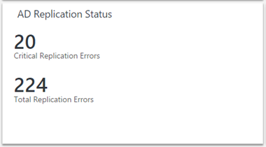
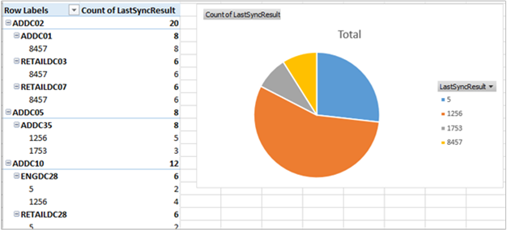

<properties
    pageTitle="Solución de estado de la replicación de directorio activo en el análisis de registro | Microsoft Azure"
    description="El paquete de soluciones de estado de replicación de Active Directory con regularidad supervisa el entorno de Active Directory para los errores de replicación informes y los resultados en el panel OMS."
    services="log-analytics"
    documentationCenter=""
    authors="bandersmsft"
    manager="jwhit"
    editor=""/>

<tags
    ms.service="log-analytics"
    ms.workload="na"
    ms.tgt_pltfrm="na"
    ms.devlang="na"
    ms.topic="article"
    ms.date="10/10/2016"
    ms.author="banders"/>

# Solución de estado de la replicación de directorio activo en el análisis de registro

Active Directory es un componente clave de un entorno de TI empresarial. Para asegurarse de alto rendimiento y alta disponibilidad, cada controlador de dominio tiene su propia copia de la base de datos de Active Directory. Controladores de dominio replican entre sí para propagar cambios en toda la empresa. Errores en este proceso de replicación pueden causar una gran variedad de problemas en toda la empresa.

El paquete de soluciones de estado de la replicación de AD con regularidad supervisa el entorno de Active Directory para los errores de replicación informes y los resultados en el panel OMS.

## Instalar y configurar la solución
Use la información siguiente para instalar y configurar la solución.

- Agentes deben estar instalados en los controladores de dominio que son miembros del dominio que se debe evaluar o en servidores miembro configurados para enviar datos de replicación de AD a OMS. Para comprender cómo conectar equipos de Windows a OMS, vea [Conectar Windows equipos para el análisis de registro](log-analytics-windows-agents.md). Si el controlador de dominio ya es parte de un entorno existente de System Center Operations Manager que le gustaría conectarse a OMS, consulte [Conectar Operations Manager para el análisis de registro](log-analytics-om-agents.md).
- Agregar la solución de estado de replicación de Active Directory para el área de trabajo OMS mediante el proceso descrito en [soluciones de agregar el registro de análisis de la Galería de soluciones](log-analytics-add-solutions.md).  No es necesaria realizar ninguna configuración adicional.

## Detalles de colección de datos de estado de la replicación de AD

La siguiente tabla muestra los métodos de conjunto de datos y otros detalles acerca de cómo se recopilan los datos de estado de la replicación de AD.

| plataforma | Agente directo | Agente SCOM | Almacenamiento de Azure | ¿SCOM obligatorio? | Datos de agente SCOM enviadas por grupo de administración | frecuencia de la colección |
|---|---|---|---|---|---|---|
|Windows|||||| cada 5 días|

## Opcionalmente, habilite un dominio enviar datos de AD a OMS
Si no desea conectarse a cualquiera de los controladores de dominio directamente a OMS, puede usar cualquier otro equipo conectado OMS en su dominio para recopilar datos para el paquete de soluciones de estado de la replicación de AD y enviar los datos.

### Para habilitar un dominio enviar datos de AD a OMS
1.  Compruebe que el equipo es miembro del dominio que desea supervisar el uso de la solución de estado de la replicación de AD.
2.  [Conectar el equipo de Windows a OMS](log-analytics-windows-agents.md) o [Conectar con su entorno de Operations Manager existente para OMS](log-analytics-om-agents.md), si ya no está conectado.
3.  En el equipo, establezca la clave del registro siguiente:
    - Tecla: **grupos HKEY_LOCAL_MACHINE\SYSTEM\CurrentControlSet\Services\HealthService\Parameters\Management\<ManagementGroupName > \Solutions\ADReplication**
    - Valor: **IsTarge**
    - Datos de valor: **true**

    >[AZURE.NOTE]Estos cambios no surtirán efecto hasta reiniciar el servicio de agente de supervisión de Microsoft (HealthService.exe).

## Descripción de los errores de replicación
Una vez que tenga datos de estado de replicación de AD enviados a OMS, verá un mosaico similar al siguiente en el panel OMS que indica cuántos errores de replicación que tiene actualmente.  

**Errores críticos de replicación** son aquellos que están en o por encima del 75% de la [duración de desechar](https://technet.microsoft.com/library/cc784932%28v=ws.10%29.aspx) su bosque de Active Directory.

Al hacer clic en el mosaico, verá más información sobre los errores.

### Estado del servidor de destino y el estado del servidor de origen
Estos módulos muestran el estado de los servidores de destino y origen que experimentan errores de replicación. El número después de cada nombre de controlador de dominio indica el número de errores de replicación en ese dominio.

Se muestran los errores de los servidores de destino y los servidores de origen porque algunos problemas son más fáciles de solucionar desde la perspectiva del servidor de origen y otros usuarios desde la perspectiva del servidor de destino.

En este ejemplo, puede ver que muchos de los servidores de destino tienen aproximadamente el mismo número de errores, pero hay un servidor de origen (ADDC35) que tiene muchos más errores de los demás. Es probable que hay algún problema en ADDC35 que está causando un error al enviar datos a sus asociados de replicación. Solucionar los problemas de ADDC35 probablemente se resolverán muchos de los errores que aparecen en el servidor de hoja de destino.

### Tipos de errores de replicación
Este módulo proporciona información sobre los tipos de errores detectados en toda la empresa. Cada error tiene un código numérico único y un mensaje que puede ayudarle a determinar la causa del error.

El anillo en la parte superior le da una idea de qué errores aparecen más y menos frecuencia en su entorno.

Esto puede mostrar cuando varios controladores de dominio experimentan el mismo error de replicación. En este caso, es posible que pueda descubrir identificar una solución en un controlador de dominio y luego repita en otros controladores de dominio afectados por el mismo error.

### Desechar su vida.
La duración de desechar determina cuánto un objeto eliminado, esto se conoce como un marcador de exclusión, se conservará en la base de datos de Active Directory. Cuando un objeto eliminado pasa la duración desechar, un proceso de recopilación de basura la elimina automáticamente de la base de datos de Active Directory.

La duración de desechar predeterminada es 180 días para versiones más recientes de Windows, pero era 60 días en versiones anteriores y puede cambiar de forma explícita por un administrador de Active Directory.

Es importante saber si experimenta errores de replicación que se están acercando a o están más allá de la duración de desechar. Si dos controladores de dominio produce un error de replicación continúa más allá de la duración de desechar, replicación deshabilitará entre los dos controladores de dominio, incluso si se corrige el error de replicación subyacente.

El módulo de duración desechar le ayuda a identificar los lugares donde esto corre el riesgo de que ocurra. Cada error en la **más del 100% TSL** categoría representa una partición que ha no replicar entre su servidor de origen y de destino para al menos la duración de desechar para el bosque.

En esta situación, simplemente corregir el error de replicación no será suficiente. Como mínimo, tendrá que investigar manualmente para identificar y objetos persistentes de limpieza antes de reiniciar la replicación. Incluso puede que necesite retirar un controlador de dominio.

Además de identificar los errores de replicación que han persistido más allá de la duración de desechar, también querrá preste atención a los errores de las categorías **TSL 50-75%** o **TSL 75 100%** .

Estos son los errores que son claramente persistentes, no transitorias, por lo que es probable que necesitan intervención del usuario para resolver. La buena noticia es que no han alcanzado todavía la duración desechar. Si solucionar estos problemas rápidamente y *antes de* que lleguen a la duración de desechar, puede reiniciar la replicación con mínima intervención manual.

Como se mencionó anteriormente, el mosaico de paneles de la solución de estado de la replicación de AD muestra al número de *crítica* errores de replicación en su entorno, que se define como errores de más del 75% de la duración de desechar (incluidos los errores que sean más 100% de TSL). Intentar mantener este número en 0.

>[AZURE.NOTE] Todos los cálculos de porcentaje de la duración desechar se basan en la duración real desechar su bosque de Active Directory, por lo que puede confiar en que los porcentajes son correctas, incluso si ha configurado un valor de duración personalizados desechar.

### Detalles de estado de replicación de AD
Al hacer clic en cualquier elemento de una de las listas, verá los detalles adicionales sobre mediante la búsqueda de registros. Los resultados se filtran para mostrar solo los errores relacionados con dicho elemento. Por ejemplo, si hace clic en el primer controlador de dominio que aparece en **El estado del servidor de destino (ADDC02)**, verá los resultados de búsqueda filtrados para mostrar errores con el controlador de dominio aparece como el servidor de destino:

Desde aquí, puede filtrar aún más, modifique la consulta de búsqueda y así sucesivamente. Para obtener más información sobre el uso de la búsqueda de registros, vea [búsquedas de registro](log-analytics-log-searches.md).

El campo **HelpLink** muestra la dirección URL de una página de TechNet con detalles adicionales sobre ese error específico. Puede copiar y pegar este vínculo en la ventana del explorador para ver información sobre solución de problemas y corregir el error.

También puede hacer clic en **Exportar** para exportar los resultados a Excel. Esto le permite visualizar datos de error de replicación de ninguna forma que le gustaría.

## Preguntas más frecuentes de estado de la replicación de AD
**P: ¿con qué frecuencia están datos de estado de replicación de AD actualizados?**
R: la información se actualiza cada 5 días.

**P: ¿existe una forma de configurar la frecuencia de actualización de datos?**
R: no en este momento.

**P: ¿debo agregar todos los controladores de dominio a mi área de trabajo OMS para poder ver el estado de la replicación?**
R: no, debe agregarse un controlador de dominio. Si tiene varios controladores de dominio en el área de trabajo OMS, los datos de todas ellas se envían a OMS.

**P: no quiero agregar cualquier controlador de dominio a mi área de trabajo OMS. ¿Puedo usar la solución de estado de la replicación de AD?**
R: Sí. Puede establecer el valor de una clave del registro para habilitar esta opción. Vea [para habilitar un dominio enviar datos de AD a OMS](#to-enable-a-non-domain-controller-to-send-ad-data-to-oms).

**P: ¿cuál es el nombre del proceso que realiza la recopilación de datos?**
R: AdvisorAssessment.exe

**P: ¿cuánto tiempo tarda para que se van a recopilar datos?**
A: hora de recopilación de datos depende del tamaño del entorno de Active Directory, pero normalmente tarda menos de 15 minutos.

**P: ¿qué tipo de datos se recopila?**
R: replicación información que se recopila a través de LDAP.

**P: ¿existe una forma de configurar cuando se recopilan datos?**
R: no en este momento.

**P: ¿qué permisos necesito para recopilar datos?**
A: permisos de usuario normal a Active Directory normalmente son suficientes.

## Solucionar problemas de la colección de datos
Para recopilar datos, el paquete de soluciones de estado de la replicación de AD requiere al menos un controlador de dominio que estar conectado a su área de trabajo OMS. Hasta que lo haga, verá un mensaje que indica que **aún se están recopilando datos**.

Si necesita ayuda para conectarse a uno de los controladores de dominio, puede ver la documentación en [equipos con Windows conectarse al análisis de registro](log-analytics-windows-agents.md). Como alternativa, si el controlador de dominio ya está conectado a un entorno existente de System Center Operations Manager, puede ver documentación al [Conectar System Center Operations Manager para el análisis de registro](log-analytics-om-agents.md).

Si no desea conectarse a cualquiera de los controladores de dominio directamente a OMS o a SCOM, vea [para habilitar un dominio enviar datos de AD a OMS](#to-enable-a-non-domain-controller-to-send-ad-data-to-oms).

## Pasos siguientes

- Usar [búsquedas de registro de análisis de registro](log-analytics-log-searches.md) para ver datos detallados de estado de replicación de Active Directory.
