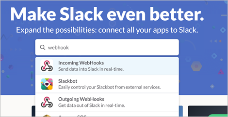

<properties
   pageTitle="Ejemplo de alerta webhook de análisis de registro"
   description="Una de las acciones que se pueden ejecutar en respuesta a una alerta de análisis de registro es una *webhook*, que permite invocar un proceso externo a través de una sola solicitud HTTP. En este artículo se recorre un ejemplo de cómo crear una acción de webhook una alerta de análisis de registro con el margen de demora."
   services="log-analytics"
   documentationCenter=""
   authors="bwren"
   manager="jwhit"
   editor="tysonn" />
<tags
   ms.service="log-analytics"
   ms.devlang="na"
   ms.topic="article"
   ms.tgt_pltfrm="na"
   ms.workload="infrastructure-services"
   ms.date="10/27/2016"
   ms.author="bwren" />

# <a name="webhooks-in-log-analytics-alerts"></a>Webhooks en alertas de análisis de registro

Una de las acciones que se pueden ejecutar en respuesta a una [alerta de análisis de registro](log-analytics-alerts.md) es una *webhook*, que permite invocar un proceso externo a través de una sola solicitud HTTP.  Puede leer acerca de los detalles de alertas y webhooks en [las alertas de análisis de registro](log-analytics-alerts.md)

En este artículo, veremos un ejemplo de cómo crear una acción de webhook una alerta de análisis de registro con el margen de demora que es un servicio de mensajería.

>[AZURE.NOTE] Debe tener una cuenta de margen de demora para completar este ejemplo.  Puede registrarse para una cuenta gratuita de [slack.com](http://slack.com).

## <a name="step-1---enable-webhooks-in-slack"></a>Paso 1: habilitar webhooks en el margen de demora
2.  Inicie sesión en una demora en [slack.com](http://slack.com).
3.  Seleccione un canal en la sección **canales** en el panel izquierdo.  Este es el canal que el mensaje se enviará a.  Puede seleccionar uno de los canales predeterminados como **general** o **aleatorio**.  En un escenario de producción, es muy probable que crearía un canal especial como **criticalservicealerts**. <br>

    

3. Haga clic en **Agregar una aplicación o integración personalizada** para abrir el directorio de la aplicación.
3.  Escriba *webhooks* en el cuadro de búsqueda y, a continuación, seleccione **WebHooks entrantes**. <br>

    

4.  Haga clic en **instalar** junto al nombre del equipo.
5.  Haga clic en **Agregar configuración**.
6.  Seleccione el canal que se va a usar en este ejemplo y, a continuación, haga clic en **Agregar entrantes WebHooks integración**.  
6. Copie la **dirección URL de Webhook**.  Se va a pegar esto en la configuración de alertas. <br>

    

## <a name="step-2---create-alert-rule-in-log-analytics"></a>Paso 2: crear la regla de alerta de análisis de registro
1.  [Crear una regla de alerta](log-analytics-alerts.md) con la siguiente configuración.
    - Consulta:```    Type=Event EventLevelName=error ```
    - Compruebe si esta alerta cada: 5 minutos
    - Es el número de resultados: superior a 10
    - En esta ventana de tiempo: 60 minutos
    - Seleccione **Sí** para **Webhook** y **No** para las demás acciones.
7. Pegue la dirección URL de margen de demora en el campo **Dirección URL de Webhook** .
8. Seleccione la opción para **incluir una carga JSON personalizada**.
9. Margen de demora espera una carga con formato JSON con un parámetro denominado *texto*.  Este es el texto que se mostrará en el mensaje que crea.  Puede usar uno o varios de los parámetros de alerta con la *#* símbolo tal como se muestra en el ejemplo siguiente.

    ```
    {
    "text":"#alertrulename fired with #searchresultcount records which exceeds the over threshold of #thresholdvalue ."
    }
    ```

    

9.  Haga clic en **Guardar** para guardar la regla de alerta.

10. Tiempo de espera suficiente para una alerta que se creará y busque demora un mensaje que será similar al siguiente.

    


### <a name="advanced-webhook-payload-for-slack"></a>Avanzada webhook carga de margen de demora

Puede personalizar ampliamente los mensajes entrantes con margen de demora. Para obtener más información, vea [Webhooks entrantes](https://api.slack.com/incoming-webhooks) en el sitio Web de margen de demora. A continuación se muestra una carga más compleja para crear un mensaje enriquecido con el formato:

    {
        "attachments": [
            {
                "title":"OMS Alerts Custom Payload",
                "fields": [
                    {
                        "title": "Alert Rule Name",
                        "value": "#alertrulename"},
                    {
                        "title": "Link To SearchResults",
                        "value": "<#linktosearchresults|OMS Search Results>"},
                    {
                        "title": "Search Interval",
                        "value": "#searchinterval"},
                    {
                        "title": "Threshold Operator",
                        "value": "#thresholdoperator"},
                    {
                        "title": "Threshold Value",
                        "value": "#thresholdvalue"}
                ],
                "color": "#F35A00"
            }
        ]
    }


Esto generará un mensaje en el margen de demora similar al siguiente.


## <a name="summary"></a>Resumen

Con esta regla de alerta en su lugar, tendría un mensaje enviado a demora cada vez que se cumplen los criterios.  

Esto es solo un ejemplo de una acción que puede crear en respuesta a una alerta.  Puede crear una acción de webhook que llama a otro servicio externo, una acción runbook para iniciar un runbook de automatización de Azure o una acción de correo electrónico para enviar un correo electrónico a usted mismo o a otros destinatarios.   

## <a name="next-steps"></a>Pasos siguientes

- Conocer más acerca de [las alertas de análisis de registro](log-analytics-alerts.md) incluidas otras acciones.
- [Crear runbooks en Azure automatización](../automation/automation-webhooks.md) que se puede llamar desde un webhook.
