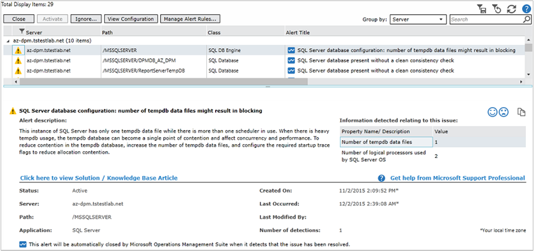
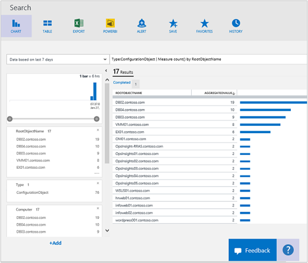

<properties
    pageTitle="Solución de evaluación de la configuración de análisis de registro | Microsoft Azure"
    description="La solución de evaluación de la configuración de análisis de registro proporciona información detallada sobre el estado actual de la infraestructura de servidor de System Center Operations Manager cuando utilice agentes de Operations Manager o un grupo de administración de Operations Manager."
    services="log-analytics"
    documentationCenter=""
    authors="bandersmsft"
    manager="jwhit"
    editor=""/>

<tags
    ms.service="log-analytics"
    ms.workload="na"
    ms.tgt_pltfrm="na"
    ms.devlang="na"
    ms.topic="article"
    ms.date="10/10/2016"
    ms.author="banders"/>

# Solución de evaluación de la configuración de análisis de registro

La solución de evaluación de la configuración de registro de análisis ayuda a encontrar posibles problemas de configuración de servidor a través de alertas y recomendaciones de knowledge.

Esta solución requiere System Center Operations Manager. Evaluación de la configuración no está disponible si solo utiliza a agentes conectado directamente.

Ver información de solución de evaluación de la configuración requiere el complemento de Silverlight para el explorador.

>[AZURE.NOTE] A partir del 5 de julio de 2016, la solución de evaluación de configuración ya no puede agregarse a áreas de trabajo de análisis de registro y esta solución ya no estará disponible para los usuarios existentes después del 1 de agosto de 2016. Los clientes con esta solución para SQL Server o Active Directory, le recomendamos que use en su lugar la [Evaluación de SQL Server](log-analytics-sql-assessment.md), las soluciones de [Evaluación de Active Directory](log-analytics-ad-assessment.md) y el [Estado de replicación de Active Directory](log-analytics-ad-replication-status.md) . Para los clientes que usan la evaluación de configuración para Windows, Hyper-V y System Center Virtual Machine Manager, se recomienda usar la recopilación de eventos y las capacidades para obtener una vista holística de cualquier problema en los entornos de seguimiento de cambios.

Datos de configuración se recopilan de servidores supervisados y, a continuación, se envía al servicio de OMS en la nube para el procesamiento. Lógica se aplica a los datos recibidos y el servicio de nube registra los datos. Datos procesados para los servidores se muestran para las siguientes áreas:

- **Alertas:** Muestra las alertas relacionadas con la configuración y proactivas que se han desencadenado para los servidores supervisados. Estos son creados mediante reglas creadas por Microsoft Customer y organización de soporte técnico (CSS) con las mejores prácticas del campo.
- **Knowledge recomendaciones:** Muestra los artículos de Microsoft Knowledge Base que se recomiendan para cargas de trabajo que se encuentran en su infraestructura; estos se sugieren automáticamente basándose en la configuración mediante el uso de aprendizaje del equipo.
- **Servidores y analizadas las cargas de trabajo:** Muestra los servidores y las cargas de trabajo supervisados OMS.

### Tecnologías puede analizar con la configuración de evaluación

Evaluación de la configuración de OMS analiza las cargas de trabajo siguientes:

- Windows Server 2012 y Microsoft Hyper-V Server 2012
- Windows Server 2008 y Windows Server 2008 R2, incluidos:
    - Active Directory
    - Host Hyper-v.
    - Sistema operativo general
- SQL Server 2008 y versiones posterior
    - Motor de base de datos SQL Server
- Microsoft SharePoint 2010
- Microsoft Exchange Server 2010 y Microsoft Exchange Server 2013
- Microsoft Lync Server 2013 y Lync Server 2010
- System Center 2012 SP1: Administrador de máquina Virtual

Para SQL Server, se admiten las siguientes ediciones de 32 bits y 64 bits para análisis:

- SQL Server 2016 - todas las ediciones
- SQL Server 2014 - todas las ediciones
- SQL Server 2008 y 2008 R2 - todas las ediciones

El motor de base de datos de SQL Server se analiza en todas las ediciones compatibles. Además, la edición de 32 bits de SQL Server es compatible cuando se ejecuta en la implementación de WOW64.

## Instalar y configurar la solución
Use la información siguiente para instalar y configurar la solución.

- Operations Manager se requiere para la solución de evaluación de la configuración.
- Debe tener un agente de Operations Manager en cada equipo donde desea evaluar su configuración.
- Agregar la solución de evaluación de la configuración para el área de trabajo OMS mediante el proceso descrito en [soluciones de agregar el registro de análisis de la Galería de soluciones](log-analytics-add-solutions.md).  No es necesaria realizar ninguna configuración adicional.

## Detalles del conjunto de datos de evaluación de configuración

Evaluación de configuraciones recopila los datos de configuración, metadatos y datos de estado con los agentes que ha habilitado.

La siguiente tabla muestra los métodos de conjunto de datos y otros detalles acerca de cómo se recopilan los datos de configuración de evaluación.

| plataforma | Agente directo | Agente SCOM | Almacenamiento de Azure | ¿SCOM obligatorio? | Datos de agente SCOM enviadas por grupo de administración | frecuencia de la colección |
|---|---|---|---|---|---|---|
|Windows||||            || dos veces por día|

La siguiente tabla muestra ejemplos de los tipos de datos recopilados por la evaluación de la configuración:

|**Tipo de datos**|**Campos**|
|---|---|
|Configuración|IdCliente, AgentID, EntityID, ManagedTypeID, ManagedTypePropertyID, ValorActual, ChangeDate|
|Metadatos|BaseManagedEntityId, ObjectStatus, OrganizationalUnit, ActiveDirectoryObjectSid, PhysicalProcessors, NetworkName, dirección IP, ForestDNSName, NombreDeEquipoNetBIOS, VirtualMachineName, LastInventoryDate, HostServerNameIsVirtualMachine, dirección IP, NetBIOSDomainName., LogicalProcessors, DNSName, DisplayName, DomainDnsName, ActiveDirectorySite, PrincipalName, OffsetInMinuteFromGreenwichTime|
|Estado|StateChangeEventId, el identificador, NewHealthState, OldHealthState, contexto, TimeGenerated, TimeAdded, StateId2, BaseManagedEntityId, MonitorId, HealthState, LastModified, LastGreenAlertGenerated, DatabaseTimeModified|

## Alertas de configuración de evaluación
Puede ver y administrar alertas de la evaluación de la configuración con la página de alertas. Alertas indican el problema que se ha detectado la causa y cómo solucionar el problema. También proporcionan información sobre la configuración de configuración en su entorno que podrían provocar problemas de rendimiento.

>[AZURE.NOTE] Las alertas de evaluación de configuración son diferentes de las otras alertas de análisis de registro. Visualización de alertas requiere un complemento de Silverlight para el explorador.

Cuando se selecciona un elemento o una categoría de elementos en la página de alertas, verá una lista de los servidores o cargas de trabajo con alertas que se aplican a cada elemento.

Cada alerta incluye un vínculo a un artículo de Microsoft Knowledge Base. Estos artículos proporcionan información adicional acerca de la alerta.

>[AZURE.TIP] De forma predeterminada, el número máximo de alertas que se muestran es 2.000. Para ver más alertas, haga clic en la barra de notificación sobre la lista de alertas.

Puede hacer clic en cualquier elemento de la lista para ver el artículo KB puede ayudarle a resolver la causa del problema que generó la alerta.

Puede administrar las reglas de alertas para omitir reglas específicas o clases de reglas.

## Recomendaciones de conocimiento
Cuando se ve recomendaciones de conocimientos, está presenta los resultados de búsqueda de registro lista de artículos de Microsoft KB recomendadas para las cargas de trabajo y equipos que proporcionan información adicional acerca de la alerta.

## Servidores y analizadas las cargas de trabajo
Cuando se ve recomendaciones de conocimientos, que se muestren los resultados de búsqueda de registro listado de todos los servidores y las cargas de trabajo que se sabe que OMS de Operations Manager.

## Pasos siguientes

- Usar [búsquedas de registro de análisis de registro](log-analytics-log-searches.md) para ver los datos de la evaluación de configuración detallada.
