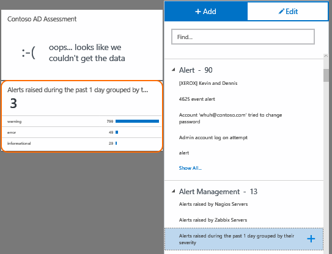
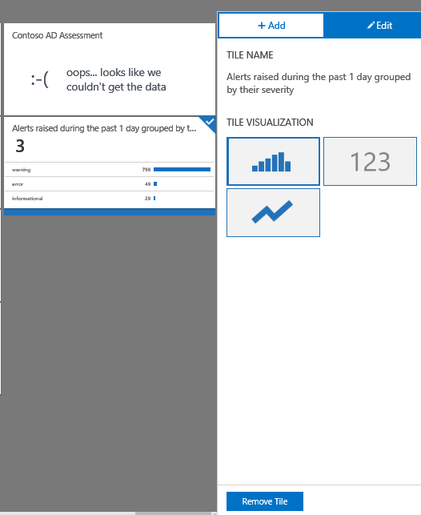
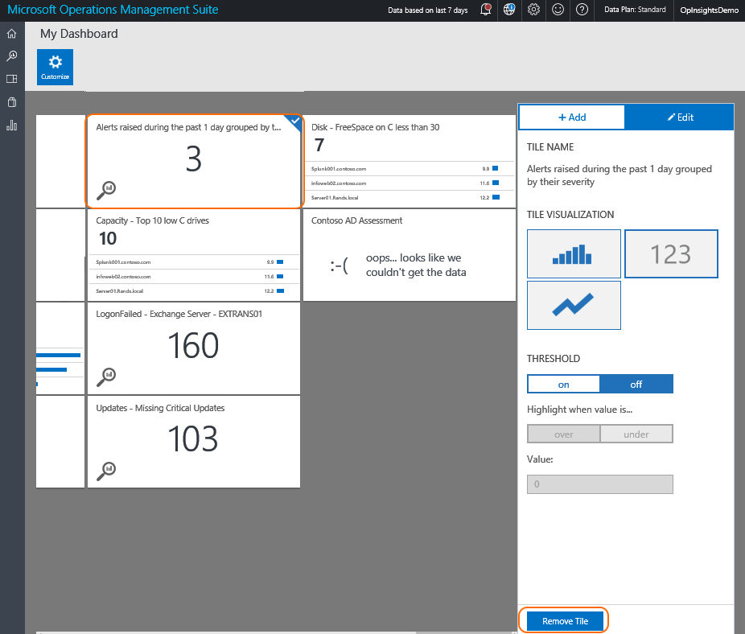

<properties
    pageTitle="Crear un panel personalizado en el análisis de registro | Microsoft Azure"
    description="Esta guía le ayuda a comprender cómo paneles de análisis de registro puede visualizar todas las búsquedas de registro guardado, que le da una lente solo para ver su entorno."
    services="log-analytics"
    documentationCenter=""
    authors="bandersmsft"
    manager="jwhit"
    editor=""/>

<tags
    ms.service="log-analytics"
    ms.workload="na"
    ms.tgt_pltfrm="na"
    ms.devlang="na"
    ms.topic="article"
    ms.date="10/10/2016"
    ms.author="banders"/>

# Crear un panel personalizado en el análisis de registro

Esta guía le ayuda a comprender cómo pueden visualizar los paneles de análisis de registro todas las búsquedas de registro guardado, que le da una lente solo para ver su entorno.

Todos los paneles personalizados que cree en el portal OMS también están disponibles en la aplicación móvil de OMS. Vea las páginas siguientes para obtener más información acerca de las aplicaciones.

- [OMS aplicación móvil de Microsoft Store](http://www.windowsphone.com/store/app/operational-insights/4823b935-83ce-466c-82bb-bd0a3f58d865)
- [Aplicación móvil de OMS desde iTunes de Apple](https://itunes.apple.com/app/microsoft-operations-management/id1042424859?mt=8)

## ¿Cómo creo Mi panel?

Para empezar, vaya a la página de información general de OMS. Verá el icono **Mi panel** de la izquierda. Haga clic en él para profundizar en su escritorio.

## Agregar un mosaico

En paneles, mosaicos cuentan con las búsquedas de registro guardado. OMS incluye muchos previamente realizan búsquedas de registro guardado, para que pueda empezar inmediatamente. Realice los pasos siguientes que describen cómo empezar.

En la vista de Mi panel, simplemente haga clic en **Personalizar** para introducir el modo de personalizar.

 El panel que se abre en el lado derecho de la página muestra todas las búsquedas de registro guardado del área de trabajo. Para visualizar una búsqueda de registro guardado como un mosaico, desplace el puntero sobre una búsqueda guardada y, a continuación, haga clic en el símbolo **más** .

Al hacer clic en el símbolo **más** , aparece un nuevo mosaico en la vista de Mi panel.

## Editar un mosaico

En la vista de Mi panel, simplemente haga clic en **Personalizar** para introducir el modo de personalizar. Haga clic en el icono que desea editar. Los cambios del panel de la derecha para editar y le ofrece una selección de opciones:

### Visualizaciones de mosaico#
Existen tres tipos de visualizaciones de mosaico para elegir:

|tipo de gráfico|Qué hace|
|---|---|
||Muestra una escala de tiempo de los resultados de la búsqueda de registro guardado como un gráfico de barras o una lista de resultados por un campo en función de si la búsqueda de registro agrega resultados por un campo o no.
||Muestra los visitas de resultado de búsqueda de registro total como un número de un mosaico. Métricos mosaicos permiten establecer un umbral que se resaltará el mosaico cuando se alcance el umbral.|
||Muestra una escala de tiempo de su visitas de resultado de búsqueda de registro guardado con valores como un gráfico de líneas.|

### Umbral
Puede crear un umbral en un mosaico usando la visualización métrica. Seleccione crear un valor de umbral en el mosaico. Elija si desea resaltar el mosaico cuando el valor está por encima o el umbral seleccionado, a continuación, establezca el valor de umbral a continuación.

## Organizar los paneles
Para organizar el panel, vaya a la vista de Mi panel y haga clic en **Personalizar** para introducir Personalizar modo. Haga clic y arrastre el icono que desea mover y muévalo hasta donde desee el mosaico ser.

## Quitar un mosaico
Para quitar un mosaico, vaya a la vista de Mi panel y haga clic en **Personalizar** para introducir Personalizar modo. Seleccione el icono que desea quitar y luego en el panel derecho, seleccione **Quitar de mosaico**.

## Pasos siguientes

- Cree [alertas](log-analytics-alerts.md) de análisis de registro para generar notificaciones y corregir problemas.
