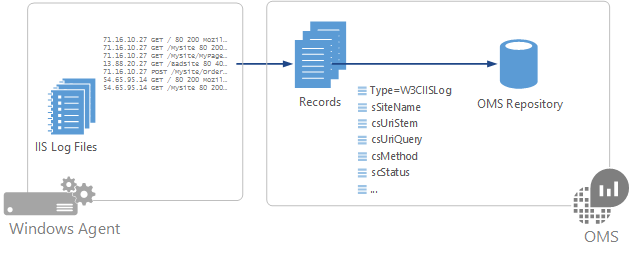

<properties
   pageTitle="Registros de IIS en el análisis de registro | Microsoft Azure"
   description="Internet Information Services (IIS) almacena la actividad de usuario en archivos de registro que se pueden recopilar análisis de registro.  En este artículo se describe cómo configurar la colección de registros de IIS y detalles de los registros que se crean en el repositorio OMS."
   services="log-analytics"
   documentationCenter=""
   authors="bwren"
   manager="jwhit"
   editor="tysonn" />
<tags
   ms.service="log-analytics"
   ms.devlang="na"
   ms.topic="article"
   ms.tgt_pltfrm="na"
   ms.workload="infrastructure-services"
   ms.date="10/18/2016"
   ms.author="bwren" />

# Registros de IIS en el análisis de registro
Internet Information Services (IIS) almacena la actividad de usuario en archivos de registro que se pueden recopilar análisis de registro.  

## Registros de configuración de IIS
Análisis de registro recopila los elementos de archivos de registro creados por IIS, por lo que debe [configurar IIS para el registro](https://technet.microsoft.com/library/hh831775.aspx).

Análisis de registro solo es compatible con archivos de registro IIS almacenados en formato W3C y no admite campos personalizados o registro avanzado de IIS.  
Análisis de registro no recopilar registros en formato nativo NCSA o IIS.

Configurar los registros de IIS en el análisis de registro en el [menú datos de configuración de análisis de registro](log-analytics-data-sources.md#configuring-data-sources).  Hay necesaria ninguna configuración excepto seleccionar **archivos de registro de W3C recopilar formato IIS**.

Se recomienda que, cuando se habilita la colección de registro IIS, debe configurar la opción de renovación de registro IIS en cada servidor.

## Recopilación de datos

Análisis de registro recopila entradas del registro IIS de cada origen conectada aproximadamente cada 15 minutos.  El agente registra su posición en cada registro de eventos que recopila de.  Si el agente se desconecta, el análisis de registro recopila eventos desde donde se quedó, incluso si los eventos que se crearon mientras el agente estaba sin conexión.

## Propiedades del registro de registro IIS

Registros IIS tienen un tipo de **W3CIISLog** y tienen las propiedades de la tabla siguiente:

| (Propiedad) | Descripción |
|:--|:--|
| Equipo | Nombre del equipo que se ha recopilado el evento. |
| cIP | Dirección IP del cliente. |
| csMethod | Método de la solicitud como GET o POST. |
| csReferer | Sitio que el usuario seguido de un vínculo desde el sitio actual. |
| csUserAgent | Tipo de explorador del cliente. |
| csUserName | Nombre del usuario autenticado que tiene acceso el servidor. Los usuarios anónimos se indican con un guión. |
| csUriStem | Destino de la solicitud como una página web. |
| csUriQuery | Crear una consulta, si la hay, que el cliente intentaba realizar. |
| ManagementGroupName | Nombre del grupo de administración para Operations Manager agentes.  Para otros agentes, esto es AOI -\<identificador de área de trabajo\> |
| RemoteIPCountry | País de la dirección IP del cliente. |
| RemoteIPLatitude | Latitud de la dirección IP del cliente. |
| RemoteIPLongitude | Longitud de la dirección IP del cliente. |
| scStatus | Código de estado HTTP. |
| scSubStatus | Código de error de subestado. |
| scWin32Status | Código de estado de Windows. |
| sIP | Dirección IP del servidor web. |
| SourceSystem  | OpsMgr |
| Deporte | Puerto del servidor del cliente conectado a. |
| sSiteName | Nombre del sitio IIS. |
| TimeGenerated | Fecha y hora en que se registró la entrada. |
| TimeTaken | Período de tiempo para procesar la solicitud en milisegundos. |

## Búsquedas de registros con los registros de IIS

La siguiente tabla proporciona ejemplos diferentes de consultas de registro que recuperar registros IIS.

| Consulta | Descripción |
|:--|:--|
| Tipo = IISLog | Todos los registros de registro IIS. |
| Tipo = IISLog EventLevelName = error | Todos los eventos de Windows con gravedad del error. |
| Tipo = W3CIISLog & #124; Medir count() cIP | Entradas de registro de recuento de IIS por la dirección IP del cliente. |
| Tipo = W3CIISLog csHost = "www.contoso.com" & #124; Medir count() por csUriStem | Registro de recuento de IIS entradas por la dirección URL para el host www.contoso.com. |
| Tipo = W3CIISLog & #124; Medir Sum(csBytes) por equipo & #124; principio de 500000| Total de bytes recibidos por cada equipo IIS. |

## Pasos siguientes

- Configurar el análisis de registro para recopilar otros [orígenes de datos](log-analytics-data-sources.md) para el análisis.
- Obtenga información acerca de las [búsquedas de registro](log-analytics-log-searches.md) analizar los datos recopilados desde orígenes de datos y soluciones.
- Configurar alertas de análisis de registro para informarle de manera proactiva condiciones importantes que se encuentra en los registros de IIS.
