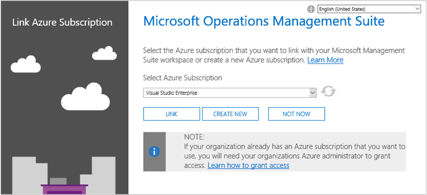
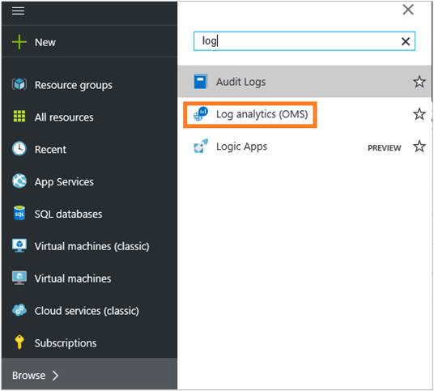
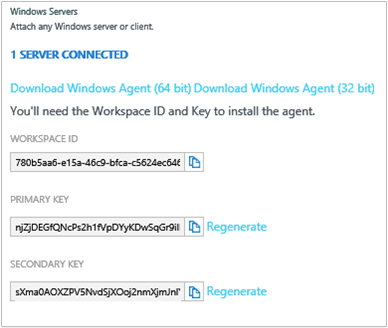

<properties
    pageTitle="Introducción a análisis de registro | Microsoft Azure"
    description="Puede obtener marcha con análisis de registro en conjunto de aplicaciones de administración de operaciones de Microsoft (OMS) en minutos."
    services="log-analytics"
    documentationCenter=""
    authors="bandersmsft"
    manager="jwhit"
    editor=""/>

<tags
    ms.service="log-analytics"
    ms.workload="na"
    ms.tgt_pltfrm="na"
    ms.devlang="na"
    ms.topic="get-started-article"
    ms.date="10/10/2016"
    ms.author="banders"/>

# Introducción a análisis de registro

Puede obtener marcha con análisis de registro en conjunto de aplicaciones de administración de operaciones de Microsoft (OMS) en minutos. Tiene dos opciones al elegir cómo crear un área de trabajo OMS, que es similar a una cuenta:

- Sitio Web de la serie de administración de operaciones de Microsoft
- Suscripción de Microsoft Azure

Puede crear un área de trabajo OMS gratuita mediante el sitio web OMS. O bien, puede usar una suscripción de Microsoft Azure para crear un área de trabajo OMS. Las áreas de trabajo son equivalentes, excepto en que un área de trabajo OMS gratuita sólo puede enviar 500 MB de datos diariamente al servicio de OMS. Si usa una suscripción de Azure, también puede usar esa suscripción para tener acceso a otros servicios de Azure. Independientemente del método que se utiliza para crear el área de trabajo, debe crear el área de trabajo con una cuenta de Microsoft o una cuenta de la organización.

Aquí explicamos el proceso:

## Requisitos previos de análisis de registro y consideraciones de implementación

- Tiene una suscripción de Microsoft Azure totalmente usar el análisis de registro. Si no tiene una suscripción de Azure, cree una [cuenta gratuita](https://azure.microsoft.com/free/) que permite el acceso a cualquier servicio de Azure. O bien, puede crear una cuenta gratuita de OMS en el sitio Web de la [Serie de administración de operaciones](http://microsoft.com/oms) y haga clic en **probar de forma gratuita**.
- Un área de trabajo OMS
- Cada equipo de Windows que desea recopilar datos de deben ejecutar Windows Server 2008 SP1 o posterior
- Acceso de [Firewall](log-analytics-proxy-firewall.md) a la OMS web direcciones del servicio
- Un servidor de [OMS registro análisis reenviador](https://blogs.technet.microsoft.com/msoms/2016/03/17/oms-log-analytics-forwarder) (puerta de enlace) para reenviar el tráfico de servidores a OMS, si no está disponible en equipos de acceso a Internet
- Si usa Operations Manager, es compatible con el análisis de registro Operations Manager 2012 SP1 UR6 y por encima y Operations Manager 2012 R2 UR2 y anteriores. Se agregó la compatibilidad de proxy de Operations Manager 2012 SP1 UR7 y Operations Manager 2012 R2 UR3. Determinar cómo se integrarán con OMS.
- Determinar si los equipos tienen acceso directo a Internet. Si no es así, requiere un servidor de puerta de enlace para tener acceso a los sitios de servicio web OMS. Todo el acceso es a través de HTTPS.
- Determinar qué tecnologías y servidores enviará datos a OMS. Por ejemplo, controladores de dominio, SQL Server, etcetera.
- Conceda permiso a los usuarios de OMS y Azure.
- Si le preocupa el uso de datos, implementar cada solución de forma individual y probar el impacto de rendimiento antes de agregar soluciones adicionales.
- Revise el uso de datos y el rendimiento cuando agregue soluciones y características al análisis de registro. Esto incluye la recopilación de eventos, colección de registro, recopilación de datos de rendimiento, etcetera. Mejor es comenzar con mínima colección hasta el uso de datos o se ha identificado el impacto en el rendimiento.
- Compruebe que los agentes de Windows no también se administran mediante Operations Manager, en caso contrario, se producen datos duplicados. Esto también se aplica a Azure-según-agentes que tengan diagnósticos de Azure habilitado.
- Después de instalar a agentes, compruebe que el agente funciona correctamente. Si no es así, compruebe que cifrado API: aislamiento de clave de próxima generación (CNG) no está deshabilitado mediante la directiva de grupo.
- Algunas soluciones de análisis de registro tienen requisitos adicionales

## Registrarse en los 3 pasos con el conjunto de administración de operaciones

1. Vaya al sitio Web de la [Serie de administración de operaciones](http://microsoft.com/oms) y haga clic en **probar de forma gratuita**. Inicie sesión con su cuenta de Microsoft, como Outlook.com o con una cuenta profesional proporcionó su compañía o institución educativa para usar con Office 365 u otros servicios de Microsoft.
2. Proporcione un nombre único del área de trabajo. Un área de trabajo es un contenedor lógico donde se almacenan los datos de administración. Le proporciona una manera de dividir los datos entre los distintos equipos de su organización, como los datos están exclusivos de su área de trabajo. Especifique una dirección de correo electrónico y la región donde desee que los datos almacenados.  
    
3. A continuación, puede crear una nueva suscripción Azure o un vínculo a una suscripción existente de Azure. Si desea continuar con la versión de prueba gratuita, haga clic en **No**.  
  

Está listo para empezar a trabajar con el portal de la serie de administración de operaciones.

Puede obtener más sobre cómo configurar el área de trabajo y vincular cuentas de Azure existente a áreas de trabajo creadas con la aplicación de gestión de las operaciones al [administrar el acceso a los análisis de registro](log-analytics-manage-access.md).

## Registrarse rápidamente con Microsoft Azure

1. Vaya al [portal de Azure](https://portal.azure.com) inicio de sesión, examine la lista de servicios y, a continuación, seleccione **El análisis de registro (OMS)**.  
    
2. Haga clic en **Agregar**y luego seleccione las opciones para los elementos siguientes:
    - Nombre del **Área de trabajo de OMS**
    - **Suscripción** : si tiene varias suscripciones, elija el que desee asociar a la nueva área de trabajo.
    - **Grupo de recursos**
    - **Ubicación**
    - **Nivel de precios**  
        
3. Haga clic en **crear** y verá los detalles del área de trabajo en el portal de Azure.       
             
4. Haga clic en el vínculo de **OMS Portal** para abrir el sitio Web de la serie de administración de las operaciones con el área de trabajo.

Está listo para empezar a usar el portal de la serie de administración de operaciones.

Puede aprender más sobre cómo configurar el área de trabajo y vincular las áreas de trabajo existentes que creó con el conjunto de administración de operaciones a Azure suscripciones a [administrar el acceso a los análisis de registro](log-analytics-manage-access.md).

## Empezar a trabajar con el portal de operaciones Management Suite
Para elegir soluciones y conecte los servidores que desea administrar, haga clic en el icono **configuración** y siga los pasos descritos en esta sección.  

  

1. **Agregar soluciones** - ver las soluciones instaladas.  
      
    Haga clic en **visitar la Galería** para agregar más soluciones.  
      
    Seleccione una solución y, a continuación, haga clic en **Agregar**.
2. **Conectar una fuente** - elegir cómo quiere conectarse a su entorno de servidor para recopilar datos:
    - Conectar un cliente o servidor de Windows instalando un agente.
    - Conecte servidores Linux con el agente de OMS para Linux.
    - Usar una cuenta de almacenamiento de Azure configurada con la extensión VM diagnóstico de Windows o Linux Azure.
    - Utilice System Center Operations Manager para vincular los grupos de administración o toda la implementación de Operations Manager.
    - Habilitar telemetría de Windows usar el análisis de actualización.
            

3. **Recopilar datos** Configurar al menos un origen de datos para rellenar datos en el área de trabajo. Cuando haya terminado, haga clic en **Guardar**.    

        

## Opcionalmente, conectar servidores directamente a la aplicación de gestión de operaciones instalando un agente

En el ejemplo siguiente se muestra cómo instalar a un agente de Windows.

1. Haga clic en el icono **configuración** , haga clic en la pestaña **Orígenes conectados** , haga clic en una ficha para el tipo de origen que desea agregar y descargar un agente u Obtenga más información sobre cómo habilitar a un agente. Por ejemplo, haga clic en **Descargar el agente de Windows (64 bits)**. Para los agentes de Windows, sólo puede instalar al agente de Windows Server 2008 Service Pack 1 o versiones posteriores o en Windows 7 SP1 o posterior.
2. Instalar al agente en uno o más servidores. Puede instalar a agentes de uno a uno o más automatizada método con un [script personalizado](log-analytics-windows-agents.md), o bien puede usar una solución de distribución de software existente que es posible que tenga.
3. Una vez que acepte el contrato de licencia y elija la carpeta de instalación, seleccione **conectar el agente de análisis de registro a Azure (OMS)**.   
    

4. En la página siguiente, se le pedirá su ID de área de trabajo y la clave del área de trabajo. El identificador del área de trabajo y la clave se muestran en la pantalla donde ha descargado el archivo agente.  
      

    
5. Durante la instalación, puede hacer clic en **Avanzadas** para configurar su servidor proxy si lo desea y proporcione información de autenticación. Haga clic en el botón **siguiente** para volver a la pantalla de información del área de trabajo.
6. Haga clic en **siguiente** para validar el identificador del área de trabajo y la clave. Si se encuentra algún error, puede haga clic en **Atrás** para realizar correcciones. Cuando se validan el identificador del área de trabajo y la clave, haga clic en **instalar** para completar la instalación del agente.
7. En el Panel de Control, haga clic en el agente de supervisión de Microsoft > pestaña de análisis de registro de Azure (OMS). Cuando los agentes comunican con el servicio de la serie de administración de operaciones, aparecerá un icono de marca de verificación verde. Inicialmente, se abrirá aproximadamente 5 a 10 minutos.

>[AZURE.NOTE] Las soluciones de evaluación de configuración y administración de capacidad no son compatibles actualmente con servidores conectados directamente a la serie de administración de operaciones.

También puede conectar al agente a System Center Operations Manager 2012 SP1 y versiones posteriores. Para ello, seleccione **conectar el agente de System Center Operations Manager**. Al elegir que opción, envía datos al servicio sin necesidad de hardware adicional o cargar en los grupos de administración.

Puede obtener más información sobre cómo conectar agentes a la serie de administración de las operaciones en [equipos con Windows conectarse al análisis de registro](log-analytics-windows-agents.md).

## Opcionalmente, conectar utilizando System Center Operations Manager de servidores

1. En la consola de Operations Manager, seleccione **administración**.
2. Expanda el nodo de **Perspectivas operativas** y seleccione la **Conexión de perspectivas operativas**.

  >[AZURE.NOTE] Dependiendo de qué Update Rollup de SCOM usa, puede ver un nodo para *Asesor de centro de sistema*, *Perspectivas operativas*o *Conjunto de aplicaciones de administración de operaciones*.

3. Haga clic en el vínculo **registrarse a perspectivas operativas** hacia la esquina superior derecha y siga las instrucciones.
4. Después de completar al Asistente de registro, haga clic en el vínculo **Agregar un grupo de equipos** .
5. En el cuadro de diálogo de **Búsqueda de equipo** pueden buscar equipos o grupos de Operations Manager supervisados. Seleccionarlos equipos o grupos a incorporado para el análisis de registro, haga clic en **Agregar**y, a continuación, haga clic en **Aceptar**. Puede comprobar que el servicio OMS está recibiendo datos seleccionando el icono de **uso** en el portal de la serie de administración de operaciones. Datos deberían aparecer en aproximadamente 5 a 10 minutos.

Puede obtener más información sobre cómo conectar Operations Manager a la serie de administración de las operaciones en [Conectar Operations Manager para el análisis de registro](log-analytics-om-agents.md).

## Opcionalmente, analizar datos de servicios de nube de Microsoft Azure

Con el conjunto de administración de operaciones, puede buscar rápidamente registros de eventos y IIS para servicios en la nube y máquinas virtuales habilitando diagnósticos para los servicios de nube de Azure. También puede recibir información adicional para las máquinas virtuales Azure instalando el agente de supervisión de Microsoft. Puede obtener más información acerca de cómo configurar su entorno de Azure para usar la aplicación de gestión de las operaciones en [el almacenamiento de Azure conectarse al análisis de registro](log-analytics-azure-storage.md).

## Pasos siguientes

- [Soluciones de agregar el registro de análisis de la Galería de soluciones](log-analytics-add-solutions.md) para agregar funcionalidad y recopilación de datos.
- Familiarizarse con [las búsquedas de registro](log-analytics-log-searches.md) ver información detallada recopilada por soluciones.
- Use los [paneles](log-analytics-dashboards.md) para guardar y mostrar sus propias búsquedas personalizadas.
