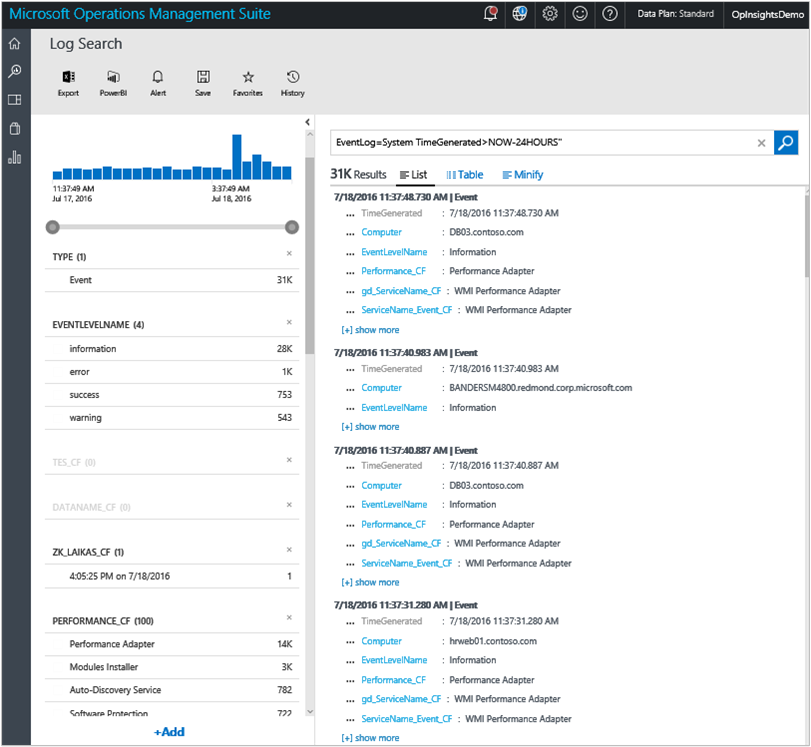
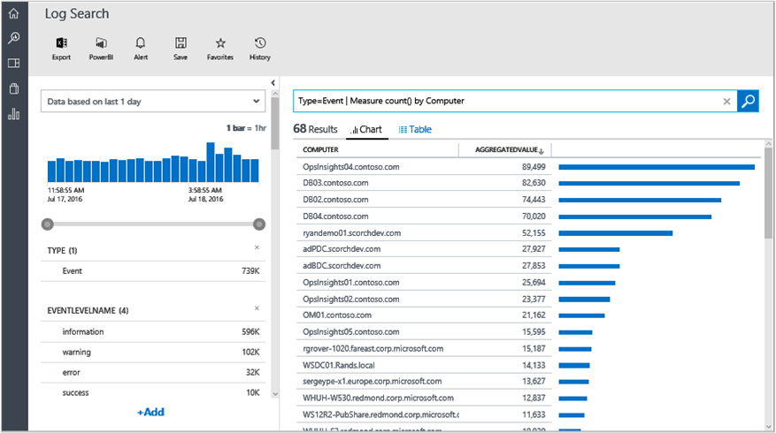
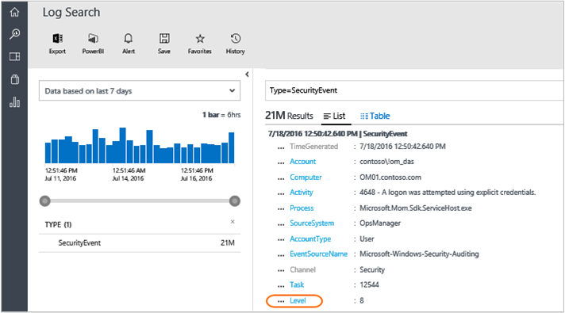
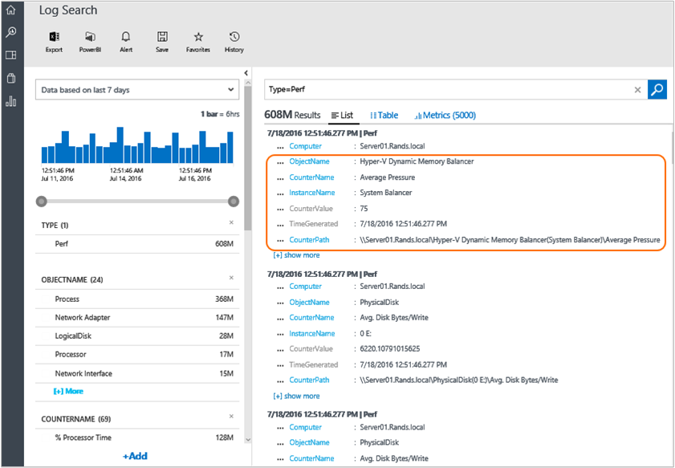
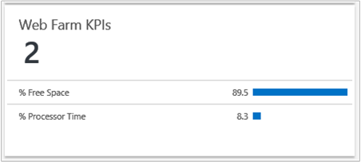
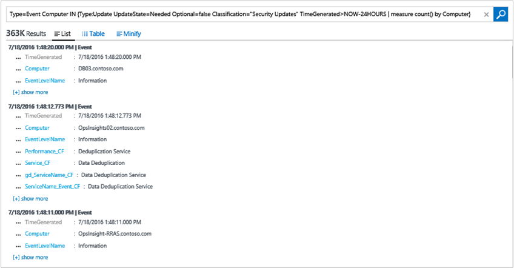

<properties
    pageTitle="Inicie búsquedas de análisis de registro | Microsoft Azure"
    description="Búsquedas de registro le permiten combinar y relacionar datos de varios orígenes en su entorno de equipo."
    services="log-analytics"
    documentationCenter=""
    authors="bandersmsft"
    manager="jwhit"
    editor=""/>

<tags
    ms.service="log-analytics"
    ms.workload="na"
    ms.tgt_pltfrm="na"
    ms.devlang="na"
    ms.topic="article"
    ms.date="10/10/2016"
    ms.author="banders"/>

# <a name="log-searches-in-log-analytics"></a>Búsquedas de registro de análisis de registro

En el centro de análisis de registro es la característica de búsqueda de registro que le permite combinar y relacionar datos de varios orígenes en su entorno de equipo. Soluciones también se ofrecido por registro de búsqueda para que aparezca métricas girados alrededor de un área del problema en particular.

En la página de búsqueda, puede crear una consulta y, a continuación, cuando busque, puede filtrar los resultados mediante controles de faceta. También puede crear consultas avanzadas para transformar, filtro e informe en los resultados.

Las consultas de búsqueda comunes de registro aparecen en la mayoría de las páginas solución. En la consola OMS, puede hacer clic mosaicos o explora a otros elementos para ver los detalles sobre el elemento mediante búsqueda de registros.

En este tutorial, le guiaremos a través de ejemplos para cubrir todos los conceptos básicos al usar la búsqueda de registros.

Estamos deberá iniciar con ejemplos sencillos y prácticos y, a continuación, crear en ellos para que pueda obtener una descripción de los casos de uso práctico sobre cómo usar la sintaxis de extraer la información que desee de los datos.

Después de haber familiarizado con técnicas de búsqueda, puede revisar la [referencia de búsqueda de registros de análisis de registro](log-analytics-search-reference.md).

## <a name="use-basic-filters"></a>Usar filtros básicos

Lo primero que hay que saber es que la primera parte de una búsqueda de consulta, antes de cualquier "|" carácter de barra vertical, siempre es un *filtro*. Se puede considerar como una cláusula WHERE en TSQL--determina *qué* subconjunto de datos para extraer fuera del almacén de datos OMS. Buscar en el almacén de datos es muy acerca de cómo especificar las características de los datos que desea extraer, por lo que es natural que desea iniciar una consulta con la cláusula WHERE.

Los filtros más básicos que puede usar son *palabras clave*, como 'error' o 'tiempo de espera' o un nombre de equipo. Estos tipos de consultas sencillas generalmente devuelven diversas formas de datos en el mismo conjunto de resultados. Esto es porque el análisis de registro tiene distintos *tipos* de datos en el sistema.


### <a name="to-conduct-a-simple-search"></a>Para realizar una búsqueda simple
1. En el portal OMS, haga clic en **Búsqueda de registros**.  
    
2. En el campo de consulta, escriba `error` y, a continuación, haga clic en **Buscar**.  
      
    Por ejemplo, la consulta para `error` en la siguiente imagen devuelto 100000 registros de **eventos** (recopilados por la administración de registros), 18 **ConfigurationAlert** registros (generados por la evaluación de la configuración) y 12 **ConfigurationChange** registros (genera por el seguimiento de cambios).   
      

Estos filtros no son realmente clases o tipos de objeto. *Tipo* es solo una etiqueta o una propiedad o una cadena/nombre o categoría, que está conectada a un elemento de datos. Algunos documentos en el sistema se marca como **Tipo: ConfigurationAlert** y algunos etiquetada como **Tipo: rendimiento**o un **Tipo: eventos**y así sucesivamente. Cada resultado de búsqueda, el documento, el registro o la entrada de muestra todas las propiedades sin formato y sus valores para cada uno de esos datos y puede usar esos nombres de campo para especificar en el filtro al que desea recuperar solo los registros donde el campo tiene ese valor.

*Tipo* es en realidad un campo que tienen todos los registros, no es diferente de cualquier otro campo. Esto se estableció en función del valor del campo tipo. Dicho registro tendrá un formulario o de forma diferente. Por cierto, **tipo = rendimiento**, o **tipo = evento** también es la sintaxis que necesita para aprender a crear una consulta con los datos de rendimiento o eventos.

Puede usar dos puntos (:) o un signo igual (=) después del nombre de campo y antes del valor. **Tipo: evento** y **tipo = evento** son equivalentes en significado, puede elegir el estilo que prefiera.

Por tanto, si el tipo = rendimiento registros tienen un campo denominado 'CounterName', a continuación, puede escribir una consulta que parezca `Type=Perf CounterName="% Processor Time"`.

Esto hará que solo los datos de rendimiento donde el nombre de contador de rendimiento es "% de tiempo de procesador".

### <a name="to-search-for-processor-time-performance-data"></a>Para buscar datos de rendimiento de tiempo de procesador
- En el campo de consulta de búsqueda, escriba`Type=Perf CounterName="% Processor Time"`

También puede ser más específico y usar **InstanceName = _ 'Total'** en la consulta, que es un contador de rendimiento de Windows. También puede seleccionar un aspecto y otro **campo: valor**. El filtro se agrega automáticamente al filtro en la barra de la consulta. Puede ver esto en la siguiente imagen. Muestra dónde hacer clic para agregar **InstanceName: '_Total'** a la consulta sin escribir nada.


La consulta ahora se convierte en`Type=Perf CounterName="% Processor Time" InstanceName="_Total"`

En este ejemplo, no tiene que especificar **tipo = rendimiento** para acceder a este resultado. Porque los campos CounterName y InstanceName existen solo para los registros del tipo = rendimiento, la consulta es lo suficientemente específica para devolver los mismos resultados que el anterior, más larga:
```
CounterName="% Processor Time" InstanceName="_Total"
```

Esto es porque todos los filtros de la consulta se evalúan como en *y* entre sí. Eficaz, los campos más agregar a los criterios, obtener menos, resultados más refinados y específicos.

Por ejemplo, la consulta `Type=Event EventLog="Windows PowerShell"` es idéntico al `Type=Event AND EventLog="Windows PowerShell"`. Devuelve todos los eventos que se han iniciado sesión y recopilada desde el registro de eventos de Windows PowerShell. Si agrega un filtro varias veces seleccionando varias veces el mismo aspecto, entonces el problema es puramente cosmético--podría otros correos a la barra de búsqueda, pero todavía devuelve los mismos resultados porque el operador AND implícito siempre está ahí.

Puede invertir fácilmente el operador AND implícito utilizando un operador no explícitamente. Por ejemplo:

`Type:Event NOT(EventLog:"Windows PowerShell")`o su equivalente `Type=Event EventLog!="Windows PowerShell"` devolver todos los eventos de todos los demás registros que no son el registro de Windows PowerShell.

O bien, puede usar otro operador booleano como 'O'. La siguiente consulta devuelve los registros para los que el registro de eventos es la aplicación o sistema.

```
EventLog=Application OR EventLog=System
```

Con la consulta anterior, recibirá las entradas para ambos registros del mismo conjunto de resultados.

Sin embargo, si quita el o dejando el implícitos y en su lugar, a continuación, la siguiente consulta no generará ningún resultado porque no hay una entrada de registro de eventos que pertenece a ambos registros. Cada entrada de registro de eventos escrita solo a uno de los dos registros.

```
EventLog=Application EventLog=System
```


## <a name="use-additional-filters"></a>Usar filtros adicionales

La siguiente consulta devuelve las entradas de 2 registros de eventos para todos los equipos que han enviado datos.

```
EventLog=Application OR EventLog=System
```


Al seleccionar uno de los campos o los filtros se limite la consulta en un equipo específico, excluyendo todos los otros que. La consulta resultante tendría la apariencia siguiente.

```
EventLog=Application OR EventLog=System Computer=SERVER1.contoso.com
```

Que es equivalente a la siguiente, debido a la and implícitos.

```
EventLog=Application OR EventLog=System AND Computer=SERVER1.contoso.com
```

Cada consulta se evalúa en el siguiente orden explícito. Tenga en cuenta los paréntesis.

```
(EventLog=Application OR EventLog=System) AND Computer=SERVER1.contoso.com
```

Al igual que el campo de registro de eventos, puede recuperar los datos solo para un conjunto de equipos específicos agregando o. Por ejemplo:

```
(EventLog=Application OR EventLog=System) AND (Computer=SERVER1.contoso.com OR Computer=SERVER2.contoso.com OR Computer=SERVER3.contoso.com)
```

Asimismo, este la siguiente consulta devolverá **% de tiempo de CPU** de los equipos seleccionados de dos solo.

```
CounterName="% Processor Time"  AND InstanceName="_Total" AND (Computer=SERVER1.contoso.com OR Computer=SERVER2.contoso.com)
```


### <a name="boolean-operators"></a>Operadores booleanos
Con la fecha y hora y los campos numéricos, puede buscar valores con *mayor*, *menor que*, y *menor o igual*. Puede utilizar los operadores simples como >, <>, =, < =,! = en la barra de búsqueda de la consulta.


Puede consultar un registro de eventos específico para un período de tiempo específico. Por ejemplo, las últimas 24 horas se expresa con la siguiente expresión de tecla de acceso.

```
EventLog=System TimeGenerated>NOW-24HOURS
```


#### <a name="to-search-using-a-boolean-operator"></a>Para buscar usando un operador booleano
- En el campo de consulta de búsqueda, escriba`EventLog=System TimeGenerated>NOW-24HOURS"`  
    

Aunque puede controlar el intervalo de tiempo gráficamente y casi siempre es recomendable hacerlo, hay ventajas para incluir un filtro tiempo directamente en la consulta. Por ejemplo, esto funciona bien con paneles donde puede reemplazar el tiempo para cada mosaico, independientemente del selector de tiempo *global* en la página de panel. Para obtener más información, vea [Cuestiones de tiempo en el panel](http://cloudadministrator.wordpress.com/2014/10/19/system-center-advisor-restarted-time-matters-in-dashboard-part-6/).

Si desea filtrar por hora, tenga en cuenta que obtiene resultados para la *intersección* de los dos períodos de tiempo: especificado en el portal OMS (S1) y el especificado en la consulta (S2).


Esto significa que, si los períodos de tiempo no se intersecan, por ejemplo en el portal OMS donde elegir **esta semana** en la consulta que defina **la semana pasada**, a continuación, no hay ninguna intersección y dejará de recibir ningún resultado.

Operadores de comparación que se utiliza para el campo TimeGenerated también son útiles en otras situaciones. Por ejemplo, con los campos numéricos.

Por ejemplo, dado que las alertas de evaluación de configuraciones tienen los siguientes valores de gravedad:

- 0 = información
- 1 = advertencia
- 2 = tareas críticas

Puede consultar para las alertas de advertencia y críticas y también excluir las informativas con la siguiente consulta:

```
Type=ConfigurationAlert  Severity>=1
```


También puede usar las consultas de rango. Esto significa que puede proporcionar el intervalo de comienzo y finalización de valores en una secuencia. Por ejemplo, si desea que los eventos del registro de eventos de Operations Manager donde la IdEvento es mayor o igual a 2100 pero no mayor que 2199, a continuación, la siguiente consulta devolverá ellos.

```
Type=Event EventLog="Operations Manager" EventID:[2100..2199]
```


>[AZURE.NOTE] La sintaxis de rango debe usar es el separador de dos puntos (:): el valor de campo y *no* el signo igual (=). Enmarcar final superior e inferior del intervalo entre corchetes y sepárelos con dos puntos (.).

## <a name="manipulate-search-results"></a>Manipular los resultados de búsqueda

Cuando está buscando datos, querrá refinar la consulta de búsqueda y tener un buen nivel de control sobre los resultados. Cuando se recuperan los resultados, puede aplicar comandos para transformarlos.

Comandos de análisis de registro búsquedas *debe* siguen después del carácter de barra vertical (|). Un filtro siempre debe ser la primera parte de una cadena de consulta. Define el conjunto de datos que está trabajando con y "canalizaciones", a continuación, los resultados en un comando. A continuación, puede usar la canalización para agregar comandos adicionales. Esto es ligeramente similar a la canalización de Windows PowerShell.

En general, el idioma de búsqueda de análisis de registro intenta seguir PowerShell estilo e instrucciones para que sea similar a los profesionales de TI y a reducir la curva de aprendizaje.

Comandos tienen nombres de verbos forma fácilmente puede saber qué hacen.  

### <a name="sort"></a>Ordenar

El comando Ordenar le permite definir el criterio de ordenación por uno o varios campos. Incluso si no se usa, de forma predeterminada, se exige una hora en orden descendente. Los resultados más recientes siempre están en la parte superior de los resultados de búsqueda. Esto significa que cuando se ejecuta una búsqueda con `Type=Event EventID=1234` es lo que realmente se ejecuta por usted:

```
Type=Event EventID=1234 **| Sort TimeGenerated desc**
```

Eso es porque es el tipo de experiencia que ya conoce en registros. Por ejemplo, en el Visor de eventos de Windows.

Puede usar a ordenación para cambiar la forma en que los resultados se devuelven. Los siguientes ejemplos muestran cómo funciona esto.

```
Type=Event EventID=1234 | Sort TimeGenerated asc
```

```
Type=Event EventID=1234 | Sort Computer asc
```

```
Type=Event EventID=1234 | Sort Computer asc,TimeGenerated desc
```


Los ejemplos simples anteriores muestra cómo funcionan los comandos--tener que cambian la forma de los resultados que devuelve el filtro.

### <a name="limit-and-top"></a>Límite y la parte superior
Otro menos comando conocido es límite. Límite es un verbo de PowerShell. Límite es funcional igual que el comando superior. Las consultas siguientes devuelven los mismos resultados.

```
Type=Event EventID=600 | Limit 1
```

```
Type=Event EventID=600 | Top 1
```


#### <a name="to-search-using-top"></a>Para buscar usando la parte superior
- En el campo de consulta de búsqueda, escriba`Type=Event EventID=600 | Top 1`   
    

En la imagen anterior, hay registros de mil 358 con IdEvento = 600. Los campos, facetas y filtros a la izquierda Mostrar siempre devuelve información acerca de los resultados *por la parte de filtro* de la consulta, que es el elemento antes de cualquier carácter de barra vertical. El panel de **resultados** solo devuelve el resultado de 1 más reciente, porque el comando de ejemplo con forma y los resultados de la transformación.

### <a name="select"></a>Seleccione

El comando SELECT se comporta como Seleccionar objeto en PowerShell. Devuelve los resultados filtrados que no tienen todas sus propiedades originales. En su lugar, selecciona sólo las propiedades que especifique.

#### <a name="to-run-a-search-using-the-select-command"></a>Para ejecutar una búsqueda usando el comando select

1. En Buscar, escriba `Type=Event` y, a continuación, haga clic en **Buscar**.
2. Haga clic en **+ Mostrar más** de uno de los resultados para ver todas las propiedades que tienen los resultados.
3. Seleccionar algunos de ellos explícitamente y, a continuación, cambie la consulta a `Type=Event | Select Computer,EventID,RenderedDescription`.  
    

Esto es especialmente útil de comando cuando desee controlar los resultados de búsqueda y elija sólo las partes de los datos que realmente es relevante para la exploración, que a menudo no es el registro completo. También es útil cuando registros de los diferentes tipos tienen *algunas* propiedades comunes, pero no *todas* sus propiedades comunes. El, puede generar un resultado que parezca más natural de una tabla o funciona bien cuando se exportan a un archivo CSV y, a continuación, requiera en Excel.


## <a name="use-the-measure-command"></a>Use el comando de medida

MEDIDA es uno de los comandos más flexible en las búsquedas de análisis de registro. Permite aplicar estadísticas *funciones* a sus datos y agregar los resultados agrupados por un campo determinado. Existen varias funciones estadísticas que admita medida.

### <a name="measure-count"></a>Medir count()

La primera función estadística a trabajar con y a continuación, una de las más fáciles de entender es la función *count()* .

Resultados de las consultas de búsqueda como `Type=Event`, Mostrar filtros también denominados aspectos en el lado izquierdo de resultados de búsqueda. Los filtros de mostrar una distribución de valores de un campo determinado de los resultados de la búsqueda realizada.


Por ejemplo, en la imagen encima, verá el campo del **equipo** y muestra que dentro de los eventos de casi 739 mil en los resultados, hay 68 valores únicos y distintos para el campo de **equipo** en esos registros. El mosaico solo muestra los 5 superior, que son los 5 valores más comunes que se escriben en los campos de **equipo** ), ordenados por el número de documentos que contienen ese valor específico de ese campo. En la imagen puede ver que – entre esos eventos casi 369 mil – 90 mil provenir del equipo de OpsInsights04.contoso.com mil 83 desde el equipo de DB03.contoso.com y así sucesivamente.


¿Qué ocurre si desea ver todos los valores, ya que el mosaico solo muestra los primeros 5?

Esto es lo que puede hacer el comando medida con la función count(). Esta función no utiliza parámetros. Solo tiene que especifique el campo por el que desea agrupar por: el campo de **equipo** en este caso:

`Type=Event | Measure count() by Computer`



Sin embargo, el **equipo** es simplemente un campo que se utiliza *en* cada fragmento de datos – no intervienen bases de datos relacionales y no hay ningún objeto de **equipo** independiente en cualquier lugar. Solo los valores *de* los datos puede describir qué entidad generados por ellas y un número de otras características y aspectos de los datos, por lo tanto, el *aspecto*de términos. Sin embargo, también puede agrupar por otros campos. Puesto que los resultados de eventos de casi 739 mil que se redirija el resultado en el comando de medida originales también tienen un campo denominado **IdEvento**, puede aplicar la misma técnica para agrupar por este campo y obtener un recuento de eventos por IdEvento:

```
Type=Event | Measure count() by EventID
```

Si no está interesado en el número de registros real que contengan un valor específico, pero en su lugar si solo desea una lista de los valores, puede agregar un comando *Select* al final de la misma y simplemente seleccione la primera columna:

```
Type=Event | Measure count() by EventID | Select EventID
```

A continuación, puede obtener más compleja y ordene por adelantado los resultados de la consulta, o puede hacer clic en las columnas en la cuadrícula, demasiado.

```
Type=Event | Measure count() by EventID | Select EventID | Sort EventID asc
```

#### <a name="to-search-using-measure-count"></a>Para buscar usando el recuento de medida

- En el campo de consulta de búsqueda, escriba`Type=Event | Measure count() by EventID`
- Anexar `| Select EventID` hasta el final de la consulta.
- Por último, anexar `| Sort EventID asc` hasta el final de la consulta.


Hay algunos puntos importantes para observe y resaltar:

En primer lugar, los resultados que vea ya no son los resultados sin formato originales. En su lugar, son resultados agregados: esencialmente a los grupos de resultados. Esto no es un problema, pero debe saber que está interacción con una forma muy diferente de datos diferente de la forma sin formato original que se crea sobre la marcha como resultado de la función de agregación estadísticas.

En segundo término, **recuento de medida** actualmente devuelve solo los primeros 100 distintos resultados. Este límite no se aplica a las otras funciones estadísticas. Por lo tanto, normalmente deberá usar un filtro más preciso en primer lugar para buscar elementos específicos antes de aplicar count() medida.

## <a name="use-the-max-and-min-functions-with-the-measure-command"></a>Use las funciones max y min con el comando de medida

Existen varios escenarios donde **Max() medida** y **Medida Min()** son útiles. Sin embargo, dado que cada función es opuesto de la otra, se le ilustrar Max() y puede experimentar con Min() sus propias.

Si una consulta de eventos de seguridad, tienen **una propiedad que puede variar** . Por ejemplo:

```
Type=SecurityEvent
```



Si desea ver el valor más alto para toda la seguridad eventos dado un equipo comunes, el campo Agrupar por, puede usar

```
Type=ConfigurationAlert | Measure Max(Level) by Computer
```


Lo hará al menos de visualización que para los equipos que haya registros de **nivel** , la mayoría de ellas tienen nivel 8, muchos tenían un nivel de 16.

```
Type=ConfigurationAlert | Measure Max(Severity) by Computer
```


Esta función funciona bien con números, pero también funciona con los campos de fecha y hora. Es útil comprobar la marca de hora último o más reciente de cualquier dato indizada para cada equipo. ¿Por ejemplo: cuando se notifica el evento más reciente de seguridad para cada equipo?

```
Type=ConfigurationChange | Measure Max(TimeGenerated) by Computer
```

## <a name="use-the-avg-function-with-the-measure-command"></a>Utilice la función promedio con el comando de medida

La función estadística de Avg() usada con medida le permite calcular el valor medio de algún campo y los resultados de grupo por el mismo u otro campo. Esto es útil en muchos casos, como los datos de rendimiento.

Comenzaremos con los datos de rendimiento. Tenga en cuenta que OMS actualmente recopila contadores de rendimiento para equipos de Windows y Linux.

Para buscar *todos los* datos de rendimiento, la consulta más básica es:

```
Type=Perf
```



Lo primero que verá es que el análisis de registro muestra tres perspectivas: lista que muestra que muestra los registros reales detrás de los gráficos; Tabla, que muestra una vista tabular de los datos de contador de rendimiento; y métricas, que muestra gráficos para los contadores de rendimiento.

En la imagen anterior, hay dos conjuntos de campos marcados que indican lo siguiente:

- El primer conjunto identifica el nombre de contador de rendimiento de Windows, el nombre de objeto y el nombre de instancia en el filtro de consulta. Estos son los campos que probablemente usará normalmente como facetas y filtros
- **CounterValue** es el valor real del contador. En este ejemplo, el valor es *75*.
- **TimeGenerated** es 12:51, en formato de 24 horas.

Aquí es una vista de las mediciones en un gráfico.


Después de leer sobre la forma de registro de rendimiento y tener más información sobre otras técnicas de búsqueda, puede usar la medida Avg() para agregar este tipo de datos numéricos.

Este es un ejemplo sencillo:

```
Type=Perf  ObjectName:Processor  InstanceName:_Total  CounterName:"% Processor Time" | Measure Avg(CounterValue) by Computer
```


En este ejemplo, seleccione el rendimiento de tiempo Total de CPU promedio y contador por el equipo. Si desea limitar los resultados de las últimas horas 6, puede usar el control de filtro de tiempo o especificar en la consulta como sigue:

```
Type=Perf  ObjectName:Processor  InstanceName:_Total  CounterName:"% Processor Time" TimeGenerated>NOW-6HOURS | Measure Avg(CounterValue) by Computer
```

### <a name="to-search-using-the-avg-function-with-the-measure-command"></a>Para buscar usando la función promedio con el comando de medida
- En el cuadro de consulta de búsqueda, escriba `Type=Perf  ObjectName:Processor  InstanceName:_Total  CounterName:"% Processor Time" TimeGenerated>NOW-6HOURS | Measure Avg(CounterValue) by Computer`.


Puede agregar y relacionar datos *entre* equipos. Por ejemplo, suponga que tiene un conjunto de hosts en algún tipo de granja de servidores donde cada nodo es igual a cualquier otro uno y solo todos del mismo tipo de trabajo y debe ser con equilibrio de carga más o menos. Puede obtener sus contadores que todo en un ir con los siguientes elementos de la consulta y obtener promedios para toda la granja de servidores. Puede iniciar seleccionando los equipos con el siguiente ejemplo:

```
Type=Perf AND (Computer="AzureMktg01" OR Computer="AzureMktg02" OR Computer="AzureMktg03")
```

Ahora que ya tiene los equipos, también desea seleccionar dos indicadores clave de rendimiento (KPI): uso de CPU y % espacio libre en disco. Por lo tanto, se convierte en esa parte de la consulta:

```
Type=Perf InstanceName:_Total  ((ObjectName:Processor AND CounterName:"% Processor Time") OR (ObjectName="LogicalDisk" AND CounterName="% Free Space")) AND TimeGenerated>NOW-4HOURS
```

Ahora puede agregar equipos y contadores con el siguiente ejemplo:

```
Type=Perf InstanceName:_Total  ((ObjectName:Processor AND CounterName:"% Processor Time") OR (ObjectName="LogicalDisk" AND CounterName="% Free Space")) AND TimeGenerated>NOW-4HOURS AND (Computer="AzureMktg01" OR Computer="AzureMktg02" OR Computer="AzureMktg03")
```

Debido a que tiene una selección muy específica, el comando de **medida Avg()** puede devolver el promedio no por el equipo, pero a través de la granja, simplemente agrupación por CounterName. Por ejemplo:

```
Type=Perf  InstanceName:_Total  ((ObjectName:Processor AND CounterName:"% Processor Time") OR (ObjectName="LogicalDisk" AND CounterName="% Free Space")) AND TimeGenerated>NOW-4HOURS AND (Computer="AzureMktg01" OR Computer="AzureMktg02" OR Computer="AzureMktg03") | Measure Avg(CounterValue) by CounterName
```

Esto le da una vista compacta útil de un par de KPI de su entorno.


Puede utilizar fácilmente la consulta de búsqueda en un panel. Por ejemplo, puede guardar la consulta de búsqueda y crear un panel de *KPI de granja de servidores Web*con el nombre. Para obtener más información sobre el uso de paneles, consulte [crear un panel personalizado en el análisis de registro](log-analytics-dashboards.md).



### <a name="use-the-sum-function-with-the-measure-command"></a>Utilice la función suma con el comando de medida

La función suma es similar a otras funciones del comando medida. Puede ver un ejemplo acerca de cómo usar la función suma en la [Búsqueda de registros de IIS W3C en Microsoft Azure operativas perspectivas](http://blogs.msdn.com/b/dmuscett/archive/2014/09/20/w3c-iis-logs-search-in-system-center-advisor-limited-preview.aspx).

Puede usar Max() y Min() con números, fechas y cadenas de texto. Con las cadenas de texto, se ordenan alfabéticamente y los primeros y últimos.

Sin embargo, no puede usar Sum() con distinto de campos numéricos. Esto también se aplica a Avg().

### <a name="use-the-percentile-function-with-the-measure-command"></a>Utilice la función percentil con el comando de medida

La función percentil es similar a Avg() y Sum() sólo se puede utilizar para campos numéricos. Puede usar cualquier percentil entre 1 y 99 en un campo numérico. También puede usar los comandos de **percentil** y **en porcentaje** . Estos son algunos ejemplos:  

```
Type:Perf CounterName:"DiskTransers/sec" |measure percentile95(CurrentValue) by Computer
```
```
Type:Perf ObjectName=LogicalDisk CounterName="Current Disk Queue Length" Computer="MyComputerName" | measure pct65(CurrentValue) by InstanceName
```

## <a name="use-the-where-command"></a>Utilice dónde de comando

El donde comando funciona como un filtro, pero se puede aplicar en la canalización de filtrar más los resultados agregados que se han producido por un comando de medida: en lugar de los resultados sin formato que se filtran al principio de una consulta.

Por ejemplo:

```
Type=Perf  CounterName="% Processor Time"  InstanceName="_Total" | Measure Avg(CounterValue) as AVGCPU by Computer
```

Puede agregar otra canalización "|" carácter y dónde comando solo obtener equipos cuya promedio CPU está por encima de 80%, con el siguiente ejemplo:

```
Type=Perf  CounterName="% Processor Time"  InstanceName="_Total" | Measure Avg(CounterValue) as AVGCPU by Computer | Where AVGCPU>80
```

Si ya está familiarizado con Microsoft System Center - Operations Manager, puede considerar que el comando where en términos de paquete de administración. Si el ejemplo se una regla, la primera parte de la consulta sería el origen de datos y dónde comando sería la detección de condición.

Puede utilizar la consulta como un mosaico en **Mi panel**, como un monitor de clasificaciones, para ver cuándo está exceso CPU del equipo. Para obtener más información acerca de los paneles, consulte [crear un panel personalizado en el análisis de registro](log-analytics-dashboards.md). También puede crear y usar paneles con la aplicación móvil. Para obtener más información, vea [Aplicación móvil de OMS ](http://www.windowsphone.com/en-us/store/app/operational-insights/4823b935-83ce-466c-82bb-bd0a3f58d865). En los mosaicos de dos de parte inferior de la imagen siguiente, puede ver el monitor muestra una lista y un número. Básicamente, siempre que desee el número sea cero y la lista esté vacío. En caso contrario, indica una condición de alerta. Si es necesario, puede usarlo para echar un vistazo en qué equipos están bajo presión.


## <a name="use-the-in-operator"></a>Usar el operador in

El operador *en* , junto con *NOT IN* le permite usar subsearches, que son las búsquedas que incluyen otra búsqueda como un argumento. Se encuentran en las llaves {} dentro de otra búsqueda *principal* o *externa* . A continuación, se utiliza el resultado de un subsearch, a menudo una lista de resultados distintos, como un argumento en su búsqueda principal.

Puede usar subsearches para que coincida con subconjuntos de los datos que no se puede describir directamente en una expresión de búsqueda, pero que se pueden generar desde una búsqueda. Por ejemplo, si está interesado en el uso de una búsqueda para encontrar todos los eventos de *equipos faltan actualizaciones de seguridad*, debe diseñar un subsearch que identifica primero que *faltan actualizaciones de seguridad de equipos* antes de encontrar eventos que pertenecen a esos hosts.

Por lo tanto, podría express *equipos actualmente que faltan actualizaciones de seguridad* con la siguiente consulta:

```
Type:Update UpdateState=Needed Optional=false Classification="Security Updates" TimeGenerated>NOW-24HOURS | measure count() by Computer
```    


Una vez que la lista, puede usar la búsqueda como una búsqueda interna para la fuente de la lista de equipos a una búsqueda (principal) externa que tendrá un aspecto para los eventos de esos equipos. Para ello, cierre la búsqueda interna entre llaves y alimentación sus resultados como los posibles valores de un campo de filtro y en la búsqueda externa usando el operador IN. Debería ser similar la consulta:

```
Type=Event Computer IN {Type:Update UpdateState=Needed Optional=false Classification="Security Updates" TimeGenerated>NOW-24HOURS | measure count() by Computer}
```



Observe también el filtro de tiempo se usa en la búsqueda interna porque la evaluación de actualización de sistema toma una instantánea de todos los equipos cada 24 horas. Puede realizar la consulta interna más ligera y precisa sólo busca un día. En su lugar la búsqueda externa utiliza la selección de tiempo en la interfaz de usuario, recuperar eventos de los últimos 7 días. Para obtener más información acerca de los operadores de tiempo, consulte [operadores booleanos](#boolean-operators) .

Dado que realmente usar solo los resultados de la búsqueda interna como un filtro de valor para el exterior, puede aplicar los comandos de la búsqueda externa. Por ejemplo, aún puede agrupar los eventos anteriores con otro comando de medida:

```
Type=Event Computer IN {Type:Update UpdateState=Needed Optional=false Classification="Security Updates" TimeGenerated>NOW-24HOURS | measure count() by Computer} | measure count() by Source
```


En general, desea que la consulta interna ejecutar rápidamente porque el análisis de registro tiene tiempos de espera de servicio para el mismo y también para devolver una cantidad pequeña de resultados. Si la consulta interna devuelve más resultados, obtiene trunca la lista de resultados, que podría causar la búsqueda externa a devolver resultados incorrectos.

Otra regla es que la búsqueda interna actualmente debe proporcionar resultados de *agregado* . En otras palabras, debe contener un comando *medida* ; actualmente no puede fuente resultados sin formato a una búsqueda externa.

Además, puede haber solo un operador IN y debe ser el último filtro de la consulta. No pueden tener varios operadores en o sería: Esto esencialmente impide que ejecutan subsearches varios: el punto importante es que la búsqueda sub interno solo es posible para cada búsqueda externa.

Incluso con estos límites en permite a muchos tipos de búsqueda relacionada y le permite definir algo similar a los grupos como equipos, usuarios o archivos, independientemente de los campos en los datos contienen. Aquí hay más ejemplos:

**Todas las actualizaciones que faltan desde equipos donde se desactiva la configuración de actualización automática**

```
Type=Update UpdateState=Needed Optional=false Computer IN {Type=UpdateSummary WindowsUpdateSetting=Manual | measure count() by Computer} | measure count() by KBID
```

**Todos los eventos de error de equipos que ejecutan SQL Server (= donde ha ejecutado evaluación SQL)**

```
Type=Event EventLevelName=error Computer IN {Type=SQLAssessmentRecommendation | measure count() by Computer}
```

**Todos los eventos de seguridad de los equipos que son controladores de dominio (= donde ha ejecutado la evaluación de AD)**

```
Type=SecurityEvent Computer IN { Type=ADAssessmentRecommendation | measure count() by Computer }
```

**¿Que otras cuentas han iniciado sesión en los mismos equipos en cuenta BACONLAND\jochan ha iniciado sesión?**

```
Type=SecurityEvent EventID=4624   Account!="BACONLAND\\jochan" Computer IN { Type=SecurityEvent EventID=4624   Account="BACONLAND\\jochan" | measure count() by Computer } | measure count() by Account
```

## <a name="use-the-distinct-command"></a>Use el comando distinct

Como el nombre sugiere, este comando proporciona una lista de valores distintos para un campo. Es muy simple pero muy útil. La misma podría conseguirse con el comando de medida count() así, como se muestra a continuación.

```
Type=Event | Measure count() by Computer
```


Sin embargo, si lo que le interesa es una mera lista de valores y no el número de documentos que tienen que puede proporcionar valores y, a continuación, DISTINCT más limpios y facilitar la lectura de salida y sintaxis más corta, como se muestra a continuación.

```
Type=Event | Distinct Computer
```


## <a name="use-the-countdistinct-function-with-the-measure-command"></a>Utilice la función countdistinct con el comando de medida
La función countdistinct cuenta el número de valores distintos dentro de cada grupo. Por ejemplo, se puede utilizar para contar el número de informes para cada tipo de equipos:

```
* | measure countdistinct(Computer) by Type
```


## <a name="use-the-measure-interval-command"></a>Utilice el comando de intervalo de medida
Con cerca de recopilación de datos de rendimiento en tiempo real, puede recopilar y visualizar cualquier contador de rendimiento de análisis de registro. Basta con especificar la consulta que devolverá miles de gráficos métricas **Tipo: rendimiento** en función del número de contadores y servidores de su entorno de análisis de registro. Con la agregación de métrica a petición, puede mirar las métricas generales en su entorno en un alto nivel y análisis detallado datos más granulares que lo necesite.

Supongamos que desea saber qué es la media de la CPU a través de todos los equipos. Mirar el promedio de CPU para cada equipo podría no ser útil porque pueden obtener suave resultados. Para buscar más detalles, puede agregar el resultado de un tiempo más pequeño partes de la ventana y busque en una serie de tiempo en distintas dimensiones. Por ejemplo, puede realizar el promedio de uso de CPU por hora a través de todos los equipos como sigue:

```
Type:Perf CounterName="% Processor Time" InstanceName="_Total" | measure avg(CounterValue) by Computer Interval 1HOUR
```


De forma predeterminada se mostrarán los resultados en un gráfico de líneas interactiva de varias series.  Este gráfico es compatible con la serie alternar (con el eje y modificación de la escala), zoom y mantener el mouse.  La opción de visualización de la tabla está todavía disponible para ver los datos sin formato si es necesario.

También puede agrupar por otros campos. En este ejemplo, buscar en todos los contadores % para un equipo específico y quiero saber cuál es la percentiles por hora 70 de cada contador:

```
Type:Perf Computer=beefpatty4 CounterName=%* InstanceName=_Total | measure percentile70(CounterValue) by CounterName Interval 1HOUR
```
Hay que destacar es que estas consultas no se limitan a registros de rendimiento. Se puede aplicar a cualquier métrica. En este ejemplo, se trata de registros de IIS W3C. Quiero saber cuál es el tiempo máximo que se tarda en un intervalo de 5 minutos para procesar cada solicitud:

```
Type:W3CIISLog | measure max(TimeTaken) by csMethod Interval 5MINUTES
```

### <a name="use-multiple-aggregates-in-one-query"></a>Usar varios agregados en una consulta
Puede especificar varias cláusulas agregadas en un comando de medida.  Cada uno de ellos puede tener un alias por separado.  Si no se proporciona un alias el nombre de campo resultante será la función de agregado que se ha usado (es decir, "avg(CounterValue)" para avg(CounterValue)).

 ```
Type=WireData | measure avg(ReceivedBytes), avg(SentBytes) by Direction interval 1hour
```


A continuación se ofrece otro ejemplo:
 ```
* | measure countdistinct(Computer) as Computers, count() as TotalRecords by Type
```


## <a name="next-steps"></a>Pasos siguientes

Para obtener información acerca de las búsquedas de registro, consulte:

- Use [los campos personalizados de análisis de registro](log-analytics-custom-fields.md) para ampliar las búsquedas de registro.
- Revise la [referencia de búsqueda de registros de análisis de registro](log-analytics-search-reference.md) para ver todos los campos de búsqueda y facetas disponibles en el análisis de registro.
