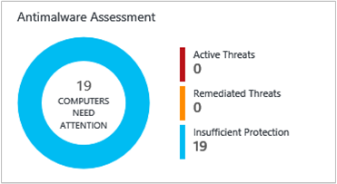
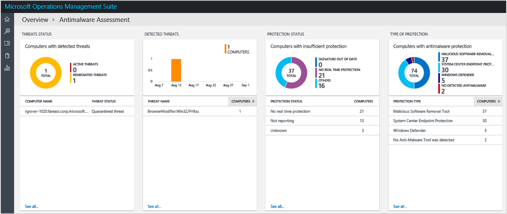
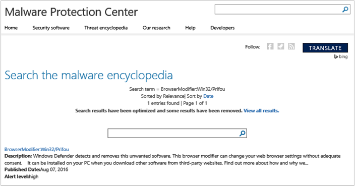
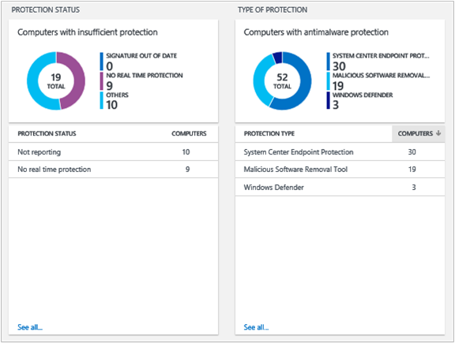

<properties
    pageTitle="Solución de evaluación de malware en el análisis de registro | Microsoft Azure"
    description="Puede usar la solución Antimalware en análisis de registro para informar del estado de protección antimalware en su infraestructura."
    services="log-analytics"
    documentationCenter=""
    authors="bandersmsft"
    manager="jwhit"
    editor=""/>

<tags
    ms.service="log-analytics"
    ms.workload="na"
    ms.tgt_pltfrm="na"
    ms.devlang="na"
    ms.topic="article"
    ms.date="10/10/2016"
    ms.author="banders"/>

# Solución de evaluación de malware en el análisis de registro

Puede usar la solución Antimalware en análisis de registro para informar del estado de protección antimalware en su infraestructura. Instalación de la solución actualiza el agente OMS y la configuración básica para OMS. Estado de protección antimalware y amenazas detectadas en los servidores supervisados se leen y, a continuación, los datos se envían al servicio de análisis de registro en la nube para el procesamiento. Lógica se aplica a los datos recibidos y el servicio de nube registra los datos. Servidores con amenazas detectados y servidores con protección insuficiente se muestran en el panel de **Antimalware** . Con la información en el panel de **Antimalware** , puede identificar un plan para aplicar la protección a los servidores que necesitan.

## Instalar y configurar la solución
Use la información siguiente para instalar y configurar la solución.

- Agregar la solución de evaluación de Malware en el área de trabajo OMS mediante el proceso descrito en [soluciones de agregar el registro de análisis de la Galería de soluciones](log-analytics-add-solutions.md).  No es necesaria realizar ninguna configuración adicional.

## Usar Antimalware

Antimalware estado para informes de análisis de registro:

- Equipos que ejecutan Windows Defender en Windows 8, Windows 8.1, Windows 10 y Windows Server 2016 TP4 o posterior
- Centro de seguridad de Windows (WSC) en Windows 8, Windows 8.1, Windows 10, Windows Server 2016 TP4 o posterior
- Los servidores que ejecutan el sistema Centro Endpoint Protection (v4.5.216 o posterior), Azure máquinas virtuales con la [extensión de antimalware](http://go.microsoft.com/fwlink/?linkid=398023)y herramienta de eliminación de Software malintencionado de Windows (MSRT)  
- Servidores con Windows Management Framework 3 & #40; o posterior & #41; [WMF 3.0](https://support.microsoft.com/kb/2506143), [WMF 4.0](http://www.microsoft.com/download/details.aspx?id=40855).

La solución antimalware no informar actualmente en:

- Servidores que ejecutan Windows Server 2008 y versiones anteriores
- Roles de Web y trabajador en Microsoft Azure
- 3er productos antimalware

Para ayudar a priorizar la adición de nuevas características de voto o agregando una sugerencia nueva en nuestra [página de comentarios](http://feedback.azure.com/forums/267889-azure-operational-insights/category/88093-malware-assessment-solution).

## Detalles de conjunto de datos de evaluación de malware

Evaluación de malware recopila los datos de configuración, metadatos y datos de estado con los agentes que ha habilitado.

La siguiente tabla muestra los métodos de conjunto de datos y otros detalles acerca de cómo se recopilan los datos de evaluación de Malware.

| plataforma | Agente directo | Agente SCOM | Almacenamiento de Azure | ¿SCOM obligatorio? | Datos de agente SCOM enviadas por grupo de administración | frecuencia de la colección |
|---|---|---|---|---|---|---|
|Windows||||            || cada hora|

La siguiente tabla muestra ejemplos de los tipos de datos recopilados por la evaluación de Malware:

|**Tipo de datos**|**Campos**|
|---|---|
|Configuración|IdCliente, AgentID, EntityID, ManagedTypeID, ManagedTypePropertyID, ValorActual, ChangeDate|
|Metadatos|BaseManagedEntityId, ObjectStatus, OrganizationalUnit, ActiveDirectoryObjectSid, PhysicalProcessors, NetworkName, dirección IP, ForestDNSName, NombreDeEquipoNetBIOS, VirtualMachineName, LastInventoryDate, HostServerNameIsVirtualMachine, dirección IP, NetBIOSDomainName., LogicalProcessors, DNSName, DisplayName, DomainDnsName, ActiveDirectorySite, PrincipalName, OffsetInMinuteFromGreenwichTime|
|Estado|StateChangeEventId, el identificador, NewHealthState, OldHealthState, contexto, TimeGenerated, TimeAdded, StateId2, BaseManagedEntityId, MonitorId, HealthState, LastModified, LastGreenAlertGenerated, DatabaseTimeModified|

## Revise las amenazas para servidores

Cuando los equipos están protegidos correctamente, activas amenazas rápidamente puesto en cuarentena por el software antimalware y casi nunca deberían aparecer como amenazas activas. Por este motivo, revise corregidas amenazas que muestran la eficacia de la solución de evaluación de Antimalware en el siguiente procedimiento de ejemplo.

1. En la página **Introducción** , haga clic en el mosaico de la **Evaluación de Antimalware** .  
    
2. En el panel **Antimalware** , revise el módulo **Detectado amenazas** y haga clic en un nombre de servidor con amenazas corregidas.  
    
3. En la página de **búsqueda** puede ver información detallada sobre la amenaza en cuarentena. Junto a la **amenaza**, haga clic en **Ver**.  
    
4. En la página de **búsqueda de la enciclopedia de malware** , haga clic en el elemento de malware para ver más detalles sobre ella.  
    
5. En la página **Centro de protección contra Malware** de Microsoft para el elemento de malware, revise la información de la sección de **Resumen** . Esta sección describe cómo puede detectar el software antimalware y eliminar la amenaza y proporciona información sobre qué amenazas malware posible que tenga que sus equipos.  
    

## Revisar el estado de protección

1. En el panel **Antimalware** , revise el módulo de **Estado de protección** y haga clic en **sin protección en tiempo real**.  
    
2. Búsqueda muestra una lista de servidores sin protección.  
    
3. Se muestran los servidores sin protección en tiempo real.

Equipos que no se admite software antimalware aparecen como **sin protección en tiempo real**.

## Pasos siguientes

- Usar [búsquedas de registro de análisis de registro](log-analytics-log-searches.md) para ver los datos de la evaluación de malware detallada.
