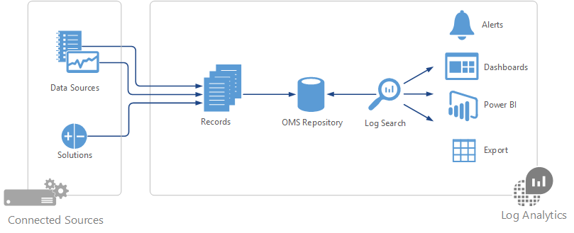
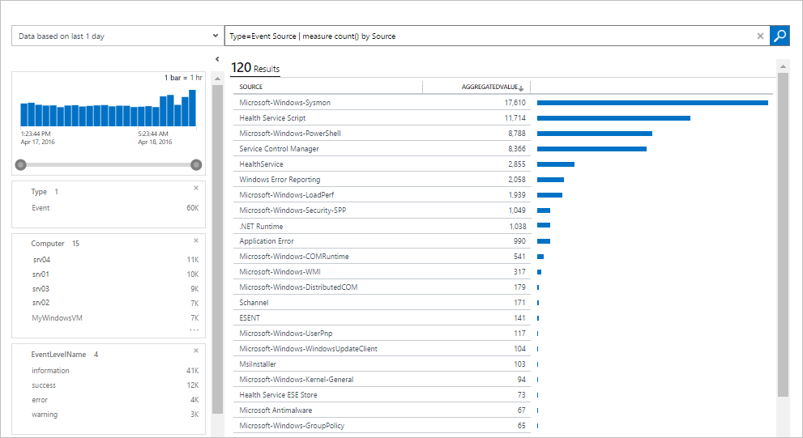

<properties
   pageTitle="¿Qué es el análisis de registro? | Microsoft Azure"
   description="Análisis de registro es un servicio en conjunto de aplicaciones de administración de operaciones (OMS) que le ayuda a recopilar y analizar datos operativos generados por los recursos en la nube y entorno local.  En este artículo se proporciona una breve descripción de los distintos componentes de análisis de registro y vínculos a contenido detallada."
   services="log-analytics"
   documentationCenter=""
   authors="bwren"
   manager="jwhit"
   editor="tysonn" />
<tags
   ms.service="log-analytics"
   ms.devlang="na"
   ms.topic="hero-article"
   ms.tgt_pltfrm="na"
   ms.workload="infrastructure-services"
   ms.date="09/06/2016"
   ms.author="bwren" />

# ¿Qué es el análisis de registro?
Análisis de registro es un servicio en [operaciones Management Suite \(OMS\) ](../operations-management-suite/operations-management-suite-overview.md) que le ayuda a recopilar y analizar datos generados por los recursos en la nube y entornos locales. Proporciona información en tiempo real con búsqueda integrada y paneles personalizados para analizar fácilmente millones de registros en todas las cargas de trabajo y los servidores independientemente de su ubicación física.

## Componentes de análisis de registro
En el centro de análisis de registro es el repositorio OMS que se encuentra en la nube de Azure.  Datos que se recopilan en el repositorio de orígenes conectados soluciones agregar y configurar orígenes de datos a su suscripción.  Orígenes de datos y soluciones de cada creará diferentes tipos de registros que tienen su propio conjunto de propiedades, pero aún se podrán analizar juntos en las consultas en el repositorio.  Esto le permite usar las mismas herramientas y métodos para trabajar con diferentes tipos de datos recopilados por los distintos orígenes.

Orígenes conectados son los equipos y otros recursos que generan los datos recopilados por el análisis de registro.  Esto puede incluir agentes instalados en los equipos de [Windows](log-analytics-windows-agents.md) y [Linux](log-analytics-linux-agents.md) que se conectan directamente o agentes en un [grupo de administración de System Center Operations Manager conectado](log-analytics-om-agents.md).  Análisis de registro también puede recopilar datos de [almacenamiento de Azure](log-analytics-azure-storage.md).

[Orígenes de datos](log-analytics-data-sources.md) son los distintos tipos de datos recopilados de cada origen conectada.  Esto incluye eventos y [datos de rendimiento](log-analytics-data-sources-performance-counters.md) de [Windows](log-analytics-data-sources-windows-events.md) y Linux agentes además de orígenes, como los [registros de IIS](log-analytics-data-sources-iis-logs.md)y [texto personalizado](log-analytics-data-sources-custom-logs.md).  Configurar cada origen de datos que desean recopilar y, a continuación, la configuración se entrega automáticamente a cada origen conectada.

## Analizar los datos de análisis de registro
La mayoría de la interacción con el análisis de registro será a través del portal OMS que se ejecuta en cualquier explorador y proporciona acceso a configuración y varias herramientas para analizar y actuar en los datos recopilados.  Desde el portal puede aprovechar [las búsquedas de registro](log-analytics-log-searches.md) donde se construir consultas para analizar los datos recopilados, los [paneles](log-analytics-dashboards.md) que puede personalizar con vistas gráficas de sus búsquedas más valiosas y [soluciones](log-analytics-add-solutions.md) que proporcionan funciones adicionales y herramientas de análisis.

Análisis de registro proporciona una sintaxis de consulta para recuperar rápidamente y consolidar datos en el repositorio.  Puede crear y guardar el [Registro de búsquedas](log-analytics-log-searches.md) para analizar los datos en el portal OMS directamente o disponen de búsquedas de registro ejecutar automáticamente para crear una alerta si los resultados de la consulta indican una condición importante.

Para dar a una vista rápida gráfica del estado de su entorno general, puede agregar visualizaciones para las búsquedas de registro guardado a su [escritorio](log-analytics-dashboards.md).   

Para analizar datos fuera de análisis de registro, puede exportar los datos del repositorio de OMS en herramientas como [Power BI](log-analytics-powerbi.md) o Excel.  También puede aprovechar la [API de búsqueda de registro](log-analytics-log-search-api.md) para crear soluciones personalizadas aprovechar los datos de análisis de registro o integrar con otros sistemas.

## Soluciones
Soluciones agregan funcionalidad al análisis de registro.  Principalmente se ejecutan en la nube y proporcionar análisis de datos recopilados en el repositorio OMS. También pueden definir nuevos tipos de registro que se deben recopilar que se pueden analizar con búsquedas de registros o mediante la interfaz de usuario adicionales proporcionada por la solución en el panel OMS.  

Soluciones están disponibles para una gran variedad de funciones y podrá examinar fácilmente soluciones disponibles y [agregarlas a su área de trabajo OMS](log-analytics-add-solutions.md) desde la Galería de soluciones.  Muchos se implementará automáticamente y comenzar a trabajar de forma inmediata mientras otras personas pueden requieren una configuración.

## Arquitectura de análisis de registro
Los requisitos de implementación de análisis de registro son mínimos, ya que se hospedan los componentes central en la nube de Azure.  Esto incluye el repositorio además de los servicios que le permiten relacionar y analizar los datos recopilados.  El portal puede tener acceso desde cualquier explorador para que no es necesario para el software cliente.

Debe instalar a agentes en equipos con [Windows](log-analytics-windows-agents.md) y [Linux](log-analytics-linux-agents.md) , pero no hay ningún agente adicional necesario para equipos que ya son miembros de un [grupo de administración de SCOM conectado](log-analytics-om-agents.md).  Agentes SCOM seguirá comunicarse con los servidores de administración que reenvían sus datos para el análisis de registro.  Aunque algunas soluciones requieren agentes para comunicarse directamente con el análisis de registro.  La documentación de cada solución especificará sus requisitos de comunicación.

[Iniciar sesión en el análisis de registro](log-analytics-get-started.md), que tendrá que crear un área de trabajo OMS.  Puede considerar que el área de trabajo como un único entorno de OMS con su propio repositorio de datos, orígenes de datos y soluciones. Puede crear varias áreas de trabajo en su suscripción de prueba y admite varios entornos como producción.

## Pasos siguientes

- [Suscribirse a una cuenta gratuita de análisis de registro](log-analytics-get-started.md) para probar en su entorno.
- Ver los distintos [Orígenes de datos](log-analytics-data-sources.md) disponibles para recopilar datos en el repositorio OMS.
- [Examinar las soluciones disponibles en la Galería de soluciones](log-analytics-add-solutions.md) para agregar funcionalidad al análisis de registro.
