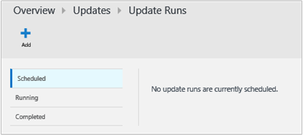

<properties
    pageTitle="Solución de evaluación de actualización de sistema de análisis de registro | Microsoft Azure"
    description="Puede usar la solución de actualizaciones del sistema de análisis de registro para ayudarle a aplicar las actualizaciones que faltan en servidores de la infraestructura."
    services="log-analytics"
    documentationCenter=""
    authors="bandersmsft"
    manager="jwhit"
    editor=""/>

<tags
    ms.service="log-analytics"
    ms.workload="na"
    ms.tgt_pltfrm="na"
    ms.devlang="na"
    ms.topic="article"
    ms.date="08/11/2016"
    ms.author="banders"/>

# Solución de evaluación de actualización de sistema de análisis de registro

Puede usar la solución de actualizaciones del sistema de análisis de registro para ayudarle a aplicar las actualizaciones que faltan en servidores de la infraestructura. Después de instalar la solución, puede ver las actualizaciones que faltan en los servidores supervisados utilizando el mosaico de la **Evaluación de actualización de sistema** en la página de **información general** de OMS.

Si se encuentran las actualizaciones que faltan, se muestran detalles en el panel de **actualizaciones** . Puede usar el panel de **actualizaciones** para trabajar con las actualizaciones que faltan y desarrollar un plan para aplicarlos a los servidores que necesiten.

## Instalar y configurar la solución
Use la información siguiente para instalar y configurar la solución.

- Agregar la solución de evaluación de actualización de sistema al área de trabajo OMS con el proceso descrito en [soluciones de agregar el registro de análisis de la Galería de soluciones](log-analytics-add-solutions.md).  No es necesaria realizar ninguna configuración adicional.

## Detalles de conjunto de datos de actualización de sistema

Evaluación de actualización de sistema recopila metadatos y estado de los datos con los agentes que ha habilitado.

La siguiente tabla muestra los métodos de conjunto de datos y otros detalles acerca de cómo se recopilan los datos de evaluación de actualización de sistema.

| plataforma | Agente directo | Agente SCOM | Almacenamiento de Azure | ¿SCOM obligatorio? | Datos de agente SCOM enviadas por grupo de administración | frecuencia de la colección |
|---|---|---|---|---|---|---|
|Windows||||            || Al menos de 2 horas por día y 15 minutos después de instalar una actualización|

La siguiente tabla muestra ejemplos de los tipos de datos recopilados por la evaluación de actualización del sistema:

|**Tipo de datos**|**Campos**|
|---|---|
|Metadatos|BaseManagedEntityId, ObjectStatus, OrganizationalUnit, ActiveDirectoryObjectSid, PhysicalProcessors, NetworkName, dirección IP, ForestDNSName, NombreDeEquipoNetBIOS, VirtualMachineName, LastInventoryDate, HostServerNameIsVirtualMachine, dirección IP, NetBIOSDomainName., LogicalProcessors, DNSName, DisplayName, DomainDnsName, ActiveDirectorySite, PrincipalName, OffsetInMinuteFromGreenwichTime|
|Estado|StateChangeEventId, el identificador, NewHealthState, OldHealthState, contexto, TimeGenerated, TimeAdded, StateId2, BaseManagedEntityId, MonitorId, HealthState, LastModified, LastGreenAlertGenerated, DatabaseTimeModified|

### Para trabajar con las actualizaciones

1. En la página **Introducción** , haga clic en el mosaico de la **Evaluación de actualización de sistema** .  
    
2. En el panel de **actualizaciones** , ver las categorías de actualización.  
    
3. Desplácese a la derecha de la página para ver el módulo de **Las actualizaciones de tareas críticas de seguridad de Windows** y, a continuación, en la **clasificación**, haga clic en **Actualizaciones de seguridad**.  
    
4. En la página de búsqueda de registros, se muestra una gran variedad de información sobre las actualizaciones de seguridad que se han encontrado falta de servidores de la infraestructura. Haga clic en la **lista** para ver información detallada sobre las actualizaciones.  
    
5. En la página de búsqueda de registros, se muestra información detallada sobre cada actualización. Junto al número KBID, haga clic en **la vista** para ver el artículo correspondiente en el sitio Web de soporte técnico de Microsoft.  
    
6. El explorador web abre la página Web de soporte técnico de Microsoft para la actualización en una nueva pestaña. Ver la información acerca de la actualización que falta.  
    
7. Mediante el uso de la información que haya encontrado, puede crear un plan para aplicar manualmente la actualización falta o puede seguir los restantes pasos siguientes para aplicar automáticamente la actualización.
8. Si desea aplicar automáticamente la actualización que faltan, vuelva al panel de **actualizaciones** y en **Ejecuciones actualizar**, haga clic en **haga clic aquí para programar una actualización ejecutar**.  
    
9. En la página **Se ejecuta actualizar** en la ficha **periódicamente** , haga clic en **Agregar** para crear una nueva ejecución de actualización.  
    
10. En la página **Nuevo actualizar ejecutar** , escriba un nombre para la actualización de ejecutar, agregar individuales o grupos de equipos, definir una programación y, a continuación, haga clic en **Guardar**.  
    
11. La ficha **programada** en la página **Actualizar ejecuciones** muestra la nueva actualización ejecutar que haya programado.  
    
12. Cuando se inicie la actualización, ejecute, verá información en la pestaña **ejecutando** .  
    
13. Una vez completada la actualización, ejecute, la pestaña **completado** muestra el estado.
14. Si se han aplicado las actualizaciones de la actualización de ejecutar, en el módulo de **Las actualizaciones de tareas críticas de seguridad de Windows** , verá que se reduce el número de actualizaciones.  
    

## Pasos siguientes

- [Registros de búsqueda](log-analytics-log-searches.md) para ver los datos de actualización detallada del sistema.
