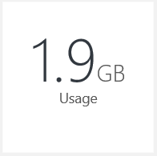

<properties
    pageTitle="Analizar el uso de datos de análisis de registro | Microsoft Azure"
    description="Puede usar la página uso de análisis de registro para ver la cantidad de datos se envía al servicio de OMS."
    services="log-analytics"
    documentationCenter=""
    authors="bandersmsft"
    manager="jwhit"
    editor=""/>

<tags
    ms.service="log-analytics"
    ms.workload="na"
    ms.tgt_pltfrm="na"
    ms.devlang="na"
    ms.topic="get-started-article"
    ms.date="08/11/2016"
    ms.author="banders"/>

# Analizar el uso de datos de análisis de registro

Análisis de registro en el conjunto de administración de operaciones (OMS) recopila datos y envía al servicio de OMS periódicamente.  Puede usar la página de **uso** para ver la cantidad de datos se envía al servicio de OMS. La página **uso** también muestra la cantidad de datos que se envía diariamente soluciones y con qué frecuencia los servidores envían datos.

>[AZURE.NOTE] Si tiene una cuenta gratuita creada con el [sitio web OMS](http://www.microsoft.com/oms), está limitado a enviar 500 MB de datos al servicio de OMS diariamente. Si alcanza el límite diariamente, análisis de datos detener y reanudar al inicio del día siguiente. También deberá volver a enviar los datos que no se han aceptado o procesados por OMS.

Puede ver su uso con el icono de **uso** en el panel de **información general** de OMS.

Si ha superado el límite de uso diario, o si se encuentra cerca de su límite, opcionalmente, puede quitar una solución para reducir la cantidad de datos que envíe al servicio de OMS. Para obtener más información acerca de cómo quitar soluciones, vea [soluciones de agregar el registro de análisis de la Galería de soluciones](log-analytics-add-solutions.md).

La página **uso** muestra la siguiente información:

- Uso promedio por día
- Uso de datos para cada solución durante los últimos 30 días
- ¿Cuánto para enviar datos de los servidores de su entorno al servicio de OMS durante los últimos 30 días
- Su plan de datos de precios nivel y costo estimado
- Información sobre el contrato de nivel de servicio (SLA), incluidos cuánto tiempo tarda OMS para procesar los datos

## Para trabajar con datos de uso

1. En la página **Introducción** , haga clic en el icono de **uso** .
2. En la página de **uso** , ver las categorías de uso que muestran áreas que le preocupa.
3. Si tiene una solución que consume demasiado la cuota diaria de la carga, considere la posibilidad de quitar esa solución.

## Para ver el costo estimado y la información de facturación
1. En la página **Introducción** , haga clic en el icono de **uso** .
2. En la página de **uso** en **uso**, haga clic en el cheurón (**>**) junto a **costo estimado**.
3. En el esquema detalles de **su plan de datos** , puede ver su estimado costo mensual.  
    
4. Si desea ver la información de facturación, haga clic en **Ver mi factura** para ver la información de la suscripción.
    - En la página suscripciones, haga clic en la suscripción para ver los detalles y una lista de elementos de línea de uso.  
        
    - En la página Resumen de la suscripción, puede realizar una gran variedad de tareas para administrar y ver más detalles acerca de la suscripción.  
        

## Para ver los lotes de datos para su SLA
1. En la página **Introducción** , haga clic en el icono de **uso** .
2. **Contrato de nivel de servicio**, haga clic en **Descargar SLA detalles**.
3. Se descarga un archivo de Excel para que revisarlo.  
    

## Pasos siguientes

- Consulte las [búsquedas de registro de análisis de registro](log-analytics-log-searches.md) para ver información detallada recopilada por soluciones.
