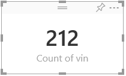
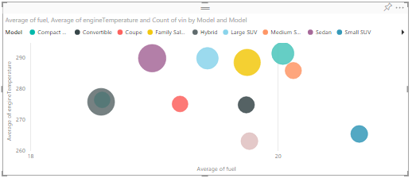
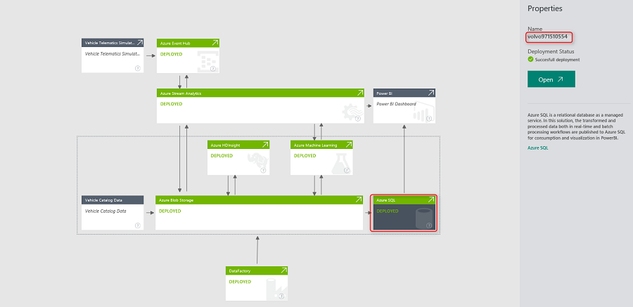
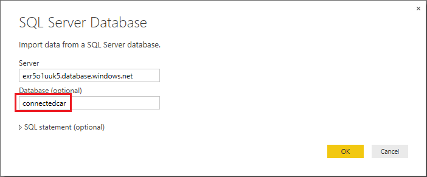
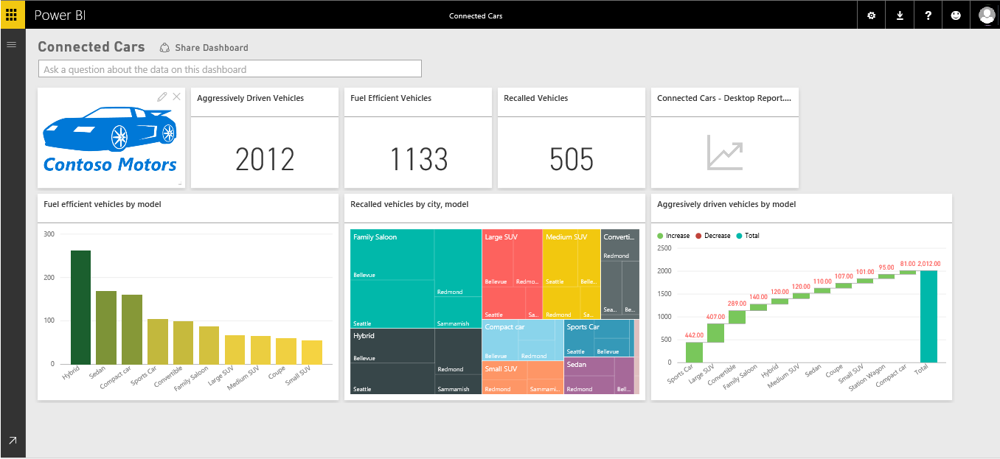

<properties 
    pageTitle="Instrucciones de configuración de la plantilla de la solución de análisis de telemetría vehículo paneles PowerBI | Microsoft Azure" 
    description="Usar las capacidades de inteligencia de Cortana para obtener perspectivas en tiempo real y predictivas en estado de vehículo y conducción hábitos." 
    services="machine-learning" 
    documentationCenter="" 
    authors="bradsev" 
    manager="jhubbard" 
    editor="cgronlun" />

<tags 
    ms.service="machine-learning" 
    ms.workload="data-services" 
    ms.tgt_pltfrm="na" 
    ms.devlang="na" 
    ms.topic="article" 
    ms.date="09/12/2016" 
    ms.author="bradsev" />

# Instrucciones de instalación de vehículo telemetría análisis solución plantilla PowerBI paneles

Vínculos de este **menú** los capítulos en esta guía. 

[AZURE.INCLUDE [cap-vehicle-telemetry-playbook-selector](../../includes/cap-vehicle-telemetry-playbook-selector.md)]

La solución de análisis de telemetría de vehículo muestra cómo concesiones de coches, fabricantes de automóviles y las empresas de seguros pueden aprovechar las capacidades de inteligencia de Cortana para obtener recomendaciones predictivas y en tiempo real sobre el mantenimiento de vehículo y experiencia de conducción hábitos para impulsar mejoras en el área de cliente, I+d y campañas de marketing. Este documento contiene instrucciones paso a paso sobre cómo configurar los paneles e informes de PowerBI una vez que se implementa la solución en la suscripción. 

## Requisitos previos
1.  Implementar la solución de análisis de telemetría de vehículo desplazándose hasta [https://gallery.cortanaanalytics.com/SolutionTemplate/Vehicle-Telemetry-Analytics-3](https://gallery.cortanaanalytics.com/SolutionTemplate/Vehicle-Telemetry-Analytics-3)  
2.  [Instalar Microsoft Power BI Desktop](http://www.microsoft.com/download/details.aspx?id=45331)
3.  Una [suscripción de Azure](https://azure.microsoft.com/pricing/free-trial/). Si no tiene una suscripción de Azure, introducción a la suscripción gratuita de Azure
4.  Cuenta de Microsoft PowerBI
    

## Componentes de conjunto de aplicaciones de inteligencia de Cortana
Como parte de la plantilla de solución de análisis de telemetría de vehículo, se implementan los siguientes servicios de inteligencia de Cortana en la suscripción.

- **Evento Hubs** para recopila millones de eventos de telemetría vehículo en Azure.
- **Secuencia analítico**s para obtener información en tiempo real sobre el mantenimiento de vehículo y continúa esos datos en un almacenamiento a largo plazo para análisis de lote más rico.
- **Aprendizaje** para la detección de anomalías en tiempo real y el proceso por lotes para obtener recomendaciones predictivas.
- **HDInsight** se aprovecha para transformar datos a escala
- **Generador de datos** controla orquestación, programación, administración de recursos y el seguimiento de la canalización de proceso por lotes.

**Power BI** le ofrece esta solución un panel enriquecido para datos en tiempo real y visualizaciones de análisis predictiva. 

La solución utiliza dos distintos orígenes de datos: **vehículo simulada señales y conjunto de datos de diagnóstico** y **catálogo de vehículo**.

Un simulador de telemáticas vehículo se incluye como parte de esta solución. Envía información de diagnóstico y señales corresponde al estado de vehículo y conducción trama en un momento determinado en el tiempo. 

El catálogo de vehículo es un conjunto de datos de referencia que contengan bastidor a asignación de modelo

## Preparación del panel de PowerBI

### Implementación

Una vez completada la implementación, verá el siguiente diagrama con todos estos componentes marcados en verde. 

- Para navegar a los servicios correspondientes para validar si todos estos han implementado correctamente, haga clic en la flecha situada en la esquina superior derecha de los nodos verdes.
- Para descargar el paquete de simulator de datos, haga clic en la flecha situada en la esquina superior derecha en el nodo de **Vehículo telemáticas Simulator** . Guardar y extraer los archivos localmente en el equipo. 

Ahora, está listo para configurar el panel de PowerBI con eficaces visualizaciones a ganar en tiempo real y perspectivas predictivas en estado de vehículo y realizar la transformación. Tarda aproximadamente 45 minutos a una hora para crear todos los informes y configurar el escritorio. 

### Panel de configuración Power BI en tiempo real

**Generar datos simuladas**

1. En el equipo local, vaya a la carpeta donde se extrae el paquete de vehículo telemáticas Simulator
2.  Ejecute la aplicación ***CarEventGenerator.exe***.
3.  Envía información de diagnóstico y señales corresponde al estado de vehículo y conducción trama en un momento determinado en el tiempo. Esto se publica en una instancia de Azure evento concentrador que está configurada como parte de su implementación.

     
**Inicie la aplicación de escritorio en tiempo real**

La solución incluye una aplicación que genera un panel en tiempo real en PowerBI. Esta aplicación escucha una instancia de evento concentrador, desde el que el análisis de secuencia publica los eventos continuamente. Para todos los eventos que recibe de esta aplicación, procesa los datos mediante un extremo de puntuación de aprendizaje de petición de respuesta del equipo. El conjunto de datos resultante se publica en la API de inserción de PowerBI para visualización. 

Para descargar la aplicación:

1.  Haga clic en el nodo PowerBI en la vista de diagrama y haga clic en la **Aplicación de escritorio en tiempo real descargar**' vínculo en el panel de propiedades.
2.  Extraer y guarde la aplicación localmente

3.  Ejecutar la aplicación **RealtimeDashboardApp.exe**
4.  Proporcione credenciales válidas de Power BI, inicio de sesión y haga clic en **Aceptar**
    
    
    
    

### Configurar informes de PowerBI
Los informes en tiempo real y el panel tarden unos 30 y 45 minutos en completarse. Vaya a [http://powerbi.com](http://powerbi.com) e inicie sesión.

Se genera un nuevo conjunto de datos en Power BI. Haga clic en el conjunto de datos de **ConnectedCarsRealtime** .

Guarde el informe en blanco con **Ctrl + s**.

Proporcionar *informes en tiempo real de un vehículo telemetría análisis -*nombre del informe.

## Informes en tiempo real
Hay tres informes en tiempo real en esta solución:

1.  Vehículos de la operación
2.  Vehículos que requieren mantenimiento
3.  Estadísticas de salud de vehículos

Puede configurar todos los informes en tiempo real tres o detener después de cualquier región y continuar con la siguiente sección de la configuración de los informes de lote. Se recomienda crear todos los tres informes para visualizar la información completa de la ruta de acceso en tiempo real de la solución.  

### 1. vehículos de operación
  
Haga doble clic en **la página 1** y cambiarle el nombre a "Vehículos en operación"  
      

Seleccione el campo de **bastidor** de **campos** y elija el tipo de visualización como **"Tarjeta"**.  

Visualización de tarjeta se crea como se muestra en la ilustración.  
    

Haga clic en el área en blanco para agregar una visualización nueva.  

Seleccione **Ciudad** y **bastidor** de campos. Cambiar la visualización a **"Básica"**. Arrastre **bastidor** en el área de valores. Arrastre **Ciudad** de campos al área de la **leyenda** .   
    
  
Seleccione la sección **formato** de **visualizaciones**, haga clic en **título** y cambiar el **texto** a **"Vehículos en operación por ciudad"**.  
       

Visualización final es como se muestra en la ilustración.    
    

Haga clic en el área en blanco para agregar una visualización nueva.  

Seleccione **Ciudad** y **bastidor**, cambie el tipo de visualización a **Gráfico de columnas agrupadas**. Garantizar el campo **Ciudad** en el **área eje** y **bastidor** en el **área de valores**  

Ordenar gráfico **"Recuento de bastidor"**  
      

Cambiar el **título** de gráfico a **"Vehículos en operación por ciudad"**  

Haga clic en la sección **formato** , seleccione **Colores de datos**, haga clic en la **"En"** **Mostrar** todo  
      

Cambiar el color de la ciudad individual haciendo clic en el icono de color.  
      

Haga clic en el área en blanco para agregar una visualización nueva.  

Seleccione la visualización de **Gráfico de columnas agrupadas** de visualizaciones, arrastre el campo **Ciudad** en área de **eje** , **modelo** en el área de la **leyenda** y el **número de bastidor** en el área de **valores** .  
      
    
  
Reorganizar visualización todo en esta página como se muestra en la ilustración.  
    

Ha configurado correctamente el informe en tiempo real de "Vehículos en operación de". Puede continuar para crear el siguiente informe en tiempo real o detener aquí y configurar el escritorio. 

### 2. necesidad de mantenimiento de vehículos de
  
Haga clic en  para agregar un nuevo informe, cambiarle el nombre a **"vehículos que requieren mantenimiento"**

  

Seleccione el campo de **bastidor** y cambiar el tipo de visualización a **tarjeta**.  
      

Tenemos un campo denominado "MaintenanceLabel" en el conjunto de datos. Este campo puede tener un valor de "0" o "1"." Se establece el modelo de aprendizaje del equipo de Azure aprovisionado como parte de la solución e integrado con la ruta de acceso en tiempo real. El valor "1" indica que un vehículo requiere mantenimiento. 

Para agregar un filtro de **Nivel de página** para mostrar los datos de vehículos, que requieren mantenimiento: 

1. Arrastre el campo **"MaintenanceLabel"** **Los filtros de nivel de página**.  
  

2. Haga clic en menú de **Filtrado básico de** presentar en la parte inferior del filtro de nivel de página de MaintenanceLabel.  
  

3.  Establezca su valor de filtro en **"1"**    
  

Haga clic en el área en blanco para agregar una visualización nueva.  

Seleccione el **Gráfico de columnas agrupadas** de visualizaciones  
  

Arrastre el campo **modelo de** área de **eje** , **bastidor** al área de **valor** . A continuación, ordenar la visualización por **número de bastidor**.  Cambiar el **título** de gráfico a **"Vehículos que requieren mantenimiento modelo"**  

Arrastrar campos de **bastidor** **Saturación de Color** presente en **campos**  sección de la pestaña **visualización**  
  

Cambiar los **Colores de datos** en visualizaciones de la sección **formato**  
Cambiar el color de mínima: **F2C812**  
Cambiar el color de máximo: **FF6300**  
  
  

Haga clic en el área en blanco para agregar una visualización nueva.  

Seleccione **gráfico de columna agrupada** de visualizaciones, arrastre el campo de **bastidor** área de **valor** , arrastre el campo **Ciudad** en el área **eje** . Ordenar gráfico **"Recuento de bastidor"**. Cambiar el **título** de gráfico a **"Vehículos que requieren mantenimiento por ciudad"**   
  

Haga clic en el área en blanco para agregar una visualización nueva.  

Seleccione la visualización de **Tarjeta de varias filas** de visualizaciones, arrastre **modelo** y **número de bastidor** en el área de **campos** .  
    

Reorganizar todo de la visualización, el informe final tiene el siguiente aspecto:  
  

Ha configurado correctamente el informe en tiempo real "Vehículos que requieren mantenimiento". Puede continuar para crear el siguiente informe en tiempo real o detener aquí y configurar el escritorio. 

### 3. estadísticas de salud de vehículos
  
Haga clic en  para agregar nuevo informe, cambiarle el nombre a **"estadísticas de salud de vehículos"**  

Seleccione la visualización de **indicadores** de visualizaciones y luego arrastre el campo de **velocidad** en áreas de **valor, el valor mínimo, valor máximo** .  
  

Cambiar la agregación predeterminada de **velocidad** en el **área de valores** a **promedio** 

Cambiar la agregación predeterminada de la **velocidad** de **área mínima** **mínimo**

Cambiar la agregación predeterminada de la **velocidad** de **área máxima** **máximo**

  

Cambie el nombre del **Título de indicadores** a **"Velocidad media"** 
 
  

Haga clic en el área en blanco para agregar una visualización nueva.  

De manera similar a agregar un **indicador** de **oil motor promedio**, **medio**y **promedio motor templada**.  

Indicador de cambio de la agregación predeterminada de los campos en cada indicador como por encima de los pasos de **"Velocidad media"** .

Haga clic en el área en blanco para agregar una visualización nueva.

Seleccione **líneas y gráfico de columnas agrupadas** de visualizaciones y, a continuación, arrastre el campo de **Ciudad** en **Eje compartido**, arrastre **velocidad**, **campos tirepressure y engineoil** en el área de **Valores de columna** , cambie su tipo de agregación a **promedio**. 

Arrastre el campo **engineTemperature** área de **Valores de la línea** , cambie el tipo de agregación a **promedio**. 

Cambiar el **título** de gráfico **"velocidad media, presión neumático, oil motor**y temperatura motor".  

Haga clic en el área en blanco para agregar una visualización nueva.

Seleccione la visualización de **rectángulos** de visualizaciones, arrastre el campo de **modelo** en el área de **grupo** y arrastre el campo **MaintenanceProbability** al área **valores** .

Cambiar el **título** de gráfico a **"Modelos de vehículo que requieren mantenimiento"**.

Haga clic en el área en blanco para agregar una visualización nueva.

Seleccione el **gráfico de barras apiladas 100%** de visualización, arrastre el campo **Ciudad** en el área **eje** y arrastre la **MaintenanceProbability**, **RecallProbability** campos en el área de **valores** .

Haga clic en **formato**, seleccione **Colores de datos**y establezca el color de **MaintenanceProbability** en el valor **"F2C80F"**.

Cambiar el **título** del gráfico para **"probabilidad de vehículo mantenimiento & recuperar por ciudad"**.

Haga clic en el área en blanco para agregar una visualización nueva.

Seleccione el **Gráfico de área** de visualización de visualizaciones, arrastre el campo de **modelo** en el área **eje** y arrastre los campos **engineOil, tirepressure, velocidad y MaintenanceProbability** al área **valores** . Cambie su tipo de agregación a **"Promedio"**. 

Cambiar el título del gráfico **"promedio oil motor**, neumáticos probabilidad presión, velocidad y del mantenimiento del modelo de".

Haga clic en el área en blanco para agregar una visualización nueva:

1. Seleccione la visualización del **Gráfico de dispersión** de visualizaciones.
2. Arrastre el campo de **modelo** en el área **Detalles** y la **leyenda** .
3. Arrastre el campo de **combustible** al área del **eje x** , cambie la agregación a **promedio**.
4. Arrastre **engineTemparature** **eje y área**, cambie la agregación a **promedio**
5. Arrastre el campo **número de bastidor** en el área de **tamaño** .

Cambiar el **título** de gráfico **"promedios de combustible**, temperatura de motor modelo".

El informe final tendrá un aspecto similar a como se muestra a continuación.

### Visualizaciones de PIN de los informes a un panel en tiempo real
  
Crear un panel en blanco haciendo clic en el icono de signo más junto a los paneles. Puede asignarle un nombre "Panel de análisis de telemetría de vehículo"

Anclar la visualización de los informes anteriores al escritorio. 
 

El panel debe tener el siguiente aspecto cuando se crean los tres informes y las visualizaciones correspondientes están ancladas a los paneles. Si no ha creado todos los informes, el panel puede tener un aspecto diferente. 

¡Felicidades! Ha creado correctamente el panel en tiempo real. Continuar ejecutar CarEventGenerator.exe y RealtimeDashboardApp.exe, verá las actualizaciones automáticas en el panel. Tardará unos 10 o 15 minutos para completar los pasos siguientes.

 
##  Panel de procesamiento por lotes de Power BI de instalación

>[AZURE.NOTE] Tarda aproximadamente dos horas (desde el éxito de la implementación) para que la canalización de proceso por lotes de llevar a cabo finalizar la ejecución y procesar un año patrimonio de datos generadas. Así que esperar a que el procesamiento finalizar antes de continuar con los siguientes pasos. 

**Descargar el archivo del Diseñador de PowerBI**

-   Un archivo de diseñador PowerBI preconfigurado se incluye como parte de la implementación
-   Haga clic en el nodo PowerBI en la vista de diagrama y haga clic en **descargar el archivo del Diseñador de PowerBI** vínculo en el panel de propiedades

-   Guardar localmente

**Configurar informes de PowerBI**

-   Abra el archivo del diseñador 'VehicleTelemetryAnalytics - Report.pbix escritorio' mediante PowerBI escritorio. Si ya no tiene, instale la versión de escritorio de PowerBI de [escritorio PowerBI instalar](http://www.microsoft.com/download/details.aspx?id=45331). 

-   Haga clic en **Editar consultas**.

- Haga doble clic en el **origen**.

- Actualizar la cadena de conexión de servidor con el servidor de SQL Azure obtuvo aprovisionado como parte de la implementación. Haga clic en el nodo de SQL Azure en el diagrama y ver el nombre del servidor del panel de propiedades.

- Deje la **base de datos** como *connectedcar*.

- Haga clic en **Aceptar**.
- Verá ficha de **credenciales de Windows** seleccionado de manera predeterminada, cambie a **las credenciales de la base de datos** haciendo clic en la pestaña de la **base de datos** a la derecha.
- Proporcione el **nombre de usuario** y **contraseña** de la base de datos de SQL Azure que se especificó durante la instalación de su implementación.

- Haga clic en **Conectar**
- Repita los pasos anteriores para cada una de las tres consultas restantes presentes en el panel derecho y, a continuación, actualice los detalles de conexión de origen de datos.
- Haga clic en **Cerrar y volver a cargar**. Conjuntos de datos de Power BI Desktop archivo están conectadas a las tablas de base de datos de SQL Azure.
- **Cerrar** Archivo de Power BI Desktop.

- Haga clic en el botón **Guardar** para guardar los cambios. 
 
Se han configurado todos los informes que corresponde a la ruta de procesamiento de lote de la solución. 

## Cargar en *powerbi.com*
 
1.  Desplácese hasta el portal de web PowerBI http://powerbi.com y el inicio de sesión.
2.  Haga clic en **obtener datos**  
3.  Cargue el archivo de Power BI Desktop.  
4.  Para cargar, haga clic en **obtener datos -> archivos Get -> archivo Local**  
5.  Vaya a la **"VehicleTelemetryAnalytics-Report.pbix escritorio"**  
6.  Una vez que el archivo se carga, se le dirigirá a su espacio de trabajo de Power BI.  

Se creará un conjunto de datos, informe y un panel en blanco para usted.  
 

Gráficos de anclar al escritorio existente del **Panel de análisis de telemetría vehículo** en **Power BI**. Haga clic en el escritorio en blanco creado anteriormente y, a continuación, vaya a la sección **informes** , haga clic al informe acaba de cargar.  

 

**Tenga en cuenta que el informe tiene seis páginas:**  
Página 1: Densidad vehículo  
La página 2: Estado vehículo en tiempo real  
Página 3: Agresiva controlados por vehículos   
Página 4: Recuperar vehículos  
Página 5: Combustible eficazmente controlados por vehículos  
Página 6: Logotipo de Contoso  

 

**Desde página 3**, pin lo siguiente:  

1.  Recuento de bastidor  
     

2.  Agresiva controlados vehículos por modelo: gráfico de cascada  
    

**Desde página 5**, pin lo siguiente: 
 
1.  Recuento de bastidor    
      
2.  Vehículos eficaces de combustible por modelo: gráfico de columnas agrupadas  
    

**Desde página 4**, pin lo siguiente:  

1.  Recuento de bastidor  
     

2.  Modelo de vehículos recuperados por ciudad,: rectángulos  
      

**Desde el 6 de página**, pin lo siguiente:  

1.  Logotipo de motores de Contoso  
    

**Organizar los paneles**  

1.  Vaya a panel
2.  Mantenga el mouse sobre cada gráfico y cambiar el nombre en función de los nombres en la siguiente imagen de escritorio completa. También desplazarse los gráficos de aspecto de los paneles a continuación.  
      
    
3.  Si ha creado todos los informes como mencionados en este documento, el panel completado final debe tener un aspecto similar a la siguiente ilustración. 

¡Felicidades! Ha creado correctamente los informes y los paneles para obtener en tiempo real, predictiva y lote perspectivas en estado de vehículo y conducción transformación.  
