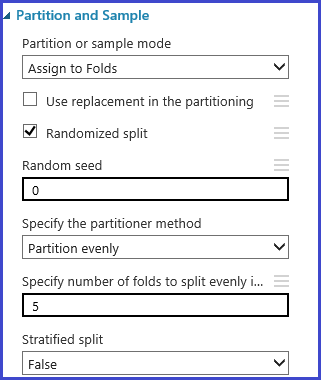
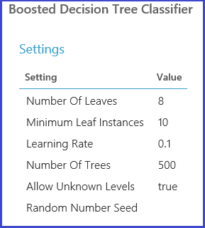
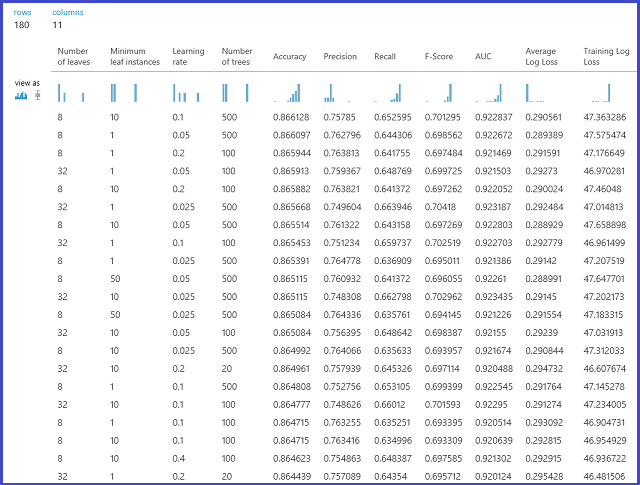

<properties
    pageTitle="Elegir parámetros para optimizar los algoritmos en aprendizaje de máquinas de Azure | Microsoft Azure"
    description="Explica cómo elegir el parámetro óptimo establecido para un algoritmo de aprendizaje automático de Azure."
    services="machine-learning"
    documentationCenter=""
    authors="bradsev"
    manager="jhubbard"
    editor="cgronlun"/>

<tags
    ms.service="machine-learning"
    ms.workload="data-services"
    ms.tgt_pltfrm="na"
    ms.devlang="na"
    ms.topic="article"
    ms.date="09/12/2016"
    ms.author="bradsev" />

# Elegir parámetros para optimizar los algoritmos en aprendizaje de máquinas de Azure

Este tema describe cómo elegir el derecho hyperparameter establecido para un algoritmo de aprendizaje de la máquina de Azure. La mayoría de los algoritmos de aprendizaje de la máquina tiene parámetros para configurar. Cuando entrena un modelo, debe proporcionar valores para esos parámetros. La eficacia del modelo capacitado depende de los parámetros del modelo que elija. El proceso de encontrar el conjunto óptimo de parámetros se conoce como *selección del modelo*.

[AZURE.INCLUDE [machine-learning-free-trial](../../includes/machine-learning-free-trial.md)]

Hay varias formas de la selección del modelo. En el aprendizaje de la máquina, validación cruzada es uno de los métodos más utilizados para la selección del modelo, y es el mecanismo de selección de modelo por defecto en el aprendizaje de la máquina de Azure. Dado que el aprendizaje Azure admite R y Python, siempre puede implementar sus propios mecanismos de selección de modelo mediante R o Python.

Hay cuatro pasos en el proceso de encontrar el mejor conjunto de parámetros:

1.  **Definir el espacio de parámetros**: para el algoritmo, primero debe decidir los valores de parámetro exacto que desee tener en cuenta.
2.  **Configuración de definir la validación cruzada**: decidir cómo elegir pliegues de validación cruzada para el conjunto de datos.
3.  **Definir la métrica**: decidir qué métrica para determinar el mejor conjunto de parámetros, como la precisión, Media raíz cuadrado error, precisión, recuperación o puntuación de f.
4.  **Tren, evaluar y comparar**: para cada combinación única de valores de los parámetros, es llevado a cabo por validación cruzada y se basa en la métrica de error se define. Después de la evaluación y la comparación, puede elegir el modelo de mejor rendimiento.

En la siguiente imagen ilustra muestra cómo esto se puede lograr en el aprendizaje de la máquina de Azure.

## Definir el espacio de parámetros
Puede definir el parámetro establecido en el paso de inicialización del modelo. El panel de parámetros de todos los algoritmos de aprendizaje de la máquina tiene dos modos de instructor: *Parámetro único* y *Rango de parámetros*. Elija modo de rango de parámetros. En el modo de rango de parámetros, puede especificar varios valores para cada parámetro. En el cuadro de texto puede introducir valores separados por comas.

 Como alternativa, puede definir los puntos de máximos y mínimos de la cuadrícula y el número total de puntos que se generan con **Usar generador de intervalo**. De forma predeterminada, los valores de parámetro se generan en una escala lineal. Pero si se activa la **Escala logarítmica** , los valores se generan en la escala de registro (es decir, la relación de los puntos adyacentes es constante en lugar de su diferencia). Para los parámetros de número entero, puede definir un intervalo con un guión. Por ejemplo, "1-10" significa que todos los enteros entre 1 y 10 (ambos inclusive) forman el conjunto de parámetros. También se admite el modo mixto. Por ejemplo, Establece el parámetro "1-10, 20, 50" incluiría enteros de 1 a 10, 20 y 50.

## Definir pliegues de validación cruzada
La [partición y la muestra] [ partition-and-sample] módulo puede utilizarse para asignar aleatoriamente los pliegues a los datos. En la siguiente configuración de ejemplo para el módulo, definimos cinco pliegues y asignar aleatoriamente un número de doblado a las instancias de ejemplo.

## Definir la métrica
El [Ajuste modelo Hiperparámetros] [ tune-model-hyperparameters] módulo proporciona soporte para empíricamente elegir el mejor conjunto de parámetros de un algoritmo determinado y el conjunto de datos. Además de otra información sobre el modelo, el panel de **Propiedades** de este módulo de formación incluye la métrica para determinar el mejor conjunto de parámetros. Tiene dos cuadros de lista desplegable diferentes algoritmos de clasificación y regresión, respectivamente. Si el algoritmo en cuestión es un algoritmo de clasificación, se omite la métrica de regresión y viceversa. En este ejemplo concreto, la métrica es la **precisión**.   

## Entrenar, evaluar y comparar  
El mismo [Ajuste modelo Hiperparámetros] [ tune-model-hyperparameters] módulo entrena todos los modelos que se corresponden con el parámetro establecido, evalúa diversas métricas y, a continuación, crea el modelo mejor capacitado según la métrica que elija. Este módulo consta de dos entradas obligatorias:

* El estudiante no capacitado
* El conjunto de datos

El módulo también tiene un conjunto de datos opcional de entrada. Conectar el conjunto de datos con información de plegado a la entrada del conjunto de datos obligatorios. Si el conjunto de datos no se asigna ninguna información de plegado, una validación cruzada 10 veces se ejecuta automáticamente de forma predeterminada. Si no se realiza la asignación de plegado y se proporciona un conjunto de datos de validación en el puerto opcional dataset, se elige un modo de prueba del tren y el primer conjunto de datos se utiliza para entrenar el modelo para cada combinación de parámetros.

A continuación, se evalúa el modelo del conjunto de datos de validación. El puerto de salida izquierda del módulo muestra diferentes métricas como funciones de valores de parámetro. El puerto de salida derecha da el modelo capacitado que corresponde al modelo de mejor rendimiento según la métrica elegida (**precisión** en este caso).  

Puede ver los parámetros exactos elegidos visualizando el puerto de salida adecuado. Este modelo puede utilizarse en un conjunto de pruebas de calificación o en un servicio web de poner en práctica después de guardar como modelo capacitado.

<!-- Module References -->
[partition-and-sample]: https://msdn.microsoft.com/library/azure/a8726e34-1b3e-4515-b59a-3e4a475654b8/
[tune-model-hyperparameters]: https://msdn.microsoft.com/library/azure/038d91b6-c2f2-42a1-9215-1f2c20ed1b40/
