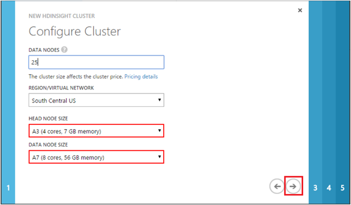

<properties 
    pageTitle="Personalizar Hadoop clústeres para el proceso de ciencias grupo datos | Microsoft Azure" 
    description="Módulos de Python populares disponibles en clústeres de Azure HDInsight Hadoop personalizados."
    services="machine-learning" 
    documentationCenter="" 
    authors="bradsev" 
    manager="jhubbard" 
    editor="cgronlun"  />

<tags 
    ms.service="machine-learning" 
    ms.workload="data-services" 
    ms.tgt_pltfrm="na" 
    ms.devlang="na" 
    ms.topic="article" 
    ms.date="09/19/2016" 
    ms.author="hangzh;bradsev" />

# Personalizar HDInsight Hadoop de Azure clústeres para el proceso de ciencias de datos de grupo 

En este artículo se describe cómo personalizar un clúster HDInsight Hadoop instalando Anaconda de 64 bits (Python 2.7) en cada nodo cuando se aprovisiona el clúster como un servicio de HDInsight. También se muestra cómo tener acceso a la headnode para enviar trabajos personalizados al clúster. Esta personalización hace muchos módulos Python populares a los que se incluyen en Anaconda están disponible para su uso en las funciones definidas por el usuario (UDF) que están diseñados para procesar registros de sección en el clúster. Para obtener instrucciones sobre los procedimientos que se usan en este escenario, vea [cómo enviar las consultas de la sección](machine-learning-data-science-move-hive-tables.md#submit).

El menú debajo de vínculos a temas que describen cómo configurar los diversos entornos de ciencias de datos usados por el [Proceso de ciencias de datos de equipo (TDSP)](data-science-process-overview.md).

[AZURE.INCLUDE [data-science-environment-setup](../../includes/cap-setup-environments.md)]

## Personalizar el clúster de Hadoop HDInsight de Azure

Para crear un clúster de HDInsight Hadoop personalizado, los usuarios necesitan iniciar sesión en el [**Portal de Azure clásica**](https://manage.windowsazure.com/), haga clic en **nuevo** en la esquina inferior izquierda y, a continuación, seleccione los servicios de datos -> HDINSIGHT -> **Crear personalizado** para que aparezca la ventana de **Detalles de clúster** . 

Introduzca el nombre del clúster que debe crearse en la página de configuración 1 y acepte los valores predeterminados para los demás campos. Haga clic en la flecha para ir a la siguiente página de configuración. 

En la página de configuración 2, introduzca el número de **Nodos de datos**, seleccione la **Región y virtuales red**y seleccione el tamaño de la **Cabeza nodo** y el **Nodo de datos**. Haga clic en la flecha para ir a la siguiente página de configuración.

>[AZURE.NOTE] La **Red de región y virtuales** tiene que ser la misma que la región de la cuenta de almacenamiento que va a utilizar para el clúster de HDInsight Hadoop. En caso contrario, en la cuarta página de configuración, la cuenta de almacenamiento que los usuarios que desea usar no aparecerá en la lista desplegable de **Nombre de la cuenta**.

En la página de configuración 3, proporcione un nombre de usuario y contraseña para el clúster de HDInsight Hadoop. **No** seleccione la _ENTRAR Metastore de subárbol/Oozie_. A continuación, haga clic en la flecha para ir a la siguiente página de configuración. 

En la página de configuración 4, especifique el nombre de la cuenta de almacenamiento, el contenedor predeterminado del clúster HDInsight Hadoop. Si los usuarios seleccionan _Crear contenedor predeterminado_ en la lista desplegable de **Contenedor predeterminado** , se creará un contenedor con el mismo nombre que el clúster. Haga clic en la flecha para ir a la última página de configuración.

En la última página de configuración de **Acciones de secuencia de comandos** , haga clic en el botón **Agregar acción de secuencia de comandos** y rellenar los campos de texto con los siguientes valores.
 
* **Nombre** : cualquier cadena como el nombre de esta acción de secuencia de comandos. 
* **Tipo de nodo** - seleccionar **todos los nodos**. 
* **URI de secuencia de comandos** - *http://getgoing.blob.core.windows.net/publicscripts/Azure_HDI_Setup_Windows.ps1* 
    * *publicscripts* es un contenedor público en la cuenta de almacenamiento 
    * *getgoing* que usamos para compartir archivos de script de PowerShell para facilitar el trabajo de los usuarios en Azure. 
* **Parámetros** : (deje en blanco)

Por último, haga clic en la marca de verificación para iniciar la creación del clúster HDInsight Hadoop personalizada. 

## Obtener acceso al nodo de cabeza de clúster Hadoop

Los usuarios deben habilitar el acceso remoto al clúster Hadoop en Azure para poder tener acceso el nodo principal del clúster Hadoop a través de RDP. 

1. Iniciar sesión en el [**Portal de Azure clásico**](https://manage.windowsazure.com/), seleccione **HDInsight** a la izquierda, seleccione el clúster Hadoop desde la lista de clústeres, haga clic en la pestaña **configuración** y, a continuación, haga clic en el icono **Habilitar remoto** en la parte inferior de la página.
    
    

2. En la ventana **Configurar Escritorio remoto** , escriba los campos nombre de usuario y contraseña y seleccione la fecha de vencimiento para el acceso remoto. A continuación, haga clic en la marca de verificación para habilitar el acceso remoto al nodo principal del clúster Hadoop.

    
    
>[AZURE.NOTE] El nombre de usuario y contraseña para el acceso remoto no son el nombre de usuario y la contraseña que utiliza al crear el clúster de Hadoop. Se trata de un conjunto de credenciales diferente. Además, la fecha de expiración del acceso remoto debe estar dentro de 7 días desde la fecha actual.

Después de habilita el acceso remoto, haga clic en **Conectar** en la parte inferior de la página para remoto en el nodo principal. Inicie sesión en el nodo principal del clúster Hadoop especificando las credenciales para el usuario de acceso remoto que ha especificado una versión anterior.

Los siguientes pasos en el proceso de análisis avanzadas se asignan en el [Grupo datos ciencias proceso (TDSP)](https://azure.microsoft.com/documentation/learning-paths/cortana-analytics-process/) y pueden incluir pasos que mover los datos a HDInsight, procesarán y escuche ahí en preparación para aprender de los datos con el aprendizaje del equipo de Azure.

Aprenda [a enviar las consultas de la sección](machine-learning-data-science-move-hive-tables.md#submit) para obtener instrucciones sobre cómo obtener acceso a los módulos de Python que se incluyen en Anaconda desde el nodo principal del clúster en las funciones definidas por el usuario (UDF) que se utilizan para procesar registros subárbol almacenados en el clúster.

 
