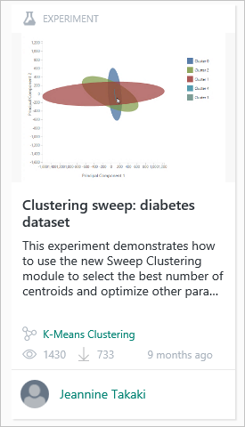

<properties
   pageTitle="Copiar otros datos ciencias trabajo - ejemplo de aprendizaje de equipo | Microsoft Azure"
   description="Secreto comercial de ciencias de datos: invite a otros usuarios a realizar el trabajo para usted. Vea ejemplos de galería de análisis de Cortana como un ejemplo de algoritmo de agrupamiento."
   keywords="ejemplos de ciencias de datos de ejemplo de aprendizaje del equipo, algoritmo, clúster de ejemplo del algoritmo de agrupación"
   services="machine-learning"
   documentationCenter="na"
   authors="cjgronlund"
   manager="jhubbard"
   editor="cjgronlund"/>

<tags
   ms.service="machine-learning"
   ms.devlang="na"
   ms.topic="article"
   ms.tgt_pltfrm="na"
   ms.workload="na"
   ms.date="10/20/2016"
   ms.author="cgronlun;garye"/>

# Copiar el trabajo de otras personas para realizar la ciencia de datos

## Vídeo 5: Ciencias de datos de serie principiantes

Uno de ellos comerciales de ciencias de datos está recibiendo otras personas para realizar el trabajo para usted. Buscar un ejemplo de algoritmo clúster para su propio equipo ensayo de aprendizaje.

Para obtener el máximo provecho de la serie, vea todos ellos. [Vaya a la lista de vídeos](#other-videos-in-this-series)

> [AZURE.VIDEO data-science-for-beginners-series-copy-other-peoples-work-to-do-data-science]

## Otros vídeos de esta serie

*Ciencia de datos para principiantes* es una introducción rápida a ciencia datos en cinco vídeos breves.

  * Vídeo 1: [Las respuestas de ciencias datos 5 preguntas](machine-learning-data-science-for-beginners-the-5-questions-data-science-answers.md) *(5 14 min.)*
  * Vídeo 2: [está listo para Ciencias datos sus datos?](machine-learning-data-science-for-beginners-is-your-data-ready-for-data-science.md) *(4 56 min.)*
  * Vídeo 3: [Formular una pregunta puede responder con datos](machine-learning-data-science-for-beginners-ask-a-question-you-can-answer-with-data.md) *(4 17 min.)*
  * Vídeo 4: [Predecir una respuesta con un modelo simple](machine-learning-data-science-for-beginners-predict-an-answer-with-a-simple-model.md) *(7 42 min.)*
  * Vídeo 5: Copiar el trabajo de otras personas para realizar la ciencia de datos

## Transcripción: Copiar el trabajo de otras personas para realizar la ciencia de datos

Bienvenido a la quinta vídeo de la serie "Ciencia de datos para principiantes".

En este uno, descubrirá un lugar para buscar los ejemplos que copian como punto de partida para su propio trabajo. Puede obtener el máximo provecho este vídeo si primero ver los vídeos anterior de esta serie.

Uno de ellos comerciales de ciencias de datos está recibiendo otras personas para realizar el trabajo para usted.

## Encontrar ejemplos en la Galería de inteligencia de Cortana

Microsoft dispone de un servicio basado en la nube denominado [Azure el aprendizaje]( https://azure.microsoft.com/services/machine-learning/) que le Bienvenido a intentar de forma gratuita. Proporciona un área de trabajo en las que puede experimentar con algoritmos de aprendizaje de otro equipo y, si tienes la solución puede averiguar, puede iniciar como un servicio web.

Parte de este servicio es algo que denomina la **[Galería de inteligencia de Cortana](http://aka.ms/CortanaIntelligenceGallery)**. Contiene una variedad de recursos, uno de los cuales es una colección de aprendizaje del equipo de Azure experimentación o modelos, que los usuarios han integrado y contribuido para que otras personas usar. Estos experimentación es excelentes para aprovechar las ideas y el trabajo de otros usuarios a empezar en sus propias soluciones.

Puede encontrar la galería en [aka.ms/CortanaIntelligenceGallery]( http://aka.ms/CortanaIntelligenceGallery). Todos los usuarios están Bienvenido a navegar por él.

Si hace clic en **experimentación** en la parte superior, verá un número de la experimentación más recientes y populares en la galería. Puede buscar por el resto de experimentación haciendo clic en **Examinar todos** en la parte superior de la pantalla y, a continuación, se puede escribir términos de búsqueda y seleccione filtros de búsqueda.

## Buscar y usar un ejemplo de algoritmo de agrupación

Por lo tanto, por ejemplo, supongamos que desea ver un ejemplo de cómo funciona el clúster, por lo que busca experimentación **"" clúster""** .

Aquí tiene una interesante que alguien ha contribuido a la galería.

Haga clic en dicho ensayo y obtener una página web que describe el trabajo que hizo este colaborador, junto con algunos de sus resultados.

Observe que el vínculo que dice **abierto en Studio**.

¿Haga clic en el y me tiene derecho a **Azure máquina aprendizaje Studio**. Crea una copia de la ensayo y coloca en mi propia área de trabajo. Esto incluye del conjunto de datos del colaborador, todo el procesamiento que tenían, todos los algoritmos que utilizan y cómo guardan los resultados.

Y ahora tengo un punto de partida. Puedo intercambiar sus datos para mi propia y realice la mía ajustes del modelo. Esto me proporciona con ventaja y me permite crear en el trabajo de las personas que sabe lo que están haciendo.

## Buscar experimentación que muestran técnicas de aprendizaje de equipo

Hay otras experimentación en la [Galería de inteligencia Cortana](http://aka.ms/CortanaIntelligenceGallery) proporcionadas específicamente para proporcionar ejemplos de procedimientos de personas nuevas en ciencia de datos. Por ejemplo, hay un ensayo en la galería que muestra cómo controlar los valores que faltan ([métodos para tratamiento de valores que faltan](https://gallery.cortanaintelligence.com/Experiment/Methods-for-handling-missing-values-1)). Se le guiará a través de 15 diferentes maneras de sustituir valores vacíos y habla sobre las ventajas de cada método y cuándo usarlo.

[Galería de inteligencia de Cortana](http://aka.ms/CortanaIntelligenceGallery) es un lugar para buscar experimentación de trabajo que puede usar como punto de partida para sus propias soluciones.

Asegúrese de desproteger los otros vídeos de "Datos de ciencias para principiantes" de aprendizaje de Microsoft Azure máquina.

## Pasos siguientes

  * [Pruebe su primera experimentar de ciencias de datos con el aprendizaje Azure](machine-learning-create-experiment.md)
  * [Obtener una introducción a aprendizaje en Microsoft Azure](machine-learning-what-is-machine-learning.md)
