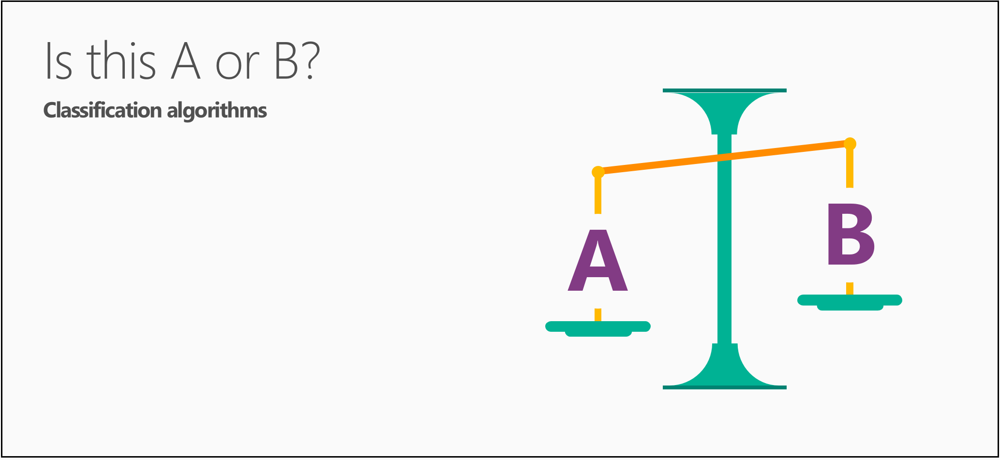
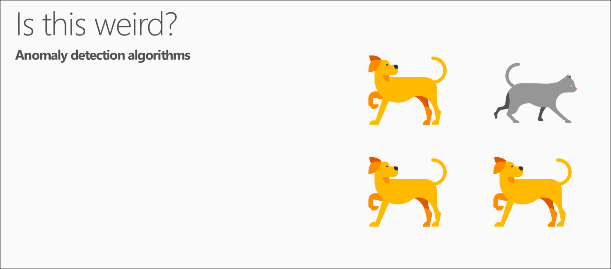
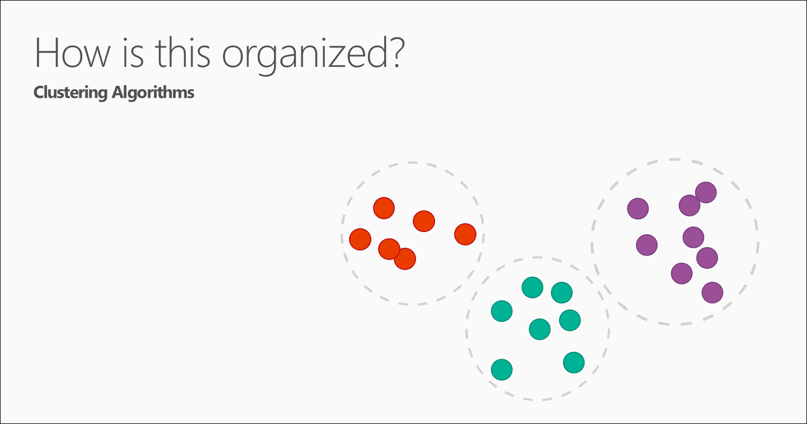

<properties
   pageTitle="Las preguntas de ciencias 5 datos - ciencias de datos para principiantes | Microsoft Azure"
   description="Una rápida introducción a ciencia de datos de ciencias de datos para principiantes, cinco vídeos breves que empiecen por la 5 preguntas datos ciencias respuestas."
   keywords="procedimiento ciencias de datos, principiantes de ciencias de datos, ciencias de datos para principiantes, tipos de preguntas, preguntas de ciencias de datos, datos de vídeo de ciencias"
   services="machine-learning"
   documentationCenter="na"
   authors="cjgronlund"
   manager="jhubbard"
   editor="cjgronlund"/>

<tags
   ms.service="machine-learning"
   ms.devlang="na"
   ms.topic="article"
   ms.tgt_pltfrm="na"
   ms.workload="na"
   ms.date="10/20/2016"
   ms.author="cgronlun;garye"/>

# Ciencia de datos para principiantes vídeo 1: 5 las preguntas respuestas de ciencias de datos

Obtener una introducción rápida a ciencia de datos de *Ciencias de datos para principiantes* en cinco vídeos breves de un científico datos superior. Estos vídeos son básicas pero útil, si está interesado en realizar ciencias de datos o trabajar con científicos de datos.

Este vídeo primera es sobre los tipos de preguntas que pueden responder ciencias de datos. Para obtener el máximo provecho de la serie, vea todos ellos. [Vaya a la lista de vídeos](#other-videos-in-this-series)

> [AZURE.VIDEO data-science-for-beginners-series-the-5-questions-data-science-answers]

## Otros vídeos de esta serie

*Ciencia de datos para principiantes* es una introducción rápida a la toma de ciencias datos total de 25 minutos. Consulte los cuatro vídeos:

  * Vídeo 1: 5 preguntas respuestas de ciencias de datos
  * Vídeo 2: [está listo para Ciencias datos sus datos?](machine-learning-data-science-for-beginners-is-your-data-ready-for-data-science.md) *(4 56 min.)*
  * Vídeo 3: [Formular una pregunta puede responder con datos](machine-learning-data-science-for-beginners-ask-a-question-you-can-answer-with-data.md) *(4 17 min.)*
  * Vídeo 4: [Predecir una respuesta con un modelo simple](machine-learning-data-science-for-beginners-predict-an-answer-with-a-simple-model.md) *(7 42 min.)*
  * Vídeo 5: [Copiar el trabajo de otras personas para realizar la ciencia de datos](machine-learning-data-science-for-beginners-copy-other-peoples-work-to-do-data-science.md) *(3 18 min.)*

## Transcripción: 5 preguntas respuestas de ciencias de datos

¡Hola! Bienvenido a la serie de vídeos *Ciencias de datos para principiantes*.

Ciencia de datos puede intimidar, por lo que deberá introducir los conceptos básicos aquí sin necesidad de ecuaciones o equipo jerga de programación.

En este vídeo primera hablaremos "5 preguntas respuestas de ciencias de datos".

Datos ciencias usa nombres (también conocido como categorías o etiquetas) y números para predecir las respuestas a preguntas.

Que puede sorprenderle, pero *hay solo cinco preguntas que respuestas de ciencias de datos*:

  * ¿Es este A o B?
  * ¿Es extraño?
  * ¿Cuánto – o – cuántos?
  * ¿Cómo está organizado?
  * ¿Qué debo hacer a continuación?

  Cada una de estas preguntas se responde en una familia de métodos de aprendizaje de equipo, denominado algoritmos independiente.

Resulta útil pensar en un algoritmo como una receta y los datos como los componentes. Un algoritmo indica cómo combinar y combinar los datos con el fin de obtener una respuesta. Equipos son como una mezcladora. Como lo hacen la mayor parte del trabajo del algoritmo para usted y lo bastante rápido.

## Pregunta 1: ¿Es este A o B? utiliza algoritmos de clasificación

¿Comencemos con la pregunta: es este A o B?

En esta serie de algoritmos se denomina clase dos clasificación.

Es útil para cualquier pregunta con dos respuestas posibles.

Por ejemplo:

  * ¿Este neumático producirá un error en la siguientes 1.000 millas: Sí o no?
  * ¿Que obtiene de más clientes: cupón $5 o un descuento del 25%?

¿Esta pregunta puede ser volver a escribir también para incluir más de dos opciones: es este A o B o C y D etcetera.?  Se denomina multiclass clasificación y es útil cuando se dispone de varias — o miles: respuestas posibles. Clasificación multiclass elige probablemente una.

## Pregunta 2: Esto es extraño? utiliza algoritmos de detección de anomalías

¿La siguiente pregunta ciencias de datos pueden responder es: es este extraño? Esta pregunta tiene respuesta en una familia de algoritmos denominado detección de anomalías.

Si tiene una tarjeta de crédito, ya ha saca partido de detección de anomalías. Compañía de su tarjeta de crédito analiza los patrones de compra, para que le pueden alertar a posibles fraudes. Gastos de "extraños" pueden ser una compra en una tienda donde normalmente no comprar o comprar un elemento demasiado costoso.

Esta pregunta puede ser útil de muchas formas. Por ejemplo:

  * ¿Si tiene un coche con indicadores de presión, desea saber: es este manómetro normal de lectura?
  * Si va a supervisar internet, ¿desea saber: suele este mensaje de internet?

Detección de anomalías indicadores eventos inesperados o inusuales o comportamientos. Proporciona pistas dónde debe buscar los problemas.

## Pregunta 3: ¿Cuánto? ¿o cómo muchos? utiliza algoritmos de regresión.

¿Aprendizaje del equipo también puede predecir la respuesta a cómo mucho? ¿o cómo muchos? Familia de algoritmos que respondan a esta pregunta se denomina regresión.

Algoritmos de regresión realizar predicciones numéricos, como por ejemplo:

  * ¿Qué la temperatura estará martes siguiente?  
  * ¿Cuál será los cuarto ventas del trimestre?

Ayudan a responder a cualquier pregunta que solicita un número.

## Pregunta 4: ¿Cómo es esto organizado? usos algoritmos agrupados

Ahora la última dos preguntas son un poco más avanzado.

¿A veces desea comprender la estructura de un conjunto de datos: cómo está organizado? Para esta pregunta, no tiene ejemplos en los que ya conoce de resultados para.

Hay una gran cantidad de maneras de obtener la estructura de datos. Un enfoque clústeres. Datos que separa en natural "agrupa," para interpretación sea más fácil. Con clústeres, no hay una respuesta correcta.

Ejemplos de agrupación preguntas comunes son:

  * ¿Que los usuarios, como los mismos tipos de películas?
  * ¿Los modelos de impresora no la misma manera?

Comprender cómo se organizan los datos, puede comprender - mejor y predecir - comportamientos y eventos.  

## Pregunta 5: ¿Qué debo hacer ahora? usa refuerzo algoritmos de aprendizaje

La última de la pregunta: ¿qué debo hacer ahora? – utiliza una familia de algoritmos denominados aprendizaje refuerzo.

Aprendizaje de refuerzo se inspiró en cómo responde el cerebro de RAT y a las personas a la pena y ventajas. Estos algoritmos Aprenda de resultados y Decisión sobre la acción siguiente.

Aprendizaje de refuerzo suele ser una buena opción para sistemas automatizados que tiene que hacer muchas pequeñas decisiones sin ayuda humana.

Preguntas que responde son siempre sobre qué acción debe tomarse - normalmente por un equipo o un robot. Algunos ejemplos son:

  * ¿Si soy un sistema de control de temperatura de una casa: ajustar la temperatura o dejar sea?  
  * ¿Si soy un coche Self-conducción: una luz amarilla, frenos o acelerar?  
  * ¿Para vacío robot: mantenga Vacuumer o volver a la estación de carga?

Algoritmos de aprendizaje de refuerzo recopilan datos de medida que vaya, aprendizaje de prueba y error.

Lo - pueden responder ciencias de datos de preguntas de la 5.

## Pasos siguientes

  * [Pruebe una primera experimentar de ciencias de datos con Machine aprendizaje Studio](machine-learning-create-experiment.md)
  * [Obtener una introducción a aprendizaje en Microsoft Azure](machine-learning-what-is-machine-learning.md)
