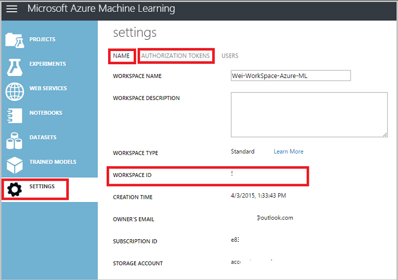
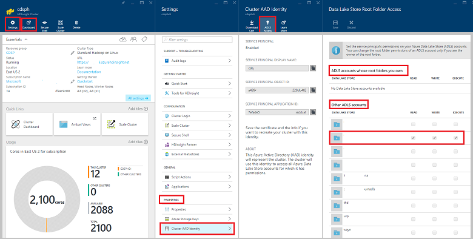
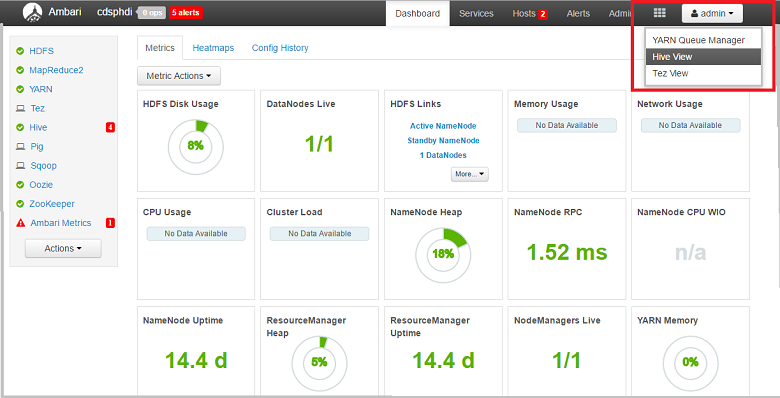
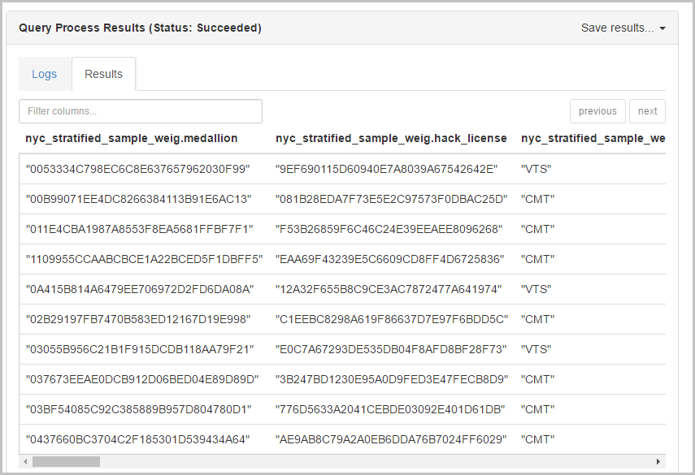
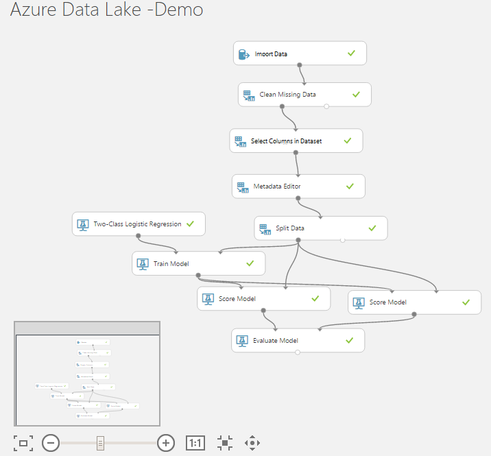

<properties
    pageTitle="Scalable ciencias de datos de Azure datos lago: un tutorial to-end | Microsoft Azure"
    description="Cómo usar lago de datos de Azure para realizar tareas de clasificación de datos binarios y obtener información detallada en un conjunto de datos."  
    services="machine-learning"
    documentationCenter=""
    authors="bradsev"
    manager="jhubbard"
    editor="cgronlun" />

<tags
    ms.service="machine-learning"
    ms.workload="data-services"
    ms.tgt_pltfrm="na"
    ms.devlang="na"
    ms.topic="article"
    ms.date="09/19/2016"
    ms.author="bradsev;weig"/>

# Scalable ciencias de datos de Azure datos lago: un tutorial to-end

Este tutorial muestra cómo usar lago de datos de Azure para realizar tareas de clasificación binario de una muestra de la excursión taxi de Nueva York y la exploración de datos y resultados son para predecir o no una tarifa pagará una sugerencia del conjunto de datos. Le guiará por los pasos del [Proceso de ciencias de datos de equipo](http://aka.ms/datascienceprocess),-to-end, de adquisición de datos al modelo de aprendizaje y luego a la implementación de un servicio web que se publica el modelo.

### Análisis de datos de Azure lago

[Lago de datos de Microsoft Azure](https://azure.microsoft.com/solutions/data-lake/) tiene todas las capacidades necesarias para que sea más fácil científicos de datos para almacenar datos de cualquier tamaño, la forma y la velocidad y llevar a cabo el procesamiento de datos, analíticas avanzadas y modelado de aprendizaje con alta escalabilidad de manera rentable.   Pagar de forma por trabajo, solo cuando en realidad se está procesando datos. Análisis de lago datos Azure incluye U SQL, un lenguaje que combina la naturaleza descriptiva de SQL con la potencia expresiva de C# para proporcionar scalable distribuye la capacidad de consulta. Le permite procesar datos no estructurados mediante la aplicación de esquema de lectura, insertar lógica personalizada y las funciones definidas por el usuario (UDF) e incluye la capacidad de ampliación para habilitar un control minucioso sobre cómo ejecutar a escala. Para obtener más información sobre la filosofía de diseño de SQL U, consulte [entrada de blog de Visual Studio](https://blogs.msdn.microsoft.com/visualstudio/2015/09/28/introducing-u-sql-a-language-that-makes-big-data-processing-easy/).

Análisis de datos lago también es una parte clave del conjunto de aplicaciones de análisis de Cortana y trabaja con el almacén de datos de SQL Azure, Power BI y generador de datos. Esto le da una plataforma de funciones analíticas avanzadas y datos grande de nube completa.

Este tutorial comienza con la descripción de los requisitos previos y los recursos que son necesarios para completar las tareas con el análisis de datos lago que componen el proceso de ciencias de datos y cómo instalarlas. A continuación, se describen los pasos de procesamiento de datos mediante SQL U como concluye mostrando cómo utilizar Python y subárbol con Azure máquina aprendizaje Studio compilar e implementar los modelos de predicción. 

### U-SQL y Visual Studio

En este tutorial, se recomienda usar Visual Studio para editar secuencias de comandos de SQL de U para procesar el conjunto de datos. Las secuencias de comandos de SQL U están descritas aquí y proporcionados en un archivo independiente. El proceso incluye recopila, explorar y muestreo de los datos. También se muestra cómo ejecutar un trabajo de secuencias de comandos de SQL U desde el portal de Azure. Se crean tablas de subárbol para los datos en un clúster de HDInsight asociada para facilitar la creación y la implementación de un modelo de clasificación binario de Azure máquina aprendizaje Studio.  

### Python

En este tutorial también contiene una sección que muestra cómo crear e implementar un modelo de predicción con Python Studio de aprendizaje del equipo de Azure.  Le proporcionamos un bloc de notas de Jupyter con las secuencias de comandos de Python para estos pasos de este proceso. El Bloc de notas incluye código para algunas características adicionales ingeniería pasos y los modelos de construcción como clasificación multiclass y regresión modelado además del modelo de clasificación binario descrito a continuación. La tarea de regresión es predecir la cantidad de la sugerencia en función de otras características de sugerencia. 

### Aprendizaje del equipo de Azure
Azure Studio de aprendizaje de equipo se usa para crear e implementar los modelos de predicción. Esto se hace con dos métodos: primero con las secuencias de comandos de Python y, a continuación, con las tablas de la sección en un clúster de HDInsight (Hadoop).

### Secuencias de comandos

Solo los pasos principales se describen en este tutorial. Puede descargar la completa de **secuencia de comandos SQL U** y el **Bloc de notas de Jupyter** desde [GitHub](https://github.com/Azure/Azure-MachineLearning-DataScience/tree/master/Misc/AzureDataLakeWalkthrough).

## Requisitos previos

Antes de comenzar estos temas, debe tener el siguiente:

- Una suscripción de Azure. Si ya tiene una, vea [Azure obtener la versión de prueba gratuita](https://azure.microsoft.com/documentation/videos/get-azure-free-trial-for-testing-hadoop-in-hdinsight/).

- [Recomendado] 2013 de Visual Studio, o de 2015. Si ya tiene una de estas versiones instaladas, puede descargar una edición de comunidad gratuita desde [aquí](https://www.visualstudio.com/visual-studio-homepage-vs.aspx). Haga clic en el botón **Descargar 2015 de comunidad** en la sección de Visual Studio. 

>[AZURE.NOTE] En lugar de Visual Studio, también puede usar el Portal de Azure enviar consultas lago de datos de Azure. Le proporcionamos instrucciones sobre cómo hacerlo tanto con Visual Studio y en el portal de la sección de **datos de proceso con U SQL**. 

- Registro en vista previa de datos de Azure lago

>[AZURE.NOTE] Debe obtener la aprobación para usar el almacén de lago de datos de Azure (ADLS) y el análisis de lago de datos de Azure (ADLA) como estos servicios en la vista previa. Se le pedirá registrarse al crear el primer ADLS o ADLA. Suspire hacia arriba, haga clic en **registrarse para obtener una vista previa**, lea el acuerdo y haga clic en **Aceptar**. Aquí, por ejemplo, es la página suscripción ADLS:

 

## Preparar datos ciencias entorno para lago de datos de Azure
Para preparar el entorno de ciencias de datos para este tutorial, cree los siguientes recursos:

- Almacén de lago de datos de Azure (ADLS) 
- Análisis de datos de Azure lago (ADLA)
- Cuenta de almacenamiento de blobs de Windows Azure
- Cuenta de máquina aprendizaje Studio Azure
- Datos de Azure lago Tools para Visual Studio (recomendado)

Esta sección proporciona instrucciones sobre cómo crear cada uno de estos recursos. Si decide usar tablas subárbol con Azure el aprendizaje, en lugar de Python, para generar un modelo, también debe aprovisionar a un clúster de HDInsight (Hadoop). Este procedimiento alternativo en que se describe en la sección apropiada.
 
>AZURE. Nota: el **Almacén de lago de datos de Azure** se pueden crear por separado o al crear el **Análisis de lago de datos de Azure** como el almacenamiento predeterminado. Se hace referencia a las instrucciones para la creación de cada uno de estos recursos por separado a continuación, pero la cuenta de almacenamiento de datos lago no es necesario crear por separado.
 
### Crear un almacén de lago de datos de Azure

Crear un ADLS desde el [Portal de Azure](http://portal.azure.com). Para obtener más información, consulte [crear un clúster de HDInsight con el almacén de datos de lago con el Portal de Azure](../data-lake-store/data-lake-store-hdinsight-hadoop-use-portal.md). Asegúrese de configurar la identidad de AAD de clúster en el módulo de **origen de datos** del módulo de **Configuración opcional** descrito. 

 

### Crear una cuenta de análisis de lago de datos de Azure
Cree una cuenta ADLA desde el [Portal de Azure](http://portal.azure.com). Para obtener información detallada, consulte [Tutorial: Introducción a Azure datos lago análisis con Azure Portal](../data-lake-analytics/data-lake-analytics-get-started-portal.md). 

 

### Crear una cuenta de almacenamiento de blobs de Windows Azure
Cree una cuenta de almacenamiento de blobs de Windows Azure desde el [Portal de Azure](http://portal.azure.com). Para obtener información detallada, vea Crear una sección de la cuenta de almacenamiento de [Azure sobre cuentas de almacenamiento](../storage/storage-create-storage-account.md).
    
 

### Configurar una cuenta de Azure máquina aprendizaje Studio
Inicie sesión arriba o en Azure máquina aprendizaje Studio desde la página de [Aprendizaje de máquina de Azure](https://azure.microsoft.com/services/machine-learning/) . Haga clic en el botón **empezar ahora** y, a continuación, elija un "Área de trabajo libre" o "Área de trabajo estándar". Después podrá crear experimentación en Azure m Studio.  

### Instalar herramientas de datos de Azure lago (recomendado)
Instalar herramientas de lago de datos de Azure para su versión de Visual Studio de [Azure datos lago Tools para Visual Studio](https://www.microsoft.com/download/details.aspx?id=49504).

 

Después de la instalación no finaliza correctamente, abra Visual Studio. Verá el lago de datos del menú en la parte superior de la pestaña. Los recursos de Azure deberían aparecer en el panel izquierdo al iniciar sesión en su cuenta de Azure.

 

## El conjunto de datos de Nueva York Taxi viajes
El conjunto de datos, que hemos usado aquí es un conjunto de datos esté disponible públicamente--el [conjunto de datos de Nueva York Taxi viajes](http://www.andresmh.com/nyctaxitrips/). Los datos de Nueva York Taxi viaje constan de aproximadamente 20GB de archivos CSV comprimidos (GB de ~ 48 sin comprimir), cada viaje de más de 173 millones de viajes individuales y las tarifas de las grabaciones de pago. Cada registro de viaje incluye las ubicaciones de entrega y recogida y horas, el número de licencias piratería anonymized (controlador) y el número de medallion (identificador exclusivo de taxi). Los datos cubre todos los viajes del año 2013 y está disponible en los dos conjuntos de datos siguientes para cada mes:

 - CSV 'trip_data' contiene detalles de viaje, como el número de personas, recogida y puntos de caída, duración de viaje y longitud de viaje. Estos son algunos registros de ejemplo:

        medallion,hack_license,vendor_id,rate_code,store_and_fwd_flag,pickup_datetime,dropoff_datetime,passenger_count, trip_time_in_secs,trip_distance,pickup_longitude,pickup_latitude,dropoff_longitude,dropoff_latitude
        89D227B655E5C82AECF13C3F540D4CF4,BA96DE419E711691B9445D6A6307C170,CMT,1,N,2013-01-01 15:11:48,2013-01-01 15:18:10,4,382,1.00,-73.978165,40.757977,-73.989838,40.751171
        0BD7C8F5BA12B88E0B67BED28BEA73D8,9FD8F69F0804BDB5549F40E9DA1BE472,CMT,1,N,2013-01-06 00:18:35,2013-01-06 00:22:54,1,259,1.50,-74.006683,40.731781,-73.994499,40.75066
        0BD7C8F5BA12B88E0B67BED28BEA73D8,9FD8F69F0804BDB5549F40E9DA1BE472,CMT,1,N,2013-01-05 18:49:41,2013-01-05 18:54:23,1,282,1.10,-74.004707,40.73777,-74.009834,40.726002
        DFD2202EE08F7A8DC9A57B02ACB81FE2,51EE87E3205C985EF8431D850C786310,CMT,1,N,2013-01-07 23:54:15,2013-01-07 23:58:20,2,244,.70,-73.974602,40.759945,-73.984734,40.759388
        DFD2202EE08F7A8DC9A57B02ACB81FE2,51EE87E3205C985EF8431D850C786310,CMT,1,N,2013-01-07 23:25:03,2013-01-07 23:34:24,1,560,2.10,-73.97625,40.748528,-74.002586,40.747868

 - 'trip_fare' CSV contiene detalles de la tarifa de pago para cada viaje, como el tipo de pago, importe tarifa, suplemento y los impuestos, sugerencias y peajes y la cantidad total pagada. Estos son algunos registros de ejemplo:

        medallion, hack_license, vendor_id, pickup_datetime, payment_type, fare_amount, surcharge, mta_tax, tip_amount, tolls_amount, total_amount
        89D227B655E5C82AECF13C3F540D4CF4,BA96DE419E711691B9445D6A6307C170,CMT,2013-01-01 15:11:48,CSH,6.5,0,0.5,0,0,7
        0BD7C8F5BA12B88E0B67BED28BEA73D8,9FD8F69F0804BDB5549F40E9DA1BE472,CMT,2013-01-06 00:18:35,CSH,6,0.5,0.5,0,0,7
        0BD7C8F5BA12B88E0B67BED28BEA73D8,9FD8F69F0804BDB5549F40E9DA1BE472,CMT,2013-01-05 18:49:41,CSH,5.5,1,0.5,0,0,7
        DFD2202EE08F7A8DC9A57B02ACB81FE2,51EE87E3205C985EF8431D850C786310,CMT,2013-01-07 23:54:15,CSH,5,0.5,0.5,0,0,6
        DFD2202EE08F7A8DC9A57B02ACB81FE2,51EE87E3205C985EF8431D850C786310,CMT,2013-01-07 23:25:03,CSH,9.5,0.5,0.5,0,0,10.5

La clave única para unirse a viajes\_datos y viaje\_tarifa se compone de los tres campos siguientes: medallion, prueba\_licencia y recogida\_datetime. Los archivos CSV sin formato se pueden acceder desde un blob de almacenamiento de Azure público. La secuencia de comandos SQL U para esta combinación se encuentra en la sección de [tablas de viaje y tarifa de combinación](#join) .

## Procesar datos con SQL U

Las tareas de procesamiento de datos se muestra en esta sección incluyen recopila, comprobar la calidad, explorar y muestreo de los datos. También le mostraremos cómo combinar tablas viaje y tarifa. En la última sección muestra ejecutar un trabajo de secuencias de comandos de SQL U desde el portal de Azure. Estos son los vínculos a cada subsección:

- [Recopilación de datos: leer datos de blob público](#ingest)
- [Comprobaciones de calidad de datos](#quality)
- [Exploración de datos](#explore)
- [Combinar tablas viaje y billete](#join)
- [Muestreo de datos](#sample)
- [Ejecutar SQL U trabajos](#run)

Las secuencias de comandos de SQL U están descritas aquí y proporcionados en un archivo independiente. Puede descargar la completa **secuencias de comandos SQL U** desde [GitHub](https://github.com/Azure/Azure-MachineLearning-DataScience/tree/master/Misc/AzureDataLakeWalkthrough).

Para ejecutar U-SQL, abra Visual Studio, haga clic en **archivo--> Nuevo--> proyecto**, elija **Proyecto U SQL**, nombre y guárdela en una carpeta.

>[AZURE.NOTE] Es posible usar el Portal de Azure para ejecutar U SQL en lugar de Visual Studio. Puede navegar hasta el recurso de análisis de lago de datos de Azure en el portal y enviar consultas directamente, como se muestra en la siguiente ilustración.

### Recopilación de datos: Leer datos de blob público

Se hace referencia a la ubicación de los datos de la blobs de Windows Azure como **wasb://container_name@blob_storage_account_name.blob.core.windows.net/blob_name** y se pueden extraer utilizando **Extractors.Csv()**. Sustituir su propio nombre de contenedor y el nombre de la cuenta de almacenamiento de secuencias de comandos siguientes para container_name@blob_storage_account_name en la dirección wasb. Dado que los nombres de archivo en el mismo formato, podemos utilizar **viaje\_data_ {\*\}.csv** leer en todos los archivos de ida y vuelta 12. 

    ///Read in Trip data
    @trip0 =
        EXTRACT 
        medallion string,
        hack_license string,
        vendor_id string,
        rate_code string,
        store_and_fwd_flag string,
        pickup_datetime string,
        dropoff_datetime string,
        passenger_count string,
        trip_time_in_secs string,
        trip_distance string,
        pickup_longitude string,
        pickup_latitude string,
        dropoff_longitude string,
        dropoff_latitude string
    // This is reading 12 trip data from blob
    FROM "wasb://container_name@blob_storage_account_name.blob.core.windows.net/nyctaxitrip/trip_data_{*}.csv"
    USING Extractors.Csv();

Puesto que hay encabezados en la primera fila, es necesario quitar los encabezados y cambiar los tipos de columna en las columnas adecuadas. Podemos alguno guardar los datos procesados al almacenamiento de lago de datos de Azure con **swebhdfs://data_lake_storage_name.azuredatalakestorage.net/folder_name/file_name**_ o con el almacenamiento de blobs de Windows Azure cuenta usando **wasb://container_name@blob_storage_account_name.blob.core.windows.net/blob_name**. 

    // change data types
    @trip =
        SELECT 
        medallion,
        hack_license,
        vendor_id,
        rate_code,
        store_and_fwd_flag,
        DateTime.Parse(pickup_datetime) AS pickup_datetime,
        DateTime.Parse(dropoff_datetime) AS dropoff_datetime,
        Int32.Parse(passenger_count) AS passenger_count,
        Double.Parse(trip_time_in_secs) AS trip_time_in_secs,
        Double.Parse(trip_distance) AS trip_distance,
        (pickup_longitude==string.Empty ? 0: float.Parse(pickup_longitude)) AS pickup_longitude,
        (pickup_latitude==string.Empty ? 0: float.Parse(pickup_latitude)) AS pickup_latitude,
        (dropoff_longitude==string.Empty ? 0: float.Parse(dropoff_longitude)) AS dropoff_longitude,
        (dropoff_latitude==string.Empty ? 0: float.Parse(dropoff_latitude)) AS dropoff_latitude
    FROM @trip0
    WHERE medallion != "medallion";

    ////output data to ADL
    OUTPUT @trip   
    TO "swebhdfs://data_lake_storage_name.azuredatalakestore.net/nyctaxi_folder/demo_trip.csv"
    USING Outputters.Csv(); 

    ////Output data to blob
    OUTPUT @trip   
    TO "wasb://container_name@blob_storage_account_name.blob.core.windows.net/demo_trip.csv"
    USING Outputters.Csv();  

Del mismo modo nos podemos leer la tarifa en conjuntos de datos. Haga clic con el botón secundario del mouse en almacén de lago de datos de Azure, puede ver los datos en **El Explorador de archivos** en Visual Studio o **Portal de Azure--> Explorador de datos** . 

 

 

### Comprobaciones de calidad de datos

Después de viaje y tarifa tablas se han leído, es posible comprobaciones de calidad de datos de la siguiente manera. Los archivos CSV resultantes pueden presentar a almacenamiento de blobs de Windows Azure o lago almacén de datos de Azure. 

Buscar el número de medallions y un número exclusivo de medallions:

    ///check the number of medallions and unique number of medallions
    @trip2 =
        SELECT
        medallion,
        vendor_id,
        pickup_datetime.Month AS pickup_month
        FROM @trip;
    
    @ex_1 =
        SELECT
        pickup_month, 
        COUNT(medallion) AS cnt_medallion,
        COUNT(DISTINCT(medallion)) AS unique_medallion
        FROM @trip2
        GROUP BY pickup_month;
        OUTPUT @ex_1   
    TO "wasb://container_name@blob_storage_account_name.blob.core.windows.net/demo_ex_1.csv"
    USING Outputters.Csv(); 

Buscar esos medallions que tuvieron viajes más de 100:

    ///find those medallions that had more than 100 trips
    @ex_2 =
        SELECT medallion,
               COUNT(medallion) AS cnt_medallion
        FROM @trip2
        //where pickup_datetime >= "2013-01-01t00:00:00.0000000" and pickup_datetime <= "2013-04-01t00:00:00.0000000"
        GROUP BY medallion
        HAVING COUNT(medallion) > 100;
        OUTPUT @ex_2   
    TO "wasb://container_name@blob_storage_account_name.blob.core.windows.net/demo_ex_2.csv"
    USING Outputters.Csv(); 

Buscar los registros no válidos en términos de pickup_longitude:

    ///find those invalid records in terms of pickup_longitude
    @ex_3 =
        SELECT COUNT(medallion) AS cnt_invalid_pickup_longitude
        FROM @trip
        WHERE
        pickup_longitude <- 90 OR pickup_longitude > 90;
        OUTPUT @ex_3   
    TO "wasb://container_name@blob_storage_account_name.blob.core.windows.net/demo_ex_3.csv"
    USING Outputters.Csv(); 

Buscar valores que faltan algunas variables:

    //check missing values
    @res =
        SELECT *,
               (medallion == null? 1 : 0) AS missing_medallion
        FROM @trip;
    
    @trip_summary6 =
        SELECT 
            vendor_id,
        SUM(missing_medallion) AS medallion_empty, 
        COUNT(medallion) AS medallion_total,
        COUNT(DISTINCT(medallion)) AS medallion_total_unique  
        FROM @res
        GROUP BY vendor_id;
    OUTPUT @trip_summary6
    TO "wasb://container_name@blob_storage_account_name.blob.core.windows.net/demo_ex_16.csv"
    USING Outputters.Csv();

### Exploración de datos

Podemos realizar la exploración de algunos datos para comprender mejor los datos.

Buscar la distribución de viajes superpuestos y no superpuesto:

    ///tipped vs. not tipped distribution
    @tip_or_not =
        SELECT *,
               (tip_amount > 0 ? 1: 0) AS tipped
        FROM @fare;
    
    @ex_4 =
        SELECT tipped,
               COUNT(*) AS tip_freq
        FROM @tip_or_not
        GROUP BY tipped;
        OUTPUT @ex_4   
    TO "wasb://container_name@blob_storage_account_name.blob.core.windows.net/demo_ex_4.csv"
    USING Outputters.Csv(); 

Buscar la distribución del importe de sugerencia con los valores límite: 0,5,10 y 20 dólares.

    //tip class/range distribution
    @tip_class =
        SELECT *,
               (tip_amount >20? 4: (tip_amount >10? 3:(tip_amount >5 ? 2:(tip_amount > 0 ? 1: 0)))) AS tip_class
        FROM @fare;
    @ex_5 =
        SELECT tip_class,
               COUNT(*) AS tip_freq
        FROM @tip_class
        GROUP BY tip_class;
        OUTPUT @ex_5   
    TO "wasb://container_name@blob_storage_account_name.blob.core.windows.net/demo_ex_5.csv"
    USING Outputters.Csv(); 

Buscar las estadísticas básicas de distancia de viaje:

    // find basic statistics for trip_distance
    @trip_summary4 =
        SELECT 
            vendor_id,
            COUNT(*) AS cnt_row,
            MIN(trip_distance) AS min_trip_distance,
            MAX(trip_distance) AS max_trip_distance,
            AVG(trip_distance) AS avg_trip_distance 
        FROM @trip
        GROUP BY vendor_id;
    OUTPUT @trip_summary4
    TO "wasb://container_name@blob_storage_account_name.blob.core.windows.net/demo_ex_14.csv"
    USING Outputters.Csv();

Buscar valores de percentiles de distancia de viaje:

    // find percentiles of trip_distance
    @trip_summary3 =
        SELECT DISTINCT vendor_id AS vendor,
                        PERCENTILE_DISC(0.25) WITHIN GROUP(ORDER BY trip_distance) OVER(PARTITION BY vendor_id) AS median_trip_distance_disc,
                        PERCENTILE_DISC(0.5) WITHIN GROUP(ORDER BY trip_distance) OVER(PARTITION BY vendor_id) AS median_trip_distance_disc,
                        PERCENTILE_DISC(0.75) WITHIN GROUP(ORDER BY trip_distance) OVER(PARTITION BY vendor_id) AS median_trip_distance_disc
        FROM @trip;
       // group by vendor_id;
    OUTPUT @trip_summary3
    TO "wasb://container_name@blob_storage_account_name.blob.core.windows.net/demo_ex_13.csv"
    USING Outputters.Csv(); 

### Combinar tablas viaje y billete

Combinar tablas de viaje y tarifa por medallion, hack_license y pickup_time.

    //join trip and fare table

    @model_data_full =
    SELECT t.*, 
    f.payment_type, f.fare_amount, f.surcharge, f.mta_tax, f.tolls_amount,  f.total_amount, f.tip_amount,
    (f.tip_amount > 0 ? 1: 0) AS tipped,
    (f.tip_amount >20? 4: (f.tip_amount >10? 3:(f.tip_amount >5 ? 2:(f.tip_amount > 0 ? 1: 0)))) AS tip_class
    FROM @trip AS t JOIN  @fare AS f
    ON   (t.medallion == f.medallion AND t.hack_license == f.hack_license AND t.pickup_datetime == f.pickup_datetime)
    WHERE   (pickup_longitude != 0 AND dropoff_longitude != 0 );

    //// output to blob
    OUTPUT @model_data_full   
    TO "wasb://container_name@blob_storage_account_name.blob.core.windows.net/demo_ex_7_full_data.csv"
    USING Outputters.Csv(); 

    ////output data to ADL
    OUTPUT @model_data_full   
    TO "swebhdfs://data_lake_storage_name.azuredatalakestore.net/nyctaxi_folder/demo_ex_7_full_data.csv"
    USING Outputters.Csv(); 

Para cada nivel de recuento de pasajeros, calcular el número de registros, sugerencia promedio, variación del importe de sugerencia, porcentaje de viajes superpuestos.

    // contigency table
    @trip_summary8 =
        SELECT passenger_count,
               COUNT(*) AS cnt,
               AVG(tip_amount) AS avg_tip_amount,
               VAR(tip_amount) AS var_tip_amount,
               SUM(tipped) AS cnt_tipped,
               (float)SUM(tipped)/COUNT(*) AS pct_tipped
        FROM @model_data_full
        GROUP BY passenger_count;
        OUTPUT @trip_summary8
    TO "wasb://container_name@blob_storage_account_name.blob.core.windows.net/demo_ex_17.csv"
    USING Outputters.Csv();

### Muestreo de datos

En primer lugar aleatoriamente seleccionamos 0,1% de los datos de la tabla combinada:

    //random select 1/1000 data for modeling purpose
    @addrownumberres_randomsample =
    SELECT *,
            ROW_NUMBER() OVER() AS rownum
    FROM @model_data_full;
    
    @model_data_random_sample_1_1000 =
    SELECT *
    FROM @addrownumberres_randomsample
    WHERE rownum % 1000 == 0;
    
    OUTPUT @model_data_random_sample_1_1000   
    TO "wasb://container_name@blob_storage_account_name.blob.core.windows.net/demo_ex_7_random_1_1000.csv"
    USING Outputters.Csv(); 

A continuación, se hace muestreo stratified binario tip_class variable:

    //stratified random select 1/1000 data for modeling purpose
    @addrownumberres_stratifiedsample =
    SELECT *,
            ROW_NUMBER() OVER(PARTITION BY tip_class) AS rownum
    FROM @model_data_full;
    
    @model_data_stratified_sample_1_1000 =
    SELECT *
    FROM @addrownumberres_stratifiedsample
    WHERE rownum % 1000 == 0;
    //// output to blob
    OUTPUT @model_data_stratified_sample_1_1000   
    TO "wasb://container_name@blob_storage_account_name.blob.core.windows.net/demo_ex_9_stratified_1_1000.csv"
    USING Outputters.Csv(); 
    ////output data to ADL
    OUTPUT @model_data_stratified_sample_1_1000   
    TO "swebhdfs://data_lake_storage_name.azuredatalakestore.net/nyctaxi_folder/demo_ex_9_stratified_1_1000.csv"
    USING Outputters.Csv(); 

### Ejecutar SQL U trabajos

Cuando termine de modificar las secuencias de comandos SQL U, se puede enviar al servidor con su cuenta de Azure datos lago análisis. Haga clic en seleccionar **Datos lago**, **Enviar el trabajo**, su **Cuenta de análisis**, elija **paralelismo**y haga clic en el botón **Enviar** .  

 

Cuando el trabajo se cumpla correctamente, se mostrará el estado de su trabajo en Visual Studio para la supervisión. Cuando finalice el trabajo, incluso puede reproducir el proceso de ejecución de trabajo y averigüe los pasos de botella para mejorar la eficacia de su trabajo. También puede ir al Portal de Azure para comprobar el estado de los trabajos de SQL U.

 

 

Ahora puede comprobar los archivos de salida en el almacenamiento de blobs de Windows Azure o Portal de Azure. Los datos de ejemplo stratified se utiliza para nuestro modelado en el siguiente paso.

 

 

## Compile e implemente modelos en aprendizaje de máquina de Azure

Se muestran dos opciones disponibles extraer datos en Azure aprendizaje crear y 

- En la primera opción, utilice los datos muestras que se ha escrito en un blobs de Windows Azure (en el paso de **muestreo de datos** anterior) y utilizar Python compilar e implementar modelos de aprendizaje del equipo de Azure. 
- En la segunda opción, consultar los datos de Azure datos lago directamente mediante una consulta de la sección. Esta opción requiere que crear un nuevo clúster de HDInsight o use un clúster de HDInsight existente donde las tablas de la sección Seleccione los datos NY Taxi en el almacenamiento de lago de datos de Azure.  Trataremos ambas opciones siguiente. 

## Opción 1: Usar Python compilar e implementar modelos de aprendizaje de máquina

Para crear e implementar modelos de aprendizaje de máquina utilizando Python, cree un bloc de notas de Jupyter en el equipo local o en Azure máquina aprendizaje Studio. El Bloc de notas de Jupyter proporcionado en [GitHub](https://github.com/Azure/Azure-MachineLearning-DataScience/tree/master/Misc/AzureDataLakeWalkthrough) contiene el código completo para explorar y visualizar datos, ingeniería de la característica de la implementación y modelado. En este artículo, le mostraremos solo la implementación y modelado. 

### Python bibliotecas de importación

Para ejecutar el ejemplo Jupyter Bloc de notas o la Python script de archivo, el siguiente Python paquetes son necesarias. Si está utilizando el servicio de Bloc de notas AzureML, estos paquetes se han preinstalado.

    import pandas as pd
    from pandas import Series, DataFrame
    import numpy as np
    import matplotlib.pyplot as plt
    from time import time
    import pyodbc
    import os
    from azure.storage.blob import BlobService
    import tables
    import time
    import zipfile
    import random
    import sklearn
    from sklearn.linear_model import LogisticRegression
    from sklearn.cross_validation import train_test_split
    from sklearn import metrics
    from __future__ import division
    from sklearn import linear_model
    from azureml import services

### Leer en los datos de blob

- Cadena de conexión   

        CONTAINERNAME = 'test1'
        STORAGEACCOUNTNAME = 'XXXXXXXXX'
        STORAGEACCOUNTKEY = 'YYYYYYYYYYYYYYYYYYYYYYYYYYYY'
        BLOBNAME = 'demo_ex_9_stratified_1_1000_copy.csv'
        blob_service = BlobService(account_name=STORAGEACCOUNTNAME,account_key=STORAGEACCOUNTKEY)
    
- Leer como texto

        t1 = time.time()
        data = blob_service.get_blob_to_text(CONTAINERNAME,BLOBNAME).split("\n")
        t2 = time.time()
        print(("It takes %s seconds to read in "+BLOBNAME) % (t2 - t1))

     
 
- Agregar nombres de columna y separar columnas

        colnames = ['medallion','hack_license','vendor_id','rate_code','store_and_fwd_flag','pickup_datetime','dropoff_datetime',
        'passenger_count','trip_time_in_secs','trip_distance','pickup_longitude','pickup_latitude','dropoff_longitude','dropoff_latitude',
        'payment_type', 'fare_amount', 'surcharge', 'mta_tax', 'tolls_amount',  'total_amount', 'tip_amount', 'tipped', 'tip_class', 'rownum']
        df1 = pd.DataFrame([sub.split(",") for sub in data], columns = colnames)
    

- Cambiar algunas columnas a numérico

        cols_2_float = ['trip_time_in_secs','pickup_longitude','pickup_latitude','dropoff_longitude','dropoff_latitude',
        'fare_amount', 'surcharge','mta_tax','tolls_amount','total_amount','tip_amount', 'passenger_count','trip_distance'
        ,'tipped','tip_class','rownum']
        for col in cols_2_float:
            df1[col] = df1[col].astype(float)

### Crear modelos de aprendizaje de equipo

Este artículo, se crea un modelo de clasificación binario para predecir si un viaje es superpuesto o no. En el Bloc de notas de Jupyter encontrará otros dos modelos: clasificación multiclass y los modelos de regresión.

- En primer lugar es necesario crear variables ficticias que pueden usarse en scikit-obtener modelos

        df1_payment_type_dummy = pd.get_dummies(df1['payment_type'], prefix='payment_type_dummy')
        df1_vendor_id_dummy = pd.get_dummies(df1['vendor_id'], prefix='vendor_id_dummy')

- Crear la trama de datos para el modelado

        cols_to_keep = ['tipped', 'trip_distance', 'passenger_count']
        data = df1[cols_to_keep].join([df1_payment_type_dummy,df1_vendor_id_dummy])
        
        X = data.iloc[:,1:]
        Y = data.tipped

- Aprendizaje y la comprobación de 60 40 dividido

        X_train, X_test, Y_train, Y_test = train_test_split(X, Y, test_size=0.4, random_state=0)

- Regresión logística en conjunto de entrenamiento

        model = LogisticRegression()
        logit_fit = model.fit(X_train, Y_train)
        print ('Coefficients: \n', logit_fit.coef_)
        Y_train_pred = logit_fit.predict(X_train)

       

- Puntuación pruebas conjunto de datos.

        Y_test_pred = logit_fit.predict(X_test)

- Calcular métricas de evaluación

        fpr_train, tpr_train, thresholds_train = metrics.roc_curve(Y_train, Y_train_pred)
        print fpr_train, tpr_train, thresholds_train
        
        fpr_test, tpr_test, thresholds_test = metrics.roc_curve(Y_test, Y_test_pred) 
        print fpr_test, tpr_test, thresholds_test
        
        #AUC
        print metrics.auc(fpr_train,tpr_train)
        print metrics.auc(fpr_test,tpr_test)
        
        #Confusion Matrix
        print metrics.confusion_matrix(Y_train,Y_train_pred)
        print metrics.confusion_matrix(Y_test,Y_test_pred)

       

 
### Generar API del servicio Web y consumir en Python

Queremos que controle la máquina aprendizaje modelo después de que se ha creado. Aquí usamos el modelo logístico binario como ejemplo. Asegúrese de que el scikit-obtener la versión en el equipo local es 0.15.1. No tiene que preocuparse por esto si utiliza m Azure studio servicio.

- Encontrar sus credenciales de área de trabajo de configuración de studio m de Azure. Azure Studio de aprendizaje de máquina, haga clic en **configuración** --> **nombre** --> **Autorización Tokens**. 

    

        workspaceid = 'xxxxxxxxxxxxxxxxxxxxxxxxxxx'
        auth_token = 'xxxxxxxxxxxxxxxxxxxxxxxxxxx'

- Crear servicio Web

        @services.publish(workspaceid, auth_token) 
        @services.types(trip_distance = float, passenger_count = float, payment_type_dummy_CRD = float, payment_type_dummy_CSH=float, payment_type_dummy_DIS = float, payment_type_dummy_NOC = float, payment_type_dummy_UNK = float, vendor_id_dummy_CMT = float, vendor_id_dummy_VTS = float)
        @services.returns(int) #0, or 1
        def predictNYCTAXI(trip_distance, passenger_count, payment_type_dummy_CRD, payment_type_dummy_CSH,payment_type_dummy_DIS, payment_type_dummy_NOC, payment_type_dummy_UNK, vendor_id_dummy_CMT, vendor_id_dummy_VTS ):
            inputArray = [trip_distance, passenger_count, payment_type_dummy_CRD, payment_type_dummy_CSH, payment_type_dummy_DIS, payment_type_dummy_NOC, payment_type_dummy_UNK, vendor_id_dummy_CMT, vendor_id_dummy_VTS]
            return logit_fit.predict(inputArray)

- Obtener las credenciales de servicio web

        url = predictNYCTAXI.service.url
        api_key =  predictNYCTAXI.service.api_key
        
        print url
        print api_key

        @services.service(url, api_key)
        @services.types(trip_distance = float, passenger_count = float, payment_type_dummy_CRD = float, payment_type_dummy_CSH=float,payment_type_dummy_DIS = float, payment_type_dummy_NOC = float, payment_type_dummy_UNK = float, vendor_id_dummy_CMT = float, vendor_id_dummy_VTS = float)
        @services.returns(float)
        def NYCTAXIPredictor(trip_distance, passenger_count, payment_type_dummy_CRD, payment_type_dummy_CSH,payment_type_dummy_DIS, payment_type_dummy_NOC, payment_type_dummy_UNK, vendor_id_dummy_CMT, vendor_id_dummy_VTS ):
            pass

- Llamar a API del servicio Web. Tiene que esperar 5 y 10 segundos después del paso anterior.

        NYCTAXIPredictor(1,2,1,0,0,0,0,0,1)

       

## Opción 2: Crear e implementar modelos directamente en aprendizaje de máquina de Azure

Azure Studio de aprendizaje de equipo pueden leer datos directamente desde la tienda de lago de datos de Azure y utilizarse para crear e implementar modelos. Este enfoque utiliza una tabla subárbol que apunta a la tienda de lago de datos de Azure. Esto requiere que se aprovisiona un clúster de Azure HDInsight independiente, en la que se creó la tabla subárbol. Las secciones siguientes muestran cómo hacerlo. 

### Crear un clúster de Linux HDInsight

Crear un clúster de HDInsight (Linux) desde el [Portal de Azure](http://portal.azure.com). Para obtener más información, vea la sección **crear un clúster de HDInsight con acceso al almacén de lago de datos de Azure** en [crear un clúster de HDInsight con el almacén de datos de lago con el Portal de Azure](../data-lake-store/data-lake-store-hdinsight-hadoop-use-portal.md).

 

### Crear tabla subárbol en HDInsight

Ahora crear tablas de la sección que desee utilizar en Azure máquina aprendizaje Studio en el clúster de HDInsight con los datos almacenados en el almacén de lago de datos de Azure en el paso anterior. Vaya al clúster HDInsight que acaba de crear. Haga clic en **configuración** --> **Propiedades** --> **Clúster AAD identidad** --> **ADLS Access**, asegúrese de que se agrega la cuenta de la tienda de lago de datos de Azure en la lista de lectura, escritura y ejecución de derechos. 

 

A continuación, haga clic en **panel** junto al botón **Opciones** y una ventana emergente. Haga clic en **Vista de sección** en la esquina superior derecha de la página y verán el **Editor de consultas**.

 

 

Pegue las secuencias de comandos de sección siguientes para crear una tabla. La ubicación del origen de datos está en la referencia de almacén de lago de datos de Azure de esta manera: **adl://data_lake_store_name.azuredatalakestore.net:443/nombreCarpeta/file_name**.

    CREATE EXTERNAL TABLE nyc_stratified_sample
    (
        medallion string,
        hack_license string,
        vendor_id string,
        rate_code string,
        store_and_fwd_flag string,
        pickup_datetime string,
        dropoff_datetime string,
        passenger_count string,
        trip_time_in_secs string,
        trip_distance string,
        pickup_longitude string,
        pickup_latitude string,
        dropoff_longitude string,
        dropoff_latitude string,
      payment_type string,
      fare_amount string,
      surcharge string,
      mta_tax string,
      tolls_amount string,
      total_amount string,
      tip_amount string,
      tipped string,
      tip_class string,
      rownum string
      )
    ROW FORMAT DELIMITED FIELDS TERMINATED BY ',' lines terminated by '\n'
    LOCATION 'adl://data_lake_storage_name.azuredatalakestore.net:443/nyctaxi_folder/demo_ex_9_stratified_1_1000_copy.csv';

Cuando finalice la consulta, verá los resultados similar a esta:

 

### Compile e implemente modelos en Azure máquina aprendizaje Studio

Se está listos crear e implementar un modelo de predicciones si no se paga una sugerencia con el aprendizaje Azure. Los datos de ejemplo stratified están listos para usarse en esta clasificación binaria (sugerencia o no) problema. Los modelos de predictivos con clasificación multiclass (tip_class) y regresión (tip_amount) pueden también compilar e implementar con Azure máquina aprendizaje Studio, pero aquí sólo le mostraremos cómo manejar el caso utiliza el modelo de clasificación binario.

1. Obtengan los datos en Azure m usando el módulo de **Importar datos** , disponible en la sección **datos de entrada y salida** . Para obtener más información, consulte la página de referencia de [módulo de importar datos](https://msdn.microsoft.com/library/azure/4e1b0fe6-aded-4b3f-a36f-39b8862b9004/) .
2. Seleccione **Sección consulta** como **origen de datos** en el panel **Propiedades** .
3. Pegue el siguiente script de sección en el editor de la **sección consulta de base de datos**

        select * from nyc_stratified_sample;

4. Escriba el clúster de URI de HDInsight (se encuentra en el Portal de Azure), el Hadoop credenciales, la ubicación de los datos de salida y el nombre de clave o contenedor/nombre de cuenta de almacenamiento de Azure.

   

Se muestra un ejemplo de un ensayo de clasificación binario leer los datos de tabla subárbol en la siguiente ilustración.

 

Una vez creado el ensayo, haga clic en **Configurar servicio Web** --> **Predictiva servicio Web**

 

Ejecutar creado automáticamente puntuación ensayo, cuando termine, haga clic en **Servicio Web de implementación**

 

En breve se mostrará el panel de servicio web:

 

## Resumen

Al completar este tutorial se ha creado un entorno de ciencias de datos para crear soluciones de llevar a cabo scalable en lago de datos de Azure. Este entorno se usó para analizar un conjunto de datos público grande, realizando los pasos del proceso de ciencias de datos, desde la adquisición de datos a través de entrenamiento del modelo y, a continuación, a la implementación del modelo, como un servicio web canónico. SQL U se usó para procesar, explorar y los datos de ejemplo. Python y subárbol se utilizaron con Azure máquina aprendizaje Studio compilar e implementar modelos de predicción.

## ¿Qué es el siguiente?

La ruta de aprendizaje para el [Proceso de ciencias de datos de equipo (TDSP)](http://aka.ms/datascienceprocess) proporciona vínculos a temas que describen cada paso del proceso de análisis avanzadas. Hay una serie de tutoriales detallado en la página [grupo datos ciencias proceso tutoriales](data-science-process-walkthroughs.md) que muestran cómo utilizar recursos y servicios en diversas situaciones de análisis predictiva:

- [El proceso de ciencias de datos de grupo de acción: usar el almacén de datos SQL](machine-learning-data-science-process-sqldw-walkthrough.md)
- [El proceso de ciencias de datos de grupo de acción: usar clústeres HDInsight Hadoop](machine-learning-data-science-process-hive-walkthrough.md)
- [El proceso de ciencias de datos de grupo: uso de SQL Server](machine-learning-data-science-process-sql-walkthrough.md)
- [Información general del proceso de ciencias de datos mediante el motor en HDInsight de Azure](machine-learning-data-science-spark-overview.md)

