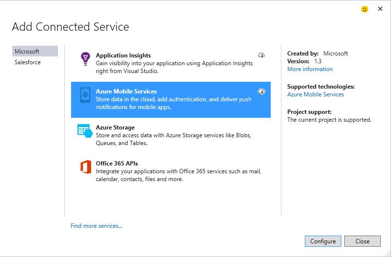
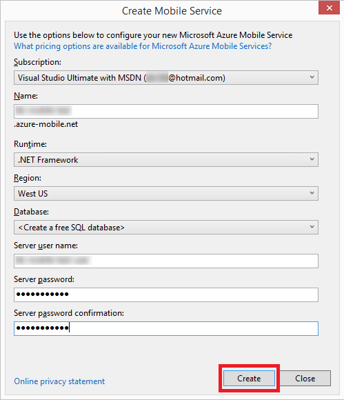

<properties 
   pageTitle="Adición de servicios móviles mediante servicios conectados en Visual Studio | Microsoft Azure"
   description="Agregar servicios móviles mediante el cuadro de diálogo Servicios de conectados agregar de Visual Studio"
   services="visual-studio-online"
   documentationCenter="na"
   authors="mlhoop"
   manager="douge"
   editor="" />
<tags 
   ms.service="visual-studio-online"
   ms.devlang="na"
   ms.topic="article"
   ms.tgt_pltfrm="na"
   ms.workload="mobile"
   ms.date="12/16/2015"
   ms.author="mlearned" />

# Adición de servicios móviles mediante servicios conectados de Visual Studio

Con Visual Studio de 2015, puede conectarse a los servicios de Mobile de Azure mediante el cuadro de diálogo **Agregar servicios conectados** . Puede conectarse desde cualquier aplicación de cliente de C#, cualquier aplicación de JavaScript o la aplicación de Cordova de entre plataformas. Una vez que se conecta, puede crear y obtener acceso a datos, crear personalizadas API y las tareas programadas o agregar compatibilidad para las notificaciones de inserción.  La operación de servicios conectados agrega todas las referencias apropiadas y código de conexión. También puede aprovechar las ventajas de compatibilidad integrada para la autenticación con una amplia variedad de combinaciones de identidad populares, como Azure AD, Facebook, Twitter y Accounts de Microsoft.

## Tipos de proyectos compatibles

>[AZURE.NOTE] En Visual Studio de 2015, no se admite agregar servicios móviles de Azure a proyectos de Universal de Windows (Windows 10) mediante el cuadro de diálogo Agregar servicios conectados. Puede agregar servicios móviles de Azure instalando los paquetes adecuados con el Administrador de paquetes de NuGet para el proyecto.

Puede usar el cuadro de diálogo servicios conectados para conectarse a servicios móviles de Azure en los siguientes tipos de proyecto.

- Proyectos .NET de la tienda Windows 8.1, teléfono y aplicación Universal

- Proyectos de JavaScript de la tienda Windows 8.1, teléfono y aplicación Universal

- Proyectos creados con Visual Studio Tools para Cordova Apache

## Conectarse a los servicios de móvil de Azure mediante el cuadro de diálogo Agregar servicios conectados

1. Asegúrese de que dispone de una cuenta de Azure. Si no tiene una cuenta de Azure, puede registrarse para una [prueba gratuita](http://go.microsoft.com/fwlink/?LinkId=518146).

1. Abrir el cuadro de diálogo **Agregar servicios conectados** .
 - Para .NET aplicaciones, abra el proyecto de Visual Studio, abra el menú contextual para el nodo **referencias** en el Explorador de soluciones y, a continuación, elija **Agregar servicio conectado**
 
        

 - Para los proyectos de aplicación de Apache Cordova, abra el proyecto de Visual Studio, abrir el menú contextual para el nodo de proyecto en el Explorador de soluciones y, a continuación, elija **Agregar servicios conectados**.

1. En el cuadro de diálogo **Agregar servicio conectado** , elija **Servicios móviles de Azure**y, a continuación, elija el botón **Configurar** . Es posible que se le pregunte si para iniciar sesión en Azure si aún no lo ha hecho.

    

1. En el cuadro de diálogo **Servicios de móvil de Azure** , elija un servicio móvil existente si tiene uno. Si necesita crear un nuevo servicio móvil Azure, siga el procedimiento siguiente para hacerlo. En caso contrario, vaya al paso siguiente.

    Para crear una nueva cuenta de servicio móvil:
    1. Elija el vínculo **Crear servicio **en la parte inferior del cuadro de diálogo.
        

    2. En el cuadro de diálogo **Crear servicio de móvil** , puede elegir un servicio móvil de back-end de JavaScript o un servicio móvil de back-end de .NET de la lista desplegable de **tiempo de ejecución** . 
  
        

        Un servicio de back-end de JavaScript es fácil y eficaz. Si crea un servicio móvil de back-end de JavaScript, el código de JavaScript del servidor se almacena en la nube, pero puede editar secuencias de comandos de servidor con el Explorador de servidor o el portal de administración de Azure. 

        Un servicio móvil de back-end de .NET le ofrece la capacidad total y flexibilidad de Web API y marco de la entidad. Si crea un servicio móvil de .NET back-end, se creará un proyecto y se agrega a la solución. 

    1. Elija la **región** donde desea que el servicio móvil y, a continuación, escriba un nombre de usuario y contraseña para el servidor.
 
    1. Una vez que haya introducido toda la información necesaria, elija el botón **crear** para crear el servicio móvil.
    2. El nuevo servicio móvil debería aparecer en la lista de servicios en el cuadro de diálogo de **Servicios móviles de Azure** . Elija el servicio móvil de nuevo en la lista y, a continuación, elija el botón **Agregar** para agregar el servicio a su proyecto.
    

1. Revise la página de introducción que aparece y averiguar cómo se ha modificado el proyecto. Una página de introducción aparece en el explorador cuando se agrega un servicio conectado. Puede revisar los pasos siguientes sugeridos y ejemplos de código, o cambie a la página ¿Qué ha ocurrido para ver qué referencias se han agregado a su proyecto y cómo se modificaron los archivos de código y la configuración.

1. ¡Uso de los ejemplos de código como guía, empezar a escribir código para tener acceso al servicio móvil!

## ¿Cómo se modifica el proyecto

Cómo Visual Studio modifica el proyecto depende del tipo de proyecto. Para C# aplicaciones cliente, vea [¿Qué ha ocurrido: proyectos C#](http://go.microsoft.com/fwlink/p/?LinkId=513119). Para las aplicaciones cliente de JavaScript, vea [¿Qué ha ocurrido: proyectos de JavaScript](http://go.microsoft.com/fwlink/p/?LinkId=513120). Para aplicaciones de Cordova, vea [¿Qué ha ocurrido: Cordova proyectos](http://go.microsoft.com/fwlink/p/?LinkId=513116).

##Pasos siguientes

Formular preguntas y obtener ayuda: 

 - [Foro de MSDN: Azure Servicios para dispositivos móviles](https://social.msdn.microsoft.com/forums/azure/home?forum=azuremobile)

 - [Azure servicios móviles en el Blog del equipo de Microsoft Azure](https://azure.microsoft.com/blog/topics/mobile/)

 - [Servicios móviles Azure en azure.microsoft.com](https://azure.microsoft.com/services/mobile-services/)

 - [Documentación de servicios móviles Azure en azure.microsoft.com](https://azure.microsoft.com/documentation/services/mobile-services/)

