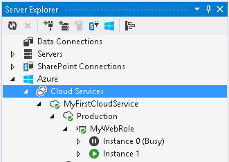
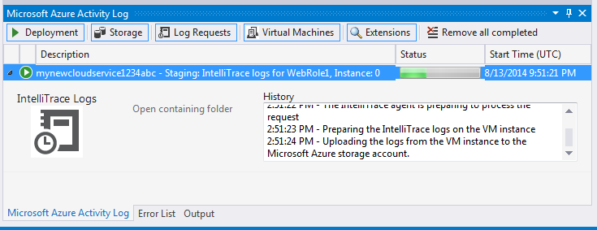

<properties 
   pageTitle="Depurar un servicio de nube publicados con IntelliTrace y Visual Studio | Microsoft Azure"
   description="Depurar un servicio de nube publicados con IntelliTrace y Visual Studio"
   services="visual-studio-online"
   documentationCenter="n/a"
   authors="TomArcher"
   manager="douge"
   editor="" />
<tags 
   ms.service="visual-studio-online"
   ms.devlang="multiple"
   ms.topic="article"
   ms.tgt_pltfrm="multiple"
   ms.workload="na"
   ms.date="08/15/2016"
   ms.author="tarcher" />

# Depurar un servicio de nube publicados con IntelliTrace y Visual Studio

##Información general

Con IntelliTrace, puede registrar información de depuración extensiva para una instancia de funciones cuando se ejecuta en Azure. Si necesita averiguar la causa de un problema, puede usar los registros de IntelliTrace para desplazarse por el código de Visual Studio, como si se ejecuta en Azure. De hecho, registros de IntelliTrace clave ejecución de código y datos del entorno cuando la aplicación de Azure se ejecuta como un servicio de nube en Azure y le permite reproducir los datos registrados desde Visual Studio. Como alternativa, puede usar la depuración remota para adjuntar directamente a un servicio de nube que se ejecuta en Azure. Vea [Depurar servicios en la nube](http://go.microsoft.com/fwlink/p/?LinkId=623041).

>[AZURE.IMPORTANT] IntelliTrace está pensado para escenarios de depuración solo y no se debe utilizar para una implementación de producción.

>[AZURE.NOTE] Puede usar IntelliTrace si tiene Visual Studio Enterprise instalado y los objetivos de la aplicación de Azure .NET Framework 4 o una versión posterior. IntelliTrace recopila información para las funciones de Azure. Las máquinas virtuales de estas funciones siempre se ejecutan sistemas operativos de 64 bits.

## Configurar una aplicación de Azure de IntelliTrace

Para habilitar IntelliTrace para una aplicación de Azure, debe crear y publicar la aplicación de un proyecto de Azure de Visual Studio. Debe configurar IntelliTrace para la aplicación de Azure antes de publicar en Azure. Publicar su aplicación sin configurar IntelliTrace pero, a continuación, decide que desea hacerlo, debe publicar la aplicación desde Visual Studio. Para obtener más información, consulte [publicar un servicio de nube con las herramientas de Azure](http://go.microsoft.com/fwlink/p/?LinkId=623012).

1. Cuando esté listo para implementar la aplicación de Azure, compruebe que se establecen los destinos de compilación de proyecto para **Depurar**.

1. Abrir el menú contextual para el proyecto de Azure en el Explorador de soluciones y elija **Publicar**.
 
    Aparece el Asistente para publicar aplicaciones de Azure.

1. Para recopilar registros de IntelliTrace para su aplicación cuando se publica en la nube, active la casilla de verificación **Habilitar IntelliTrace** .

    >[AZURE.NOTE] Puede habilitar IntelliTrace o perfiles al publicar su aplicación de Azure. No se puede habilitar ambas.

1. Para personalizar la configuración básica de IntelliTrace, seleccione el hipervínculo de la **configuración** .

    Aparece el cuadro de diálogo Configuración de IntelliTrace, tal como se muestra en la siguiente ilustración. Puede especificar qué eventos de registro, si se va a recopilar información de llamadas, los módulos y procesos para recopilar registros para y la cantidad de espacio que desea asignar a la grabación. Para obtener más información sobre IntelliTrace, vea [Depurar con IntelliTrace](http://go.microsoft.com/fwlink/?LinkId=214468).

    

El registro de IntelliTrace es un archivo de registro circular del tamaño máximo especificado en la configuración de IntelliTrace (el tamaño predeterminado es de 250 MB). Registros de IntelliTrace se recopilan a un archivo en el sistema de archivos de la máquina virtual. Cuando se solicitan los registros, una instantánea es tomada en ese momento y descargada en su equipo local.

Después de la aplicación de Azure se ha publicado en Azure, puede determinar si se ha habilitado IntelliTrace desde el nodo calcular de Azure en el Explorador de servidor, tal como se muestra en la siguiente imagen:

## Descarga de registros de IntelliTrace para una instancia de funciones

Puede descargar registros de IntelliTrace de una instancia de funciones desde el nodo de **Servicios en la nube** en el **Explorador de servidores**. Expanda el nodo de **Servicios de nube** hasta que encuentre la instancia que le interesa, abra el menú contextual para esta instancia y elija **Ver registros de IntelliTrace**. Los registros de IntelliTrace se descargan en un archivo en un directorio en su equipo local. Cada vez que solicite el IntelliTrace registros, se crea una nueva instantánea.

Cuando se descargan los registros, Visual Studio muestra el progreso de la operación en la ventana de registro de actividad de Azure. Como se muestra en la siguiente ilustración, puede expandir el elemento de línea para la operación ver más detalles.

Puede seguir trabajando en Visual Studio mientras se descargan los registros de IntelliTrace. Cuando haya finalizado el registro de descarga, se abrirá automáticamente en Visual Studio.

>[AZURE.NOTE] Los registros de IntelliTrace pueden contener excepciones que el marco de trabajo genera y controla posteriormente. Código de marco de trabajo interno genera estas excepciones como parte normal de inicio de una función, por lo que se pueden omitir sin problemas.

## Vea también

[Servicios de nube de depuración](https://msdn.microsoft.com/library/ee405479.aspx)

