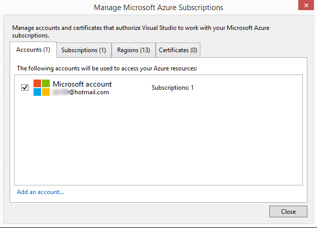
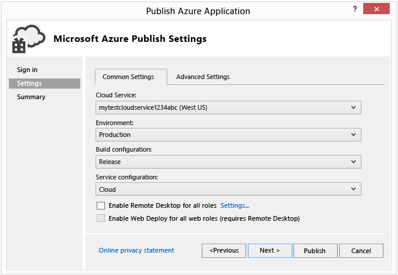

<properties 
   pageTitle="Publicar el Asistente para aplicaciones de Azure | Microsoft Azure"
   description="Publicar el Asistente para aplicaciones de Azure"
   services="visual-studio-online"
   documentationCenter="na"
   authors="TomArcher"
   manager="douge"
   editor="" />
<tags 
   ms.service="multiple"
   ms.devlang="multiple"
   ms.topic="article"
   ms.tgt_pltfrm="na"
   ms.workload="na"
   ms.date="08/15/2016"
   ms.author="tarcher" />

# Publicar el Asistente para aplicaciones de Azure

## Información general

Después de desarrollar una aplicación web en Visual Studio, puede publicar esa aplicación más fácilmente en un servicio de nube de Azure mediante el Asistente para **Publicar aplicaciones de Azure** . La primera sección explica los pasos que debe completar antes de usar el asistente y las secciones restantes explican las características del asistente.

>[AZURE.NOTE] Este tema es acerca de la implementación a servicios en la nube, no a los sitios web. Para obtener información sobre cómo implementar en sitios web, vea [cómo implementar un sitio Web de Azure](https://social.msdn.microsoft.com/Search/windowsazure?query=How%20to%20Deploy%20an%20Azure%20Web%20Site&Refinement=138&ac=4#refinementChanges=117&pageNumber=1&showMore=false).

## Requisitos previos

Antes de publicar su aplicación web a Azure, debe tener una cuenta de Microsoft y una suscripción de Azure y tiene que asociar la aplicación web con un servicio de nube de Azure. Si ya ha completado estas tareas, puede omitir a la siguiente sección.

1. Obtener una cuenta de Microsoft y una suscripción de Azure. Puede probar una suscripción de Azure gratuita de un mes gratuita [aquí](https://azure.microsoft.com/pricing/free-trial/)

1. Crear un servicio de nube y una cuenta de almacenamiento en Azure. Puede hacerlo desde el Explorador de servidores en Visual Studio o a través del [portal clásica Azure](http://go.microsoft.com/fwlink/?LinkID=213885).

1. Habilitar la aplicación web de Azure. Para habilitar la aplicación web se publiquen en Azure desde Visual Studio, debe asociar con un proyecto de servicio de nube de Azure en Visual Studio. Para crear el proyecto de servicio de nube asociado, abra el menú contextual para el proyecto de la aplicación web y, a continuación, elija a convertir, **convertir en proyecto de servicio de nube de Azure**.

1. Después de agrega el proyecto de servicio de nube para la solución, vuelva a abrir el mismo menú contextual y, a continuación, elija **Publicar**. Para obtener más información acerca de cómo habilitar las aplicaciones para Azure, vea [Cómo: migrar y publicar una aplicación Web a un servicio de nube de Azure de Visual Studio](https://msdn.microsoft.com/library/azure/hh420322.aspx).

>[AZURE.NOTE] Asegúrese de iniciar Visual Studio con credenciales de administrador (ejecutar como administrador).

1. Cuando esté listo para publicar la aplicación, abra el menú contextual para el proyecto de servicio de nube de Azure y, a continuación, elija **Publicar**. Los pasos siguientes muestran al Asistente para publicar aplicaciones de Azure.

## Elegir la suscripción

### Para elegir una suscripción

1. Antes de utilizar al Asistente para la primera vez, debe iniciar sesión. Elija el vínculo **Iniciar sesión** . Inicie sesión en el portal de Azure cuando se le solicite y proporcionar el nombre de usuario de Azure y la contraseña. 

    

    La lista de suscripciones se rellena con las suscripciones asociadas con su cuenta. También es posible que vea suscripciones de los archivos de suscripción que importó anteriormente.

1. En la lista **Elegir la suscripción** , seleccione la suscripción para esta implementación.

   Si elige **< administrar... >**, aparece el cuadro de diálogo **Administrar suscripciones** y puede elegir la cuenta de usuario y la suscripción que desea usar. La pestaña **cuentas** muestra todas las cuentas y, a continuación, en la ficha **suscripciones** muestra todas las suscripciones asociadas a las cuentas. También puede elegir una región desde la que se va a usar recursos Azure, así como crear o importar certificados para la suscripción desde el portal de Azure. Si ha importado ninguna suscripción desde un archivo de la suscripción, los certificados asociados aparecerán en la ficha **certificados** . Cuando haya terminado, elija el botón **Cerrar** .

    

    >[AZURE.NOTE] Un archivo de suscripción puede contener más de una suscripción.

1. Elija el botón **siguiente** para continuar. 

    Si no hay servicios en la nube en la suscripción, debe crear un servicio de nube en Azure para hospedar el proyecto. Aparece el cuadro de diálogo **Crear servicio de nube y cuenta de almacenamiento** .

    Especifique un nombre nuevo para el servicio de nube. El nombre debe ser único en Azure. A continuación, especifique una región o grupo de afinidad para un centro de datos que está cerca de usted o la mayoría de sus clientes. Este nombre también se usa para una nueva cuenta de almacenamiento Azure crea para su servicio de nube.

1. Modificar la configuración que desee para esta implementación y, después, publicarlo seleccionando el botón **Publicar** (la siguiente sección proporciona información detallada sobre las distintas opciones). Para revisar la configuración antes de la publicación, elija el botón **siguiente** .

    >[AZURE.NOTE] Si decide publicar en este paso, puede supervisar el estado de esta implementación en Visual Studio.

Puede modificar la configuración avanzada y comunes para una implementación usando el Asistente para **Publicar aplicaciones de Azure** . Por ejemplo, puede elegir una configuración de implementar la aplicación en un entorno de prueba antes de hacerlo. La siguiente ilustración muestra la pestaña de **Opciones comunes** para una implementación de Azure.

## Configurar la configuración de publicación

### Para configurar la configuración de publicación

1. En la lista de **Servicios de nube** , realice uno de los siguientes conjuntos de pasos:

   1. En el cuadro de lista desplegable, elija un servicio de nube existente. Aparece la ubicación del centro de datos para el servicio. Deben apuntar esta ubicación y asegúrese de que la ubicación de la cuenta de almacenamiento se encuentra en el centro de datos de la misma.

    1. Elija **Crear nuevo** para crear un servicio de nube que hospeda Azure. En el cuadro de diálogo **Crear servicio de nube** , proporcione un nombre para el servicio y, a continuación, especifique una región o un grupo de afinidad para especificar la ubicación del centro de datos que desea hospedar este servicio de nube. El nombre debe ser único en Azure.

1. En la lista **entorno** , elija **producción** o **ensayo**. Elija el entorno de ensayo si desea implementar la aplicación en un entorno de prueba. Puede mover la aplicación en el entorno de producción.

1. En la lista **configuración de compilación** , elija **Depurar** o **liberar**.

1. En la lista de **Configuración del servicio** , elija **nube** o **Local**.

    Seleccione la casilla de verificación **Habilitar Escritorio remoto para todas las funciones** si desea que puedan conectarse al servicio de forma remota. Esta opción se utiliza principalmente para solucionar este problema. Cuando Active esta casilla, aparecerá el cuadro de diálogo **Configuración de escritorio remoto** . Seleccione el vínculo de configuración para cambiar la configuración.

    Seleccione la casilla de verificación **Habilitar Web implementar para todos los roles de web** para habilitar la implementación de web para el servicio. Debe habilitar Escritorio remoto usar esta característica. Para obtener más información, consulte [[publicar un servicio de nube con las herramientas de Azure](https://msdn.microsoft.com/library/azure/ff683672.aspx)](https://msdn.microsoft.com/library/azure/ff683672.aspx). Para obtener más información sobre cómo implementar Web, consulte la [[publicación de un servicio de nube con las herramientas de Azure](https://msdn.microsoft.com/library/azure/ff683672.aspx)](https://msdn.microsoft.com/library/azure/ff683672.aspx).

1. Elija la pestaña **Configuración avanzada** . En el campo de **etiqueta de implementación** , acepte el nombre predeterminado o escriba un nombre de su elección. Para agregar la fecha a la etiqueta de implementación, deje seleccionada la casilla de verificación.

    

1. En la lista **cuenta de almacenamiento** , elija la cuenta de almacenamiento desea utilizar para esta implementación. Comparar las ubicaciones de los centros de datos del servicio de nube y su cuenta de almacenamiento. Lo ideal es que, estas ubicaciones deben ser el mismo.

    >[AZURE.NOTE] La cuenta de almacenamiento de Azure almacena el paquete de implementación de aplicaciones. Después de implementar la aplicación, se quita el paquete de la cuenta de almacenamiento.

1. Active la casilla de verificación **de implementación de actualización** si desea implementar sólo los componentes actualizados. Este tipo de implementación puede ser más rápido que una implementación completa. Seleccione el vínculo de **configuración** para abrir el cuadro de diálogo **configuración de implementación de actualización** , que se muestra en la siguiente ilustración. 

    

    Puede elegir cualquiera de las dos opciones de implementación de actualización, incremental o simultánea. Una implementación incremental actualiza una instancia implementada a la vez, de modo que la aplicación permanece en línea y disponible para los usuarios. Una implementación simultánea actualiza todas las instancias implementadas a la vez. Actualización simultánea es más rápido que la actualización incremental, pero si elige esta opción, la aplicación no estén disponible durante el proceso de actualización.

    Si no se puede actualizar la implementación, debe seleccionar la casilla de verificación para realizar una implementación completa si desea que la implementación completa deben realizarse automáticamente si se produce un error en una implementación de actualización. Una implementación completa restablece la dirección IP (VIP) virtual para el servicio de nube. Para obtener más información, vea [Cómo: conservar una constante dirección IP Virtual de un servicio de nube](https://msdn.microsoft.com/library/azure/jj614593.aspx).

1. Para depurar el servicio, seleccione la casilla de verificación **Habilitar IntelliTrace** o si va a implementar una configuración de **depuración** y desea depurar su servicio de nube en Azure, seleccione la casilla de verificación **Habilitar depurador remoto para todos los roles** para implementar los servicios de depuración remotos.

2. Para el perfil de la aplicación, seleccione la casilla de verificación **Habilitar perfiles** y, a continuación, seleccione el vínculo de **configuración** para mostrar las opciones de generación de perfiles. 

    >[AZURE.NOTE] Debe utilizar Visual Studio Ultimate Habilitar IntelliTrace o interacción perfiles a nivel (sugerencia) y no se puede habilitar ambos al mismo tiempo.

    Para obtener más información, vea [Depurar un servicio de nube publicado con IntelliTrace y Visual Studio](https://msdn.microsoft.com/library/azure/ff683671.aspx) y [probar el rendimiento de un servicio de nube](https://msdn.microsoft.com/library/azure/hh369930.aspx).

1. Seleccione **siguiente** para ver la página Resumen de la aplicación.

## La aplicación de publicación

1. Puede crear un perfil de publicación de la configuración que haya elegido. Por ejemplo, puede crear un perfil para un entorno de prueba y otro para producción. Para guardar este perfil, elija el icono **Guardar** . El asistente crea el perfil y guarda en el proyecto de Visual Studio. Para modificar el nombre del perfil, abra la lista de **perfil de destino** y, a continuación, elija **<... administrar >**.

    

    >[AZURE.NOTE] Aparece el perfil de publicación en el Explorador de soluciones de Visual Studio y la configuración del perfil se escribe en un archivo con una extensión de .azurePubxml. Configuración se guarda como atributos de etiquetas XML.

1. Elija **Publicar** para publicar la aplicación. Puede supervisar el estado del proceso en la ventana de **resultados** en Visual Studio.

## Vea también

[Cómo: migrar y publicar una aplicación Web a un servicio de nube Azure desde Visual Studio](https://msdn.microsoft.com/library/azure/hh420322.aspx)

[Publicar un servicio de nube con las herramientas de Azure](https://msdn.microsoft.com/library/azure/ff683672.aspx)

[Depurar un servicio de nube publicados con IntelliTrace y Visual Studio](https://msdn.microsoft.com/library/azure/ff683671.aspx)

[Probar el rendimiento de un servicio de nube](https://msdn.microsoft.com/library/azure/hh369930.aspx)

